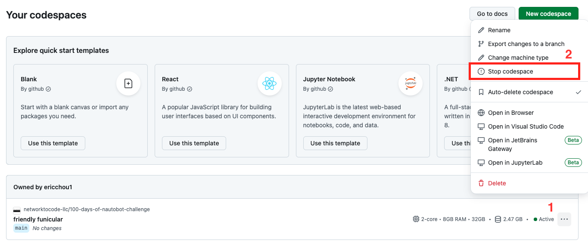

# Setting Up Development Environment

In today's challenge, we will set up our development environment for the days to come.

There are several components:

- [GitHub Codespace](https://github.com/features/codespaces) is a simple, free-tier-available, development environment provided by GitHub. GitHub Codespace [free tier](https://docs.github.com/en/billing/managing-billing-for-your-products/managing-billing-for-github-codespaces/about-billing-for-github-codespaces#monthly-included-storage-and-core-hours-for-personal-accounts) includes 120 hours of core hours per month, which equates to 60 hours of the smallest 2-core environment per month.  

- By default, when you launch a GitHub Codespace, the interface to the development environment is [VisualStudio Code](https://code.visualstudio.com/), which is a full service Integrated Development Environment (IDE). As an IDE, VSCode offers many of the features and extensions that we will use as we move along the challenges.

- We have pre-built an image that includes this repository all the components needed launch a fully functional [Nautobot](https://networktocode.com/nautobot/) instance within Codespace.

There are two steps to start our lab:

1. Launch your personal GitHub Codespace.
2. Start Nautobot and the necessary components within Codespace.

Let's start by launching Codespace with the correct options.

> [!TIP]
> There are some Tips and Tricks we learned along the way that we keep a running [Lab Notes](https://github.com/nautobot/100-days-of-nautobot/blob/main/Lab_Setup/lab_related_notes/README.md). Please keep this note handy if you run into issues.  

## Launch Codespace

If you are brand new to GitHub Codespace, we recommend watching the following video for steps to launch Codespace. However, if you are already somewhat familiar with Codespace, feel free to skip to the screenshot instructions for a quick reference.

[Video: Setting Up Your 100 Days of Nautobot Development Environment](https://www.youtube.com/watch?v=gW3Qq0yssLE)

Launch Codespace with the following steps:

1. Click on the green Code button
2. Choose Codespaces.
3. Click on the "..." option
4. Pick 'New with Options'


On the next screen, click on the dropdown menu for 'Dev container configuration' and pick 'Lab Scenario 1', then click on 'Create Codespace':

> [!TIP]
> When you launch Codespace for the very first time, it might prompt you to choose between browser-based Visual Studio Code or launch a desktop version, choose browser-based version to be consistent with the screenshots, but please feel free to pick the desktop version if you want.


Codespace will begin to launch, feel free to click on 'Building Codespace' to view the creation log and monitor the progress:


After Codespace finished setting up, you will have a browser-based development environment with the following sections:

1. Explorer Window: This is there you can choose the different files, namely Day001, Day002, etc. folders.  
2. Terminal Window: There will also be a terminal window we can interact with the Codespace code.
3. In the explorer window, expand the "100-Days-of-nautobot-challenge" folder and "Day001_Development_Setup" subfolder, right-click on the ```README.md``` file and choose "Open Preview": 

    

4. We will work with the terminal window a lot, sometimes opening many terminal windows at once. The ```+``` is where we can add more terminal windows.


Go ahead and launch the Codespace, once it is launched, come back to ```Day001_Development_Setup``` README.md file and continue on with the lesson, we will be here.

## Start Nautobot and the necessary components

Included in the Codespace is the code from [nautobot-docker-compose](https://github.com/nautobot/nautobot-docker-compose/) repository. Our Codespace is launched with the docker-in-docker feature to allow us run Nautobot as well as the necessary components in containers.

The following instructions will be typed in at the terminal window.

> [!TIP]
> If you try to copy and paste commands to the Codepsace terminal window, it will ask for permission for the first time. Please allow it. 

- Change directory to where the nautobot docker-compose code is:

```shell
@ericchou1 ➜ ~ $ cd nautobot-docker-compose/
```

- We have already installed [poetry](https://python-poetry.org/) virtual environment, so we just need to enable the environment:

```shell
@ericchou1 ➜ ~/nautobot-docker-compose (main) $ poetry shell
Spawning shell within /home/vscode/.cache/pypoetry/virtualenvs/nautobot-docker-compose-70lkLMMl-py3.10
@ericchou1 ➜ ~/nautobot-docker-compose (main) $ . /home/vscode/.cache/pypoetry/virtualenvs/nautobot-docker-compose-70lkLMMl-py3.10/bin/activate
(nautobot-docker-compose-py3.10) @ericchou1 ➜ ~/nautobot-docker-compose (main) $
```

- We will use [Invoke](https://www.pyinvoke.org/) for shell-oriented subprocess for CLI-invokable tasks. The first step is to build the docker images, if you are building it for the first time, it will take a bit of time, make sure you wait until you see the "DONE" message at the end with the terminal prompt given back to the user.

```shell
(nautobot-docker-compose-py3.10) @ericchou1 ➜ ~/nautobot-docker-compose (main) $ invoke build
Building Nautobot 2.3.2 with Python 3.8...
Running docker compose command "build"
#0 building with "default" instance using docker driver

#1 [nautobot internal] load build definition from Dockerfile
#1 transferring dockerfile: 2.32kB done
#1 WARN: FromAsCasing: 'as' and 'FROM' keywords' casing do not match (line 3)
#1 WARN: FromAsCasing: 'as' and 'FROM' keywords' casing do not match (line 14)
#1 WARN: FromAsCasing: 'as' and 'FROM' keywords' casing do not match (line 54)
#1 DONE 0.0s
... 
<skip> 
...
#2 [nautobot auth] nautobot/nautobot-dev:pull token for ghcr.io
#2 DONE 0.0s
#24 [nautobot] resolving provenance for metadata file
#24 DONE 0.0s
```

- We are now ready to import the initial datasets:

```shell
(nautobot-docker-compose-py3.10) @ericchou1 ➜ ~/nautobot-docker-compose (main) $ invoke db-import
Importing Database into Development...

Starting Postgres for DB import...

Running docker compose command "up -d db"
 db Pulling 
 43c4264eed91 Pulling fs layer 
...
<skip>
...
 55d20525b40e Waiting 
 82052d0672a9 Downloading [====================================>              ]     720B/984B
 82052d0672a9 Downloading [==================================================>]     984B/984B
 82052d0672a9 Download complete 
 ...
 <skip>
 ...
 Network nautobot_docker_compose_default  Creating
 Network nautobot_docker_compose_default  Created
...
<skip>
...
ALTER TABLE
ALTER TABLE
ALTER TABLE
ALTER TABLE
```

- Now we can start the nautobot containers with ```invoke debug```. This will start Nautobot in debug mode and display all message on the screen: 

> [!TIP]
> Wait until you see the message of ```Starting development server at http://0.0.0.0:8080/``` before moving on to the next step: 

```shell
(nautobot-docker-compose-py3.10) @ericchou1 ➜ ~/nautobot-docker-compose (main) $ invoke debug
Starting Nautobot in debug mode...
Running docker compose command "up"
 redis Pulling 
 43c4264eed91 Already exists 
 54346cffc29b Pulling fs layer 
 2866ca214a5e Pulling fs layer 
 ee16541feddb Pulling fs layer 
 d14ed515876d Pulling fs layer 
 cf7b98d3ba3c Pulling fs layer 
 4f4fb700ef54 Pulling fs layer 
 c4e0a3f69d20 Pulling fs layer 
 ...
 <skip>
 ...
nautobot-1       | October 16, 2024 - 20:18:55
nautobot-1       | Django version 4.2.16, using settings 'nautobot_config'
nautobot-1       | Starting development server at http://0.0.0.0:8080/
nautobot-1       | Quit the server with CONTROL-C.
nautobot-1       | 
```

Once Nautobot is started, we can go to the forwarded ports, hover over 'Forwarded Address' and click on the globe icon to open a separate browser window:


The new window should direct you to the forwarded port where Nautobot UI can be accessed. The default login credentials are username ```admin``` and password ```admin```, this was the admin user we included in the initial dataset:


> [!TIP]
> Not the most secure username and password, I know, you might get a warning prompt depending on the browser. The port and instance is *not* open to the public. 

We now have a working Nautobot instance in Codepsace. Let's go back to the terminal window and use ```Ctl+C``` to terminate the Nautobot instance:

```shell
...
...
nautobot-1       | 20:25:48.342 INFO    django.server :
nautobot-1       |   "GET /static/img/favicon.ico?version=2.3.2 HTTP/1.1" 200 15086
redis-1          | 1:M 16 Oct 2024 20:33:15.250 * 100 changes in 300 seconds. Saving...
redis-1          | 1:M 16 Oct 2024 20:33:15.251 * Background saving started by pid 14
redis-1          | 14:C 16 Oct 2024 20:33:15.253 * DB saved on disk
redis-1          | 14:C 16 Oct 2024 20:33:15.254 * RDB: 0 MB of memory used by copy-on-write
redis-1          | 1:M 16 Oct 2024 20:33:15.351 * Background saving terminated with success
Gracefully stopping... (press Ctrl+C again to force)
 Container nautobot_docker_compose-celery_worker-1  Stopping
 Container nautobot_docker_compose-celery_beat-1  Stopping
 Container nautobot_docker_compose-celery_beat-1  Stopped
 Container nautobot_docker_compose-celery_worker-1  Stopped
 Container nautobot_docker_compose-nautobot-1  Stopping
 Container nautobot_docker_compose-nautobot-1  Stopped
 Container nautobot_docker_compose-db-1  Stopping
 Container nautobot_docker_compose-redis-1  Stopping
 Container nautobot_docker_compose-redis-1  Stopped
 Container nautobot_docker_compose-db-1  Stopped
canceled
```

Let's go ahead and stop Codespace as we do not want to incur unnecessary charges when we are not using it. We will navigate to your [Codespace](https://github.com/codespaces) settings and stop the Codespace:



> [!TIP]
> You can optionally delete the Codespace, however, you will need to repeat the steps in this lesson if you do. My preference is to just *stop* Codespace unless you are running low on usage credit, which you can check [here](https://github.com/codespaces). 

That is it for Day 1, congratulations on creating a lab environment!

## Day 1 To Do

Go ahead and post a screenshot of your newly launched Nautobot in Codespace on a social media of your choice, make sure you use the tag `#100DaysOfNautobot` `#JobsToBeDone` and tag `@networktocode`, so we can celebrate and share your progress, See you tomorrow!

[X/Twitter](<https://twitter.com/intent/tweet?url=https://github.com/networktocode/100-days-of-nautobot-challenge&text=I+jst+completed+Day+1+of+the+100+days+of+nautobot+challenge+!&hashtags=100DaysOfNautobot,JobsToBeDone>)

[LinkedIn](https://www.linkedin.com/) (Copy & Paste: I just completed Day 1 of 100 Days of Nautobot, <https://github.com/networktocode/100-days-of-nautobot-challenge>, challenge! @networktocode #JobsToBeDone #100DaysOfNautobot)
