# Hello Jobs - Part 1: Creating Jobs

Welcome to Day 3 of the `#100DaysOfNautobot` challenge! It is time to create some jobs for Retail-r-Us. 

For our first job, we will create a customary 'Hello World' type of job. It will be a small and limited Python script, but a fully functional Nautobot job. This will help us to see how the pieces work together before we move on to more complex jobs.

Ready? Let's begin! 

## Starting Nautobot Instance in Codespaces

> [!TIP]
> If you are restarting an existing Codespace from Day 1, feel free to skip this section. However, be aware sometimes we need to [Rebuild Codespace](https://github.com/nautobot/100-days-of-nautobot/blob/main/Lab_Setup/lab_related_notes/README.md#rebuild-codespace) if the Docker daemon stopped working after restarting. 

> [!NOTE]
> This section has a lot of repeat information from Day 1, feel free to quickly glance through them. 

Let's recall our steps from Day 1 for development setup.

We will need to start a codespace instance by using "Code -> "..." -> New with Options" to pick a lab scenario:

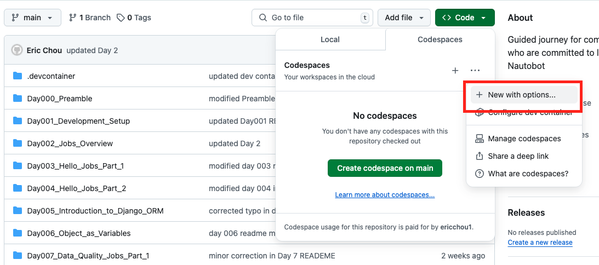

Let's pick "Lab Scenario 1":

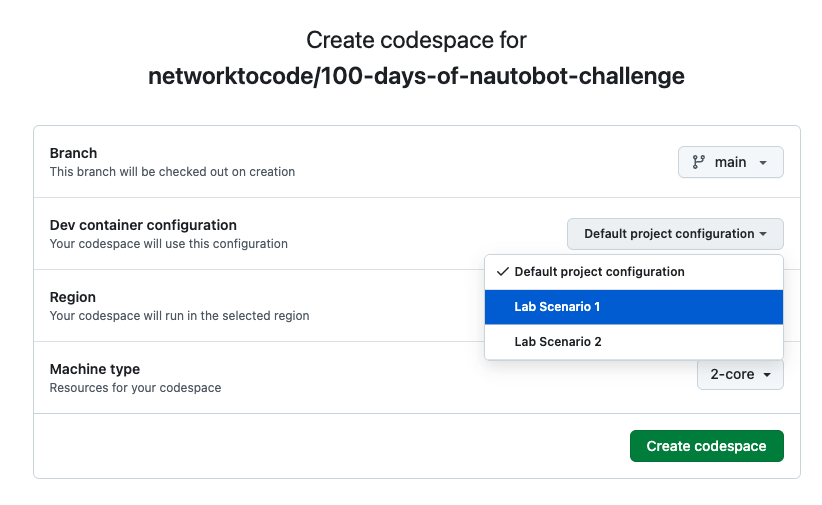

Just as we have done for Day 1, we can start the Nautobot instance along with all the other necessary components using the following commands: 

1. Navigate to the `nautobot-docker-compose` directory. 
2. Start `poetry shell`.
3. Build the containers with `invoke build`.
4. Import initial data with `invoke db-import`.
5. Launch Nautobot with `invoke debug`. 

Here is an example output: 

```
@ericchou1 ➜ ~ $ cd nautobot-docker-compose/

@ericchou1 ➜ ~/nautobot-docker-compose (main) $ poetry shell

(nautobot-docker-compose-py3.10) @ericchou1 ➜ ~/nautobot-docker-compose (main) $ invoke build

(nautobot-docker-compose-py3.10) @ericchou1 ➜ ~/nautobot-docker-compose (main) $ invoke db-import

(nautobot-docker-compose-py3.10) @ericchou1 ➜ ~/nautobot-docker-compose (main) $ invoke debug

Starting Nautobot in debug mode...
Running docker compose command "up"
 Container nautobot_docker_compose-redis-1  Created
 Container nautobot_docker_compose-db-1  Created
 Container nautobot_docker_compose-nautobot-1  Created
 Container nautobot_docker_compose-celery_beat-1  Created
 Container nautobot_docker_compose-celery_worker-1  Created
Attaching to celery_beat-1, celery_worker-1, db-1, nautobot-1, redis-1
redis-1          | 1:C 17 Oct 2024 12:06:43.191 # oO0OoO0OoO0Oo Redis is starting oO0OoO0OoO0Oo
redis-1          | 1:C 17 Oct 2024 12:06:43.191 # Redis version=6.2.16, bits=64, commit=00000000, modified=0, pid=1, just started
redis-1          | 1:C 17 Oct 2024 12:06:43.191 # Configuration loaded
redis-1          | 1:M 17 Oct 2024 12:06:43.192 * monotonic clock: POSIX clock_gettime
redis-1          | 1:M 17 Oct 2024 12:06:43.216 * Running mode=standalone, port=6379.
...
<skip>

```
 
Let's leave this terminal window open, so we can observe all future messages generated by the different containers.

Next, we will open Nautobot in a separate browser window using the forwarded port. To do this, go to ```PORTS``` and click on the globe icon. 

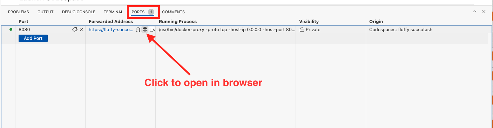

> [!NOTE] 
> Use admin/admin for username and password. 

We now have Nautobot running in debug mode with a browser window open to access the Nautobot UI. 

## Creating the Job File

We are now ready to create our first job file using Python. **There are two options to do this, just pick one.** If you’re new to Nautobot Jobs, which is probably the case for most of us, I’d recommend starting with Option 1. But don’t worry—take a look at Option 2 as well to understand the structure behind it. 

### Option 1. Create File in Jobs Folder

Under ```nautobot-docker-compose``` folder, find the ```jobs``` folder and right click to create a New File and name it ```hello_jobs.py```:

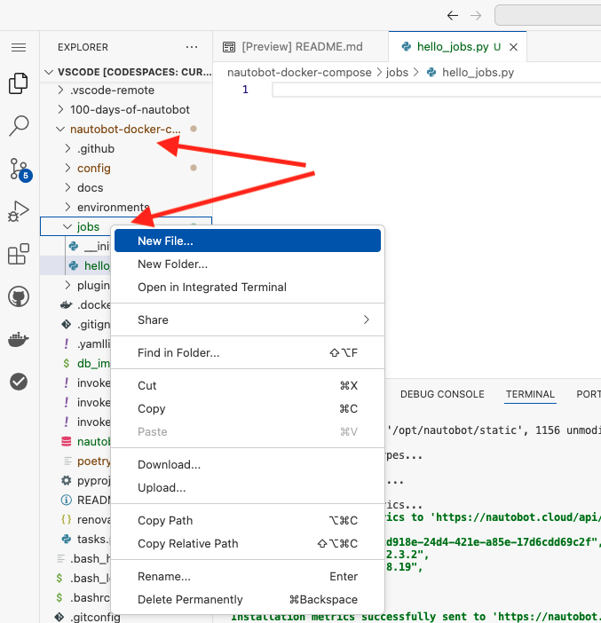

We can double-click the file and open in the editor window: 

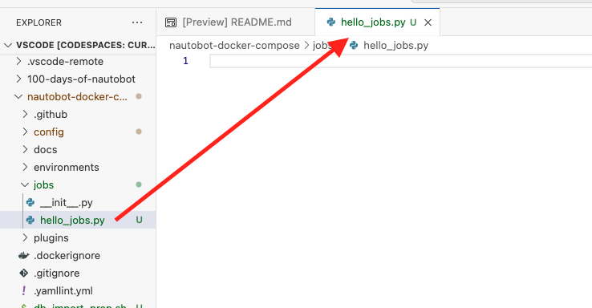

This option works because the ```docker-compose.local.yml``` file maps the volumes to the ```nautobot``` container: 

```
---
services:
  nautobot:
    command: "nautobot-server runserver 0.0.0.0:8080"
    ports:
      - "8080:8080"
    volumes:
      - "../config/nautobot_config.py:/opt/nautobot/nautobot_config.py"
      - "../jobs:/opt/nautobot/jobs"
    healthcheck:
      interval: "30s"
      timeout: "10s"
      start_period: "60s"
      retries: 3
      test: ["CMD", "true"]  # Due to layering, disable: true won't work. Instead, change the test
  celery_worker:
    volumes:
      - "../config/nautobot_config.py:/opt/nautobot/nautobot_config.py"
      - "../jobs:/opt/nautobot/jobs"
```

If you already created the file via option 1, you can read through option 2 for a better understanding of the jobs file structure. 

### Option 2. Create File in Docker Container

With option 2, we will create the job file directly in the ```nautobot``` container. We want to demonstrate this option because it follows the method used in the [Jobs Developer Guide](https://docs.nautobot.com/projects/core/en/stable/development/jobs/#installing-jobs) for installing jobs.   

Let's come back to the terminal section. While leaving the first ```invoke debug``` window open, click on the ```+``` sign to add a separate terminal window: 

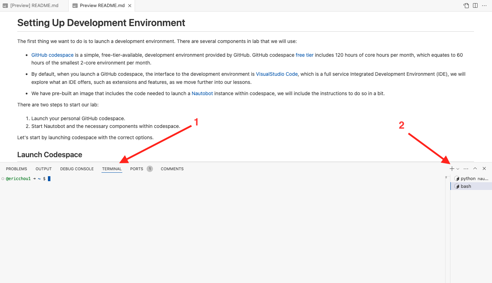


> [!TIP] 
> By leaving the first terminal window open and in debug mode, we will be able to see the system level messages that is helpful during our learning process. 

Let's see which docker containers are running: 

```
@ericchou1 ➜ ~ $ docker ps
CONTAINER ID   IMAGE                                    COMMAND                  CREATED              STATUS                        PORTS                                                 NAMES
0674568846da   yourrepo/nautobot-docker-compose:local   "sh -c 'nautobot-ser…"   About a minute ago   Up About a minute (healthy)   8080/tcp, 8443/tcp                                    nautobot_docker_compose-celery_worker-1
50c2738fbded   yourrepo/nautobot-docker-compose:local   "sh -c 'nautobot-ser…"   About a minute ago   Up About a minute             8080/tcp, 8443/tcp                                    nautobot_docker_compose-celery_beat-1
15a80b83b587   yourrepo/nautobot-docker-compose:local   "/docker-entrypoint.…"   About a minute ago   Up About a minute (healthy)   0.0.0.0:8080->8080/tcp, :::8080->8080/tcp, 8443/tcp   nautobot_docker_compose-nautobot-1
fd292402488a   redis:6-alpine                           "docker-entrypoint.s…"   About a minute ago   Up About a minute             6379/tcp                                              nautobot_docker_compose-redis-1
5075768319ae   postgres:13-alpine                       "docker-entrypoint.s…"   About a minute ago   Up About a minute (healthy)   5432/tcp                                              nautobot_docker_compose-db-1
@ericchou1 ➜ ~ $ 

```

We can attach to the Nautobot docker image from the terminal window with ```docker exec```. 

Let's attach to the nautobot container as root, navigate to the ```/opt/nautobot/jobs``` folder, then create a ```hello_jobs.py``` file:  

```
@ericchou1 ➜ ~ $ docker exec -u root -it nautobot_docker_compose-nautobot-1 bash

root@196e7f7abedd:/opt/nautobot# cd /opt/nautobot/jobs/
root@196e7f7abedd:/opt/nautobot/jobs# touch hello_jobs.py
```

> [!IMPORTANT] 
> The location of the file is very important, this is where Nautobot looks for the job files. Also the file permission with `chown` is critical as well. 

We will need to change the owner and group for the file to `nautobot`: 

```
root@196e7f7abedd:/opt/nautobot/jobs# ls -lia hello_jobs.py 
1487781 -rw-r--r-- 1 root root 0 Oct 17 12:38 hello_jobs.py

root@196e7f7abedd:/opt/nautobot/jobs# chown nautobot:nautobot hello_jobs.py 

root@196e7f7abedd:/opt/nautobot/jobs# ls -lia hello_jobs.py 

1487781 -rw-r--r-- 1 nautobot nautobot 0 Oct 17 12:38 hello_jobs.py
```

We can edit the file directly in the terminal. However, remember that Visual Studio Code is a full-featured IDE. By using the Docker extension, we can make edits much more intuitively.

We can click on the docker extension symbol and find the Nautobot container: 

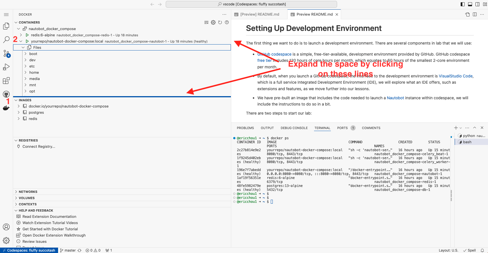

Once we locate the file under `/opt/nautobot/jobs`, highlight it and choose the `open` option to open in the viewer area: 

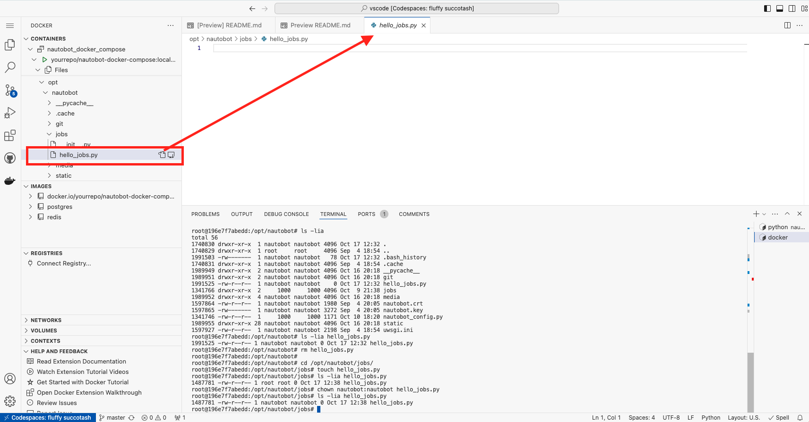

Once we have the file open, we can start adding components to the job. 

## Hello Jobs

Whether you used Option 1 or Option 2, you are now ready to modify the Python file to specify the details of the job.

First, we'll have to import the necessary object and methods from the ```nautobot.apps.jobs``` module: 

```
from nautobot.apps.jobs import Job, register_jobs
```

The ```Job``` is an object that we will inherit in our own Job class. Inheritance in programming allows us to define a class that inherits all the methods and properties from another pre-created object. 

We can now define our own Jobs object using the ```run()``` method to house our code: 

```
class HelloJobs(Job):

    def run(self):
        self.logger.debug("Hello, this is my first Nautobot Job.")
```

Finally, we will need to register our job with Nautobot: 

```
register_jobs(
    HelloJobs,
)
```

> [!IMPORTANT]
> Register jobs is an important step that many people, myself included, might miss when first introduced to Nautobot jobs. 

Here is what the complete file looks like: 

```python
from nautobot.apps.jobs import Job, register_jobs

class HelloJobs(Job):

    def run(self):
        self.logger.debug("Hello, this is my first Nautobot Job.")

register_jobs(
    HelloJobs,
)
```

Make sure we save the file before we move on to the next step. 

## Register and Run the Job

In order for the job to be available, we will need to tell Nautobot by registering it. Remember the ```invoke debug``` command that conveniently builds and start all the components for us? Turns out there is a ```invoke``` command for ```post_upgrade``` as well.

> [!IMPORTANT]
> Registering the job with `invoke post-upgrade` is another critical step many engineers new to Nautobot Jobs may have missed. Please remember to do this step. 

Open up (yet) another terminal window and initiate the poetry shell: 

```
@ericchou1 ➜ ~ $ cd nautobot-docker-compose/
@ericchou1 ➜ ~/nautobot-docker-compose (main) $ poetry shell
```

We can use ```invoke --list``` to see all the available CLI commands: 

```
(nautobot-docker-compose-py3.10) @ericchou1 ➜ ~/nautobot-docker-compose (main) $ invoke --list
Available tasks:

  build                  Build Nautobot docker image.
  cli                    Launch a bash shell inside the running Nautobot container.
  createsuperuser        Create a new Nautobot superuser account (default: "admin"), will prompt for password.
  db-export              Export the database from the dev environment to nautobot.sql.
  db-import              Install the backup of Nautobot db into development environment.
  debug                  Start Nautobot and its dependencies in debug mode.
  destroy                Destroy all containers and volumes.
  import-nautobot-data   Import nautobot_data.json.
  migrate                Perform migrate operation in Django.
  nbshell                Launch an interactive nbshell session.
  post-upgrade           Nautobot common post-upgrade operations using a single entrypoint.
  restart                Gracefully restart all containers.
  start                  Start Nautobot and its dependencies in detached mode.
  stop                   Stop Nautobot and its dependencies.

```

Let's do a ```invoke post-upgrade```: 

```
(nautobot-docker-compose-py3.10) @ericchou1 ➜ ~/nautobot-docker-compose (main) $ invoke post-upgrade
Running docker compose command "ps --services --filter status=running"
Running docker compose command "exec nautobot nautobot-server post_upgrade"
Performing database migrations...
...
20:00:52.673 INFO    nautobot.extras.utils utils.py        refresh_job_model_from_job_class() :
  Created Job "hello_jobs: HelloJobs" from <HelloJobs>

Generating cable paths...
Found no missing circuit termination paths; skipping
Found no missing console port paths; skipping
Found no missing console server port paths; skipping
Found no missing interface paths; skipping
Found no missing power feed paths; skipping
Found no missing power outlet paths; skipping
Found no missing power port paths; skipping
Finished.

Collecting static files...

0 static files copied to '/opt/nautobot/static', 1156 unmodified.

Removing stale content types...

Removing expired sessions...
...

Refreshing _content_type cache
CONTENT_TYPE_CACHE_TIMEOUT is set to 0; skipping cache refresh

Refreshing dynamic group member caches...
Refreshing DynamicGroup member caches...
```

If we move back to the `JOBS` section on the Nautobot UI, we should see the newly created job: 

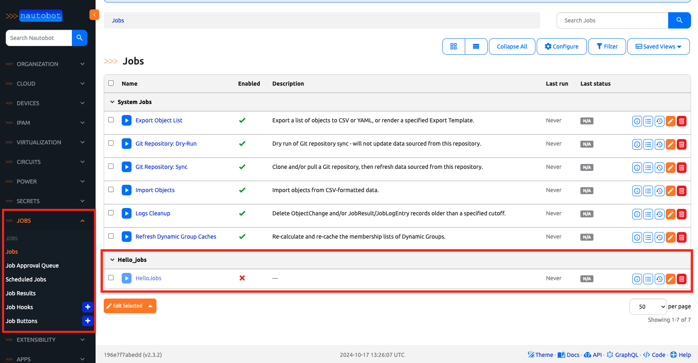

Remember that all new jobs by default is disabled? We will need edit the job by clicking on the edit button: 

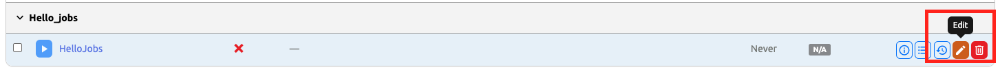

Scroll down to the checkbox for enablement: 

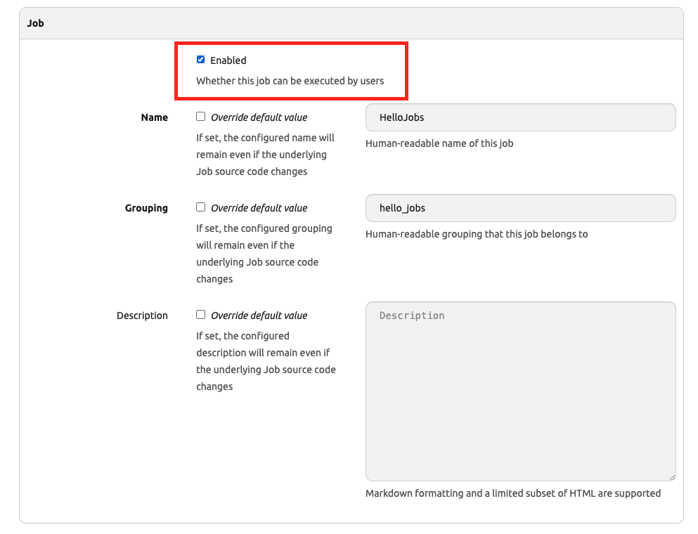

Then update the job: 

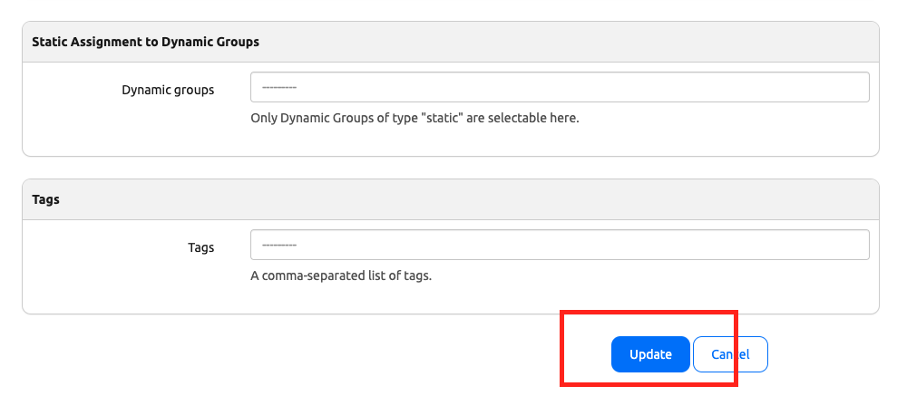

We can now run the job by clicking on the ```RUN``` button: 

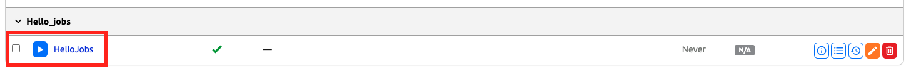

Then click on ```Run Job Now```: 

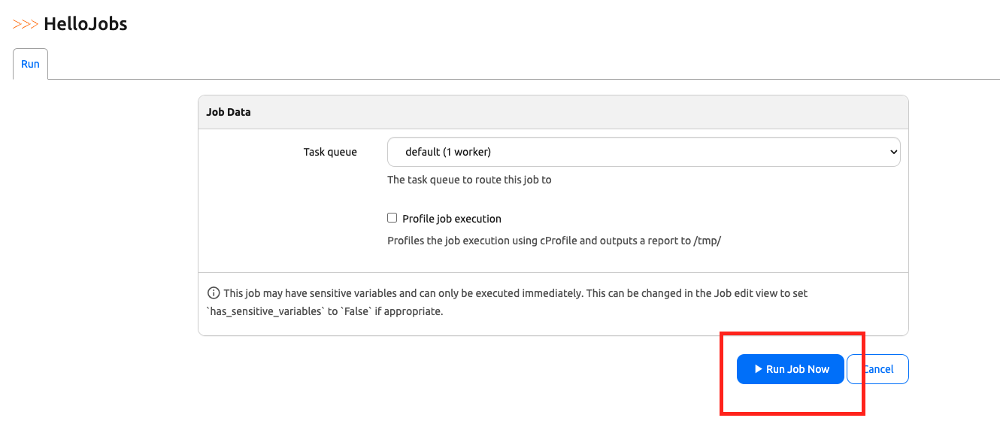

This is the result you should see: 

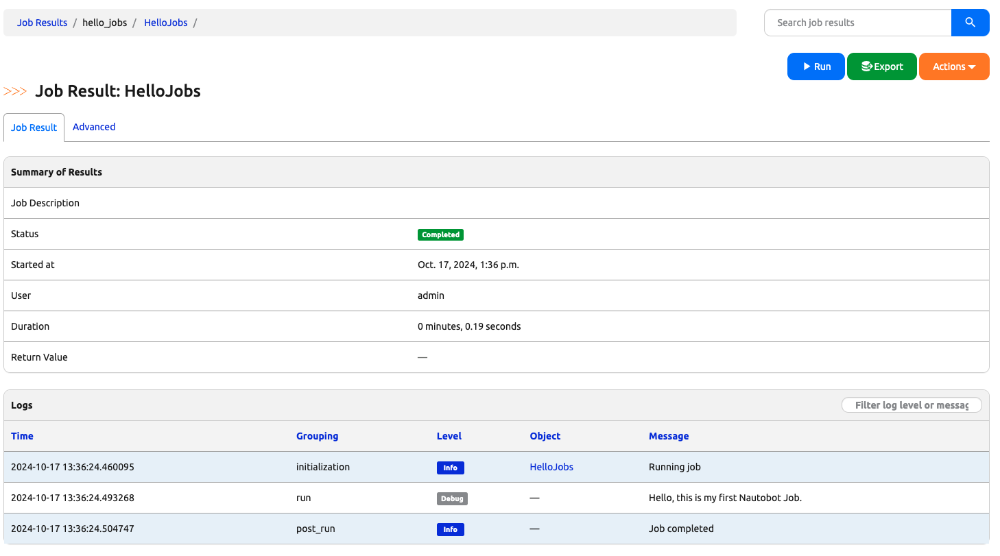

Just like that, we have our first job running! 

> [!TIP]
> If you run into any issues, here is a [video walkthrough](https://www.youtube.com/watch?v=ogh9jMTTa7I) for Day 3. 

## Day 3 To Do

Since we will continue to work on the same file tomorrow, let's go ahead and stop the codespace instance on [https://github.com/codespaces/](https://github.com/codespaces/) but do not delete it. 

Go ahead and post a screenshot of the result of the newly created job on a social media of your choice. Make sure you use the tag `#100DaysOfNautobot` `#JobsToBeDone` and tag `@networktocode`, so we can share your progress! 

In tomorrow's challenge, we will explore how we can customize the job even more. See you tomorrow! 

[X/Twitter](<https://twitter.com/intent/tweet?url=https://github.com/networktocode/100-days-of-nautobot-challenge&text=I+jst+completed+Day+3+of+the+100+days+of+nautobot+challenge+!&hashtags=100DaysOfNautobot,JobsToBeDone>)

[LinkedIn](https://www.linkedin.com/) (Copy & Paste: I just completed Day 3 of 100 Days of Nautobot, https://github.com/networktocode/100-days-of-nautobot-challenge, challenge! @networktocode #JobsToBeDone #100DaysOfNautobot)
