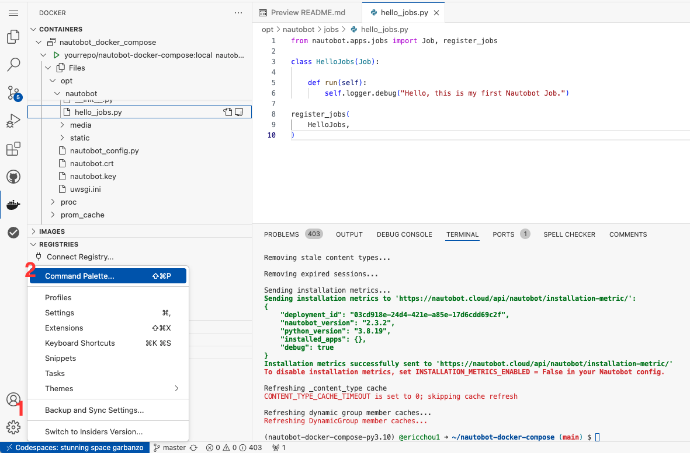
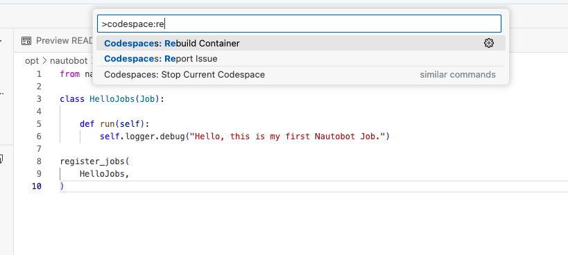
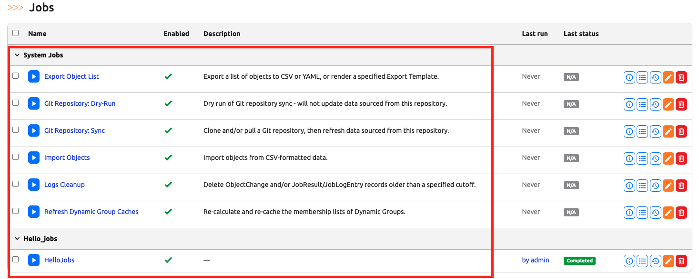
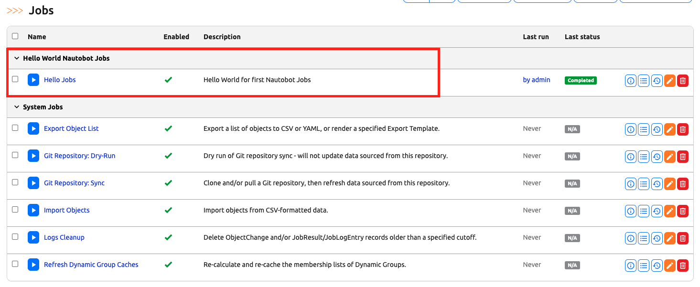
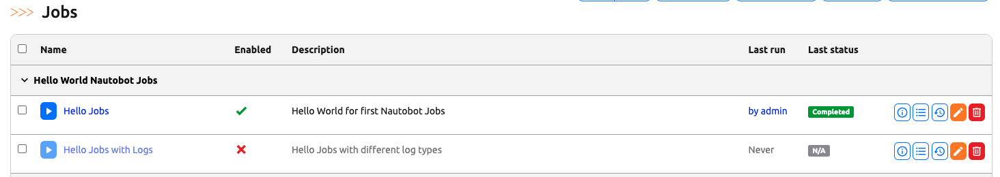
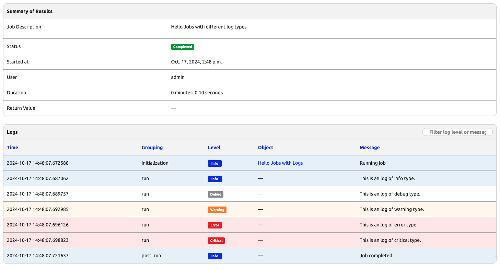
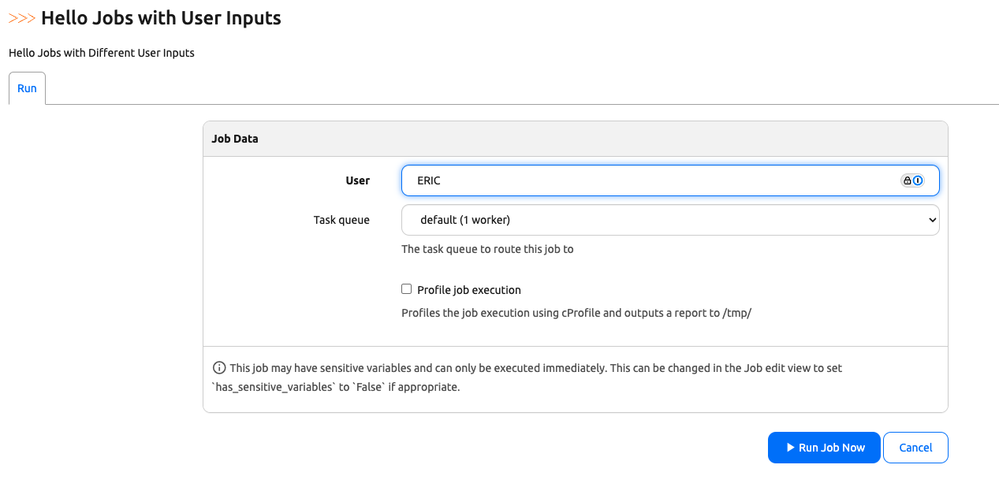
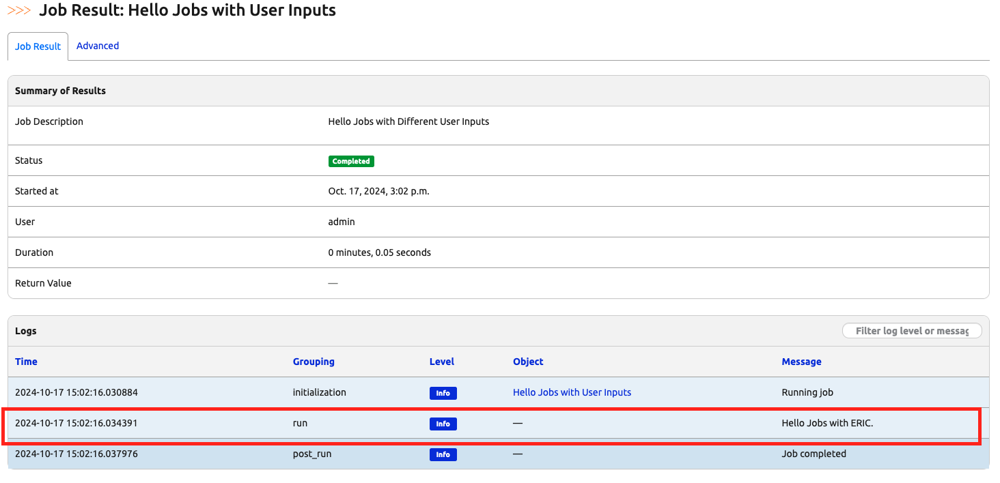

# Hello Jobs - Part 2: Customization and Features

In today's challenge, we will continue to work on the ```hello_jobs.py``` from [Day 3](https://github.com/networktocode-llc/100-days-of-nautobot-challenge/blob/main/Day003_Hello_Jobs_Part_1/README.md). 

Let's navigate to [https://github.com/codespaces/](https://github.com/codespaces/) and restart the codespace instance. 

## (Note) Rebuild Codespace

Since this is the first two-day series where we recommend stopping Codespace at the end of first day, then restarting the same instance the next day, let's spend a few minutes on the issue regarding rebuilds. For future days, we will just make a note of it (as well as mention it in [Lab Notes](../Lab_Setup/lab_related_notes/README.md)) but not spend as much time on the detail. 

Due to what I viewed as a bug, when Codespace is restarted, the Docker daemon does not start automatically. We will need to rebuild codespace. 

Click on the settings reel icon on the lower left corder and choose "Command Palette": 



In the command palette, type in "Codespace: Rebuild Container" and choose the option to rebuild, confirm the rebuild on the next page. 



Once Codespace is working again, use the terminal window to start Nautobot as we did in Day 3. 

## Jobs Meta Class

If we take a closer look at the Job we created, we can see there is no description to the job and the section grouping name is 'Hello_jobs' with an underscore. If we compare that with the existing System Jobs, we can see the System Jobs have both description and spaces between the job names: 



How do we change that? Let's refer to the [Nautobot Jobs Developer Guide](https://docs.nautobot.com/projects/core/en/stable/development/jobs/#module-metadata-attributes) section on Metadata attributes. 

From the documentation, we see that we can customize the grouping name using a global constant as well as define the job-specific name using the `Meta` class. Let's make the following change: 

```python
from nautobot.apps.jobs import Job, register_jobs

# new
name = "Hello World Nautobot Jobs"

class HelloJobs(Job):

    # new
    class Meta:
        name = "Hello Jobs"
        description = "Hello World for first Nautobot Jobs"

    def run(self):
        self.logger.debug("Hello, this is my first Nautobot Job.")
    
    
register_jobs(
    HelloJobs,
)
```

> [!IMPORTANT]
> Register jobs is an important step that many people, myself included, might miss when first introduced to Nautobot jobs, don't forget that line at the end.  

But nothing happens on the UI, what can be the issue? 

Remember we need to do a ```invoke post-upgrade``` for the changes to take effect: 

```
@ericchou1 ➜ ~ $ cd nautobot-docker-compose/
@ericchou1 ➜ ~/nautobot-docker-compose (main) $ poetry shell
(nautobot-docker-compose-py3.10) @ericchou1 ➜ ~/nautobot-docker-compose (main) $ invoke post-upgrade
```

We can see the changes have been taken by navigating back to the Nautobot Jobs UI: 



Let's see how we can add more logging to the job in the next section. 

## Add more Logging

We saw we can log our progress with ```self.logger.debug("Hello, this is my first Nautobot Job.")``` in the code. What if we want to log more data in different severity level? 

Again, the [Nautobot Jobs Developer Guide](https://docs.nautobot.com/projects/core/en/stable/development/jobs/#logging) is our friend here. Under logging, we can just as easily do that with the logger object. 

Let's create a second job in the same file with more logging: 

```python
class HelloJobsWithLogs(Job):

    class Meta:
        name = "Hello Jobs with Logs"
        description = "Hello Jobs with different log types"

    def run(self):
        self.logger.info("This is an log of info type.")
        self.logger.debug("This is an log of debug type.")
        self.logger.warning("This is an log of warning type.")
        self.logger.error("This is an log of error type.")
        self.logger.critical("This is an log of critical type.")
```

Don't forget to register the new job: 

```python
register_jobs(
    HelloJobs,
    HelloJobsWithLogs,
)
```

This is how the file would look at this point: 

```python
from nautobot.apps.jobs import Job, register_jobs

name = "Hello World Nautobot Jobs"

class HelloJobs(Job):

    class Meta:
        name = "Hello Jobs"
        description = "Hello World for first Nautobot Jobs"

    def run(self):
        self.logger.debug("Hello, this is my first Nautobot Job.")

class HelloJobsWithLogs(Job):

    class Meta:
        name = "Hello Jobs with Logs"
        description = "Hello Jobs with different log types"

    def run(self):
        self.logger.info("This is an log of info type.")
        self.logger.debug("This is an log of debug type.")
        self.logger.warning("This is an log of warning type.")
        self.logger.error("This is an log of error type.")
        self.logger.critical("This is an log of critical type.")


register_jobs(
    HelloJobs,
    HelloJobsWithLogs,
)
```

After performing a `post_upgrade`, we will see the new job showing up under the same group: 



We can enable the job and run it, the newly colored logs would show up: 



In the next job, we will see how we can provide some user input in our jobs. 

## User Input

We will learn more about the Django Object model in the future challenges. However, let's do a simple user input in the next job example. 

Let's add ```StringVar``` to the import statement: 

```python
from nautobot.apps.jobs import Job, register_jobs, StringVar
```

Then we can create a new job with user input, note that we create a variable ```username``` using the ```StringVar```, and we pass it in to the ```run(self, username)``` as an attribute: 

```python
class HelloJobsWithInputs(Job):
    
    username = StringVar()

    class Meta:
        name = "Hello Jobs with User Inputs"
        description = "Hello Jobs with Different User Inputs"

    def run(self, username):
        self.logger.info(f"Hello Jobs with {username}.")

register_jobs(
    ...
    HelloJobsWithInputs,
)
```

We will see an additional field when we try to run the job: 



The result page will display what we have entered in as the user: 



That is it for the Day 4 challenge! 

## Day 4 To Do

Remember to stop and delete the codespace instance on [https://github.com/codespaces/](https://github.com/codespaces/). 

Go ahead and post a screenshot of the newly created jobs on a social media platform of your choice, make sure you use the tag `#100DaysOfNautobot` `#JobsToBeDone` and tag `@networktocode`, so we can share your progress! 

In tomorrow's challenge, we dive deeper into Django ORM. See you tomorrow! 

[X/Twitter](<https://twitter.com/intent/tweet?url=https://github.com/networktocode/100-days-of-nautobot-challenge&text=I+jst+completed+Day+4+of+the+100+days+of+nautobot+challenge+!&hashtags=100DaysOfNautobot,JobsToBeDone>)

[LinkedIn](https://www.linkedin.com/) (Copy & Paste: I just completed Day 4 of 100 Days of Nautobot, https://github.com/networktocode/100-days-of-nautobot-challenge, challenge! @networktocode #JobsToBeDone #100DaysOfNautobot)

