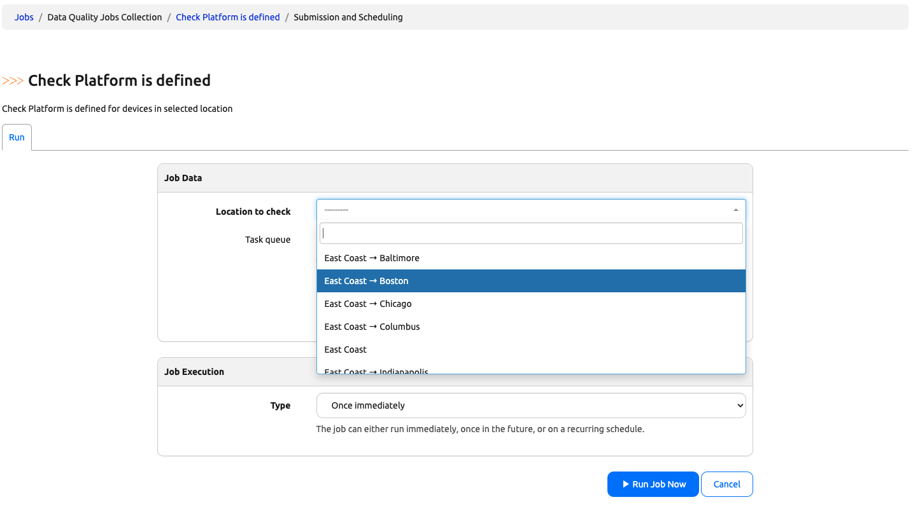
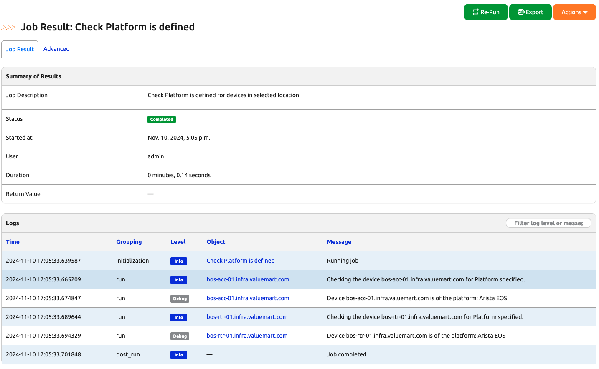
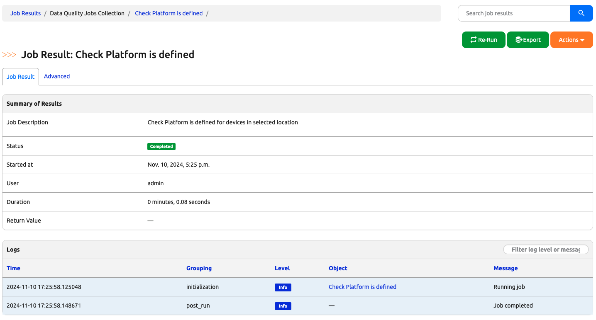
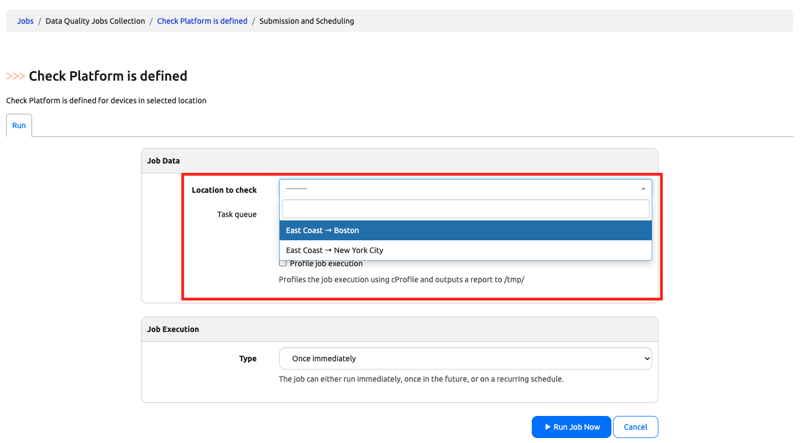
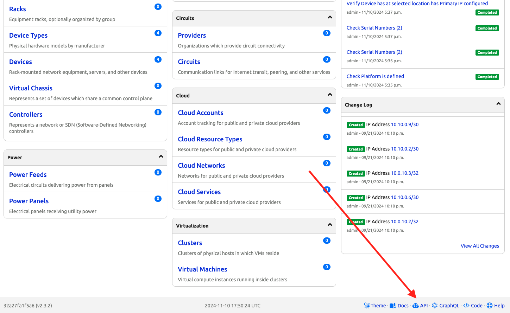
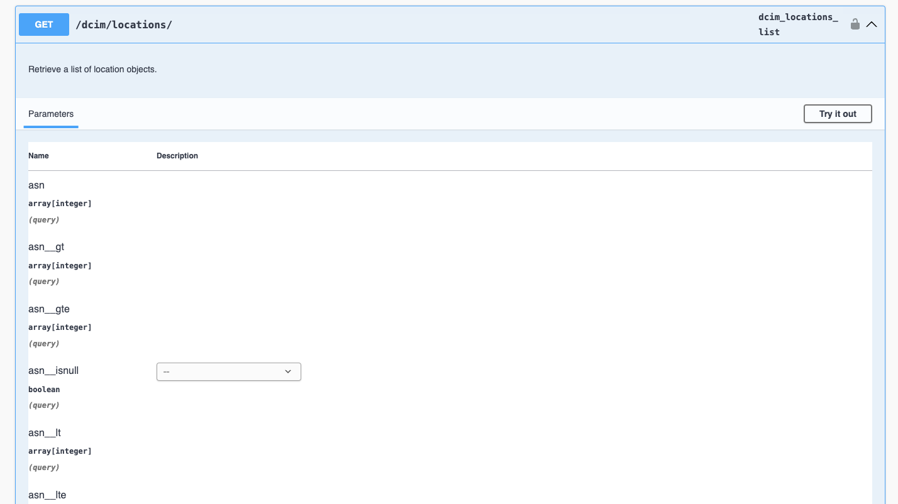
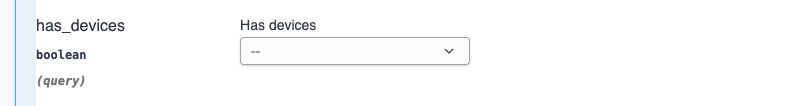
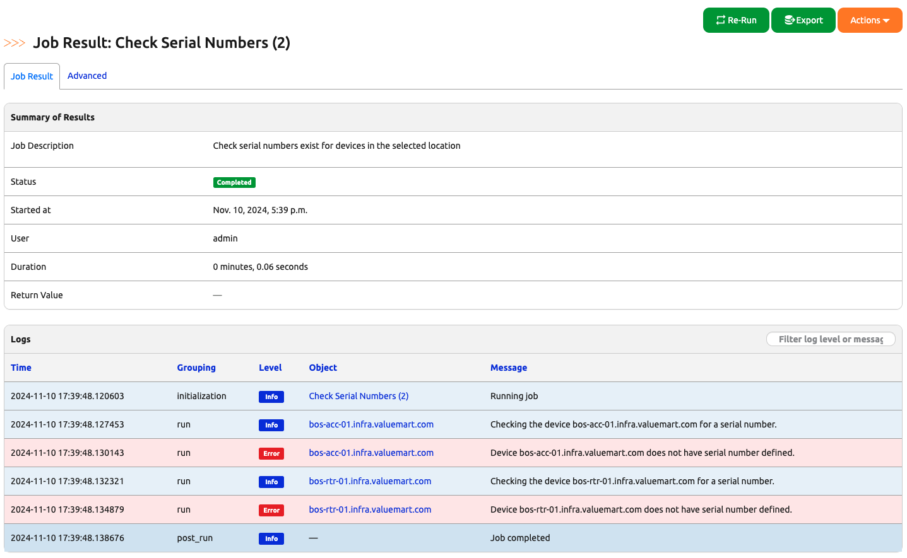

# Data Quality Jobs

In today's challenge, we will create two new jobs to check the quality of our data. 

## Lab Environment Setup

The environment setup will be the same as [Lab Setup Scenario 1](../Lab_Setup/scenario_1_setup/README.md), below is a summary of the steps, please consult the guide for a detailed background if needed. 

> [!TIP]
> If you have stopped the Codespace environment and restart again but found the Docker daemon stopped working, please follow the steps in the setup guide to rebuild the environment. 

Here is a review of the steps to start Nautobot: 

```
$ cd nautobot-docker-compose/
$ poetry shell
$ invoke build
$ invoke db-import
$ invoke debug
```
We are ready to create our new job file. 

## Job File Creation 

Let's create a new job named `data_quality_jobs.py` under `/opt/nautobot/jobs` in the nautobot docker container (feel free to use Option 1 as specified in [Hello Jobs](../Day003_Hello_Jobs_Part_1/README.md)): 

```
(nautobot-docker-compose-py3.10) @ericchou1 ➜ ~/nautobot-docker-compose (main) $ docker exec -u root -it nautobot_docker_compose-nautobot-1 bash

root@32a27fa1f5a6:/opt/nautobot# cd jobs

root@32a27fa1f5a6:/opt/nautobot/jobs# touch data_quality_jobs.py

root@32a27fa1f5a6:/opt/nautobot/jobs# chown nautobot:nautobot data_quality_jobs.py
```

We will use this file to work on the rest of today's challenge. 

## Verify platform is defined

Let's go ahead and populate the following code in `data_quality_jobs.py`, and we will go over the parts in the file that we might be familiar with after: 

```python
from nautobot.apps.jobs import MultiChoiceVar, Job, ObjectVar, register_jobs, StringVar, IntegerVar
from nautobot.dcim.models.locations import Location
from nautobot.dcim.models.devices import Device

name = "Data Quality Jobs Collection"


class VerifyPlatform(Job):

    location_to_check = ObjectVar(
        model=Location,
    )

    class Meta:
        name = "Check Platform is defined"
        has_sensitive_variables = False
        description = "Check Platform is defined for devices in selected location"

    def run(self, location_to_check):
        device_query = Device.objects.filter(location=location_to_check)

        for device in device_query:
            self.logger.info(
                "Checking the device %s for Platform specified.",
                device.name,
                extra={"object": device},
            )

            # Verify that the device has a platform set
            if device.platform is None:
                self.logger.fatal(f"{device} does not have platform set.")
                return

            else:
                self.logger.debug(
                    "Device %s is of the platform: %s",
                    device.name,
                    device.platform,
                    extra={"object": device},
                )

register_jobs(
    VerifyPlatform
)
```

The first thing we can notice is the additional attributes in the `Meta` class. They are pretty self-explanatory, but we can also reference the [documentation](https://docs.nautobot.com/projects/core/en/stable/development/jobs/#class-metadata-attributes) for more detail information : 

```python
    class Meta:
        name = "Check Platform is defined"
        has_sensitive_variables = False
        description = "Check Platform is defined for devices in selected location"
```

We can also see we use a `ObjectVar` to select the location, then use the object filter to filter the devices within the selected location: 

```python
class VerifyPlatform(Job):

    location_to_check = ObjectVar(
        model=Location,
    )
    ...
    def run(self, location_to_check):
        device_query = Device.objects.filter(location=location_to_check)
    ...
```

When we loop over the devices, in the log, we use the `extra={"object": device}` to provide a link to the device in the log: 

```python
        for device in device_query:
            self.logger.info(
                "Checking the device %s for Platform specified.",
                device.name,
                extra={"object": device},
            )
```

Once we enabled the job and run the job, we can pick Boston from the list of locations: 



Then we can see the list of devices in the location with the platform: 



## Query Parameters

However, we noticed that some locations do not have devices, for example Baltimore. When we run the job for Baltimore, it will succeed, but the result will be empty since there are no devices: 



What we can use is to add a `query_params` attribute to only limit the location with devices to show up on the list: 

```python
class VerifyPlatform(Job):

    location_to_check = ObjectVar(
        model=Location,
        query_params={
            "has_devices": True,
        }
    )
```

Now, on the Job run page, only locations with devices will show up: 



The `query_params` is a very powerful feature, we can use any of the parameters available to us in the REST API endpoint. For example, how do we find out if we can use the "has_devices" parameter to limit only the location with devices? We can use the API documentation. 

Let's go to the API doc by scrolling down to the page footer and click on the API link : 



We can then scroll down to the location endpoint: 



Then we can see there is a "has_devices" boolean parameter that we can use: 



We can follow the same code pattern to check more parameters for our data. 

## Verify Other Parameters

Following the same pattern, we can check for additional fields, such as serial number, primary IP, etc. 

Since there is no new logic added to these additional fields, the code will just be listed here as a reference: 

```python
from nautobot.apps.jobs import MultiChoiceVar, Job, ObjectVar, register_jobs, StringVar, IntegerVar
from nautobot.dcim.models.locations import Location
from nautobot.dcim.models.devices import Device

name = "Data Quality Jobs Collection"

class VerifySerialNumber(Job):

    location_to_check = ObjectVar(
        model=Location,
        query_params={
            "has_devices": True,
        }
    )

    class Meta:
        name = "Check Serial Numbers"
        has_sensitive_variables = False
        description = "Check serial numbers exist for devices in the selected location"

    def run(self, location_to_check):
        device_query = Device.objects.filter(location=location_to_check)

        for device in device_query:
            self.logger.info(
                "Checking the device %s for a serial number.",
                device.name,
                extra={"object": device},
            )
            if device.serial == "":
                self.logger.error(
                    "Device %s does not have serial number defined.",
                    device.name,
                    extra={"object": device},
                )
            else:
                self.logger.debug(
                    "Device %s has serial number: %s",
                    device.name,
                    device.serial,
                    extra={"object": device},
                )


class VerifyPrimaryIP(Job):

    location_to_check = ObjectVar(
        model=Location,
        query_params={
            "has_devices": True,
        }
    )

    class Meta:
        name = "Verify Device has at selected location has Primary IP configured"
        has_sensitive_variables = False
        description = "Check Device at selected location Primary IP configured"

    def run(self, location_to_check):
        device_query = Device.objects.filter(location=location_to_check)

        for device in device_query:
            self.logger.info(
                "Checking the device %s for Primary IP.",
                device.name,
                extra={"object": device},
            )

            # Verify that the device has a primary IP
            if device.primary_ip is None:
                self.logger.fatal(f"{device} does not have a primary IP address configured.")
                return

            else:
                self.logger.debug(
                    "Device %s has primary IP: %s",
                    device.name,
                    device.primary_ip,
                    extra={"object": device},
                )


class VerifyPlatform(Job):

    location_to_check = ObjectVar(
        model=Location,
        query_params={
            "has_devices": True,
        }
    )

    class Meta:
        name = "Check Platform is defined"
        has_sensitive_variables = False
        description = "Check Platform is defined for devices in selected location"

    def run(self, location_to_check):
        device_query = Device.objects.filter(location=location_to_check)

        for device in device_query:
            self.logger.info(
                "Checking the device %s for Platform specified.",
                device.name,
                extra={"object": device},
            )

            # Verify that the device has a platform set
            if device.platform is None:
                self.logger.fatal(f"{device} does not have platform set.")
                return

            else:
                self.logger.debug(
                    "Device %s is of the platform: %s",
                    device.name,
                    device.platform,
                    extra={"object": device},
                )

register_jobs(
    VerifySerialNumber,
    VerifyPrimaryIP,
    VerifyPlatform
)
```

After enabling the jobs, we can see the results. In this case, the Boston devices are indeed missing serial numbers: 



We did a lot in today's challenge, the fact we can access the database model in our job with just a few lines of code really goes a long way for our automation efforts. 

## Day 7 To Do

Remember to stop the codespace instance on [https://github.com/codespaces/](https://github.com/codespaces/). 

Go ahead and post a screenshot of the newly created jobs on a social media of your choice, make sure you use the tag `#100DaysOfNautobot` `#JobsToBeDone` and tag `@networktocode`, so we can share your progress! 

In tomorrow's challenge, we get continue to build on our data quality jobs, see you there!  

[X/Twitter](<https://twitter.com/intent/tweet?url=https://github.com/networktocode/100-days-of-nautobot-challenge&text=I+jst+completed+Day+7+of+the+100+days+of+nautobot+challenge+!&hashtags=100DaysOfNautobot,JobsToBeDone>)

[LinkedIn](https://www.linkedin.com/) (Copy & Paste: I just completed Day 7 of 100 Days of Nautobot, https://github.com/networktocode/100-days-of-nautobot-challenge, challenge! @networktocode #JobsToBeDone #100DaysOfNautobot)