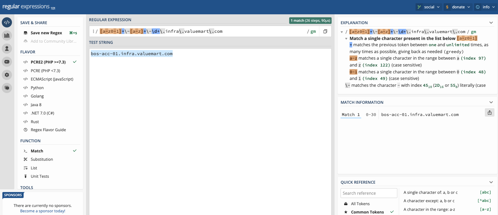
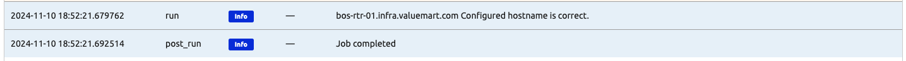

# Data Quality Jobs with User Input

In today's job, we will build from Day 007's data quality job. The main learning objective for today's challenge is to illustrate since Nautobot Jobs are based in Python, we are able to leverage the vast Python libraries to help with writing Nautobot Jobs.  

> [!NOTE] 
> Please start the Nautobot environment within Codespace, here is a condensed version of the commands:  
> ```
> $ cd nautobot-docker-compose/
> $ poetry shell
> $ invoke build
> $ invoke db-import
> $ invoke debug
> ```

As a reminder, in Day 007 we created a file named ```data_quality_jobs.py``` under ```/opt/nautobot/jobs``` in the nautobot docker container. Here is a repeat of [Day 7](../Day007_Data_Quality_Jobs_Part_1/README.md) file creation and file content: 

```
(nautobot-docker-compose-py3.10) @ericchou1 ➜ ~/nautobot-docker-compose (main) $ docker exec -u root -it nautobot_docker_compose-nautobot-1 bash

root@32a27fa1f5a6:/opt/nautobot/jobs# touch data_quality_jobs.py
root@32a27fa1f5a6:/opt/nautobot/jobs# chown nautobot:nautobot data_quality_jobs.py
```

Let's go ahead and paste in the code where we left off from Day 007: 

```python
from nautobot.apps.jobs import MultiChoiceVar, Job, ObjectVar, register_jobs, StringVar, IntegerVar
from nautobot.dcim.models.locations import Location
from nautobot.dcim.models.devices import Device

name = "Data Quality Jobs Collection"

class VerifySerialNumber(Job):

    location_to_check = ObjectVar(
        model=Location,
        query_params={
            "has_devices": True,
        }
    )

    class Meta:
        name = "Check Serial Numbers"
        has_sensitive_variables = False
        description = "Check serial numbers exist for devices in the selected location"

    def run(self, location_to_check):
        device_query = Device.objects.filter(location=location_to_check)

        for device in device_query:
            self.logger.info(
                "Checking the device %s for a serial number.",
                device.name,
                extra={"object": device},
            )
            if device.serial == "":
                self.logger.error(
                    "Device %s does not have serial number defined.",
                    device.name,
                    extra={"object": device},
                )
            else:
                self.logger.debug(
                    "Device %s has serial number: %s",
                    device.name,
                    device.serial,
                    extra={"object": device},
                )


class VerifyPrimaryIP(Job):

    location_to_check = ObjectVar(
        model=Location,
        query_params={
            "has_devices": True,
        }
    )

    class Meta:
        name = "Verify Device has at selected location has Primary IP configured"
        has_sensitive_variables = False
        description = "Check Device at selected location Primary IP configured"

    def run(self, location_to_check):
        device_query = Device.objects.filter(location=location_to_check)

        for device in device_query:
            self.logger.info(
                "Checking the device %s for Primary IP.",
                device.name,
                extra={"object": device},
            )

            # Verify that the device has a primary IP
            if device.primary_ip is None:
                self.logger.fatal(f"{device} does not have a primary IP address configured.")
                return

            else:
                self.logger.debug(
                    "Device %s has primary IP: %s",
                    device.name,
                    device.primary_ip,
                    extra={"object": device},
                )


class VerifyPlatform(Job):

    location_to_check = ObjectVar(
        model=Location,
        query_params={
            "has_devices": True,
        }
    )

    class Meta:
        name = "Check Platform is defined"
        has_sensitive_variables = False
        description = "Check Platform is defined for devices in selected location"

    def run(self, location_to_check):
        device_query = Device.objects.filter(location=location_to_check)

        for device in device_query:
            self.logger.info(
                "Checking the device %s for Platform specified.",
                device.name,
                extra={"object": device},
            )

            # Verify that the device has a platform set
            if device.platform is None:
                self.logger.fatal(f"{device} does not have platform set.")
                return

            else:
                self.logger.debug(
                    "Device %s is of the platform: %s",
                    device.name,
                    device.platform,
                    extra={"object": device},
                )

register_jobs(
    VerifySerialNumber,
    VerifyPrimaryIP,
    VerifyPlatform
)
```

We can move on with our first new job for today's challenge. 

## Verify Hostname Pattern in a Location

Let's say we want to make sure the devices in our inventory all conform to a naming standard. Our hostname should always be the following pattern: 

```
<city airport code>-<device role>-<device number>.infra.valuemart.com
```

The first thing we can do is to construct a Regular Expression pattern that we will use. A good source to learn, build, and verify regular expression pattern is [https://regex101.com/](https://regex101.com/). 



We can use the regular express we have built and use Python RE module to construct a match pattern: 

```python
import re
...

HOSTNAME_PATTERN = re.compile(r"[a-z0-1]+\-[a-z]+\-\d+\.infra\.valuemart\.com")

```

We can follow the same pattern to pick a location, then limit the devices to check within that location: 

```python
class VerifyHostname(Job):
    location_to_check = ObjectVar(
        model=Location,
        query_params={
            "has_devices": True,
        }
    )
    
    class Meta:

        name = "Verify Hostname Pattern For Selected Locations"
        description = "Checks all devices at Designated Location for hostname pattern conformation"

    def run(self, location_to_check):
        """Run method for executing the checks on the devices."""

        # Iterate through each Device object, limited to just the location of choice.
        for device in Device.objects.filter(location=location_to_check):
            hostname = device.name
            self.logger.info(
                f"Checking device hostname compliance: {hostname}",
                extra={"object": device},
            )
            # Check if the hostname matches the expected pattern
            if HOSTNAME_PATTERN.match(hostname):
                self.logger.info(f"{hostname} configured hostname is correct.")
                # Skip to next iteration of the list
                continue

            # Mark the Device as failed in the job results
            self.logger.error(f"{hostname} does Not Match Hostname Pattern.")
```

Remember to register the job: 

```python
register_jobs(
    VerifyHostname,
    VerifySerialNumber,
    VerifyPrimaryIP,
    VerifyPlatform
)
```

We will need to register the new job with ```invoke post-upgrade``` in a separate terminal window: 

```
(nautobot-docker-compose-py3.10) @ericchou1 ➜ ~/nautobot-docker-compose (main) $ invoke post-upgrade
```

After enabling, we can run the job and check the results: 



This is just a simple example of using normal Python code that we are familiar with to enhance the functionality of jobs. As we will see later, we will use Python libraries such as ```csv``` to read CSV files, ```json``` to decode and encode JSON bodies, and the various API libraries to make outbound calls. 

## Day 8 To Do

Remember to stop and delete the codespace instance on [https://github.com/codespaces/](https://github.com/codespaces/). 

Go ahead and post a screenshot of the success of the hostname check job on a social media platform of your choice, make sure you use the tag `#100DaysOfNautobot` `#JobsToBeDone` and tag `@networktocode`, so we can share your progress! 

In tomorrow's challenge, we get back to augment our Nautobot Jobs. See you tomorrow! 

[X/Twitter](<https://twitter.com/intent/tweet?url=https://github.com/networktocode/100-days-of-nautobot-challenge&text=I+jst+completed+Day+8+of+the+100+days+of+nautobot+challenge+!&hashtags=100DaysOfNautobot,JobsToBeDone>)

[LinkedIn](https://www.linkedin.com/) (Copy & Paste: I just completed Day 8 of 100 Days of Nautobot, https://github.com/networktocode/100-days-of-nautobot-challenge, challenge! @networktocode #JobsToBeDone #100DaysOfNautobot) 

