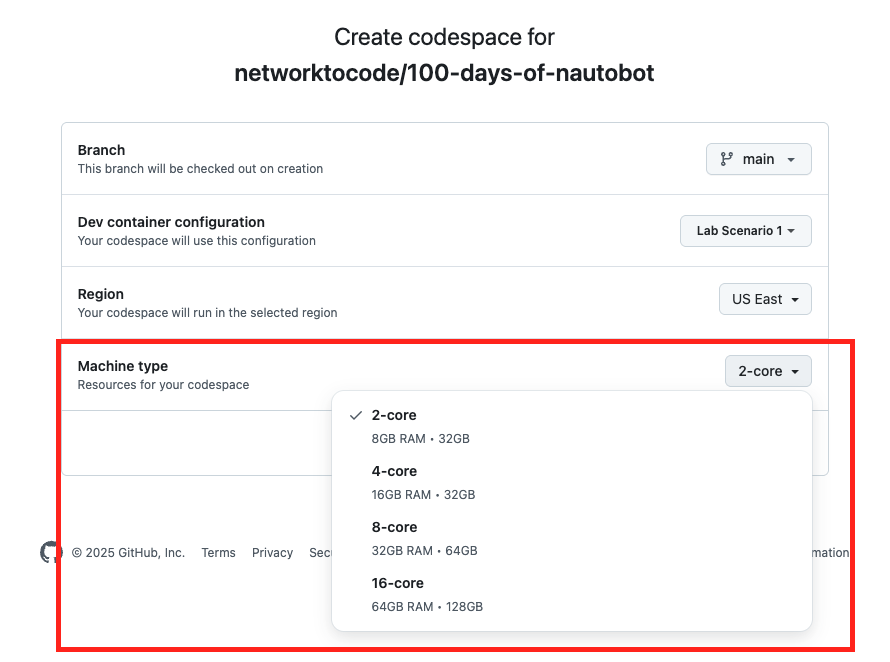

# Python Script to Job - Part 1 Netmiko `show command` Python script

In today's challenge, we will apply what we learned about Nautobot Jobs to network lab devices.  

In many of the future challenges, we will need to have a network lab our Nautobot instance can interface with. Part of our objective for today's challenge is to set up a lab environment within Codespace using [Containerlab](https://containerlab.dev/).

> [!IMPORTANT]
> If you have enough Codespace credit or do not mind paying the fee to have a better experience, you should launch the Codespace instance with more core. How much more? I would start with `4-core`. 



Again, as we stated in the `warnign` box above, s we add more containers to the Codespace environment, you will find the CPU running high during the launch. I have successfully completed the lab with the `2-core` machine types, but I had to wait a while for the CPU to normalize. 

## Lab Environment Setup

The Nautobot portion of the lab environment setup will be the same as [Lab Setup Scenario 1](../Lab_Setup/scenario_1_setup/README.md), below is a summary of the steps, please consult the guide for a detailed background if needed. 

> [!TIP]
> If you have stopped the Codespace environment and restart again but found the Docker daemon stopped working, please follow the steps in the setup guide to rebuild the environment. 

Here is a review of the steps to start Nautobot: 

```
$ cd nautobot-docker-compose/
$ poetry shell
$ invoke build
$ invoke db-import
$ invoke debug
```

Let set up the network lab. 

## Containerlab

[Containerlab](https://containerlab.dev/) is a way to build a virtual lab using network operating system with containers. 

As part of our setup, we already installed Containerlab executables. We can check the version that was installed: 

```
@ericchou1 ➜ ~ $ containerlab version
  ____ ___  _   _ _____  _    ___ _   _ _____ ____  _       _     
 / ___/ _ \| \ | |_   _|/ \  |_ _| \ | | ____|  _ \| | __ _| |__  
| |  | | | |  \| | | | / _ \  | ||  \| |  _| | |_) | |/ _` | '_ \ 
| |__| |_| | |\  | | |/ ___ \ | || |\  | |___|  _ <| | (_| | |_) |
 \____\___/|_| \_| |_/_/   \_\___|_| \_|_____|_| \_\_|\__,_|_.__/ 

    version: 0.57.3
     commit: 8c357f5a
       date: 2024-09-21T12:26:37Z
     source: https://github.com/srl-labs/containerlab
 rel. notes: https://containerlab.dev/rn/0.57/#0573
 ```

In the next step, we will download the Arista cEOS image to be used in our lab. 

## Arista cEOS

[Arista Networks](https://www.arista.com/en/) provides a free download of their containerized EOS system that can be used with Containerlab. The registration is free, but you will need to use a business email address. 

Once registered, you can download the image via "Support -> Software Download": 


> [!TIP]
> Please also see [Lab Setup Scenario 1](../Lab_Setup/scenario_1_setup/README.md) for instructions on how to download Arista cEOS image

We should pick one of the "cEOS Lab" software image, in the screenshot, we show ```cEOS64-lab-4-32.0F.tar.xz```: 


Once that is downloaded, we can right-click on the Explorer area and choose to upload the image: 


 

Depending on the Internet speed, the upload time might take a minute or two. Once the image is uploaded, we can use the following command to import the image to docker: 

> [!IMPORTANT]
> Remember to substitute the version matches the version downloaded. 

> [!WARNING]
> In the example below, the file was already unzipped, it does not have the `.zip` file extension. Please include the `.zip` extension as necessary. 

```
docker import cEOS64-lab-4.32.0F.tar ceos:4.32.0F
```

We are ready to launch our lab in the next step. 

## Launching Containerlab

We have prepared a ```clab``` folder under the ```100-days-of-nautobot``` directory containing the lab topology and startup configurations: 

```
@ericchou1 ➜ ~/100-days-of-nautobot-challenge (main) $ cd clab/
@ericchou1 ➜ ~/100-days-of-nautobot-challenge/clab (main) $ ls
ceos-lab.clab.yml  startup-configs
```

For this initial test, we can comment out the NYC devices and only launch the BOS devices to save time and resources. 

> [!IMPORTANT]
> Please use the same image name that was used in the last step if the version is different. 

```yaml
---
name: "ceos-lab"
prefix: ""

mgmt:
  network: "bridge"

topology:
  kinds:
    ceos:
      image: "ceos:4.32.0F"

  nodes:
    bos-acc-01:
      kind: "ceos"
      startup-config: "startup-configs/bos-acc-01.conf"

    bos-rtr-01:
      kind: "ceos"
      startup-config: "startup-configs/bos-rtr-01.conf"

    # nyc-acc-01:
    #   kind: "ceos"
    #   startup-config: "startup-configs/nyc-acc-01.conf"

    # nyc-rtr-01:
    #   kind: "ceos"
    #   startup-config: "startup-configs/nyc-rtr-01.conf"

  links:
    - endpoints: ["bos-acc-01:eth1", "bos-rtr-01:eth1"]
    # - endpoints: ["bos-acc-01:eth2", "nyc-rtr-01:eth2"]
    # - endpoints: ["bos-rtr-01:eth2", "nyc-acc-01:eth2"]
    # - endpoints: ["nyc-acc-01:eth1", "nyc-rtr-01:eth1"]
```

> [!TIP]
> As an alternative, we can also use the `--node-filter` command during launch: 
> 
> ```
> $ cd clab/
> $ sudo containerlab deploy --topo ceos-lab.clab.yml --node-filter bos-acc-01,bos-rtr-01
> ```

Let's go ahead and launch the lab: 

```
@ericchou1 ➜ ~/100-days-of-nautobot-challenge/clab (main) $ sudo containerlab deploy --topo ceos-lab.clab.yml 
INFO[0000] Containerlab v0.57.3 started                 
INFO[0000] Parsing & checking topology file: ceos-lab.clab.yml 
WARN[0000] Unable to init module loader: stat /lib/modules/6.5.0-1025-azure/modules.dep: no such file or directory. Skipping... 
INFO[0000] Creating lab directory: /home/vscode/100-days-of-nautobot-challenge/clab/clab-ceos-lab 
INFO[0000] Creating container: "bos-acc-01"             
INFO[0000] Creating container: "bos-rtr-01"             
INFO[0001] Running postdeploy actions for Arista cEOS 'bos-rtr-01' node 
...
INFO[0120] Adding ssh config for containerlab nodes     
INFO[0121] 🎉 New containerlab version 0.59.0 is available! Release notes: https://containerlab.dev/rn/0.59/
Run 'containerlab version upgrade' to upgrade or go check other installation options at https://containerlab.dev/install/ 
+---+------------+--------------+--------------+------+---------+---------------+--------------+
| # |    Name    | Container ID |    Image     | Kind |  State  | IPv4 Address  | IPv6 Address |
+---+------------+--------------+--------------+------+---------+---------------+--------------+
| 1 | bos-acc-01 | a7a817e93157 | ceos:4.32.0F | ceos | running | 172.17.0.3/16 | N/A          |
| 2 | bos-rtr-01 | 67cdc82c7f46 | ceos:4.32.0F | ceos | running | 172.17.0.2/16 | N/A          |
+---+------------+--------------+--------------+------+---------+---------------+--------------+
```

Take a note of the IP addresses shown, in the next step, we will use a simple Netmiko script to perform show commands. 

## Netmiko Python Script

Nautobot leverages the multivendor, open-source [Netmiko](https://pynet.twb-tech.com/blog/netmiko-python-library.html) library created by Kirk Byers to interact with network devices. As such, it is already included in our Nautobot instance. 

Let's go ahead and try it out on the Nautobot container. Let's try it out in nbshell: 

```
$ cd nautobot-docker-compose/
$ poetry shell
$ invoke nbshell
```

We can just follow the simple example illustrated on the [Netmiko Getting Started](https://pynet.twb-tech.com/blog/netmiko-python-library.html) section: 

```
>>> from netmiko import ConnectHandler
>>> net_connect = ConnectHandler( 
...     device_type="arista_eos", 
...     host="172.17.0.3", 
...     username="admin", 
...     password="admin", 
... )

>>> net_connect
<netmiko.arista.arista.AristaSSH object at 0x7abfa8bbf610>

>>> net_connect.find_prompt()
'ceos-01>'
```

Fantastic, we can communicate with the device. Let's try to grab the ```show version``` output from the device: 

```
>>> output = net_connect.send_command("show version")
>>> print(output)
Arista cEOSLab
Hardware version: 
Serial number: 7579A68E1C5B921AA01EA5A60E12FCD5
Hardware MAC address: 001c.7314.b2a8
System MAC address: 001c.7314.b2a8

Software image version: 4.32.0F-36401836.4320F (engineering build)
Architecture: x86_64
Internal build version: 4.32.0F-36401836.4320F
Internal build ID: e97bbe15-478c-45d1-84fa-332db23aef84
Image format version: 1.0
Image optimization: None

cEOS tools version: (unknown)
Kernel version: 6.5.0-1025-azure

Uptime: 4 minutes
Total memory: 8119864 kB
Free memory: 1232352 kB
```

I will leave it to you to repeat the same step for the other device ```172.17.0.2``` to test the lab reachability. 

After you are done with today's work, shutdown Containerlab with: 

```
$ cd clab/
$ sudo containerlab destroy --topo ceos-lab.clab.yml 
```

## Day 9 To Do

Remember to stop the codespace instance on [https://github.com/codespaces/](https://github.com/codespaces/). 

Go ahead and post the output of the show output of the Netmiko command on a social media of your choice, make sure you use the tag `#100DaysOfNautobot` `#JobsToBeDone` and tag `@networktocode`, so we can share your progress! 

In tomorrow's challenge, we integrate this script into our Nautobot Job. See you tomorrow! 

[X/Twitter](<https://twitter.com/intent/tweet?url=https://github.com/networktocode/100-days-of-nautobot-challenge&text=I+jst+completed+Day+9+of+the+100+days+of+nautobot+challenge+!&hashtags=100DaysOfNautobot,JobsToBeDone>)

[LinkedIn](https://www.linkedin.com/) (Copy & Paste: I just completed Day 9 of 100 Days of Nautobot, https://github.com/networktocode/100-days-of-nautobot-challenge, challenge! @networktocode #JobsToBeDone #100DaysOfNautobot)

