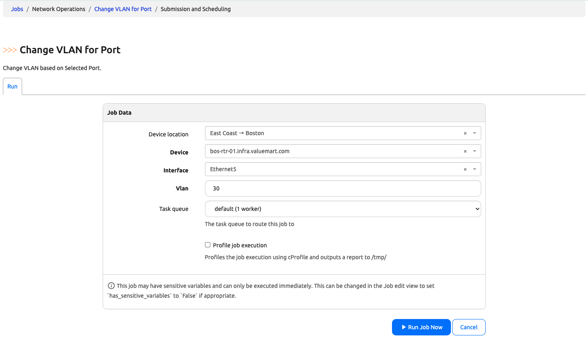
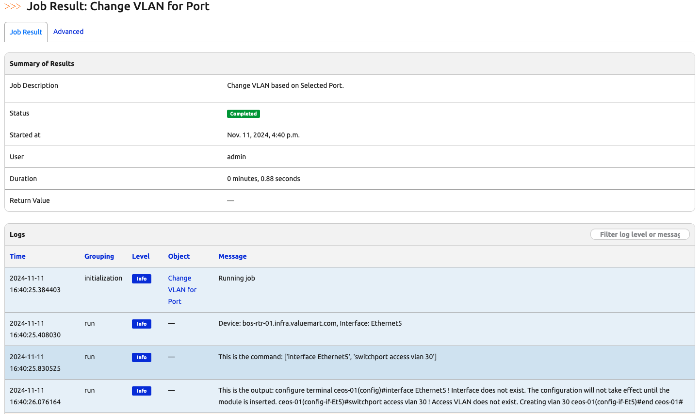
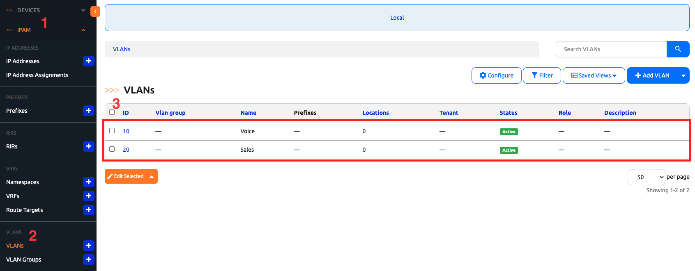
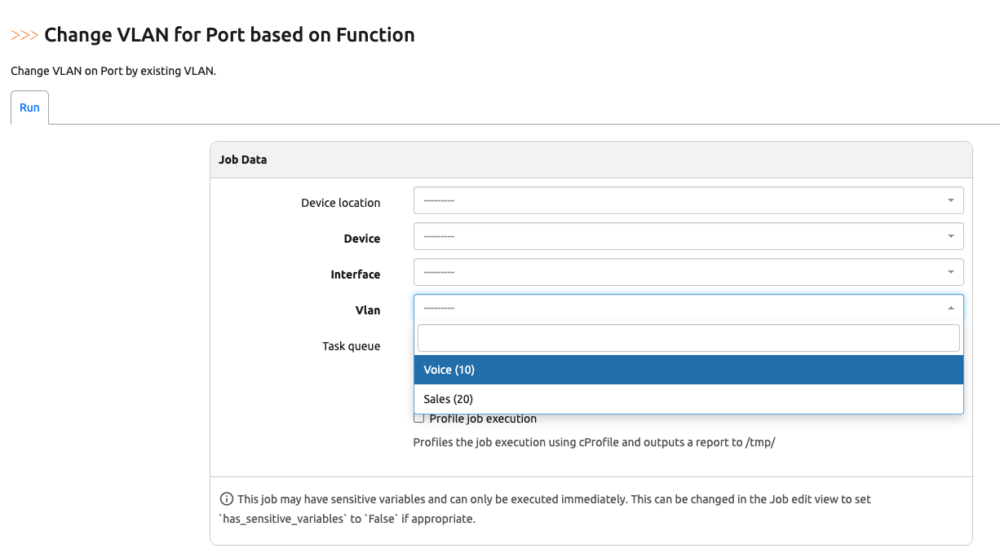

# Change VLAN Job 

In Day 10's challenge, we were able to use Nautobot Jobs to perform 'show' commands on the devices Nautobot knows about. In today's challenge, we will move one step further in performing commands that make operational changes, namely changing vlan on a port. 

Before we started, let's prepare the lab environment as we are doing it a bit different in today's lab. 

## Environment Setup

The environment setup will be the same as [Lab Setup Scenario 1](../Lab_Setup/scenario_1_setup/README.md), below is a summary of the steps, please consult the guide for a detailed background if needed. 

> [!IMPORTANT]
> If you have enough Codespace credit or do not mind paying the fee to have a better experience, you should launch the Codespace instance with more core. How much more? I would start with `4-core`. 

> [!TIP]
> If you have stopped the Codespace environment and restart again but found the Docker daemon stopped working, please follow the steps in the setup guide to rebuild the environment. 

We will follow the same steps to start Nautobot: 

```
$ cd nautobot-docker-compose/
$ poetry shell
$ invoke build
$ invoke db-import
$ invoke debug
```

Let's upload and prepare cEOS image and start Containerlab: 

> [!IMPORTANT]
> Remember to substitute the version matches the version downloaded. 

> [!WARNING]
> In the example below, the file was already unzipped, it does not have the `.zip` file extension. Please include the `.zip` extension as necessary. 

```
$ docker import cEOS64-lab-4.32.0F.tar ceos:4.32.0F
```

For this lab we only needed the BOS devices: 

```
$ cd clab/
$ sudo containerlab deploy --topo ceos-lab.clab.yml --node-filter bos-acc-01,bos-rtr-01
```

Let's create a file for today's challenge. We can either do this via the shared directory or directly in the Nautobot docker container: 

```
$ docker exec -u root -it nautobot_docker_compose-nautobot-1 bash
root@c9e0fa2a45a0:/opt/nautobot# cd jobs
root@c9e0fa2a45a0:/opt/nautobot/jobs# pwd
/opt/nautobot/jobs
root@c9e0fa2a45a0:/opt/nautobot/jobs# touch operation_jobs.py
root@c9e0fa2a45a0:/opt/nautobot/jobs# chown nautobot:nautobot operation_jobs.py
```

The environment is now setup for today's challenge.  

> [!NOTE]
> Today's challenge is an extension of Day 10's challenge, please feel free to copy and paste the final version of Day 10's Job before continuing.  

In the next step, we will create a script that allows us to change the VLAN configuration on a port. 

## VLAN Change Job

As usual, we start with the imports: 

```
import os

from django.conf import settings
from nautobot.apps.jobs import MultiChoiceVar, Job, ObjectVar, register_jobs, StringVar, IntegerVar
from nautobot.dcim.models.locations import Location
from nautobot.dcim.models.devices import Device
from nautobot.dcim.models.device_components import Interface
from netmiko import ConnectHandler
from nautobot.ipam.models import VLAN
from nautobot.apps.jobs import JobButtonReceiver
```

We will use the special global variable ```name``` to indicate the name of the Jobs: 

```
name = "Network Operations"
```

In the first part of the job, we want to achieve the following: 

1. Pick a location from the existing locations. 
2. Pick a device from the selected location. 
3. Only have Ethernet as the option to allow for VLAN change (we do not want to change vlan on, say, the loopback interfaces). 

How do we do that? We can use ```query_params``` to limit the scope: 

```
class ChangeVLAN(Job):
    device_location = ObjectVar(model=Location, required=False)

    device = ObjectVar(
        model=Device,
        query_params={
            "location": "$device_location",
        },
    )

    interface = ObjectVar(
        model=Interface,
        query_params={
            "device_id": "$device",
            "name__ic": "Ethernet"
        }
    )
```

Notice we use ```"name__ic": "Ethernet"``` with double underscore to indicate name "includes" keyword of "Ethernet". 

Then we can define a ```IntegerVar``` to enter the VLAN number as well as the Meta class for meta information: 

```
    # Specify a job input VLAN to be implemented
    vlan = IntegerVar()
    
    
    class Meta:
        name = "Change VLAN for Port"
        description = "Change VLAN based on Selected Port."
```

In the main ```run()``` method, we will perform the normal checks, then use Netmiko to execute the command: 

```
    def run(self, device_location, device, interface, vlan):
        """Run method for executing the checks on the device."""
        self.logger.info(f"Device: {device.name}, Interface: {interface}")

        # Verify that the device has a primary IP
        if device.primary_ip is None:
            self.logger.fatal("Device does not have a primary IP address set.")
            return

        # Verify that the device has a platform associated 
        if device.platform is None:
            self.logger.fatal("Device does not have a platform set.")
            return

        # check for device driver association
        if device.platform.network_driver_mappings.get("netmiko") is None:
            self.logger.fatal("Device mapping for Netmiko is not present, please set.")
            return

        # Connect to the device, get some output - comment this out if you are simulating
        net_connect = ConnectHandler(
            device_type=device.platform.network_driver_mappings["netmiko"],
            host=device.primary_ip.host,  # or device.name if your name is an FQDN
            username="admin",
            password="admin",
        )

        # Easy mapping of platform to device command
        COMMAND_MAP = {
            "cisco_nxos": [f"interface {interface}", f"switchport access vlan {vlan}"],
            "arista_eos": [f"interface {interface}", f"switchport access vlan {vlan}"],
        }

        commands = COMMAND_MAP[device.platform.network_driver_mappings.get("netmiko")]
        self.logger.info(f"This is the command: {commands}")
        # output = net_connect.send_command(commands)
        net_connect.enable()
        output = net_connect.send_config_set(commands)
        net_connect.save_config()
        net_connect.disconnect()
        self.logger.info(f"This is the output: {output}")

        # If an excpetion is not raise the configuration was implemented successfully
        self.logger.info(
            interface, f"Successfully added to {interface.name} on {device.name}!"
        )
```

In the run method, we used COMMAND_MAP to correlate the potential differences in command execution between "cisco_nxos" and "arista_eos": 

```
        # Easy mapping of platform to device command
        COMMAND_MAP = {
            "cisco_nxos": [f"interface {interface}", f"switchport access vlan {vlan}"],
            "arista_eos": [f"interface {interface}", f"switchport access vlan {vlan}"],
        }

        commands = COMMAND_MAP[device.platform.network_driver_mappings.get("netmiko")]
        self.logger.info(f"This is the command: {commands}")
```

The final step is to register the job: 

```
register_jobs(
    ChangeVLAN,  
    CommandRunner,
)
```

We can enable the job and take it for a spin: 



On the result page, we can see the command being applied as well as the result: 



This is great, we can change the VLAN on a port with Nautobot! 

Let's make one more improvement, instead of just use a ```IntegerVar``` to indicate the VLAN number, we should scope the VLAN to only existing vlan's. 

## VLAN Change based on Function 

We should already have VLAN 10 and 20 created, but feel free to create more if you'd like: 



We can create another Job to scope the VLAN change to only existing VLANs: 

```
class ChangeVLAN_by_Function(Job):
    device_location = ObjectVar(model=Location, required=False)

    device = ObjectVar(
        model=Device,
        query_params={
            "location": "$device_location",
        },
    )

    interface = ObjectVar(
        model=Interface,
        query_params={
            "device_id": "$device",
            "name__ic": "Ethernet"
        }
    )

    vlan = ObjectVar(
        model=VLAN,
    )
    
    
    class Meta:
        name = "Change VLAN on Port by existing VLAN"
        description = "Change VLAN on Port by existing VLAN."

    def run(self, device_location, device, interface, vlan):
        """Run method for executing the checks on the device."""
        self.logger.info(f"Device: {device.name}, Interface: {interface}")

        # Verify that the device has a primary IP
        if device.primary_ip is None:
            self.logger.fatal("Device does not have a primary IP address set.")
            return

        # Verify that the device has a platform associated 
        if device.platform is None:
            self.logger.fatal("Device does not have a platform set.")
            return

        # check for device driver association
        if device.platform.network_driver_mappings.get("netmiko") is None:
            self.logger.fatal("Device mapping for Netmiko is not present, please set.")
            return

        # Connect to the device, get some output - comment this out if you are simulating
        net_connect = ConnectHandler(
            device_type=device.platform.network_driver_mappings["netmiko"],
            host=device.primary_ip.host,  # or device.name if your name is an FQDN
            username="admin",
            password="admin",
        )

        # Easy mapping of platform to device command
        COMMAND_MAP = {
            "cisco_nxos": [f"interface {interface}", f"switchport access vlan {vlan.vid}"],
            "arista_eos": [f"interface {interface}", f"switchport access vlan {vlan.vid}"],
        }

        commands = COMMAND_MAP[device.platform.network_driver_mappings.get("netmiko")]
        self.logger.info(f"This is the command: {commands}")
        # output = net_connect.send_command(commands)
        net_connect.enable()
        output = net_connect.send_config_set(commands)
        net_connect.save_config()
        net_connect.disconnect()
        self.logger.info(f"This is the output: {output}")

        # If an excpetion is not raise the configuration was implemented successfully
        self.logger.info(
            interface, f"Successfully added VLAN {vlan.name} to {interface.name} on {device.name}!"
        )


register_jobs(
    ChangeVLAN,  
    ChangeVLAN_by_Function,
    CommandRunner,
)
```

Now when we go to the job, only existing VLAN will show up as the options: 



## Final Script 

Here is the final version of the Job file:

```
import os

from django.conf import settings
from nautobot.apps.jobs import MultiChoiceVar, Job, ObjectVar, register_jobs, StringVar, IntegerVar
from nautobot.dcim.models.locations import Location
from nautobot.dcim.models.devices import Device
from nautobot.dcim.models.device_components import Interface
from netmiko import ConnectHandler
from nautobot.ipam.models import VLAN
from nautobot.apps.jobs import JobButtonReceiver


name = "Network Operations"


COMMAND_CHOICES = (
    ("show ip interface brief", "show ip int bri"),
    ("show ip route", "show ip route"),
    ("show version", "show version"),
    ("show log", "show log"),
    ("show ip ospf neighbor", "show ip ospf neighbor"),
)


class CommandRunner(Job):
    device_location = ObjectVar(model=Location, required=False)

    device = ObjectVar(
        model=Device,
        query_params={
            "location": "$device_location",
        },
    )

    commands = MultiChoiceVar(choices=COMMAND_CHOICES)

    class Meta:
        name = "Command Runner"
        has_sensitive_variables = False
        description = "Command Runner"

    def run(self, device_location, device, commands):
        self.logger.info("Device name: %s", device.name)
    
        # Verify that the device has a primary IP
        if device.primary_ip is None:
            self.logger.fatal("Device does not have a primary IP address set.")
            return

        # Verify that the device has a platform associated 
        if device.platform is None:
            self.logger.fatal("Device does not have a platform set.")
            return

        # check for device driver association
        if device.platform.network_driver_mappings.get("netmiko") is None:
            self.logger.fatal("Device mapping for Netmiko is not present, please set.")
            return

        # Connect to the device, get some output - comment this out if you are simulating
        net_connect = ConnectHandler(
            device_type=device.platform.network_driver_mappings["netmiko"],
            host=device.primary_ip.host,  # or device.name if your name is an FQDN
            # username=os.getenv("DEVICE_USERNAME"),  # change to use user_name
            # password=os.getenv("DEVICE_PASSWORD"),
            username="admin",
            password="admin",
        )
        for command in commands:
            output = net_connect.send_command(
                command
            )  
            self.create_file(f"{device.name}-{command}.txt", output)

class ChangeVLAN(Job):
    device_location = ObjectVar(model=Location, required=False)

    device = ObjectVar(
        model=Device,
        query_params={
            "location": "$device_location",
        },
    )

    interface = ObjectVar(
        model=Interface,
        query_params={
            "device_id": "$device",
            "name__ic": "Ethernet"
        }
    )

    # Specify a job input VLAN to be implemented
    vlan = IntegerVar()
    
    
    class Meta:
        name = "Change VLAN for Port"
        description = "Change VLAN based on Selected Port."

    def run(self, device_location, device, interface, vlan):
        """Run method for executing the checks on the device."""
        self.logger.info(f"Device: {device.name}, Interface: {interface}")

        # Verify that the device has a primary IP
        if device.primary_ip is None:
            self.logger.fatal("Device does not have a primary IP address set.")
            return

        # Verify that the device has a platform associated 
        if device.platform is None:
            self.logger.fatal("Device does not have a platform set.")
            return

        # check for device driver association
        if device.platform.network_driver_mappings.get("netmiko") is None:
            self.logger.fatal("Device mapping for Netmiko is not present, please set.")
            return

        # Connect to the device, get some output - comment this out if you are simulating
        net_connect = ConnectHandler(
            device_type=device.platform.network_driver_mappings["netmiko"],
            host=device.primary_ip.host,  # or device.name if your name is an FQDN
            username="admin",
            password="admin",
        )

        # Easy mapping of platform to device command
        COMMAND_MAP = {
            "cisco_nxos": [f"interface {interface}", f"switchport access vlan {vlan}"],
            "arista_eos": [f"interface {interface}", f"switchport access vlan {vlan}"],
        }

        commands = COMMAND_MAP[device.platform.network_driver_mappings.get("netmiko")]
        self.logger.info(f"This is the command: {commands}")
        # output = net_connect.send_command(commands)
        net_connect.enable()
        output = net_connect.send_config_set(commands)
        net_connect.save_config()
        net_connect.disconnect()
        self.logger.info(f"This is the output: {output}")

        # If an excpetion is not raise the configuration was implemented successfully
        self.logger.info(
            interface, f"Successfully added to {interface.name} on {device.name}!"
        )
        

class ChangeVLAN_by_Function(Job):
    device_location = ObjectVar(model=Location, required=False)

    device = ObjectVar(
        model=Device,
        query_params={
            "location": "$device_location",
        },
    )

    interface = ObjectVar(
        model=Interface,
        query_params={
            "device_id": "$device",
            "name__ic": "Ethernet"
        }
    )

    vlan = ObjectVar(
        model=VLAN,
    )
    
    
    class Meta:
        name = "Change VLAN on Port by existing VLAN"
        description = "Change VLAN on Port by existing VLAN."

    def run(self, device_location, device, interface, vlan):
        """Run method for executing the checks on the device."""
        self.logger.info(f"Device: {device.name}, Interface: {interface}")

        # Verify that the device has a primary IP
        if device.primary_ip is None:
            self.logger.fatal("Device does not have a primary IP address set.")
            return

        # Verify that the device has a platform associated 
        if device.platform is None:
            self.logger.fatal("Device does not have a platform set.")
            return

        # check for device driver association
        if device.platform.network_driver_mappings.get("netmiko") is None:
            self.logger.fatal("Device mapping for Netmiko is not present, please set.")
            return

        # Connect to the device, get some output - comment this out if you are simulating
        net_connect = ConnectHandler(
            device_type=device.platform.network_driver_mappings["netmiko"],
            host=device.primary_ip.host,  # or device.name if your name is an FQDN
            username="admin",
            password="admin",
        )

        # Easy mapping of platform to device command
        COMMAND_MAP = {
            "cisco_nxos": [f"interface {interface}", f"switchport access vlan {vlan.vid}"],
            "arista_eos": [f"interface {interface}", f"switchport access vlan {vlan.vid}"],
        }

        commands = COMMAND_MAP[device.platform.network_driver_mappings.get("netmiko")]
        self.logger.info(f"This is the command: {commands}")
        # output = net_connect.send_command(commands)
        net_connect.enable()
        output = net_connect.send_config_set(commands)
        net_connect.save_config()
        net_connect.disconnect()
        self.logger.info(f"This is the output: {output}")

        # If an excpetion is not raise the configuration was implemented successfully
        self.logger.info(
            interface, f"Successfully added VLAN {vlan.name} to {interface.name} on {device.name}!"
        )


register_jobs(
    ChangeVLAN,  
    ChangeVLAN_by_Function,
    CommandRunner,
)

```

We have done a lot in today's challenge. Let's wrap up and come back tomorrow for another day's challenge. 

## Day 11 To Do

Remember to stop the codespace instance on [https://github.com/codespaces/](https://github.com/codespaces/). 

Can you think another improvement we can make to the VLAN change job? Go ahead and post your thoughts on a social media of your choice, make sure you use the tag `#100DaysOfNautobot` `#JobsToBeDone` and tag `@networktocode`, so we can share your progress! 

In tomorrow's challenge, we will get into Job Buttons. See you tomorrow! 

[X/Twitter](<https://twitter.com/intent/tweet?url=https://github.com/networktocode/100-days-of-nautobot-challenge&text=I+jst+completed+Day+11+of+the+100+days+of+nautobot+challenge+!&hashtags=100DaysOfNautobot,JobsToBeDone>)

[LinkedIn](https://www.linkedin.com/) (Copy & Paste: I just completed Day 11 of 100 Days of Nautobot, https://github.com/networktocode/100-days-of-nautobot-challenge, challenge! @networktocode #JobsToBeDone #100DaysOfNautobot)

