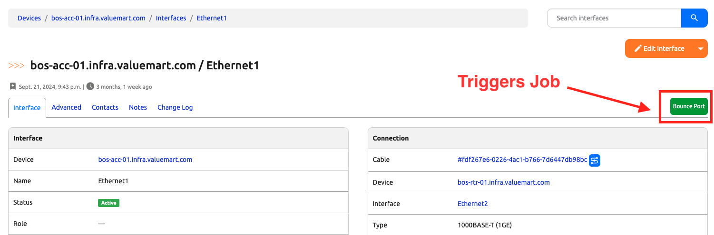
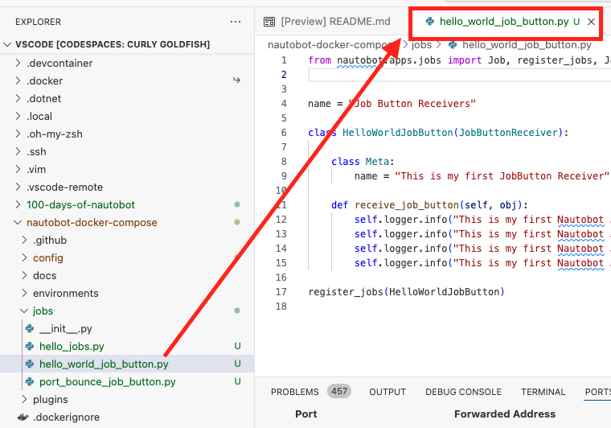
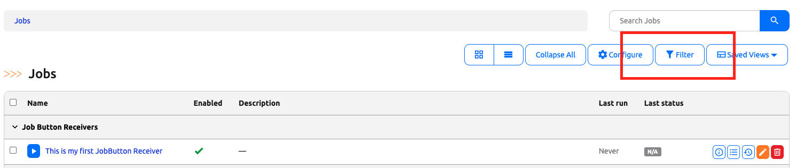
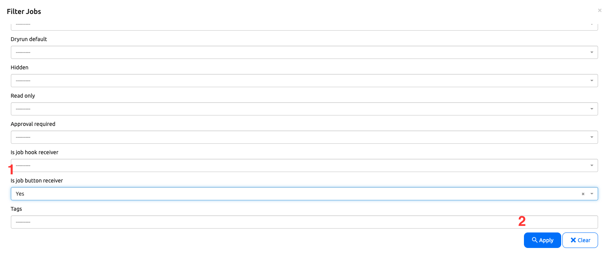
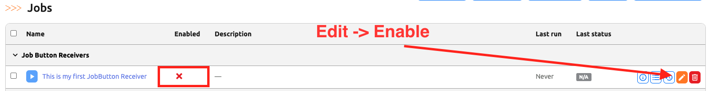
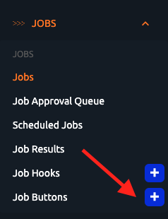
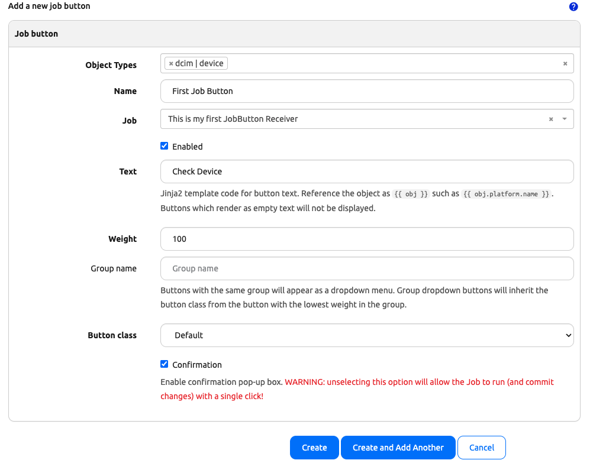
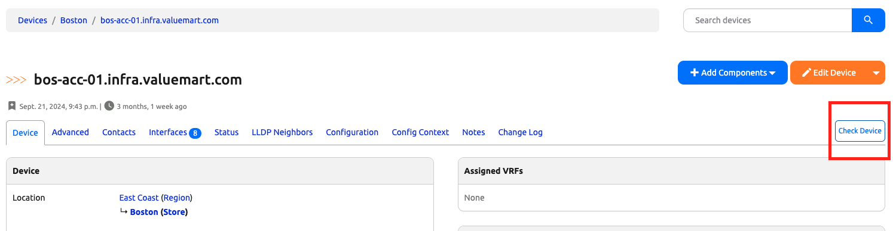
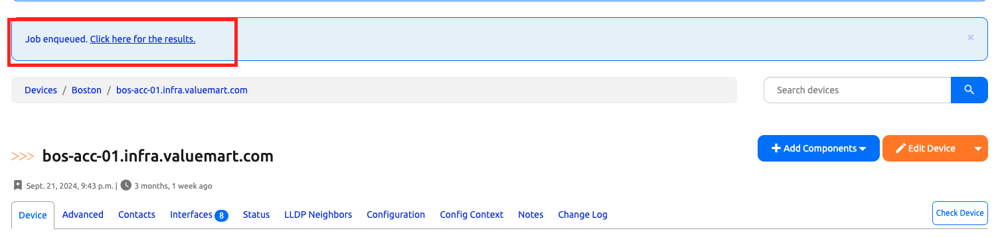
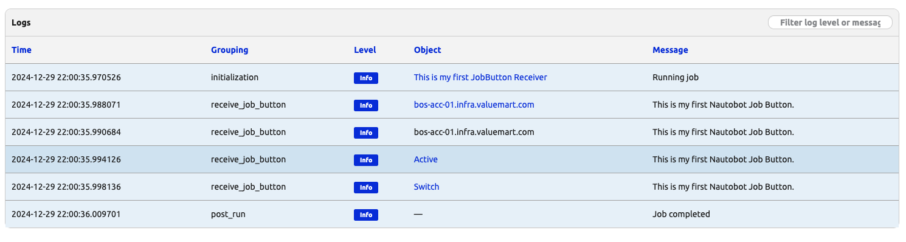

# Job Button - Part 1

So far in our work, we have been launching jobs via the web interface. Sometimes, it is more convenient to directly launch the jobs from where the object is. 

For example, we might have a Python script that bounce the interface port for a device. Once we convert that to a Nautobot job, instead of trigger that script from the Jobs UI, we might want to directly trigger the job from the interface page. We can do that with a Job button. 



Creating a Job button is a two-step process: 

Step 1. Create a job button receiver. 
Step 2. Wire it up with a Job button. 

In today's challenge, we will create a simple Job button. In tomorrow's challenge, we will build on the experience and create the port bouncer Job button. 

## Environment Setup

The environment setup will be the same as [Lab Setup Scenario 1](../Lab_Setup/scenario_1_setup/README.md), below is a summary of the steps, please consult the guide for a detailed background if needed. 

> [!TIP]
> If you have stopped the Codespace environment and restart again but found the Docker daemon stopped working, please follow the steps in the setup guide to rebuild the environment. 

We will follow the same steps to start Nautobot: 

```
$ cd nautobot-docker-compose/
$ poetry shell
$ invoke build
$ invoke db-import
$ invoke debug
```

Let's upload and prepare cEOS image and start Containerlab: 

```
$ docker import cEOS64-lab-4.32.0F.tar ceos:4.32.0F
```

For this lab we only needed the BOS devices: 

```
$ cd clab/
$ sudo containerlab deploy --topo ceos-lab.clab.yml --node-filter bos-acc-01,bos-rtr-01
```

Let's create a file for today's challenge. We can either do this via the shared directory or directly in the Nautobot docker container: 



```
$ docker exec -u root -it nautobot_docker_compose-nautobot-1 bash
root@c9e0fa2a45a0:/opt/nautobot# cd jobs
root@c9e0fa2a45a0:/opt/nautobot/jobs# pwd
/opt/nautobot/jobs
root@c9e0fa2a45a0:/opt/nautobot/jobs# touch hello_world_job_button.py
root@c9e0fa2a45a0:/opt/nautobot/jobs# chown nautobot:nautobot hello_world_job_button.py
```

The environment is now setup for today's challenge.  

## First Job Button Receiver 

The first thing we want to do is to create a Job file. We did this in the last step in the environment setup. 

> [!NOTE] 
> This example was taken from Chapter 11 of the book [Network Automation with Nautobot](https://www.packtpub.com/en-us/product/network-automation-with-nautobot-9781837634514a)

Here is the content of ```hello_world_job_button.py```: 

```
# hello_world_job_button.py

from nautobot.apps.jobs import Job, register_jobs, JobButtonReceiver


name = "Job Button Receivers"

class HelloWorldJobButton(JobButtonReceiver):

    class Meta: 
        name = "This is my first JobButton Receiver"
    
    def receive_job_button(self, obj): 
        self.logger.info("This is my first Nautobot Job Button.", extra={"object": obj})
        self.logger.info("This is my first Nautobot Job Button.", extra={"object": obj.name})
        self.logger.info("This is my first Nautobot Job Button.", extra={"object": obj.status})
        self.logger.info("This is my first Nautobot Job Button.", extra={"object": obj.role})

register_jobs(HelloWorldJobButton)
```

By now, we should be familiar with the overall structure of creating a job and register the job. However, in this file, we are creating a ```Job Button Receiver``` instead of a regular job. The ```obj``` is a generic term that describes whatever object we place this receiver at. 

We will need to run a `post-upgrade` after creating this job: 

```
$ invoke post-upgrade
```

We are ready to wire this job receiver with an object. 

## Wire Up the Job Receiver

By default, Job button receivers are not visible on the Job UO, We will need to click on the filter button on the Job menu: 



Then pick ```Yes``` for "is job button receiver", then click on "Apply": 



Once the job is visible, we still need to enable this job: 



We can create a new job button with the Job menu and the "+" icon: 



Let us associate the Job button with the ```dcim|device``` object and fill in the rest of the menu as below: 



Once it is created, we are ready to run it. 

## Testing the Job Button

If we navigate to any of our devices, we will now see a button in the top right corner: 



Once we execute it (with confirmation), we see a link to check the results: 



We can click on the link to check on the job logs. If you recall, we used ```obj.name```, ```obj.status```, and ```obj.role``` in the log messages. We can verify they match with the object at hand:  



Congratulations, that was a great exercise to get our first job button to work! 

## Day 12 To Do

Remember to stop the codespace instance on [https://github.com/codespaces/](https://github.com/codespaces/). 

Go ahead and post a screenshot of the successful execution of the new job button on a social media of your choice, make sure you use the tag `#100DaysOfNautobot` `#100DON` `#JobsToBeDone` and tag `@networktocode`, so we can share your progress! 

In tomorrow's challenge, we will continue our momentum and continue our path on creating a useful job button. See you there! 

[X/Twitter](<https://twitter.com/intent/tweet?url=https://github.com/networktocode/100-days-of-nautobot-challenge&text=I+jst+completed+Day+12+of+the+100+days+of+nautobot+challenge+!&hashtags=100DaysOfNautobot,JobsToBeDone>)

[LinkedIn](https://www.linkedin.com/) (Copy & Paste: I just completed Day 12 of 100 Days of Nautobot, https://github.com/networktocode/100-days-of-nautobot-challenge, challenge! @networktocode #JobsToBeDone #100DaysOfNautobot)
