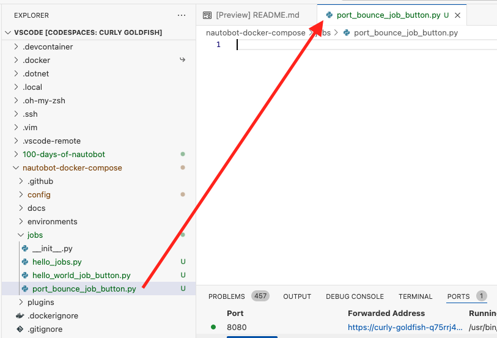
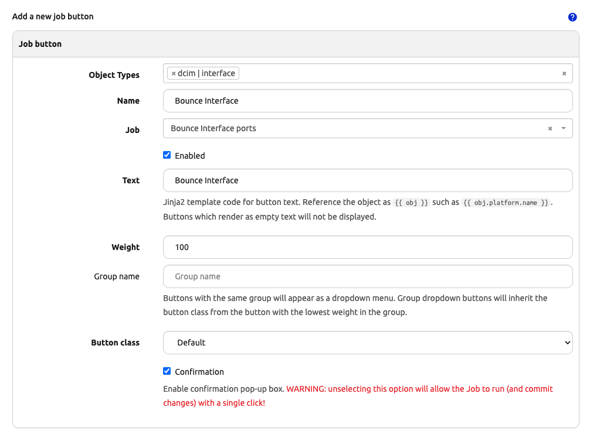
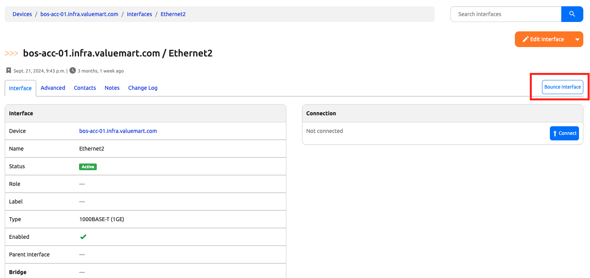
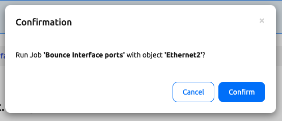
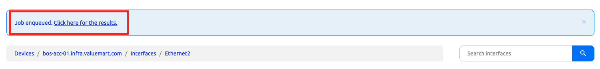

# Job Button - Part 2. Interface Port Bouncer

Bouncing ports, or turning the port down and up, is one of the most common task a network operator needs to perform. As we indicated in yesterday's challenge, we can `codify` this task and allow this operation to be executed by a Nautobot job. 

One way to do it is to create a regular job and provide a menu for selecting the right device and the right port using the techniques we have learned. However, a better option is to use the job button that we learned yesterday and tie it directly to the interface object. 

## Environment Setup

The environment setup will be the same as [Lab Setup Scenario 1](../Lab_Setup/scenario_1_setup/README.md), below is a summary of the steps, please consult the guide for a detailed background if needed. 

> [!TIP]
> If you have stopped the Codespace environment and restart again but found the Docker daemon stopped working, please follow the steps in the setup guide to rebuild the environment. 

We will follow the same steps to start Nautobot: 

```
$ cd nautobot-docker-compose/
$ poetry shell
$ invoke build
$ invoke db-import
$ invoke debug
```

Let's upload and prepare cEOS image and start Containerlab: 

```
$ docker import cEOS64-lab-4.32.0F.tar ceos:4.32.0F
```

For this lab we only needed the BOS devices: 

```
$ cd clab/
$ sudo containerlab deploy --topo ceos-lab.clab.yml --node-filter bos-acc-01,bos-rtr-01
```

Let's create a file for today's challenge. We can either do this via the shared directory or directly in the Nautobot docker container, we will name this file `port_bounce_job_button.py`: 



```
$ docker exec -u root -it nautobot_docker_compose-nautobot-1 bash
root@c9e0fa2a45a0:/opt/nautobot# cd jobs
root@c9e0fa2a45a0:/opt/nautobot/jobs# pwd
/opt/nautobot/jobs
root@c9e0fa2a45a0:/opt/nautobot/jobs# touch port_bounce_job_button.py
root@c9e0fa2a45a0:/opt/nautobot/jobs# chown nautobot:nautobot port_bounce_job_button.py
```

The environment is now setup for today's challenge.  

## Job Button Receiver

As we have done before, we will need to create the receiver with the file from last step: 

```
from nautobot.apps.jobs import Job, register_jobs, JobButtonReceiver
from netmiko import ConnectHandler


class PortBouncerButton(JobButtonReceiver):

    """Bounce Ports via Netmiko and Job Button."""
   
    class Meta:
        name = "Bounce Interface ports"
        has_sensitive_variables = False
        description = "Bounce Interface Port"

    def receive_job_button(self, obj):
        self.logger.info("Running job button receiver.", extra={"object": obj})
        if obj.device.primary_ip is None:
            self.logger.fatal("Device does not have a primary IP address set.")
            return

        if obj.device.platform is None:
            self.logger.fatal("Device does not have a platform set.")
            return

        if obj.device.platform.network_driver_mappings.get("netmiko") is None:
            self.logger.fatal("Device mapping for Netmiko is not present, please set.")
            return

        
        # Connect to the device, get some output - comment this out if you are simulating
        net_connect = ConnectHandler(
            device_type=obj.device.platform.network_driver_mappings["netmiko"],
            host=obj.device.primary_ip.host,  # or device.name if your name is an FQDN
            username="admin",
            password="admin",
        )

        # Easy mapping of platform to device command
        COMMAND_MAP = {
            "cisco_nxos": [f"interface {obj}", f"shut", f"no shut"],
            "arista_eos": [f"interface {obj}", f"shut", f"no shut",],
        }

        commands = COMMAND_MAP[obj.device.platform.network_driver_mappings.get("netmiko")]
        self.logger.info(f"This is the command: {commands}")
        net_connect.enable()
        net_connect.send_config_set(commands)
        net_connect.disconnect()

        self.logger.info(f"Successfully bounced port {obj} on {obj.device}!")
 

register_jobs(
    PortBouncerButton,
)
```

We added a few lines of command to check for primary IP, the driver mapping, as well as device platform. We then use `netmiko` driver to connect to the device and execute the commands. 

Note that we separate the commands between `cisco_nxos` and `arista_eos` eventhough both have the same commands for bouncing ports. This leaves room in the future for other platforms that might use different command sets. 

We will need to run a `post-upgrade` after creating this job: 

```
$ invoke post-upgrade
```

Let's wire up the job button with the receiver. 

## Wire Up the Job Button

As we have done in [Day 12](../Day012_Job_Button/README.md), we will need to do the following: 

1. Use `filter` in Jobs UI to make job button visible if not done so already. 
2. Enable the Job. 
3. Create a new button via the "+" icon. 

We can associate this Job with the `dcim|interface` object: 



We are ready to test it out! 

## Test the Job Button

The new button will appear in the top right corner on the interface page: 



We can click on it and confirm the execution: 



The link to check the job results will appear after confirmation: 



We will be able to check on the results as we normally would for job logs. 

## Day 13 To Do

Remember to stop the codespace instance on [https://github.com/codespaces/](https://github.com/codespaces/). 

Go ahead and post a screenshot of the successful execution of the new job on a social media of your choice, make sure you use the tag `#100DaysOfNautobot` `#JobsToBeDone` and tag `@networktocode`, so we can share your progress! 

In tomorrow's challenge, we will take a look at Job Hooks. See you then! 

[X/Twitter](<https://twitter.com/intent/tweet?url=https://github.com/networktocode/100-days-of-nautobot-challenge&text=I+jst+completed+Day+13+of+the+100+days+of+nautobot+challenge+!&hashtags=100DaysOfNautobot,JobsToBeDone>)

[LinkedIn](https://www.linkedin.com/) (Copy & Paste: I just completed Day 13 of 100 Days of Nautobot, https://github.com/networktocode/100-days-of-nautobot-challenge, challenge! @networktocode #JobsToBeDone #100DaysOfNautobot)

