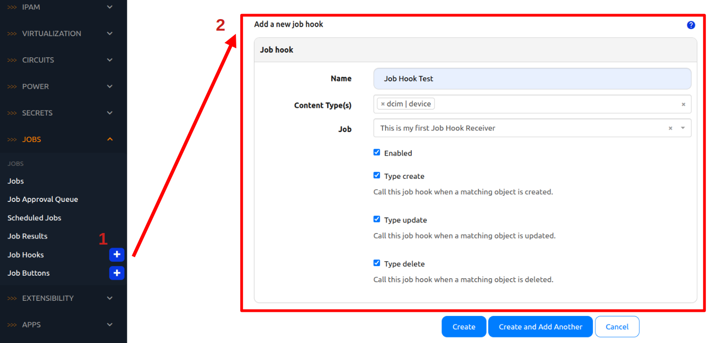

# Introduction to Job Hooks 

[Job hooks](https://docs.nautobot.com/projects/core/en/stable/user-guide/platform-functionality/jobs/jobhook/) are a concept introduced by Nautobot inspired by webhooks. The idea is to trigger a job that sends out an API call when a data is changed in Nautobot. 

We will create a simple example of Job hook for today's challenge. 

## Environment Setup

The environment setup will be the same as [Lab Setup Scenario 1](../Lab_Setup/scenario_1_setup/README.md), below is a summary of the steps, please consult the guide for a detailed background if needed. 

> [!TIP]
> If you have stopped the Codespace environment and restart again but found the Docker daemon stopped working, please follow the steps in the setup guide to rebuild the environment. 

We will follow the same steps to start Nautobot: 

```
$ cd nautobot-docker-compose/
$ poetry shell
$ invoke build
$ invoke db-import
$ invoke debug
```

We do not need to use Containerlab for this challenge. 

Let's create a file for today's challenge. We can either do this via the shared directory or directly in the Nautobot docker container: 


```
$ docker exec -u root -it nautobot_docker_compose-nautobot-1 bash
root@c9e0fa2a45a0:/opt/nautobot# cd jobs
root@c9e0fa2a45a0:/opt/nautobot/jobs# pwd
/opt/nautobot/jobs
root@c9e0fa2a45a0:/opt/nautobot/jobs# touch job_hook_test.py
root@c9e0fa2a45a0:/opt/nautobot/jobs# chown nautobot:nautobot ob_hook_test.py
```

The environment is now setup for today's challenge.  

## Job Hook Receiver

Similar to Job button receiver, the first step is to create a Job hook receiver. In the file `job_hook_test.py`, we will create the Job hook receiver: 

```
from nautobot.apps.jobs import Job, register_jobs, JobHookReceiver
import requests 

name = "Job Hook Receivers"

class HelloWorldJobHook(JobHookReceiver):

    class Meta: 
        name = "This is my first Job Hook Receiver"
    
    def receive_job_hook(self, change, action, changed_object): 
        self.logger.info("Launching Job Hook Receiver.", extra={"object": changed_object})
        
        response = requests.get("https://httpbin.org/get")
        if response.status_code == 200:
            self.logger.info("Job Hook Launched.")

register_jobs(HelloWorldJobHook)

```

In the receiver, we use `receive_job_hook()` method to react to a data object change. Notice the attributes that were passed in include the type of change (create/update/delete) as well as the `changed_object`. 

We need to do a `post-upgrade` after the Job hook receiver is created:

```
$ invoke post-upgrade
```

We will wire up the Job hook in the next step. 

## Wire Up Job Hook Receiver

As with Job button receiver, we can use the filter to enable Job hook receiver visibility: 


We will need to enable the job hook: 


We can use the "+" icon next to "Job Hooks" to create a new Job hook: 



In our example, we wired it up with the `dcim|device` object, so any time when a create/upate/delete even is associated with a device, this Job hook will be called. 


Let's test our shining new Job hook. 

## Test Job Hook

We can test the job hook by creating a dummy device: 


If we go to the "Job Results" page, we should be able to see the Job hook result: 


Alright, great job! I hope you are starting to notice a pattern of the structure and steps for Nautobot jobs. 

## Day 14 To Do

Remember to stop the codespace instance on [https://github.com/codespaces/](https://github.com/codespaces/). 

Go ahead and post a screenshot of the successful execution of the new job on a social media of your choice, make sure you use the tag `#100DaysOfNautobot` `#JobsToBeDone` and tag `@networktocode`, so we can share your progress! 

In tomorrow's challenge, we will take a look at using Web APIs to interface with Nautobot jobs. See you tomorrow! 

[X/Twitter](<https://twitter.com/intent/tweet?url=https://github.com/networktocode/100-days-of-nautobot-challenge&text=I+jst+completed+Day+14+of+the+100+days+of+nautobot+challenge+!&hashtags=100DaysOfNautobot,JobsToBeDone>)

[LinkedIn](https://www.linkedin.com/) (Copy & Paste: I just completed Day 14 of 100 Days of Nautobot, https://github.com/networktocode/100-days-of-nautobot-challenge, challenge! @networktocode #JobsToBeDone #100DaysOfNautobot)
