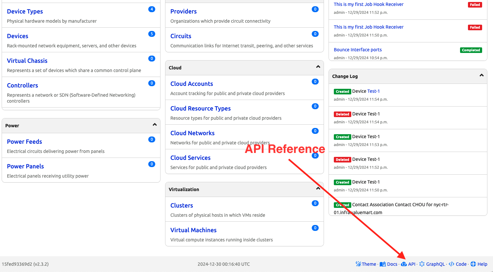
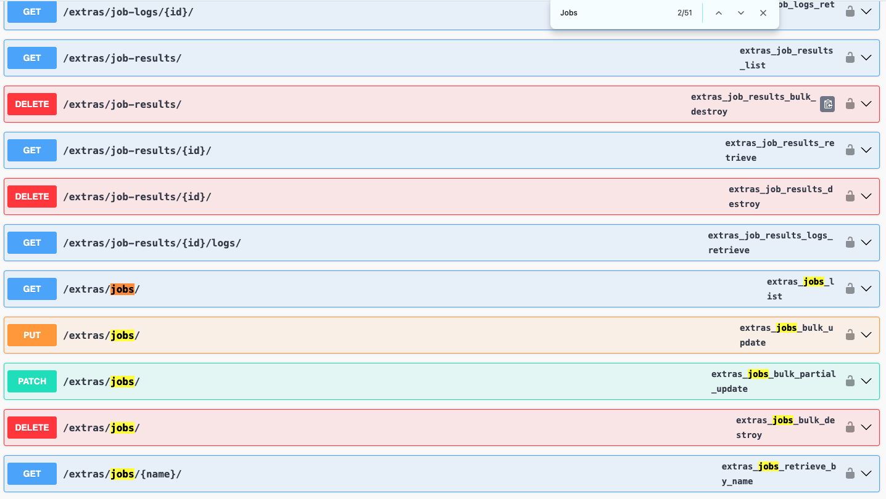
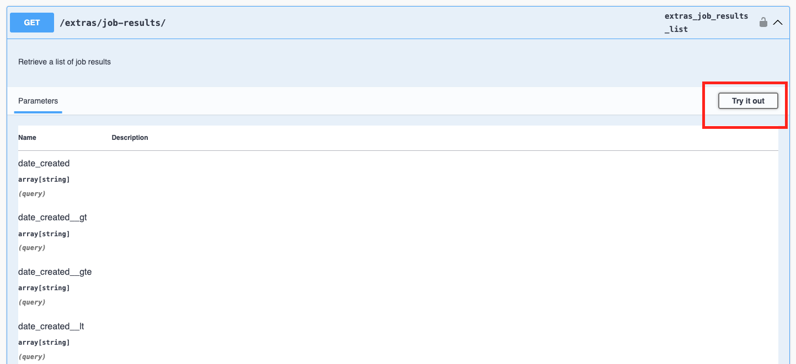
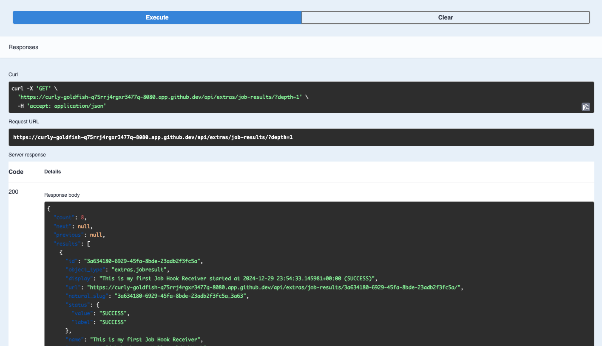

# Use REST API to Interact with Nautobot Jobs

Nautobot uses [Django REST Framework](https://www.django-rest-framework.org/) to provide Web APIs. The API can be used to trigger Nautobot Jobs. 

In today's challenge, we will use Web API to interface with Nautobot Jobs. 

## Environment Setup

The environment setup will be the same as [Lab Setup Scenario 1](../Lab_Setup/scenario_1_setup/README.md), below is a summary of the steps, please consult the guide for a detailed background if needed. 

> [!TIP]
> If you have stopped the Codespace environment and restart again but found the Docker daemon stopped working, please follow the steps in the setup guide to rebuild the environment. 

We will follow the same steps to start Nautobot: 

```
$ cd nautobot-docker-compose/
$ poetry shell
$ invoke build
$ invoke db-import
$ invoke debug
```

For today's challenge, we do not need to start Cotnainerlab, Arista vEOS image, or a new file. 

The environment is now setup for today's challenge.  

## API Endpoint Example 

The first thing to do is to locate the API reference. The link can be found on the Nautobot instance at the bottom of the page: 



We can see all the endpoints as they relate to Jobs: 



Using `/extras/job-results/` as an example, we can use the `try it out` button to test the endpoint directly in the browser: 



Find the execute button and see the results: 



## Your Turn

Now it is your turn, try out any of the API endpoint with either `curl` or `requests`: 

```
$ curl --help
Usage: curl [options...] <url>
 -d, --data <data>          HTTP POST data
 -f, --fail                 Fail silently (no output at all) on HTTP errors
 -h, --help <category>      Get help for commands
 -i, --include              Include protocol response headers in the output
 -o, --output <file>        Write to file instead of stdout
 -O, --remote-name          Write output to a file named as the remote file
 -s, --silent               Silent mode
 -T, --upload-file <file>   Transfer local FILE to destination
 -u, --user <user:password> Server user and password
 -A, --user-agent <name>    Send User-Agent <name> to server
 -v, --verbose              Make the operation more talkative
 -V, --version              Show version number and quit

This is not the full help, this menu is stripped into categories.
Use "--help category" to get an overview of all categories.
For all options use the manual or "--help all".

$ python -m requests
/home/vscode/.cache/pypoetry/virtualenvs/nautobot-docker-compose-70lkLMMl-py3.10/bin/python: No module named requests.__main__; 'requests' is a package and cannot be directly executed
(nautobot-docker-compose-py3.10) @ericchou1 ➜ ~/nautobot-docker-compose (main) $ python
Python 3.10.12 (main, Sep 11 2024, 15:47:36) [GCC 11.4.0] on linux
Type "help", "copyright", "credits" or "license" for more information.
>>> import requests
>>> exit()
```

For users familiar with [pynautobot](https://github.com/nautobot/pynautobot), you can also use the [API endpoint class](https://github.com/nautobot/pynautobot?tab=readme-ov-file#jobs). 

Be creative, we look forward to your results! 

## Day 15 To Do

Remember to stop the codespace instance on [https://github.com/codespaces/](https://github.com/codespaces/). 

Go ahead and post a screenshot of the API execution on a social media of your choice, make sure you use the tag `#100DaysOfNautobot` `#JobsToBeDone` and tag `@networktocode`, so we can share your progress! 

In tomorrow's challenge, we will take a look at how to schedule jobs at a regular interval. See you tomorrow! 

[X/Twitter](<https://twitter.com/intent/tweet?url=https://github.com/networktocode/100-days-of-nautobot-challenge&text=I+jst+completed+Day+15+of+the+100+days+of+nautobot+challenge+!&hashtags=100DaysOfNautobot,JobsToBeDone>)

[LinkedIn](https://www.linkedin.com/) (Copy & Paste: I just completed Day 15 of 100 Days of Nautobot, https://github.com/networktocode/100-days-of-nautobot-challenge, challenge! @networktocode #JobsToBeDone #100DaysOfNautobot)