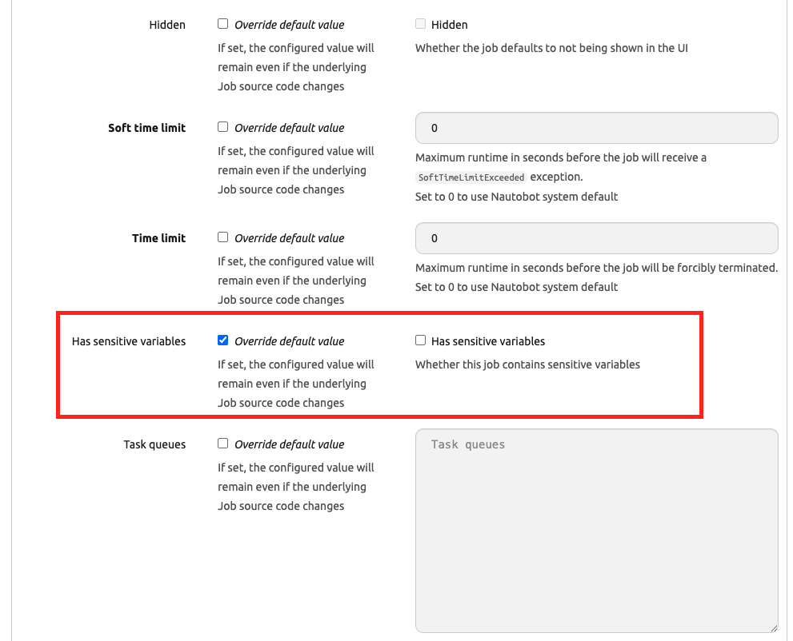
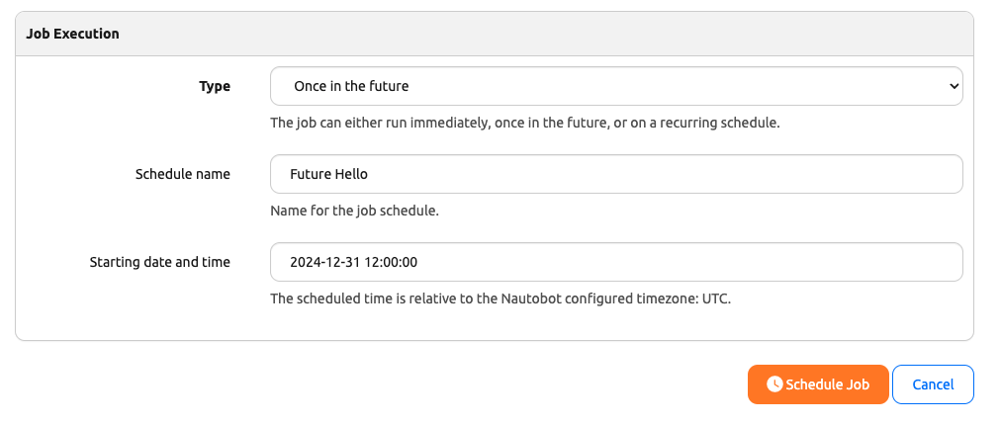
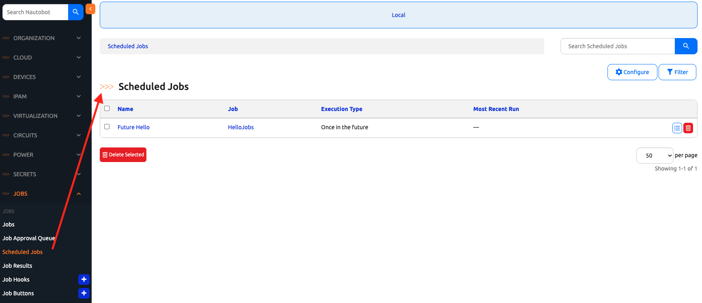

# Examples Illustrating Job Scheduling

Job Scheduling allows us to periodically execute our Jobs. This is similar to a `cron` job. 

Let's create an example in today's challenge. 

## Environment Setup

The environment setup will be the same as [Lab Setup Scenario 1](../Lab_Setup/scenario_1_setup/README.md), below is a summary of the steps, please consult the guide for a detailed background if needed. 

> [!TIP]
> If you have stopped the Codespace environment and restart again but found the Docker daemon stopped working, please follow the steps in the setup guide to rebuild the environment. 

We will follow the same steps to start Nautobot: 

```
$ cd nautobot-docker-compose/
$ poetry shell
$ invoke build
$ invoke db-import
$ invoke debug
```

For today's challenge, we do not need to use Arista vEOS image nor Containerlab. 

The environment is now setup for today's challenge.  

## Create a Job File

If you have other job files from other days, please feel free to use them. Here is the `hello_jobs.py` file we created early in our journey: 


```
from nautobot.apps.jobs import Job, register_jobs

class HelloJobs(Job):

    def run(self):
        self.logger.debug("Hello, this is my first Nautobot Job.")

register_jobs(
    HelloJobs,
)
```

If this is a new job, we will need to do a `post-upgrade`:

```
$ invoke post-upgrade
```

This job would need to be enabled if not already. 

For jobs to be able to scheduled, it cannot have sensitive information. On the job detail page (by clicking on the edit button), we will need to override the default for "Has sensitive variables": 



Once that is changed, on the Job run menu, we will have the selection to schedule the job: 


We can choose to run 'Once in the future' and pick a date and time: 



Once the job is scheduled, it can be viewed under 'Jobs -> Scheduled Jobs": 



Job scheduling is a simple but powerful feature, if you have some time, experiment with the existing 'System Jobs' for 'Logs Cleanup' or take a look at the [Nautobot Golden Config App](https://docs.nautobot.com/projects/golden-config/en/latest/), where job schedule is used for configuration back. 

## Day 16 To Do

Remember to stop the codespace instance on [https://github.com/codespaces/](https://github.com/codespaces/). 

Go ahead and post a screenshot of the successful scheduling of the new job on a social media of your choice, make sure you use the tag `#100DaysOfNautobot` `#JobsToBeDone` and tag `@networktocode`, so we can share your progress! 

In tomorrow's challenge, we will take a look at Job Approval. See you tomorrow! 

[X/Twitter](<https://twitter.com/intent/tweet?url=https://github.com/networktocode/100-days-of-nautobot-challenge&text=I+jst+completed+Day+16+of+the+100+days+of+nautobot+challenge+!&hashtags=100DaysOfNautobot,JobsToBeDone>)

[LinkedIn](https://www.linkedin.com/) (Copy & Paste: I just completed Day 16 of 100 Days of Nautobot, https://github.com/networktocode/100-days-of-nautobot-challenge, challenge! @networktocode #JobsToBeDone #100DaysOfNautobot)

