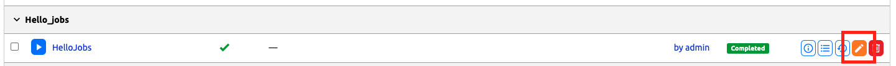
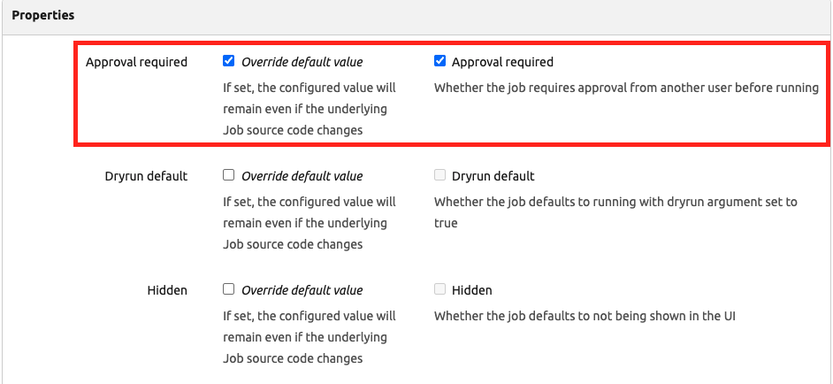
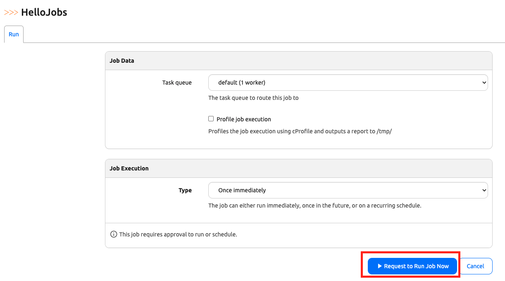
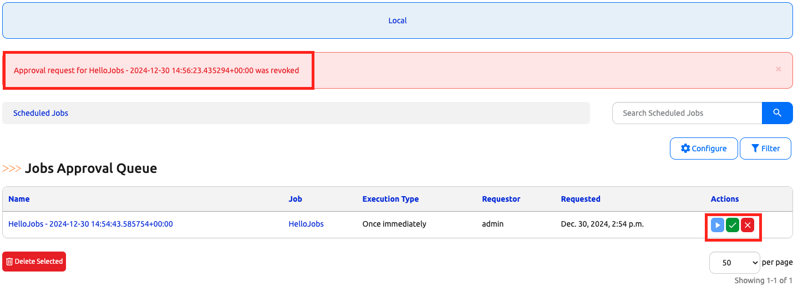

# Job Approvals

Job Approvals allows you to create a job that requires someone to approve the job before it can be executed. It is a rather straight forward process to do so. 

In today's challenge, we will take a look at a Job approval example. 

## Environment Setup

The environment setup will be the same as [Lab Setup Scenario 1](../Lab_Setup/scenario_1_setup/README.md), below is a summary of the steps, please consult the guide for a detailed background if needed. 

> [!TIP]
> If you have stopped the Codespace environment and restart again but found the Docker daemon stopped working, please follow the steps in the setup guide to rebuild the environment. 
> Also, in a restarted environment with docker container already built and database imported, we only need to start poetry shell with `poetry shell` and use `invoke debug` to start the containers. 

We will follow the same steps to start Nautobot: 

```
$ cd nautobot-docker-compose/
$ poetry shell
$ invoke build
$ invoke db-import
$ invoke debug
```

We will use the previously constructed `hello_jobs.py` file as a starting point, please create it if it does not exist in the `/jobs` folder: 

```
from nautobot.apps.jobs import Job, register_jobs

class HelloJobs(Job):

    def run(self):
        self.logger.debug("Hello, this is my first Nautobot Job.")

register_jobs(
    HelloJobs,
)

```

The environment is now setup for today's challenge.  

## Job Approval with UI

We can set the job properties to require approval with the Web UI with the `edit` button: 



The property for `approval required` can be set in the `properties` section: 



Once the properties is changed, the `Run Job Now` will be changed to `Reqeust to Run Job Now`: 



We can see the job in the approval queue for `Dry Run`, `Approve`, or `Deny`: 



Let's go ahead and reverse the approval change in the UI and see how we can enforce approval in code. 

## Job Approval with Code

To require approval for Jobs in code, it is amazingly simple, just add `approval_required = True` in the `Meta` class: 

```
from nautobot.apps.jobs import Job, register_jobs

class HelloJobs(Job):

    class Meta: 
        name = "Hello World with Approval Required"
        approval_required = True

    def run(self):
        self.logger.debug("Hello, this is my first Nautobot Job.")

register_jobs(
    HelloJobs,
)
```

The result is the same as making the change with Web UI. 

## Further Questions

Since today's challenge is relatively straight forward, I would like to post two additional questions regarding approval: 

1. Can you approve your own jobs? 
2. How and where can we implement object-level approval permission? 

Please feel free to include the answers in your posting of today's results. 

## Day 17 To Do

Remember to stop the codespace instance on [https://github.com/codespaces/](https://github.com/codespaces/). 

Go ahead and post your answers to today's challenge on a social media of your choice, make sure you use the tag `#100DaysOfNautobot` `#JobsToBeDone` and tag `@networktocode`, so we can share your progress! 

In tomorrow's challenge, we will use Git repository to share our Jobs. See you tomorrow! 

[X/Twitter](<https://twitter.com/intent/tweet?url=https://github.com/networktocode/100-days-of-nautobot-challenge&text=I+jst+completed+Day+17+of+the+100+days+of+nautobot+challenge+!&hashtags=100DaysOfNautobot,JobsToBeDone>)

[LinkedIn](https://www.linkedin.com/) (Copy & Paste: I just completed Day 17 of 100 Days of Nautobot, https://github.com/networktocode/100-days-of-nautobot-challenge, challenge! @networktocode #JobsToBeDone #100DaysOfNautobot)
