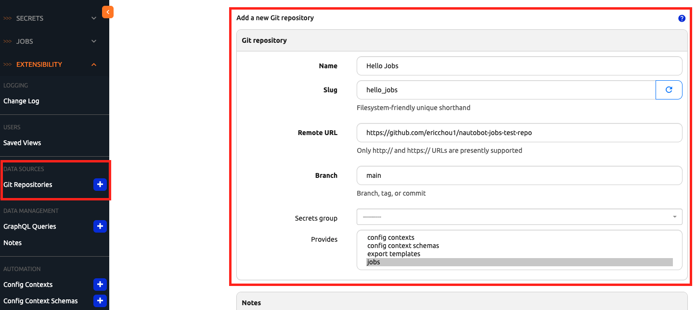
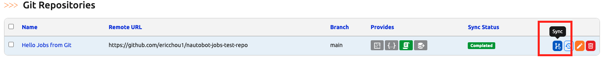
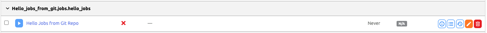

# Using Git Repository to Share Jobs

Once we have the Jobs file created, we might want to start sharing with others or have a centralized location to keep changes, allow collaboration, or roll back to previous version if the new changes did not work. 

Job code can be shared using Git repository with the 
[Git as a Data Source](https://docs.nautobot.com/projects/core/en/stable/user-guide/feature-guides/git-data-source/) feature in Nautobot. 

Let us see how we can do that in today's exercise. 

## Environment Setup

The environment setup will be the same as [Lab Setup Scenario 1](../Lab_Setup/scenario_1_setup/README.md), below is a summary of the steps, please consult the guide for a detailed background if needed. 

> [!TIP]
> If you have stopped the Codespace environment and restart again but found the Docker daemon stopped working, please follow the steps in the setup guide to rebuild the environment. Remember you only need to start poetry shell and `invoke debug` if you already have an instance running. 

We will follow the same steps to start Nautobot: 

```
$ cd nautobot-docker-compose/
$ poetry shell
$ invoke build
$ invoke db-import
$ invoke debug
```

The environment is now setup for today's challenge.  

## Git Repository Structure

I created a simple Git repository for today's exercise at [https://github.com/ericchou1/nautobot-jobs-test-repo](https://github.com/ericchou1/nautobot-jobs-test-repo) that consist of an empty `__init__.py` file and a `jobs` directory: 

```
# tree nautobot-jobs-test-repo/
nautobot-jobs-test-repo/
├── LICENSE
├── README.md
├── __init__.py
└── jobs
    ├── __init__.py
    └── hello_jobs.py

1 directory, 5 files
```

The naming of the directory is important as Nautobot will look for a `jobs` folder. We also need the `__init__.py` file to indicate this is a Python module. 

In the `jobs` directory, we have two files, the `__init__.py` file as well as the `hello_jobs.py` file. The `hello_jobs.py` file consist of what we are already familiar with: 

```
from nautobot.apps.jobs import Job

class HelloJobs(Job):

    class Meta: 
        name = "Hello Jobs from Git Repo"

    def run(self):
        self.logger.debug("This is from the Git repo.")
```

The job registration is moved to the `__init__.py` file where we import the class from the `hello_jobs.py` file and register it: 

```
# cat __init__.py 
from nautobot.apps.jobs import register_jobs
from .hello_jobs import HelloJobs


register_jobs(HelloJobs)
```

We need to register this Git repository as a Jobs data source in Nautobot. 

## Register Git Data Source 

We can register Git repositories as data source under "Extensibility -> Git Repositories": 



The page is pretty straight forward for the names and slug, make sure you use the right URL and pick `jobs` as the provider. 



Once it is successfully synchronized, we should see the job appear under Jobs UI: 



As we know by now, the new job will need to be enabled in order to run. 

That is it for today's challenge, congratulations on coming this far! 

## Day 18 To Do

Remember to stop the codespace instance on [https://github.com/codespaces/](https://github.com/codespaces/). 

Go ahead and post a screenshot of the successful execution of the new job on a social media of your choice, make sure you use the tag `#100DaysOfNautobot` `#JobsToBeDone` and tag `@networktocode`, so we can share your progress! 

In tomorrow's challenge, we will take a look at the Jobs model. See you tomorrow! 

[X/Twitter](<https://twitter.com/intent/tweet?url=https://github.com/networktocode/100-days-of-nautobot-challenge&text=I+jst+completed+Day+18+of+the+100+days+of+nautobot+challenge+!&hashtags=100DaysOfNautobot,JobsToBeDone>)

[LinkedIn](https://www.linkedin.com/) (Copy & Paste: I just completed Day 18 of 100 Days of Nautobot, https://github.com/networktocode/100-days-of-nautobot-challenge, challenge! @networktocode #JobsToBeDone #100DaysOfNautobot)
