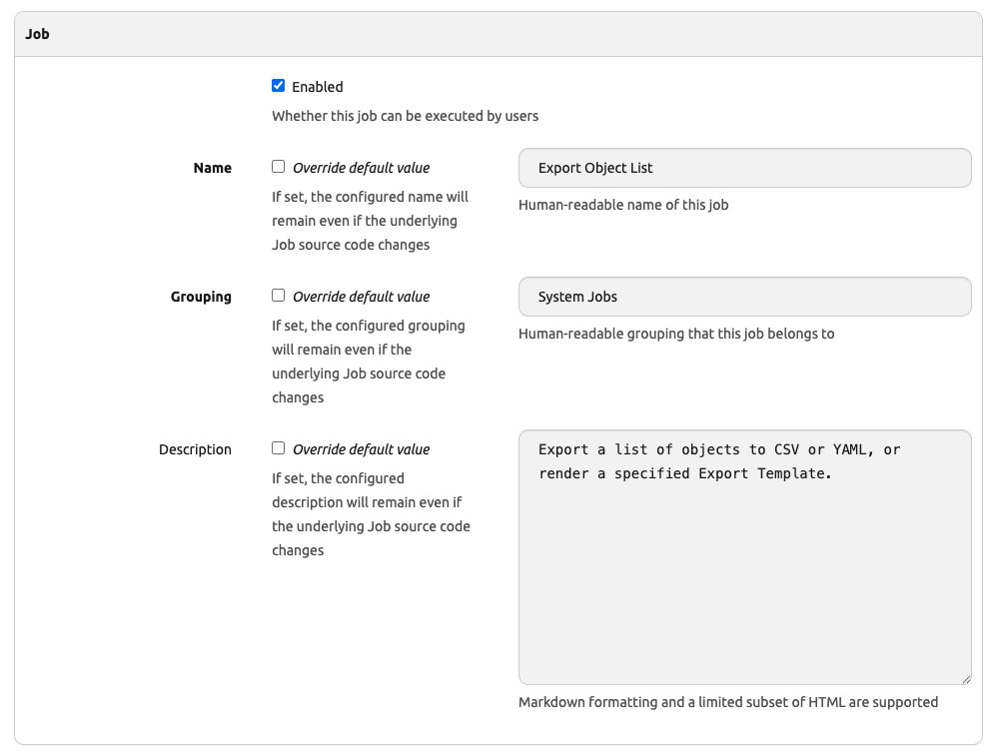
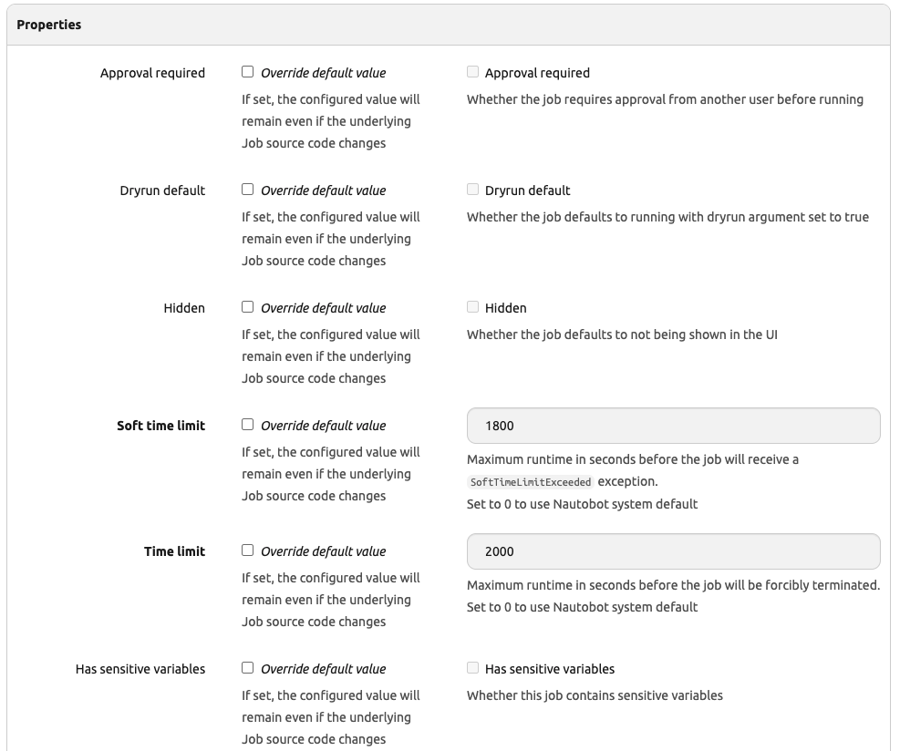

# Getting to Know Job Models 

In previous days, we have been able to execute Nautobot jobs and observe the results even when we restarted the containers. This, of course, means the results data persisted in a permanent storage location in a data model. 

Job models provide a database representation of metadata describing the jobs. It also provides a place to hold the job results. 

[https://docs.nautobot.com/projects/core/en/stable/user-guide/platform-functionality/jobs/models/](https://docs.nautobot.com/projects/core/en/stable/user-guide/platform-functionality/jobs/models/)

For today's challenge, we will do a quick walk through of the different aspects of Job data models. There is less hands-on exercise today, but more in terms 'just know where it is' to know where to look for more information when needed. 

## Environment Setup

The environment setup will be the same as [Lab Setup Scenario 1](../Lab_Setup/scenario_1_setup/README.md), below is a summary of the steps, please consult the guide for a detailed background if needed. 

> [!TIP]
> If you have stopped the Codespace environment and restart again but found the Docker daemon stopped working, please follow the steps in the setup guide to rebuild the environment. Remember you only need to start poetry shell and `invoke debug` if you already have an instance running. 

We will follow the same steps to start Nautobot: 

```
$ cd nautobot-docker-compose/
$ poetry shell
$ invoke build
$ invoke db-import
$ invoke debug
```

The environment is now setup for today's challenge.  

## Job Models

The database representation of Jobs is in the Job data model. The Job data model is also the anchor point for other data models such as JobResult and ScheduledJob. 

>[!TIP]
> Check out [Job Models documention](https://docs.nautobot.com/projects/core/en/stable/user-guide/platform-functionality/jobs/models/) for more information.

As we can see, we can change aspects of the Jobs in the UI, such as the name or grouping: 



We can also override a number of Jobs properties: 



If you recall, we already tried out the 'Approval required' override for the Job approval challenge. 

Another area that sometimes require tweaking is the 'Time limit' for job execution. As we know, sometimes we have slow network devices or simply have large quantity of devices for a job to execute, tweaking the time limit might be a short term solution to allow the job to execute. 

## Nautobot Shell

We can also invoke Nautobot shell to take a look at the data models: 

```
$ invoke nbshell
...
from nautobot.extras.models.jobs import Job, JobButton, JobHook, JobLogEntry, JobResult, ScheduledJob
...
>>> j = Job.objects.all()
>>> j
<JobQuerySet [<Job: Check Serial Numbers>, <Job: Command Runner>, <Job: Verify Hostname Pattern For Existing Locations>, <Job: Thsi is my first JobButton Receiver>, <Job: This is my first JobButton Receiver>, <Job: This is my first Job Hook Receiver>, <Job: Update Serial Number JobButton Receiver.>, <Job: Export Object List>, <Job: Git Repository: Dry-Run>, <Job: Git Repository: Sync>, <Job: Import Objects>, <Job: Logs Cleanup>, <Job: Refresh Dynamic Group Caches>, <Job: Verify Hostname Pattern For New York City>, <Job: HelloWorld>, <Job: Hello World with Approval Required>, <Job: Hello Jobs from Git Repo>, <Job: Bounce Interface ports>]>
>>>
>>> j1 = Job.objects.first()
>>> j1.
Display all 120 possibilities? (y or n)
j1.DoesNotExist(                            j1.get_computed_fields_grouping(            j1.job_task
j1.Meta(                                    j1.get_computed_fields_grouping_advanced(   j1.jobbutton_set(
j1.MultipleObjectsReturned(                 j1.get_computed_fields_grouping_basic(      j1.last_updated
j1.adelete(                                 j1.get_constraints(                         j1.latest_result
j1.approval_required                        j1.get_custom_field_groupings(              j1.module_name
j1.approval_required_override               j1.get_custom_field_groupings_advanced(     j1.name
j1.arefresh_from_db(                        j1.get_custom_field_groupings_basic(        j1.name_override
j1.asave(                                   j1.get_custom_fields(                       j1.natural_key(
j1.associated_contacts(                     j1.get_custom_fields_advanced(              j1.natural_key_args_to_kwargs(
j1.associated_object_metadata(              j1.get_custom_fields_basic(                 j1.natural_key_field_lookups
j1.associations                             j1.get_deferred_fields(                     j1.natural_slug
j1.cf                                       j1.get_dynamic_groups_url(                  j1.notes
j1.check(                                   j1.get_notes_url(                           j1.objects
j1.class_path                               j1.get_relationships(                       j1.pk
j1.clean(                                   j1.get_relationships_data(                  j1.prepare_database_save(
j1.clean_fields(                            j1.get_relationships_data_advanced_fields(  j1.present_in_database
j1.composite_key                            j1.get_relationships_data_basic_fields(     j1.read_only
j1.created                                  j1.git_repository                           j1.refresh_from_db(
j1.csv_natural_key_field_lookups(           j1.grouping                                 j1.required_related_objects_errors(
j1.custom_field_data                        j1.grouping_override                        j1.runnable
j1.date_error_message(                      j1.has_computed_fields(                     j1.save(
j1.delete(                                  j1.has_computed_fields_advanced(            j1.save_base(
j1.description                              j1.has_computed_fields_basic(               j1.scheduled_jobs(
j1.description_first_line                   j1.has_sensitive_variables                  j1.serializable_value(
j1.description_override                     j1.has_sensitive_variables_override         j1.soft_time_limit
j1.destination_for_associations(            j1.hidden                                   j1.soft_time_limit_override
j1.documentation_static_path                j1.hidden_override                          j1.source_for_associations(
j1.dryrun_default                           j1.id                                       j1.static_group_association_set(
j1.dryrun_default_override                  j1.installed                                j1.supports_dryrun
j1.dynamic_groups                           j1.is_cloud_resource_type_model             j1.tagged_items(
j1.dynamic_groups_cached                    j1.is_contact_associable_model              j1.tags
j1.dynamic_groups_list                      j1.is_dynamic_group_associable_model        j1.task_queues
j1.dynamic_groups_list_cached               j1.is_job_button_receiver                   j1.task_queues_override
j1.enabled                                  j1.is_job_hook_receiver                     j1.time_limit
j1.from_db(                                 j1.is_metadata_associable_model             j1.time_limit_override
j1.full_clean(                              j1.is_saved_view_model                      j1.to_objectchange(
j1.get_absolute_url(                        j1.job_class                                j1.unique_error_message(
j1.get_changelog_url(                       j1.job_class_name                           j1.validate_constraints(
j1.get_computed_field(                      j1.job_hooks(                               j1.validate_unique(
j1.get_computed_fields(                     j1.job_results(                             j1.validated_save(
>>>
```

Today's challenge is heavy on background knowledge on Nautobot Job models than hands on. As a beginner, we should be a bit cautious about modifying any core Data models that is not exposed to us. 

As we become more familiar with Nautobot jobs, we might need to revisit some of these fields during troubleshooting. 

## Day 19 To Do

Remember to stop the codespace instance on [https://github.com/codespaces/](https://github.com/codespaces/). 

Go ahead and post a screenshot of the `queryset` of your choice for the Job data model on a social media of your choice, make sure you use the tag `#100DaysOfNautobot` `#JobsToBeDone` and tag `@networktocode`, so we can share your progress! 

In tomorrow's challenge, we will take a look at the Single Source of Truth (SSoT) app and the DiffSync library. See you tomorrow! 

[X/Twitter](<https://twitter.com/intent/tweet?url=https://github.com/networktocode/100-days-of-nautobot-challenge&text=I+jst+completed+Day+19+of+the+100+days+of+nautobot+challenge+!&hashtags=100DaysOfNautobot,JobsToBeDone>)

[LinkedIn](https://www.linkedin.com/) (Copy & Paste: I just completed Day 19 of 100 Days of Nautobot, https://github.com/networktocode/100-days-of-nautobot-challenge, challenge! @networktocode #JobsToBeDone #100DaysOfNautobot)
