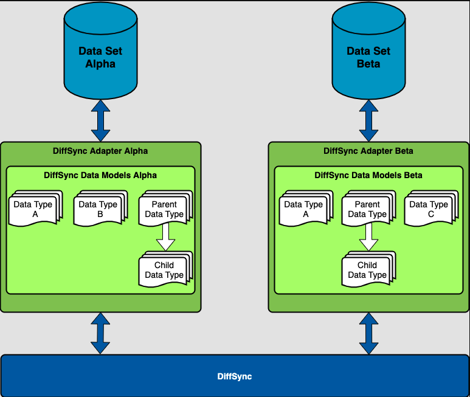
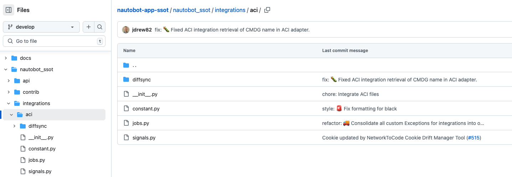
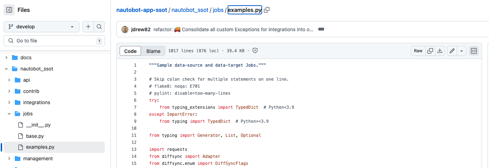

# Coupling Jobs Example - SSoT and DiffSync 

In the last 19 days, we explored different aspects of Nautobot jobs, from creation, to scheduling, to using Git as data source. We covered a lot of ground. 

We are at the halfway point of our Jobs journey, it seems logical at this point, we take a breather and zoom out a bit to take a look at Jobs in terms of how it fits into the overall picture. 

## From Jobs to Apps

Jobs are great to achieve tactical goals, such as converting a Python script into a task that can be shared and executed on a regular interval. However, as we start adding more Jobs, there is almost always a point where we need to start segment and group similar jobs together. 

This is where Nautobot Apps can come in. We will dive deeper into Nautobot Apps in the second half of the 100 Days challenge, but here we will use the Nautobot Single Source of Truth (SSoT) as an example of logical grouping of Jobs. 

## SSoT & DiffSync

[DiffSync](https://github.com/networktocode/diffsync) is a utility library that can be used to compare and synchronize different datasets. 

The primary use case is to compare multiple sources of data to compare and synchronize, as illustrated [here](https://raw.githubusercontent.com/networktocode/diffsync/develop/docs/images/diffsync_components.png): 

This certainly calls for using the library to synchronize different sources using Nautobot Jobs. This is exactly what happened as we start to create 'Adapters' that integrates with sources such as Meraki, ACI, IP Fabric, and Infoblox: 

The integration can be viewed on [nautobot-app-ssot/nautobot_ssot](https://github.com/nautobot/nautobot-app-ssot/tree/develop/nautobot_ssot). Notice that each of the integration includes Nautobot Jobs as the execution point: 

From the 'Adapters' we can use other Jobs to execute the actual integration, such as the [nautobot ssot example job](https://github.com/nautobot/nautobot-app-ssot/blob/develop/nautobot_ssot/jobs/examples.py)

As you can see, Job can be layered on top of each other and provides base points for being housed into of an App that can be distributed as a package. 

In tomorrow's challenge, we will get back to more Nautobot Job examples. 

## Day 20 To Do

Remember to stop the codespace instance on [https://github.com/codespaces/](https://github.com/codespaces/). 

Go ahead and post your thought on building SSoT, DiffSync, or Jobs on a social media of your choice, make sure you use the tag `#100DaysOfNautobot` `#JobsToBeDone` and tag `@networktocode`, so we can share your progress! 

In tomorrow's challenge, we will take a look at uploading and processing files with Jobs. See you tomorrow! 

[X/Twitter](<https://twitter.com/intent/tweet?url=https://github.com/networktocode/100-days-of-nautobot-challenge&text=I+jst+completed+Day+20+of+the+100+days+of+nautobot+challenge+!&hashtags=100DaysOfNautobot,JobsToBeDone>)

[LinkedIn](https://www.linkedin.com/) (Copy & Paste: I just completed Day 20 of 100 Days of Nautobot, https://github.com/networktocode/100-days-of-nautobot-challenge, challenge! @networktocode #JobsToBeDone #100DaysOfNautobot) 
