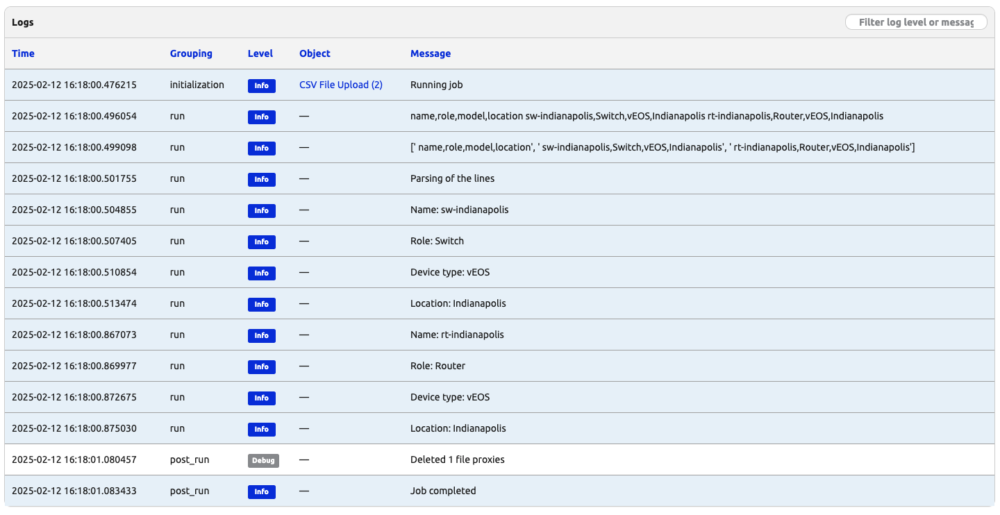

# Process Uploaded CSV Files 

In today's job, we will build on yesterday's knowledge with the ```FileVar``` object but to process a CSV file and use its contents to manipulate the data in our Nautobot instance.

This is a simple but powerful step as it demonstrates how we can use external information to work with Nautobot data models. 


## Environment Setup

The environment setup will be the same as [Lab Setup Scenario 1](../Lab_Setup/scenario_1_setup/README.md), below is a summary of the steps, please consult the guide for a detailed background if needed.  

The full steps to start Nautobot is listed below. If restarting a Codespace instance, you can skip `invoke build` and `invoke db-import` as the containers were already built: 

```
$ cd nautobot-docker-compose/
$ poetry shell
$ invoke build
$ invoke db-import
$ invoke debug
```

The environment is now setup for today's challenge.  Also, remember to have the CSV file created on Day 21 with the data we want to process.

## The Current Job

First, let's take another look at the job we created last time. Nothing new here, just make sure that you enable the job and that you can run it.

```
from nautobot.apps.jobs import Job, register_jobs, FileVar

class FileUpload(Job):
    class Meta:
        name = "CSV File Upload"
        description = "Please select a CSV file for upload"

    file = FileVar(
        description="CSV File to upload",
    )

    def run(self, file):
        
        contents = str(file.read())
        self.logger.info(f"File contents: {contents}")
        self.logger.info(f"Job didn't crash!")

        return "Great job!"


register_jobs(
    FileUpload,
)
```

## The Updated Job

The current state of the job reads the files and sends the content of the file to the logger so that the user can see that the file was processed. However, that is not very useful on its own. We want our job to read the data, parse it, and create new objects in our Nautobot instance. We know that the files is text and that is formatted as a CSV (Comma Separated Values) file. Thus, now we are modifying our job in the following manner.


```
from nautobot.apps.jobs import Job, register_jobs, FileVar
from nautobot.dcim.models import Device, Location, DeviceType
from nautobot.extras.models import Role, Status


class FileUpload(Job):
    class Meta:
        name = "CSV File Upload"
        description = "Please select a CSV file for upload"

    file = FileVar(
        description="CSV File to upload",
    )

    def run(self, file):
        
        contents = str(file.read())
        self.logger.info(f"File contents: {contents}")
        self.logger.info(f"Job didn't crash!")

        return "Great job!"


class FileUpload_2(Job):
    class Meta:
        name = "CSV File Upload and Process"
        description = "Please select a CSV file for upload"

    file = FileVar(
        description="CSV File to upload",
    )

    def run(self, file):

        file_contents = file.read().decode("utf-8")
        self.logger.info(file_contents)
        lines = file_contents.splitlines()
        self.logger.info(lines)

        self.logger.info("Parsing of the lines")

        for line in lines[1:]:
            device_name, role_name, model_name, location_name = line.split(",")
            self.logger.info(f"Name: {device_name}")
            self.logger.info(f"Role: {role_name}")
            self.logger.info(f"Device type: {model_name}")
            self.logger.info(f"Location: {location_name}")


            role = Role.objects.get(name=role_name)
            device_type = DeviceType.objects.get(model=model_name)
            location = Location.objects.get(name=location_name)
            status = Status.objects.get(name="Active")

            device = Device(
                name=device_name,
                device_type=device_type,
                location=location,
                status=status,
                role=role,
            )
            device.validated_save()


        return "Execution completed"


register_jobs(
    FileUpload,
    FileUpload_2,
)
```

The new job includes the logic necessary to read the data from the file and create devices. All the changes were implemented in the `run` method. There are multiple new elements here, so let's take the time to dissect what is going on.

First, all the lines that include `self.logger.info` can safely be removed. These are there to provide you with an intuition of how the jobs behaves and how it traverses the file line by line. If you have a file with thousands or millions of lines, this kind of logging could start to add up and become a performance problem. Look for those logs when you execute the job; it will help you to better understand the execution.

The following two lines read the file, making sure that we use the right encoding. After we have the content of the file stored in the `file_contents` variable we want to process line by line. The `lines`variables is created using the `splitlines` method. `lines` is a list of elements where each element is a line from the file, which in our example stores information of a device.

```
file_contents = file.read().decode("utf-8")
lines = file_contents.splitlines()
```

Now that we have the data of each device as one element of the `lines` list, we will traverse that data structure and create a new device in Nautobot per line in the file. We have to iterate over each one of the lines. We ignore the first line because it is the header and does not store actual data.

```
for line in lines[1:]:
    ...
```

The most important part is where we actually create the devices.

```
role = Role.objects.get(name=role_name)
device_type = DeviceType.objects.get(model=model_name)
location = Location.objects.get(name=location_name)
status = Status.objects.get(name="Active")

device = Device(
    name=device_name,
    device_type=device_type,
    location=location,
    status=status,
    role=role,
)
device.validated_save()
```

Here, we first use the strings from the file to find the Nautobot objects corresponding to the role, device type, location and status. For the status, we are making the decision that we are going to use the `Active` status. Next, we create a new object and store it in the `device` variable. That new variables has the object but we want to save it in the database, we accomplish that with the `.validate_save()` method.

Try to execute the job and when the jobs finishes check the Devices view and validate that the two new devices have been created.

Here is a sample of the job output: 



We can check to verify the devices are created: 


Great job in completing Day 22! 

# Comments

As you try out the example, you will identify potential improvements. For example, what if you want to read the file in a different manner? You might notice that if you run the job it will create the two devices. What about if you run again? The current version of the job will give an error in the second time you run the job because the devices already exists. Would you like it to behave differently? What would you change? You will explore some of these variables as you continue with the challenge, but do not hesitate to try some of those changes on your own.

## Day 22 To Do

Remember to stop the codespace instance on [https://github.com/codespaces/](https://github.com/codespaces/). 

Go ahead and post a screenshot of the successful execution of the new job on a social media of your choice, make sure you use the tag `#100DaysOfNautobot` `#JobsToBeDone` and tag `@networktocode`, so we can share your progress!

In tomorrow's challenge, we will take a look at the HTML templates associated with Nautobot Jobs. See you tomorrow!

[X/Twitter](<https://twitter.com/intent/tweet?url=https://github.com/nautobot/100-days-of-nautobot&text=I+jst+completed+Day+22+of+the+100+days+of+nautobot+!&hashtags=100DaysOfNautobot,JobsToBeDone>)

[LinkedIn](https://www.linkedin.com/) (Copy & Paste: I just completed Day 22 of 100 Days of Nautobot, https://github.com/nautobot/100-days-of-nautobot, challenge! @networktocode #JobsToBeDone #100DaysOfNautobot)
