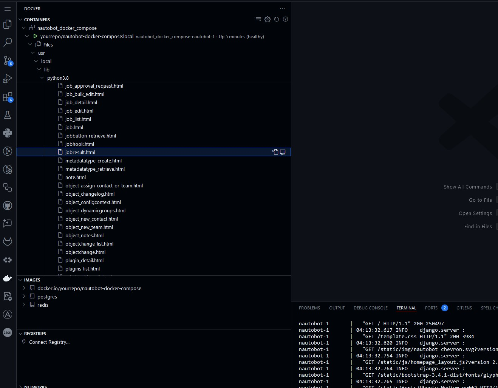

# Jobs Template HTML View

As we progress forward and build on that last 22 days, let's take a closer look at the HTML templates that make up Nautobot and see how extensible Nautobot can be, it really is an "if can you dream it, you can build it" framework. Today we are going to create a custom HTML template that takes one of our previous validation jobs and places the data in a nice table which can also be exported to a CSV file.

Today we will cover the following:
- How to extend Nautobot’s built-in jobresult.html template with a new “Hostname Check” tab that displays custom data returned by an updated job (VerifyHostname). 
- Editing the job to return a JSON payload
- Mounting new local template files via Docker volumes
- Adding HTML/JavaScript to display and optionally export the hostname validation results.

> [!TIP]
> Editing Nautobot files is not the best approach as these changes would be overwritten with each upgrade and wouldn't be ideal long-term to maintain. Nautobot Applications are perfect for this type of customization and will be covered later. We hope this approach is useful in understanding how the Nautobot framework is structured.

## Lab Environment Setup

The environment setup will be the same as [Lab Setup Scenario 1](../Lab_Setup/scenario_1_setup/README.md), below is a summary of the steps, please consult the guide for a detailed background if needed. 

Here is a review of the steps to start Nautobot. If you are restarting a previously stopped Codespace instance, you can skip `invoke build` and `invoke db-import`: 

```
$ cd nautobot-docker-compose/
$ poetry shell
$ invoke build
$ invoke db-import
$ invoke debug
```
We are ready to do some customization on the jobresult.HTML.

## Page Templates
What are page templates? Let's look directly at the [Nautobot documentation](https://docs.nautobot.com/projects/core/en/stable/development/core/templates/). *"Nautobot comes with a variety of page templates that allow for a lot of flexibility while keeping the page style consistent with the rest of the application."*

What this allows us to do is build a simple Jinja2 template that pulls in the existing HTML structure already present in Nautobot so that everything you add maintains the same look and feel.

Let's take a look at the `jobsresult.html` found in our container, we can access these files from the docker directly in the CLI: 

```bash
$ docker exec -u root -it nautobot_docker_compose-nautobot-1 bash
$ ls /usr/local/lib/python3.8/site-packages/nautobot/extras/templates/extras/job*
/usr/local/lib/python3.8/site-packages/nautobot/extras/templates/extras/job.html
/usr/local/lib/python3.8/site-packages/nautobot/extras/templates/extras/job_approval_confirmation.html
/usr/local/lib/python3.8/site-packages/nautobot/extras/templates/extras/job_approval_request.html
/usr/local/lib/python3.8/site-packages/nautobot/extras/templates/extras/job_bulk_edit.html
/usr/local/lib/python3.8/site-packages/nautobot/extras/templates/extras/job_detail.html
/usr/local/lib/python3.8/site-packages/nautobot/extras/templates/extras/job_edit.html
/usr/local/lib/python3.8/site-packages/nautobot/extras/templates/extras/job_list.html
/usr/local/lib/python3.8/site-packages/nautobot/extras/templates/extras/jobbutton_retrieve.html
/usr/local/lib/python3.8/site-packages/nautobot/extras/templates/extras/jobhook.html
/usr/local/lib/python3.8/site-packages/nautobot/extras/templates/extras/jobresult.html
```

We can also use VSCODE and open the file. In your sidebar you will see the docker whale, click that icon. You should see all the running containers for your nautobot-docker-compose docker. Find the container called ```nautobot-docker-compose-nautobot-1``` and start dropping down all the folders that follow this path - ```/usr/local/lib/python3.8/site-packages/nautobot/extras/templates/extras/jobresult.html```.



Right-click on `jobresult.html` and click open. You should now be able to see the file in VSCODE, this will make our next step a little easier.

> [!TIP]
> You can also view the `jobresult.html` [code](https://github.com/nautobot/nautobot/blob/develop/nautobot/extras/templates/extras/jobresult.html) here as well.


## Updating the hostname validation job
On day 7 and 8 we created several jobs designed to validate the inventory for serial numbers, IP addresses, correct platform, and a correctly structured hostname. The file name used for these jobs was called ```data_quality_jobs.py```. Open this file so that we can make a small adjustment that will provide data for a table.

The existing code should look like this and be located toward the bottom of the file
```python
class VerifyHostname(Job):
    location_to_check = ObjectVar(
        model=Location,
        query_params={
            "has_devices": True,
        }
    )
    
    class Meta:

        name = "Verify Hostname Pattern For Selected Locations"
        description = "Checks all devices at Designated Location for hostname pattern conformation"

    def run(self, location_to_check):
        """Run method for executing the checks on the devices."""

        # Iterate through each Device object, limited to just the location of choice.
        for device in Device.objects.filter(location=location_to_check):
            hostname = device.name
            self.logger.info(
                f"Checking device hostname compliance: {hostname}",
                extra={"object": device},
            )
            # Check if the hostname matches the expected pattern
            if HOSTNAME_PATTERN.match(hostname):
                self.logger.info(f"{hostname} configured hostname is correct.")
                # Skip to next iteration of the list
                continue

            # Mark the Device as failed in the job results
            self.logger.error(f"{hostname} does Not Match Hostname Pattern.")
```

We will make a few changes to the run function that will add a simple JSON structure. The return statement will make this data available to iterate over later in our HTML template.

```python
class VerifyHostname(Job):
    location_to_check = ObjectVar(
        model=Location,
        query_params={
            "has_devices": True,
        }
    )
    
    class Meta:

        name = "Verify Hostname Pattern For Selected Locations"
        description = "Checks all devices at Designated Location for hostname pattern conformation"

    def run(self, location_to_check):
        """Run method for executing the checks on the devices."""
        results = []

        # Iterate through each Device object, limited to just the location of choice.
        for device in Device.objects.filter(location=location_to_check):
            hostname = device.name
            device_id = device.id
            self.logger.info(
                f"Checking device hostname compliance: {hostname}",
                extra={"object": device},
            )
            # Check if the hostname matches the expected pattern
            if HOSTNAME_PATTERN.match(hostname):
                self.logger.info(f"{hostname} configured hostname is correct.")
                status = "PASS"
            else:
                # Mark the Device as failed in the job results
                self.logger.error(f"{hostname} does Not Match Hostname Pattern.")
                status = "FAIL"

            results.append({
                "hostname": hostname,
                "device_id": device_id,
                "status": status,
            })

        # Return the results as part of the job result
        return {"results": results}
```

## Adding HTML Template
We will need to add a couple of new files that will be mapped to the `nautobot-docker-compose` docker we have been using to build our jobs.

Switch back to the VSCODE file explorer, and create a new folder under the ```nautobot-docker-compose``` folder called ```templates```.  

In this folder create two new files:
1. customized_jobresult.html
2. hostname_check_results.html

In folder named ```environments``` open the ```docker-compose-local.yml``` file. The contents of the file should look like this:

```yaml
---
services:
  nautobot:
    command: "nautobot-server runserver 0.0.0.0:8080"
    ports:
      - "8080:8080"
    volumes:
      - "../config/nautobot_config.py:/opt/nautobot/nautobot_config.py"
      - "../jobs:/opt/nautobot/jobs"
    healthcheck:
      interval: "30s"
      timeout: "10s"
      start_period: "60s"
      retries: 3
      test: ["CMD", "true"]  # Due to layering, disable: true won't work. Instead, change the test
  celery_worker:
    volumes:
      - "../config/nautobot_config.py:/opt/nautobot/nautobot_config.py"
      - "../jobs:/opt/nautobot/jobs"
```

We will be adding two new lines to the volumes list under the Nautobot service. This will map our local template files to the appropriate folders in the docker container when it's loaded.

The new config should look like this:
> [!TIP]
> Notice to two new lines under the volumes list.

```yaml
---
services:
  nautobot:
    command: "nautobot-server runserver 0.0.0.0:8080"
    ports:
      - "8080:8080"
    volumes:
      - "../config/nautobot_config.py:/opt/nautobot/nautobot_config.py"
      - "../jobs:/opt/nautobot/jobs"
      - "../templates/hostname_check_results.html:/usr/local/lib/python3.8/site-packages/nautobot/extras/templates/extras/inc/hostname_check_results.html"
      - "../templates/customized_jobresult.html:/usr/local/lib/python3.8/site-packages/nautobot/extras/templates/extras/jobresult.html"
    healthcheck:
      interval: "30s"
      timeout: "10s"
      start_period: "60s"
      retries: 3
      test: ["CMD", "true"]  # Due to layering, disable: true won't work. Instead, change the test
  celery_worker:
    volumes:
      - "../config/nautobot_config.py:/opt/nautobot/nautobot_config.py"
      - "../jobs:/opt/nautobot/jobs"
```

With that little housekeeping step out of the way let's take a closer look at the jobresult.html file you have opened in VSCODE.

This template is purpose-built to present all relevant details of a single `JobResult` (like logs, arguments, traceback, and outputs) in a user-friendly, tabbed layout. 

> [!TIP]
> This might be more information than you need right now but a quick breakdown of the template is below:
> 1. **Page Structure and Layout**
    - Extends generic/object_detail.html to leverage standard Nautobot styling/layout.
    - Defines multiple content “blocks” (breadcrumbs, buttons, content_full_width_page, advanced_content_left_page, advanced_content_right_page, etc.) to organize how the job result data is presented.
> 2. **Breadcrumbs**
    - Renders the breadcrumb trail at the top of the page, which changes depending on whether the job is associated with a job_model, an associated_record, or a custom job class path.
> 3. **Buttons and Actions**
    - Displays buttons for:
        - Re-run or Run (conditionally, if the user has the necessary permissions and the job is re-runnable or can be run directly).
        - Export (provides a link to download job log entries in CSV format).
> 4. **Title**
    - Sets the page title dynamically based on whether a job_model, associated_record, or job exists.
> 5. **Tabs for Additional Data**
    - When the job finishes two tabs are rendered, "Job Result", and "Advanced".
> 6. **Job Result Tab**
    - Uses an included partial template (extras/inc/jobresult.html) to render the main body of the job’s result data, including logs.
> 7. **Advanced Tab: Left Panel**
    - Shows JSON representations of:
        - Task Keyword Arguments (result.task_kwargs)
        - Task Positional Arguments (result.task_args)
        - Celery Keyword Arguments (result.celery_kwargs)
> 8. **Advanced Tab: Right Panel**
    - Displays the Worker information, including worker hostname, queue, task name, and job meta JSON.
    - Shows any Traceback data (if the job failed or encountered errors).
> 9. **Additional Tab Contents**
    - Renders the job’s standard output (if present) in a ```<pre>``` block.
> 10. **JavaScript**
    - Includes scripts to handle table configuration and log-level filtering for the job logs.

For this example we are mostly interested in Tabs and Additional Tab Contents section of the file. These sections of the code will allow us to add a new tab in the Job results page that is rendered after a job has completed. 

### customized_jobresult.html - Adding a Tab
We are going to add a third tab called "Hostname Check". Look at the "extra_nav_tabs" code block below, this evaluates if there is result data from the job, and if there is result data, then it should display the Job Result tab. 

```jinja

    
        <li role="presentation">
            <a href="#output" role="tab" data-toggle="tab">Output</a>
        </li>
    

```

We are going to copy this format, but instead of evaluating the result data of the job itself, we want to check if the returned "results" from our updated code is truthy. When returning data in a job you will be able to find it at ```result.result.results```. In our case "results" is the name of the json structure we are returning.

```jinja

    
        <li role="presentation">
            <a href="#output" role="tab" data-toggle="tab">Output</a>
        </li>
    
    
        <li role="presentation">
            <a href="#hostname-check" role="tab" data-toggle="tab">Hostname Check</a>
        </li>
    

```

This will only display our new "Hostname Check" tab if the Results JSON structure is being returned, this way this tab will not be displayed with any other jobs.

The next block of code we want to focus on is the ```extra_tab_content``` toward the bottom of the file. This block defines the content that will appear within additional tabs (referred to by their id values) on the page. The below block checks if the result.data.output is truthy, and renders the appropriate tabs, and links us to the appropriate page with the results that we want.

```jinja

    
        <div role="tabpanel" class="tab-pane" id="output">
            <pre>{{ result.data.output }}</pre>
        </div>
    

```

We will again copy this format and check if our ```result.result.results``` is truthy and render the hostname-check tab
```jinja

    
        <div role="tabpanel" class="tab-pane" id="output">
            <pre>{{ result.data.output }}</pre>
        </div>
    
    
        <div role="tabpanel" class="tab-pane" id="hostname-check">
            
        </div>
    

```

After these two blocks have been added the final result of the ```customized_jobresult.html``` should look like this:
```html










    <li><a href="">Job Results</a></li>
    
        <li>{{ result.job_model.grouping }}</li>
        <li><a href="?job_model={{ result.job_model.name }}">
            {{ result.job_model }}
        </a></li>
    
        
            <li><a href="?name={{ associated_record.name|urlencode }}">
                {{ associated_record.name }}
            </a></li>
        
            <li>{{ associated_record }}</li>
        
    
        <li><a href="?name={{ job.class_path|urlencode }}">
            {{ job.class_path }}
        </a></li>
    
        <li>{{ result.name }}</li>
    
    <li>{{ result.created }}</li>



    
        
            <a href="?kwargs_from_job_result={{ result.pk }}"
               class="btn btn-success">
                <span class="mdi mdi-repeat" aria-hidden="true"></span> Re-Run
            </a>
        
            <a href=""
               class="btn btn-primary">
                <span class="mdi mdi-play" aria-hidden="true"></span> Run
            </a>
        
    
    <a href="?job_result={{ result.pk }}&format=csv" class="btn btn-success">
        <span class="mdi mdi-database-export" aria-hidden="true"></span> Export
    </a>
    {{ block.super }}



    Job Result:
    
        {{ result.job_model }}
    
        {{ associated_record }}
    
        {{ job }}
    
        {{ result.name }}
    



    
        <li role="presentation">
            <a href="#output" role="tab" data-toggle="tab">Output</a>
        </li>
    
    
        <li role="presentation">
            <a href="#hostname-check" role="tab" data-toggle="tab">Hostname Check</a>
        </li>
    



    



    <div class="panel panel-default">
        <div class="panel-heading">
            <strong>Job Keyword Arguments</strong>
        </div>
        <div class="panel-body">
            
        </div>
    </div>
    <div class="panel panel-default">
        <div class="panel-heading">
            <strong>Job Positional Arguments</strong>
        </div>
        <div class="panel-body">
            
        </div>
    </div>
    <div class="panel panel-default">
        <div class="panel-heading">
            <strong>Job Celery Keyword Arguments</strong>
        </div>
        <div class="panel-body">
            
        </div>
    </div>


    <div class="panel panel-default">
        <div class="panel-heading">
            <strong>Worker</strong>
        </div>
        <table class="table table-hover panel-body attr-table">
            <tbody>
                <tr>
                    <td>Worker Hostname</td>
                    <td>{{ result.worker }}</td>
                </tr>
                <tr>
                    <td>Queue</td>
                    <td>{{ result.celery_kwargs.queue}}</td>
                </tr>
                <tr>
                    <td>Task Name</td>
                    <td>{{ result.task_name }}</td>
                </tr>
                <tr>
                    <td>Meta</td>
                    <td></td>
                </tr>
            </tbody>
        </table>
    </div>
    <div class="panel panel-default">
        <div class="panel-heading">
            <strong>Traceback</strong>
        </div>
        <div class="panel-body">
            
        </div>
    </div>


    
        <div role="tabpanel" class="tab-pane" id="output">
            <pre>{{ result.data.output }}</pre>
        </div>
    
    
        <div role="tabpanel" class="tab-pane" id="hostname-check">
            
        </div>
    




    {{ block.super }}
    
    <script src=""></script>
    <script src=""></script>

```

Understanding what we need to adjust in the jobresult.html, copy the above template and place it into our new file that we created called ```customized_jobresult.html```. Notice the ```extra_nav_tabs``` block and the ```extra_tab_content``` block that should now be updated.


### hostname_check_results.html - Extending base templates
In the above step we reference a file that does not yet exist ```extras/inc/hostname_check_results.html```, this is one of the files that we created in our ```nautobot-docker-compose/template``` folder, and linked to the location described in the ```extra_tab_content``` block.

> [!TIP] Linking these files in this way allows you to make edits to the file locally and those changes will be represented in the container without having to physically move the file to the container.

Open the ```hostname_check_results.html``` file in the ```nautobot-docker-compose/template``` folder and add the following lines:

```jinja2

    <h1>Hostname Check Results Table</h1>
    <table class="table table-hover">
        <thead>
            <tr>
                <th>Hostname</th>
                <th>Status</th>
            </tr>
        </thead>
        <tbody>
            
            <tr>
                <td>
                    <a href="/dcim/devices/{{ item.device_id }}/?tab=main">
                        {{ item.hostname }}
                    </a>
                </td>
                <td>
                    
                        <span class="label label-success">{{ item.status }}</span>
                    
                        <span class="label label-danger">{{ item.status }}</span>
                    
                </td>
            </tr>
            
        </tbody>
    </table>

```

This is a really simple template that formats the output in a table with two columns, Hostname and Status. It uses the label-success and label-danger to color the Green and Red pass or fail colors. 


At this point you should stop the containers and then restart them, you can hit ```crtl-c``` in the terminal with the debug information. 

```bash
nautobot-1       |   "GET /extras/job-results/2f21d935-942d-4f11-b19d-b50d4562263d/?tab=main HTTP/1.1" 200 215322
nautobot-1       | 17:25:05.031 INFO    django.server :
nautobot-1       |   "GET /template.css HTTP/1.1" 200 3984
nautobot-1       | 17:25:05.083 INFO    django.server :
nautobot-1       |   "GET /extras/job-results/2f21d935-942d-4f11-b19d-b50d4562263d/log-table/ HTTP/1.1" 200 5852
Gracefully stopping... (press Ctrl+C again to force)
 Container nautobot_docker_compose-celery_worker-1  Stopping
 Container nautobot_docker_compose-celery_beat-1  Stopping
 Container nautobot_docker_compose-celery_beat-1  Stopped
 Container nautobot_docker_compose-celery_worker-1  Stopped
 Container nautobot_docker_compose-nautobot-1  Stopping
 Container nautobot_docker_compose-nautobot-1  Stopped
 Container nautobot_docker_compose-redis-1  Stopping
 Container nautobot_docker_compose-db-1  Stopping
 Container nautobot_docker_compose-db-1  Stopped
 Container nautobot_docker_compose-redis-1  Stopped
canceled
(nautobot-docker-compose-py3.10) bbaker4@ByrnsGameRig:~/github-projects/100-days-of-nautobot/nautobot-docker-compose$ 
```

Once it has fully stopped go ahead and start everything up again with ```invoke build debug```.
```bash
$ invoke build debug
Building Nautobot 2.3.2 with Python 3.8...
Running docker compose command "build"
 Service nautobot  Building
...
nautobot-1       | System check identified 5 issues (0 silenced).
nautobot-1       | 17:30:23.437 INFO    django.utils.autoreload :
nautobot-1       |   Watching for file changes with StatReloader
nautobot-1       | Performing system checks...
nautobot-1       | 
nautobot-1       | System check identified no issues (0 silenced).
nautobot-1       | 17:30:24.636 INFO    nautobot             __init__.py                              setup() :
nautobot-1       |   Nautobot initialized!
nautobot-1       | January 31, 2025 - 17:30:24
nautobot-1       | Django version 4.2.16, using settings 'nautobot_config'
nautobot-1       | Starting development server at http://0.0.0.0:8080/
nautobot-1       | Quit the server with CONTROL-C.
```

Navigate to the jobs and run the ```Verify Hostname Pattern For Selected Locations``` job pick either location. In the results you should now have a 3rd tab called "Hostname Check".


And in the Hostname Check tab a table of the results of the hostname validation check.


If you want to add an export button at the bottom of this template you could also add to the `hostname_checkk_results html` template some CSS code to facilitate a .CSV export like this.

Below the ```</table>``` add this line inside the "IF" evaluation.

```
    </table>
        <button id="export-results" class="btn btn-primary">Export Results</button>
```
Then below the ``````, add the following JavaScript:
```JavaScript
<script>
    document.addEventListener('DOMContentLoaded', function() {
        document.getElementById('export-results').addEventListener('click', function() {
            var table = document.querySelector('#hostname-check table');
            var rows = table.querySelectorAll('tr');
            
            var csv = [];
            for (var i = 0; i < rows.length; i++) {
                var row = [], cols = rows[i].querySelectorAll('td, th');
                
                for (var j = 0; j < cols.length; j++) {
                    // Clean up cell content for CSV
                    var data = cols[j].innerText.replace(/(\r\n|\n|\r)/gm, '').replace(/(\s\s)/gm, ' ');
                    // Escape quotes
                    data = data.replace(/"/g, '""');
                    // Add quotes if necessary
                    if (data.search(/("|,|\n)/g) >= 0) data = '"' + data + '"';
                    row.push(data);
                }
                csv.push(row.join(','));
            }
            
            // Download
            var csvString = csv.join('\n');
            var a         = document.createElement('a');
            a.href        = 'data:attachment/csv,' +  encodeURIComponent(csvString);
            a.target      = '_blank';
            a.download    = 'hostname_check_results.csv';
            document.body.appendChild(a);
            a.click();
            document.body.removeChild(a);
        });
    });
</script>
```

Refresh the page or re-run the job. In the `Hostname Check` tab you should now have a `export` button, and it will download a CSV version of the rendered table.


## Day 23 To Do

Remember to stop the codespace instance on [https://github.com/codespaces/](https://github.com/codespaces/). 

Go ahead and post a screenshot of the successful execution of the new job on a social media of your choice, make sure you use the tag `#100DaysOfNautobot` `#JobsToBeDone` and tag `@networktocode` so we can share your progress! 

In tomorrow's challenge, we will explore testing jobs. See you tomorrow! 

[X/Twitter](<https://twitter.com/intent/tweet?url=https://github.com/nautobot/100-days-of-nautobot&text=I+jst+completed+Day+23+of+the+100+days+of+nautobot+!&hashtags=100DaysOfNautobot,JobsToBeDone>)

[LinkedIn](https://www.linkedin.com/) (Copy & Paste: I just completed Day 23 of 100 Days of Nautobot, https://github.com/nautobot/100-days-of-nautobot, challenge! @networktocode #JobsToBeDone #100DaysOfNautobot)
