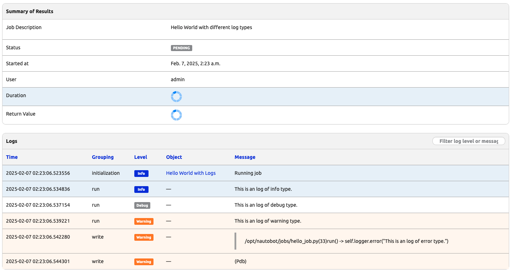
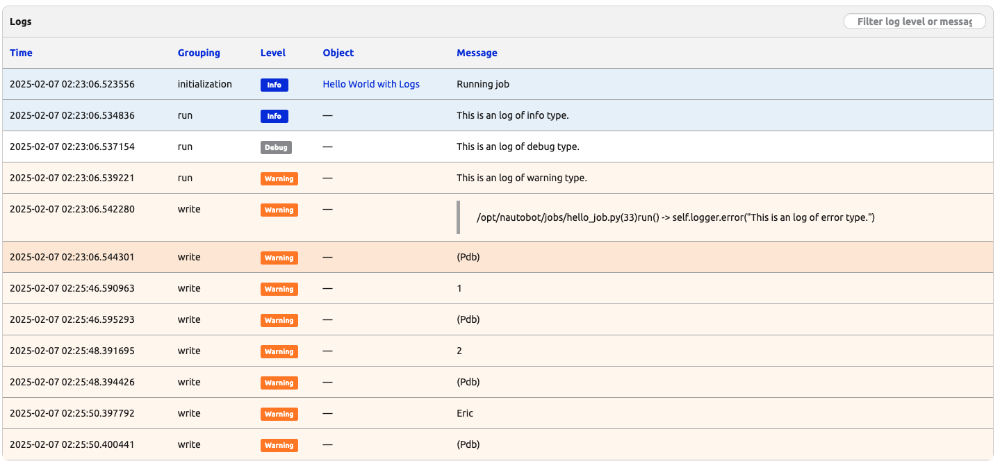

# Debug Jobs with PDB

`pdb` is the Python Debugger, a built-in module for debugging Python programs. It allows us to set breakpoints, step through code, inspect variables, and evaluate expressions interactively. 

In today's challenge, we will see how we can use `pdb` to debug Nautobot Jobs. 

## Environment Setup

The environment setup will be the same as [Lab Setup Scenario 1](../Lab_Setup/scenario_1_setup/README.md), below is a summary of the steps, please consult the guide for a detailed background if needed. 

> [!TIP]
> We keep lab notes in the [Lab Related Notes](../Lab_Setup/lab_related_notes/README.md) for helpful tips in the various lab scenario. 

If you stopped the Codespace environment, simply restart it and use the following steps, you do not need to rebuild docker instances, nor import the database again: 

```bash
$ cd nautobot-docker-compose/
$ poetry shell
$ invoke debug
```

If you need to completely rebuild the environment in Codespace, here are the steps: 

```bash
$ cd nautobot-docker-compose/
$ poetry shell
$ invoke build
$ invoke db-import
$ invoke debug
```

We do not need to use Containerlab for today's challenge. 

## Python PDB Example 

Before we use `pdb` for Nautobot Jobs, let's see a simple Python example with `pdb`. 

We will drop into the Nautobot container shell for our challenge: 

```bash
@ericchou1 ➜ ~ $ docker exec -u root -it nautobot_docker_compose-nautobot-1 bash
root@ee2753f052ae:/opt/nautobot# 
```

Let's create a simple Python file, I am installing and using `vim` directly in the container, but you can use any of the file creation and edit methods: 

```bash
root@ee2753f052ae:/opt/nautobot# apt update
root@ee2753f052ae:/opt/nautobot# apt install vim
```

Here is the content of the file `pdb_example.py` and the execution of result: 

```bash
root@ee2753f052ae:/opt/nautobot# cat pdb_example.py 

def my_function():
    x = 1
    y = 2
    z = x + y
    print(z)

my_function()

root@ee2753f052ae:/opt/nautobot# python pdb_example.py 
3
```

We will go ahead and `import pdb` at the top, and insert a breakpoint via `pdb.set_trace()` right before we print the result of `z`: 

```bash
root@ee2753f052ae:/opt/nautobot# cat pdb_example.py 
import pdb

def my_function():
    x = 1
    y = 2
    z = x + y
    pdb.set_trace()  # Execution will pause here
    print(z)

my_function()
```

This time, when we execute the file, we will be dropped into a `(Pdb)` shell. This time, we will type `print(x)` to print the value of x, `print(y)` to print the value of y, and press the letter `n` for `next` to continue. This is what is shown on the screen: 

```bash
root@ee2753f052ae:/opt/nautobot# python pdb_example.py 
> /opt/nautobot/pdb_example.py(8)my_function()
-> print(z)
(Pdb) print(x)
1
(Pdb) print(y)
2
(Pdb) n
3
--Return--
> /opt/nautobot/pdb_example.py(8)my_function()->None
-> print(z)
(Pdb) exit()
```

For reference, here are the commands in PDB to control the flow of the program: 

- n (next): Continue execution until the next line in the current function is reached.
- s (step): Execute the current line and stop at the first possible occasion.
- c (continue): Continue execution until a breakpoint is encountered.
- l (list): Display the source code around the current line.
- p (print): Evaluate and print the expression.
- q (quit): Quit the debugger and abort the program.

We can delete this test program: 

```bash
root@ee2753f052ae:/opt/nautobot# rm pdb_example.py 
```

Let's look at an example of using PDB with `Nautobot Jobs`. 

## Debug Jobs with PDB Example

Assume we have the following Job file: 

```bash
from nautobot.apps.jobs import Job, register_jobs, ObjectVar, StringVar, IntegerVar, FileVar

name = "Hello World Nautobot Jobs"

class HelloWorldwithLogs(Job):

    class Meta:
        name = "Hello World with Logs"
        description = "Hello World with different log types"

    def run(self):
        self.logger.info("This is an log of info type.")
        self.logger.debug("This is an log of debug type.")
        self.logger.warning("This is an log of warning type.")
        self.logger.error("This is an log of error type.")
        self.logger.critical("This is an log of critical type.")


register_jobs(
    HelloWorldwithLogs,
)
```

We can execute the Job via CLI: 

```bash
root@ee2753f052ae:/opt/nautobot# nautobot-server runjob hello_job.HelloWorldwithLogs -u admin

[02:19:12] Running hello_job.HelloWorldwithLogs...
```

Let's create some variables and insert a breakpoint under `run()`: 

```bash
from nautobot.apps.jobs import Job, register_jobs, ObjectVar, StringVar, IntegerVar, FileVar
import pdb 

name = "Hello World Nautobot Jobs"

class HelloWorldwithLogs(Job):

    class Meta:
        name = "Hello World with Logs"
        description = "Hello World with different log types"

    def run(self):
        x = 1
        y = 2
        name = "Eric"
        self.logger.info("This is an log of info type.")
        self.logger.debug("This is an log of debug type.")
        self.logger.warning("This is an log of warning type.")
        pdb.set_trace()
        self.logger.error("This is an log of error type.")
        self.logger.critical("This is an log of critical type.")

register_jobs(
    HelloWorldwithLogs,
)
```

We will need to execute the job with the `--local` flag: 

```bash
root@ee2753f052ae:/opt/nautobot# nautobot-server runjob hello_job.HelloWorldwithLogs -u admin --local
[02:23:06] Running hello_job.HelloWorldwithLogs...
02:23:06.508 DEBUG   nautobot.extras.jobs jobs.py                                run_job() :
  Running job hello_job.HelloWorldwithLogs
```

If we hop to the "Job Result" page of this job, we can see it is in a "pending" status and the output shows we are in `(Pdb)`: 



We can proceed with what we would do to troubleshoot the environment: 

```bash
print(x)
print(y)
print(name)
exit()
```

The results will show up in the logs of "Job Results": 



PDB might seem strange at first and feels as if it is a lot of work for little gain. But it is one of the best tried and true troubleshooting tools we can use when we need to debug our Job in its context. 

## Day 26 To Do

Remember to stop the codespace instance on [https://github.com/codespaces/](https://github.com/codespaces/). 

Go ahead and post a screenshot of the successful execution of the `PDB` result on a social media of your choice, make sure you use the tag `#100DaysOfNautobot` `#JobsToBeDone` and tag `@networktocode`, so we can share your progress! 

In tomorrow's challenge, we will learn more about URL dispatch. See you tomorrow! 

[X/Twitter](<https://twitter.com/intent/tweet?url=https://github.com/nautobot/100-days-of-nautobot&text=I+jst+completed+Day+26+of+the+100+days+of+nautobot+!&hashtags=100DaysOfNautobot,JobsToBeDone>)

[LinkedIn](https://www.linkedin.com/) (Copy & Paste: I just completed Day 26 of 100 Days of Nautobot, https://github.com/nautobot/100-days-of-nautobot, challenge! @networktocode #JobsToBeDone #100DaysOfNautobot)
