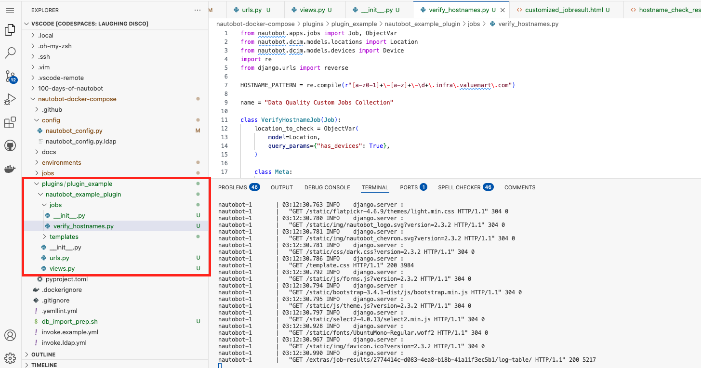
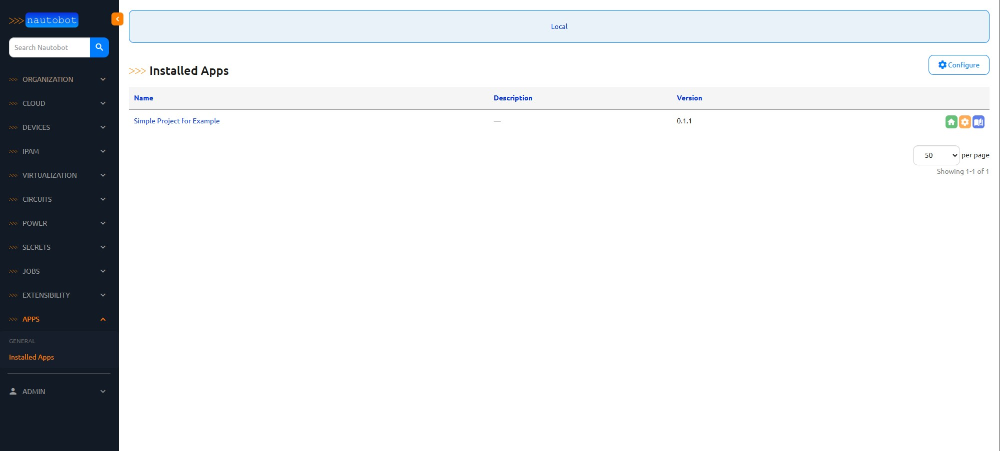

# URL Dispatch and Views in Nautobot
Every web application requires a mechanism to route incoming HTTP requests to the appropriate segment of code. In Nautobot, this capability is implemented via Django’s robust URL routing system. When a request arrives, Django consults its URL configuration—typically defined in one or more urls.py files—to determine the appropriate view for processing the request. This clear separation between URL definitions and business logic is a fundamental principle of the URL dispatch design pattern, contributing to a highly maintainable codebase.

In Nautobot, URL dispatching extends beyond serving static pages or handling API endpoints. It plays a crucial role in the platform’s extensibility, especially within its dynamic plugin ecosystem. Developers can define custom URL patterns that map directly to views, enabling the creation of new pages that interact seamlessly with Nautobot’s models, jobs, and other core components.

As you might recall from Day 23, we previously modified the Nautobot core to add an additional tab that displayed a table of results. Today, we will create our own Nautobot application to override core views for displaying job outcomes. While this approach achieves a similar objective to our earlier work, it introduces a flexible method applicable to various enhancements. For instance, you could use this technique to integrate Grafana graphs within a specific device’s tab, among other possibilities.

## Environment Setup

The environment setup will be the same as [Lab Setup Scenario 1](../Lab_Setup/scenario_1_setup/README.md), below is a summary of the steps, please consult the guide for a detailed background if needed. 

> [!TIP]
> If you have stopped the Codespace environment and restart again but found the Docker daemon stopped working, please follow the steps in the setup guide to rebuild the environment. 

>[!TIP]
> Make sure to remove the mapping of templates created on Day 23 from the ```nautobot-docker-compose/environments/docker-compose.local.yml``` file. You want to make sure you have the vanilla Nautobot files before proceeding.

Once again, we will add a volume to our `nautobot-docker-compose/environments/docker-compose.local.yml` for this walkthrough. We will use the plugin example, which should already be in your `nautobot-docker-compose` folder under `plugins`.
```yaml
---
services:
  nautobot:
    command: "nautobot-server runserver 0.0.0.0:8080"
    ports:
      - "8080:8080"
    volumes:
      - "../config/nautobot_config.py:/opt/nautobot/nautobot_config.py"
      - "../jobs:/opt/nautobot/jobs"
      - "../plugins/plugin_example/nautobot_example_plugin:/usr/local/lib/python3.8/site-packages/nautobot_example_plugin"
    healthcheck:
      interval: "30s"
      timeout: "10s"
      start_period: "60s"
      retries: 3
      test: ["CMD", "true"]  # Due to layering, disable: true won't work. Instead, change the test
  celery_worker:
    volumes:
      - "../config/nautobot_config.py:/opt/nautobot/nautobot_config.py"
      - "../jobs:/opt/nautobot/jobs"
      - "../plugins/plugin_example/nautobot_example_plugin:/usr/local/lib/python3.8/site-packages/nautobot_example_plugin"
```

### Starting Nautobot
```sh
$ cd nautobot-docker-compose/
$ poetry shell
$ invoke build
$ invoke debug
```

## The Role of URLs and Views
### `urls.py`
To better understand how Nautobot handles routing, open the Nautobot shell from your container and import the Nautobot core URLs. This process reveals the location of one of Nautobot’s `urls.py` files, allowing you to inspect its contents:

```sh
root@eba3a1d8b6ab:/opt/nautobot# nautobot-server nbshell
>>> import nautobot.core.urls
>>> print(nautobot.core.urls.__file__)
/usr/local/lib/python3.8/site-packages/nautobot/core/urls.py
>>> exit()
```

This file corresponds to the one found in the [Nautobot GitHub repository](https://github.com/nautobot/nautobot/blob/develop/nautobot/core/urls.py).

Now, let’s focus on a specific section of this `urls.py` file:

```python
urlpatterns = [
    path("circuits/", include("nautobot.circuits.urls")),
    path("cloud/", include("nautobot.cloud.urls")),
    path("dcim/", include("nautobot.dcim.urls")),
    path("extras/", include("nautobot.extras.urls")),
    path("ipam/", include("nautobot.ipam.urls")),
    path("tenancy/", include("nautobot.tenancy.urls")),
]
```

These URL patterns direct you to the appropriate views rendered on your screen when you click through links in the Nautobot application. Each path corresponds to a set of models, views, and APIs, effectively functioning as an individual Nautobot app.

### VIEWS.PY
While URL patterns determine where a request should go, views are responsible for processing those requests and generating the appropriate response. In Django—and by extension, Nautobot—views encapsulate the business logic that interacts with models, performs data processing, and renders templates or returns API responses.

```python
class JobResultView(generic.ObjectView):
    """
    Display a JobResult and its Job data.
    """

    queryset = JobResult.objects.prefetch_related("job_model", "user")
    template_name = "extras/jobresult.html"

    def get_extra_context(self, request, instance):
        associated_record = None
        job_class = None
        if instance.job_model is not None:
            job_class = instance.job_model.job_class

        return {
            "job": job_class,
            "associated_record": associated_record,
            "result": instance,
            **super().get_extra_context(request, instance),
        }
```

In this example:

GET Requests: When a user navigates to the URL for a specific JobResult, the view retrieves the corresponding object from the database using the pre-configured queryset (which also pre-fetches related job model and user data). The view then renders the extras/jobresult.html template to display the JobResult details. During this process, the get_extra_context method is invoked to augment the template context. This method checks if the JobResult instance has an associated job model and, if so, extracts the corresponding job class. It then adds this information—along with an (as yet) unused associated record and the JobResult itself—to the context provided to the template.

POST Requests: This particular view is designed solely for displaying information and does not include any logic to handle POST requests. All interactions with this view are read-only, focusing on rendering detailed job result data rather than processing user input or form submissions.

Together, this design ensures that when a user accesses a JobResult page, they receive a comprehensive view enriched with relevant job data, all managed by a clean separation of URL routing and view logic.


## Building Blocks of a Custom Plugin
Today, we’ll create a URL that maps to a view designed to interface with the VerifyHostname job. You could also create jobs that, for instance, run a routine check on network configurations or perform data aggregation. The view can be as simple as presenting a page with a button to trigger the job or as complex as handling form submissions and job status updates.

> [!TIP]
> All the files below should be created under the `nautobot-docker-compose/plugins/plugin_example/nautobot_example_plugin` folder. This folder is mapped to both the Nautobot and Nautobot-worker containers and placed in the Python site-packages folder, similar to how PIP installs files. This setup allows us to boot the Nautobot containers as if we had installed this plugin using PIP.

### Constructing the Custom Nautobot Plugin Application

In the `plugins/plugin_example/nautobot_example_plugin` folder, we will create a set of files that serve as the building blocks of our plugin. These files include the plugin configuration, URL mappings, custom views, job definitions, and the templates used to render our pages. Below is a breakdown of these files and their roles:


1. `__init__.py`
This file initializes and registers your plugin with Nautobot by defining its configuration.

- **Plugin Configuration**:
The `ExampleConfig` class (subclassing `PluginConfig`) defines essential metadata such as the plugin’s name, version, author, base URL, and other settings. This information informs Nautobot about how to integrate your plugin into its system.

- **Registration**:
By assigning `config = ExampleConfig`, Nautobot automatically detects and loads your plugin at startup.

```python
from nautobot.extras.plugins import PluginConfig

class ExampleConfig(PluginConfig):
    """Plugin configuration for the nautobot_example plugin."""

    name = "nautobot_example_plugin"
    verbose_name = "Simple Project for Example"
    version = "0.1.1"
    author = "Network to Code"
    description = ""
    base_url = "example"
    required_settings = []
    default_settings = {}
    caching_config = {}

config = ExampleConfig  # pylint: disable=invalid-name
```

2. `urls.py`
This file defines the URL mapping for your plugin.

- **URL Mapping**:
The file maps a specific URL pattern (`verifyhostname-results/<uuid:pk>/`) to a custom view (`CustomJobResultView`). When a user navigates to this URL, the request is directed to the view that will handle the display of the job result.

```python
from django.urls import path
from nautobot_example_plugin.views import CustomJobResultView

urlpatterns = [
    path("verifyhostname-results/<uuid:pk>/", CustomJobResultView.as_view(), name="custom_job_result"),
]
```

3. `views.py`
This file customizes how data is presented to the user by extending Nautobot’s built-in view for job results.

- **Custom Job Result View**:
The `CustomJobResultView` class inherits from `JobResultView`, which already handles permissions and basic object rendering. It overrides the default template with a custom one (`customized_jobresult.html`) and extends the context data to include additional variables—such as the job results and a custom message.

- **View Override Registration**:
The `override_views` dictionary directs Nautobot to use this custom view instead of the default one, ensuring your modifications are applied to the job result display.

```python
from nautobot.extras.views import JobResultView  # Import the built-in view

class CustomJobResultView(JobResultView):
    """
    This view customizes Nautobot's built-in JobResultView.
    Since JobResultView already implements ObjectPermissionRequiredMixin,
    we don't need to include it again.
    """
    template_name = "nautobot_example_plugin/customized_jobresult.html"

    def get_context_data(self, **kwargs):
        # Call the superclass implementation to get the default context.
        context = super().get_context_data(**kwargs)
        # The JobResult object is available in the context as 'object'.
        job_result = context.get("object")
        if job_result and job_result.result:
            context["results"] = job_result.result.get("results", [])
        else:
            context["results"] = []
        # Add any additional context variables here.
        context["custom_message"] = "This is my custom job result view."
        return context

# This dictionary tells Nautobot to use your custom view for job results.
override_views = {
    "extras:jobresult": CustomJobResultView.as_view(),
}
```

4. `jobs/__init__.py` and `jobs/verify_hostnames.py`
These files define the custom job that your plugin will execute.

- **Package Initialization**:
The `jobs/__init__.py` file marks the jobs directory as a package so that Nautobot can discover and import the job modules.
```python
from nautobot.core.celery import register_jobs
from .verify_hostnames import VerifyHostnameJob

jobs = [VerifyHostnameJob]
register_jobs(*jobs)
```

- **Custom Job Implementation**:
In `jobs/verify_hostnames.py`, the `VerifyHostnameJob` class defines a job that checks if device hostnames adhere to a specified pattern. It uses an `ObjectVar` to select a location that has devices, iterates over each device at that location, and logs whether each device’s hostname passes the regex pattern test. 
Additionally, the job constructs a URL (using Django’s `reverse` function) that links to the detailed results view and returns a dictionary containing the job results and the URL. This data is then consumed by your custom view to render the detailed job result page.

```python
from nautobot.apps.jobs import Job, ObjectVar
from nautobot.dcim.models.locations import Location
from nautobot.dcim.models.devices import Device
import re
from django.urls import reverse

HOSTNAME_PATTERN = re.compile(r"[a-z0-1]+\-[a-z]+\-\d+\.infra\.valuemart\.com")

name = "Data Quality Custom Jobs Collection"

class VerifyHostnameJob(Job):
    location_to_check = ObjectVar(
        model=Location,
        query_params={"has_devices": True},
    )

    class Meta:
        name = "Verify Hostname Pattern For Selected Locations Plugin Job"
        description = "Checks all devices at the designated location for hostname pattern conformity"

    def run(self, location_to_check):
        results = []
        for device in Device.objects.filter(location=location_to_check):
            hostname = device.name
            compliance_status = "PASS" if HOSTNAME_PATTERN.match(hostname) else "FAIL"

            if compliance_status == "PASS":
                self.logger.info(f"{hostname} is compliant.", extra={"object": device})
            else:
                self.logger.error(f"{hostname} does NOT match the hostname pattern.", extra={"object": device})

            results.append({
                "hostname": hostname,
                "device_id": device.id,
                "status": compliance_status,
                "device_url": device.get_absolute_url(),
            })
        
        link_url = reverse("plugins:nautobot_example_plugin:custom_job_result", args=[str(self.job_result.id)])
        self.logger.info(f'<a href="{link_url}" target="_blank">View Detailed Results</a>')

        return {"results": results, "redirect_url": link_url}
```

5. Template Files
The templates render the HTML pages that display your plugin’s output.

- **`templates/nautobot_example_plugin/customized_jobresult.html`**:
This template extends Nautobot’s generic object detail template and provides a custom layout for the job result page. It defines various blocks (breadcrumbs, buttons, content sections, tabs, and JavaScript) to structure the page. The template utilizes the context provided by `CustomJobResultView`, including the custom message and job results, to present a detailed view of the job execution.

- **`templates/nautobot_example_plugin/inc/hostname_check_results.html`**:
This partial template is included within the main job result template. It displays a table of hostname check results by iterating over the job’s result data. Additionally, it includes a button and accompanying JavaScript to export the results as a CSV file, allowing users to easily download and analyze the job output.

```templates/nautobot_example_plugin/customized_jobresult.html```:
```html










    <li><a href="">Job Results</a></li>
    
        <li>{{ result.job_model.grouping }}</li>
        <li><a href="?job_model={{ result.job_model.name }}">
            {{ result.job_model }}
        </a></li>
    
        
            <li><a href="?name={{ associated_record.name|urlencode }}">
                {{ associated_record.name }}
            </a></li>
        
            <li>{{ associated_record }}</li>
        
    
        <li><a href="?name={{ job.class_path|urlencode }}">
            {{ job.class_path }}
        </a></li>
    
        <li>{{ result.name }}</li>
    
    <li>{{ result.created }}</li>



    
        
            <a href="?kwargs_from_job_result={{ result.pk }}"
               class="btn btn-success">
                <span class="mdi mdi-repeat" aria-hidden="true"></span> Re-Run
            </a>
        
            <a href=""
               class="btn btn-primary">
                <span class="mdi mdi-play" aria-hidden="true"></span> Run
            </a>
        
    
    <a href="?job_result={{ result.pk }}&format=csv" class="btn btn-success">
        <span class="mdi mdi-database-export" aria-hidden="true"></span> Export
    </a>
    {{ block.super }}



    Job Result:
    
        {{ result.job_model }}
    
        {{ associated_record }}
    
        {{ job }}
    
        {{ result.name }}
    



    
        <li role="presentation">
            <a href="#output" role="tab" data-toggle="tab">Output</a>
        </li>
    
    
        <li role="presentation">
            <a href="#hostname-check" role="tab" data-toggle="tab">Hostname Check</a>
        </li>
    



    



    <div class="panel panel-default">
        <div class="panel-heading">
            <strong>Job Keyword Arguments</strong>
        </div>
        <div class="panel-body">
            
        </div>
    </div>
    <div class="panel panel-default">
        <div class="panel-heading">
            <strong>Job Positional Arguments</strong>
        </div>
        <div class="panel-body">
            
        </div>
    </div>
    <div class="panel panel-default">
        <div class="panel-heading">
            <strong>Job Celery Keyword Arguments</strong>
        </div>
        <div class="panel-body">
            
        </div>
    </div>


    <div class="panel panel-default">
        <div class="panel-heading">
            <strong>Worker</strong>
        </div>
        <table class="table table-hover panel-body attr-table">
            <tbody>
                <tr>
                    <td>Worker Hostname</td>
                    <td>{{ result.worker }}</td>
                </tr>
                <tr>
                    <td>Queue</td>
                    <td>{{ result.celery_kwargs.queue}}</td>
                </tr>
                <tr>
                    <td>Task Name</td>
                    <td>{{ result.task_name }}</td>
                </tr>
                <tr>
                    <td>Meta</td>
                    <td></td>
                </tr>
            </tbody>
        </table>
    </div>
    <div class="panel panel-default">
        <div class="panel-heading">
            <strong>Traceback</strong>
        </div>
        <div class="panel-body">
            
        </div>
    </div>


    
        <div role="tabpanel" class="tab-pane" id="output">
            <pre>{{ result.data.output }}</pre>
        </div>
    
    
        <div role="tabpanel" class="tab-pane" id="hostname-check">
            
        </div>
    




    {{ block.super }}
    
    <script src=""></script>
    <script src=""></script>

```

```templates/nautobot_example_plugin/inc/hostname_check_results.html```:
```html



    <h1>Hostname Check Results Table</h1>
    <!-- Added container with id "hostname-check" -->
    <div id="hostname-check">
        <table class="table table-hover">
            <thead>
                <tr>
                    <th>Hostname</th>
                    <th>Status</th>
                </tr>
            </thead>
            <tbody>
                
                <tr>
                    <td>
                        <a href="/dcim/devices/{{ item.device_id }}/?tab=main">
                            {{ item.hostname }}
                        </a>
                    </td>
                    <td>
                        
                            <span class="label label-success">{{ item.status }}</span>
                        
                            <span class="label label-danger">{{ item.status }}</span>
                        
                    </td>
                </tr>
                
            </tbody>
        </table>
    </div>
    <button id="export-results" class="btn btn-primary">Export Results</button>


<script>
    document.addEventListener('DOMContentLoaded', function() {
        document.getElementById('export-results').addEventListener('click', function() {
            // Now that the table is wrapped in #hostname-check, this selector works.
            var table = document.querySelector('#hostname-check table');
            if (!table) {
                console.error("Table not found!");
                return;
            }
            var rows = table.querySelectorAll('tr');
            
            var csv = [];
            for (var i = 0; i < rows.length; i++) {
                var row = [], cols = rows[i].querySelectorAll('td, th');
                
                for (var j = 0; j < cols.length; j++) {
                    // Clean up cell content for CSV
                    var data = cols[j].innerText.replace(/(\r\n|\n|\r)/gm, '').replace(/(\s\s)/gm, ' ');
                    // Escape quotes
                    data = data.replace(/"/g, '""');
                    // Add quotes if necessary
                    if (data.search(/("|,|\n)/g) >= 0) data = '"' + data + '"';
                    row.push(data);
                }
                csv.push(row.join(','));
            }
            
            // Download
            var csvString = csv.join('\n');
            var a = document.createElement('a');
            // Using the correct MIME type for CSV
            a.href = 'data:text/csv;charset=utf-8,' + encodeURIComponent(csvString);
            a.target = '_blank';
            a.download = 'hostname_check_results.csv';
            document.body.appendChild(a);
            a.click();
            document.body.removeChild(a);
        });
    });
</script>
```

With all these elements in place, we should restart our containers so that Nautobot can register our new plugin.

### Stop the Containers:
```bash
nautobot-1       |   "GET /extras/jobs/ HTTP/1.1" 200 255502
nautobot-1       | 02:56:33.623 INFO    django.server :
nautobot-1       |   "GET /template.css HTTP/1.1" 200 3984
Gracefully stopping... (press Ctrl+C again to force)
 Container nautobot_docker_compose-celery_beat-1  Stopping
 Container nautobot_docker_compose-celery_worker-1  Stopping
 Container nautobot_docker_compose-celery_worker-1  Stopped
 Container nautobot_docker_compose-celery_beat-1  Stopped
 Container nautobot_docker_compose-nautobot-1  Stopping
 Container nautobot_docker_compose-nautobot-1  Stopped
 Container nautobot_docker_compose-db-1  Stopping
 Container nautobot_docker_compose-redis-1  Stopping
 Container nautobot_docker_compose-db-1  Stopped
 Container nautobot_docker_compose-redis-1  Stopped
canceled
```

### Update `config/nautobot_config.py`
When adding a plugin, the plugin's name must be included in the `nautobot_config.py` file. This will register the plugin with Nautobot and allow it to function properly.


```python
"""Nautobot development configuration file."""

# pylint: disable=invalid-envvar-default
import os
import sys

from nautobot.core.settings import *  # noqa: F403  # pylint: disable=wildcard-import,unused-wildcard-import
from nautobot.core.settings_funcs import is_truthy, parse_redis_connection

# Debug
DEBUG = is_truthy(os.getenv("NAUTOBOT_DEBUG", False))

TESTING = len(sys.argv) > 1 and sys.argv[1] == "test"

# Logging
LOG_LEVEL = "DEBUG" if DEBUG else "INFO"

# Redis
# Redis Cacheops
CACHEOPS_REDIS = parse_redis_connection(redis_database=1)

# Enable installed plugins. Add the name of each plugin to the list.
PLUGINS = ["nautobot_example_plugin"]

# Plugins configuration settings.
PLUGINS_CONFIG = {
    "nautobot_example_plugin": {},
}

CSRF_TRUSTED_ORIGINS = ["http://localhost:8080", "https://localhost:8080"]
```

### Rebuild the Container:
```bash
 ➜ ~/nautobot-docker-compose (main) $ invoke build
Building Nautobot 2.3.2 with Python 3.8...
Running docker compose command "build"
#0 building with "default" instance using docker driver
#1 [nautobot internal] load build definition from Dockerfile
#1 transferring dockerfile: 2.32kB done
#1 WARN: FromAsCasing: 'as' and 'FROM' keywords' casing do not match (line 3)
#1 WARN: FromAsCasing: 'as' and 'FROM' keywords' casing do not match (line 14)
#1 WARN: FromAsCasing: 'as' and 'FROM' keywords' casing do not match (line 54)
#1 DONE 0.1s
#2 [nautobot internal] load metadata for ghcr.io/nautobot/nautobot:2.3.2-py3.8
```

### Start the Containers:
```bash
$ invoke debug
Starting Nautobot in debug mode...
Running docker compose command "up"
 Container nautobot_docker_compose-redis-1  Created
 Container nautobot_docker_compose-db-1  Created
 Container nautobot_docker_compose-nautobot-1  Created
 Container nautobot_docker_compose-celery_beat-1  Created
 Container nautobot_docker_compose-celery_worker-1  Created
```

### Validate Plugin Installation
Open a second terminal window in VSCode and validate that our files have been copied to the containers:
```bash
$ cd nautobot-docker-compose/
$ invoke cli
Running docker compose command "ps --services --filter status=running"
Running docker compose command "exec nautobot bash"
nautobot@51c9bdd1c291:~$ ls /usr/local/lib/python3.8/site-packages/nautobot_example_plugin/
__init__.py  jobs  templates  urls.py  views.py
```

### Verify in Nautobot
On the left-side navigation bar, go to the **Apps** section, expand it, and click on **Installed Apps**.


Click on **Sample Project for Example**. Here, we see details of the features we configured in this plugin, including:
- A link to the job from our `jobs` folder.
- The custom URL we created in `urls.py`.
- The **Core View Overrides** configured in `views.py`, which override the core job result page with our customized HTML template.


### Running the Job
Click the link for **Verify Hostname Pattern For Selected Locations Plugin Job** to navigate to the new job added by this plugin. Select a site and run the job.


### Reviewing the Job Result
In the **Job Result** page, you will see:
- A **Hostname Check** tab.
- A **View Detailed Results** link in the log output.

Clicking this link will direct you to the same job results page but with a customized URL. The **Hostname Check** tab will display the table output created on Day 23.


### Job List Update
In the **Jobs** list, you will notice:
- A new **Job Group** called "Data Quality Custom Jobs Collection."
- The registered job **Verify Hostname Pattern For Selected Locations Plugin Job**.

This information is defined in the `VerifyHostnameJob` class:
```python
name = "Data Quality Custom Jobs Collection"
```
and the `Meta` class:
```python
class Meta:
    name = "Verify Hostname Pattern For Selected Locations Plugin Job"
    description = "Checks all devices at the designated location for hostname pattern conformity"
```


## Summary
This custom plugin is constructed using the following components:

- **Configuration (`__init__.py`)**: Registers the plugin with Nautobot and sets essential metadata.
- **URL Mapping (`urls.py`)**: Defines the routing from a custom URL to the plugin’s view.
- **Custom Views (`views.py`)**: Extends Nautobot’s built-in views to customize job result displays.
- **Job Definition (`jobs/verify_hostnames.py`)**: Implements hostname verification logic and logs the results.
- **Templates (`customized_jobresult.html` and `hostname_check_results.html`)**: Render the UI for displaying job results, including a table and CSV export functionality.

This modular structure ensures seamless integration with Nautobot while maintaining clarity and extensibility.

## Day 27 To-Do
Remember to stop the Codespace instance at [GitHub Codespaces](https://github.com/codespaces/). 

Post a screenshot of the successful execution of the new job on social media using `#100DaysOfNautobot` and `#JobsToBeDone`, and tag `@networktocode`. 

In tomorrow's challenge, we will explore nautobot job log retention. See you tomorrow! 

[X/Twitter](<https://twitter.com/intent/tweet?url=https://github.com/nautobot/100-days-of-nautobot&text=I+just+completed+Day+27+of+the+100+days+of+nautobot+!&hashtags=100DaysOfNautobot,JobsToBeDone>)

[LinkedIn](https://www.linkedin.com/) (Copy & Paste: I just completed Day 27 of 100 Days of Nautobot, https://github.com/nautobot/100-days-of-nautobot, challenge! @networktocode #JobsToBeDone #100DaysOfNautobot)
