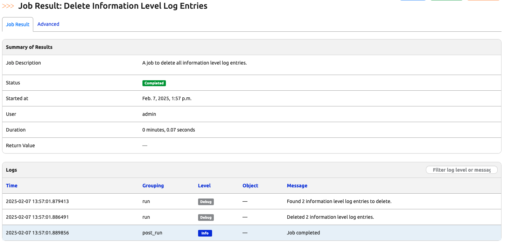
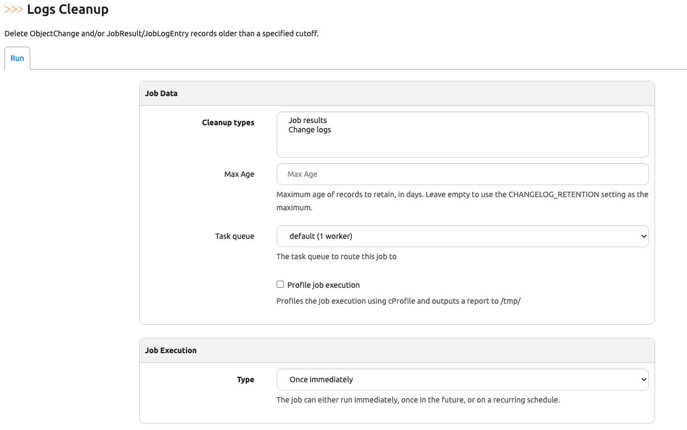

# Change Jobs Log Retention

In today's challenge, we aim to achieve two goals: 

1. Explore `JobLogEntry` data model to work with the job log entries. 
2. Establish a pattern of work when we need to implement a Nautobot job that works with database models. 

In other words, today's challenge will take you step-by-step on 

> [!TIP] 
> The log retention can also be set in the setting file, please take a look at [NAUTOBOT_CHANGELOG_RETENTION](https://docs.nautobot.com/projects/core/en/stable/user-guide/administration/configuration/settings/#changelog_retention) if interested. 

Let's get started.

## Environment Setup

The environment setup will be the same as [Lab Setup Scenario 1](../Lab_Setup/scenario_1_setup/README.md), please consult the guide for detailed steps if needed.  

## Data Model Exploration

We know the job result log entries exist in the database, but we might not know which database model we need to work with. We can use `nbshell` to explore the data models: 

```
@ericchou1 ➜ ~ $ cd nautobot-docker-compose/
@ericchou1 ➜ ~/nautobot-docker-compose (main) $ poetry shell
(nautobot-docker-compose-py3.10) @ericchou1 ➜ ~/nautobot-docker-compose (main) $ invoke nbshell
```

We can import all data models as the first pass for exploration: 

```
>>> from nautobot.extras.models import *
>>> dir()
['AdminGroup', 'Association', 'Avg', 'Cable', 'CablePath', 'Case', 'ChangeLoggedModel', 'ChordCounter', 'Circuit', 'CircuitTermination', 'CircuitType', 'ClockedSchedule', 'CloudAccount', 'CloudNetwork', 'CloudNetworkPrefixAssignment', 'CloudResourceType', 'CloudService', 'CloudServiceNetworkAssignment', 'Cluster', 'ClusterGroup', 'ClusterType', 'Code', 'ComputedField', 'ConfigContext', 'ConfigContextModel', 'ConfigContextSchema', 'ConsolePort', 'ConsolePortTemplate', 'ConsoleServerPort', 'ConsoleServerPortTemplate', 'Constance', 'Contact', 'ContactAssociation', 'ContactMixin', 'ContentType', 'Controller', 'ControllerManagedDeviceGroup', 'Count', 'CrontabSchedule', 'CustomField', 'CustomFieldChoice', 'CustomFieldModel', 'CustomLink', 'Device', 'DeviceBay', 'DeviceBayTemplate', 'DeviceFamily', 'DeviceRedundancyGroup', 'DeviceType', 'DeviceTypeToSoftwareImageFile', 'DynamicGroup', 'DynamicGroupMembership', 'DynamicGroupMixin', 'DynamicGroupsModelMixin', 'Exists', 'ExportTemplate', 'ExternalIntegration', 'F', 'FileAttachment', 'FileProxy', 'FrontPort', 'FrontPortTemplate', 'GitRepository', 'GraphQLQuery', 'Group', 'GroupResult', 'HealthCheckTestModel', 'IPAddress', 'IPAddressToInterface', 'ImageAttachment', 'Interface', 'InterfaceRedundancyGroup', 'InterfaceRedundancyGroupAssociation', 'InterfaceTemplate', 'IntervalSchedule', 'InventoryItem', 'Job', 'JobButton', 'JobHook', 'JobLogEntry', 'JobResult', 'Location', 'LocationType', 'LogEntry', 'Manufacturer', 'Max', 'MetadataChoice', 'MetadataType', 'Min', 'Module', 'ModuleBay', 'ModuleBayTemplate', 'ModuleType', 'Namespace', 'Nonce', 'Note', 'ObjectChange', 'ObjectMetadata', 'ObjectPermission', 'OuterRef', 'Partial', 'PeriodicTask', 'PeriodicTasks', 'Permission', 'Platform', 'PowerFeed', 'PowerOutlet', 'PowerOutletTemplate', 'PowerPanel', 'PowerPort', 'PowerPortTemplate', 'Prefetch', 'Prefix', 'PrefixLocationAssignment', 'Profile', 'Provider', 'ProviderNetwork', 'Q', 'RIR', 'Rack', 'RackGroup', 'RackReservation', 'RearPort', 'RearPortTemplate', 'Relationship', 'RelationshipAssociation', 'RelationshipModel', 'Request', 'Response', 'Role', 'RoleField', 'RouteTarget', 'SQLQuery', 'SavedView', 'SavedViewMixin', 'ScheduledJob', 'ScheduledJobs', 'Secret', 'SecretsGroup', 'SecretsGroupAssociation', 'Service', 'Session', 'SoftwareImageFile', 'SoftwareVersion', 'SolarSchedule', 'StaticGroupAssociation', 'Status', 'StatusField', 'StatusModel', 'Subquery', 'Sum', 'Tag', 'TaggedItem', 'TaskResult', 'Team', 'Tenant', 'TenantGroup', 'Token', 'User', 'UserSavedViewAssociation', 'UserSocialAuth', 'VLAN', 'VLANGroup', 'VLANLocationAssignment', 'VMInterface', 'VRF', 'VRFDeviceAssignment', 'VRFPrefixAssignment', 'VirtualChassis', 'VirtualMachine', 'Webhook', 'When', '_', '__builtins__', 'cache', 'deleted_count', 'get_user_model', 'info_log_entries', 'log', 'reverse', 'settings', 'timezone', 'transaction']
```

From the list of models, `Job` and `JobLogEntry` looks promising. Let's take a look: 

```
>>> from nautobot.extras.models import Job, JobLogEntry
>>> log = JobLogEntry.objects.first()

# Use tab after the period to see the options
>>> log.
log.DoesNotExist(                      log.full_clean(                        log.message
log.Meta(                              log.get_absolute_url(                  log.natural_key(
log.MultipleObjectsReturned(           log.get_constraints(                   log.natural_key_args_to_kwargs(
log.absolute_url                       log.get_deferred_fields(               log.natural_key_field_lookups
log.adelete(                           log.get_log_level_display(             log.natural_slug
log.arefresh_from_db(                  log.get_next_by_created(               log.objects
log.asave(                             log.get_previous_by_created(           log.pk
log.associated_object_metadata(        log.grouping                           log.prepare_database_save(
log.check(                             log.id                                 log.present_in_database
log.clean(                             log.is_cloud_resource_type_model       log.refresh_from_db(
log.clean_fields(                      log.is_contact_associable_model        log.save(
log.composite_key                      log.is_dynamic_group_associable_model  log.save_base(
log.created                            log.is_metadata_associable_model       log.serializable_value(
log.csv_natural_key_field_lookups(     log.is_saved_view_model                log.unique_error_message(
log.date_error_message(                log.job_result                         log.validate_constraints(
log.delete(                            log.job_result_id                      log.validate_unique(
log.documentation_static_path          log.log_level                          log.validated_save(
log.from_db(                           log.log_object                         
>>> 

>>> dir(log)
['DoesNotExist', 'Meta', 'MultipleObjectsReturned', '__class__', '__delattr__', '__dict__', '__dir__', '__doc__', '__eq__', '__format__', '__ge__', '__getattribute__', '__getstate__', '__gt__', '__hash__', '__init__', '__init_subclass__', '__le__', '__lt__', '__module__', '__ne__', '__new__', '__reduce__', '__reduce_ex__', '__repr__', '__setattr__', '__setstate__', '__sizeof__', '__str__', '__subclasshook__', '__weakref__', '_check_column_name_clashes', '_check_constraints', '_check_db_table_comment', '_check_default_pk', '_check_field_name_clashes', '_check_fields', '_check_id_field', '_check_index_together', '_check_indexes', '_check_local_fields', '_check_long_column_names', '_check_m2m_through_same_relationship', '_check_managers', '_check_model', '_check_model_name_db_lookup_clashes', '_check_ordering', '_check_property_name_related_field_accessor_clashes', '_check_single_primary_key', '_check_swappable', '_check_unique_together', '_content_type', '_content_type_cache_key', '_content_type_cached', '_do_insert', '_do_update', '_generate_field_lookups_from_natural_key_field_names', '_get_FIELD_display', '_get_expr_references', '_get_field_value_map', '_get_next_or_previous_by_FIELD', '_get_next_or_previous_in_order', '_get_pk_val', '_get_unique_checks', '_meta', '_perform_date_checks', '_perform_unique_checks', '_prepare_related_fields_for_save', '_save_parents', '_save_table', '_set_pk_val', '_state', 'absolute_url', 'adelete', 'arefresh_from_db', 'asave', 'associated_object_metadata', 'check', 'clean', 'clean_fields', 'composite_key', 'created', 'csv_natural_key_field_lookups', 'date_error_message', 'delete', 'documentation_static_path', 'from_db', 'full_clean', 'get_absolute_url', 'get_constraints', 'get_deferred_fields', 'get_log_level_display', 'get_next_by_created', 'get_previous_by_created', 'grouping', 'id', 'is_cloud_resource_type_model', 'is_contact_associable_model', 'is_dynamic_group_associable_model', 'is_metadata_associable_model', 'is_saved_view_model', 'job_result', 'job_result_id', 'log_level', 'log_object', 'message', 'natural_key', 'natural_key_args_to_kwargs', 'natural_key_field_lookups', 'natural_slug', 'objects', 'pk', 'prepare_database_save', 'present_in_database', 'refresh_from_db', 'save', 'save_base', 'serializable_value', 'unique_error_message', 'validate_constraints', 'validate_unique', 'validated_save']
```

We can filter for `info` log entries (your output would be different): 

```
>>> info_log_entries = JobLogEntry.objects.filter(log_level="info")

>>> info_log_entries
<RestrictedQuerySet [<JobLogEntry: Running job>, <JobLogEntry: Checking device hostname compliance: bos-acc-01.infra.valuemart.com>, <JobLogEntry: bos-acc-01.infra.valuemart.com configured hostname is correct.>, <JobLogEntry: Checking device hostname compliance: bos-rtr-01.infra.valuemart.com>, <JobLogEntry: bos-rtr-01.infra.valuemart.com configured hostname is correct.>, <JobLogEntry: Job completed>, <JobLogEntry: Running job>, <JobLogEntry: Job completed>, <JobLogEntry: Running job>, <JobLogEntry: This is an log of info type.>, <JobLogEntry: Running job>, <JobLogEntry: This is an log of info type.>, <JobLogEntry: Running job>, <JobLogEntry: Running job>]>
>>>

>>> info_log_entries.count()
14
```

We can see, at the moment, we have 14 `JobLogEntries` matches the `info` level logs. Let's try to delete them: 

```
>>> deleted_count, _ = info_log_entries.delete()
>>> deleted_count
14
>>> info_log_entries = JobLogEntry.objects.filter(log_level="info")
>>> info_log_entries.count()
0
```

Great! We now have everything we need to construct a new job that does this automatically for us. 

## Create a Job

We can create a new job named `delete_info_log.py` with the commands we experimented with in `nbshell`. There is no new information presented in this script, other than to codify the commands we used in `nbshell`: 

```python
from nautobot.apps.jobs import Job, register_jobs
from nautobot.extras.models import JobLogEntry


class DeleteInfoLogEntries(Job):
    class Meta:
        name = "Delete Information Level Log Entries"
        description = "A job to delete all information level log entries."

    def run(self):
        # Filter for information level log entries
        info_log_entries = JobLogEntry.objects.filter(log_level="info")

        # Log the number of entries to be deleted
        info_entries_count = info_log_entries.count()
        self.logger.debug(f"Found {info_entries_count} information level log entries to delete.")

        # Delete the filtered log entries
        deleted_count, _ = info_log_entries.delete()

        # Log the result of the deletion
        self.logger.debug(f"Deleted {deleted_count} information level log entries.")


register_jobs(
    DeleteInfoLogEntries,
)
```

After enabling the job, the job can be run to delete other `info` level Job log entries: 



It is worth mentioning there is a bundled `System Job` named `Logs Cleanup` if you want to do basic cleaning: 



## General Steps for Working with Models

Let's summarize the steps we took in today's challenge to work with Nautobot database models: 

1. Find the model we should work with. 
2. Experiment and explore the model entries. 
3. Codify the steps into scripts or jobs. 

Congratulations on completing Day 028! 

## Day 28 To Do

Remember to stop the codespace instance on [https://github.com/codespaces/](https://github.com/codespaces/). 

Go ahead and post a screenshot of the successful execution of the new `delete information level log` job on a social media of your choice, make sure you use the tag `#100DaysOfNautobot` `#JobsToBeDone` and tag `@networktocode`, so we can share your progress! 

In tomorrow's challenge, we will take a look at the reserved attribute names for Nautobot Jobs. See you tomorrow! 

[X/Twitter](<https://twitter.com/intent/tweet?url=https://github.com/nautobot/100-days-of-nautobot&text=I+jst+completed+Day+28+of+the+100+days+of+nautobot+!&hashtags=100DaysOfNautobot,JobsToBeDone>)

[LinkedIn](https://www.linkedin.com/) (Copy & Paste: I just completed Day 28 of 100 Days of Nautobot, https://github.com/nautobot/100-days-of-nautobot, challenge! @networktocode #JobsToBeDone #100DaysOfNautobot)
