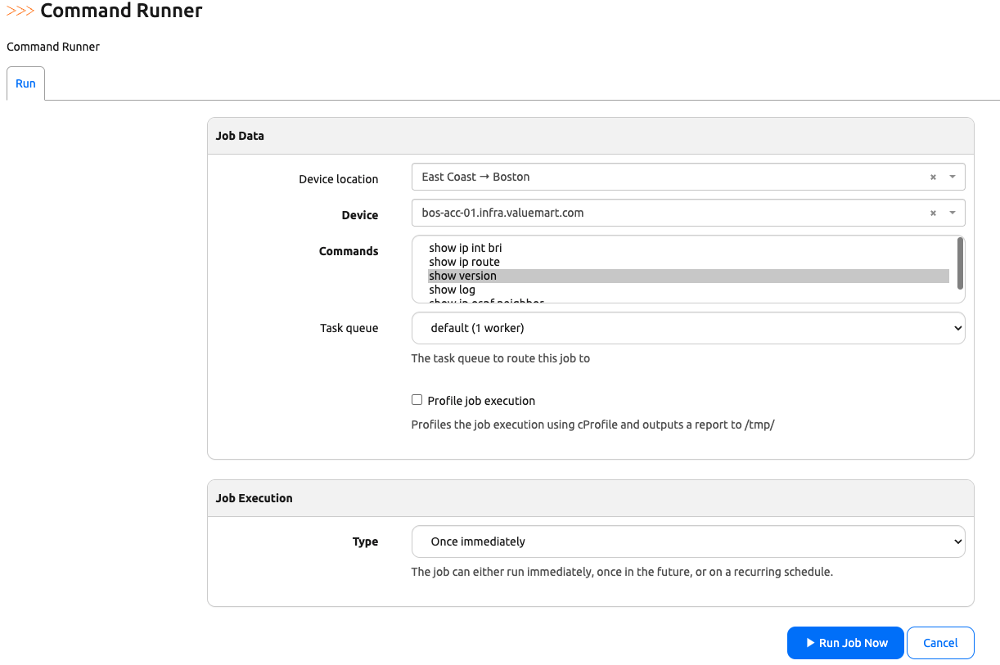
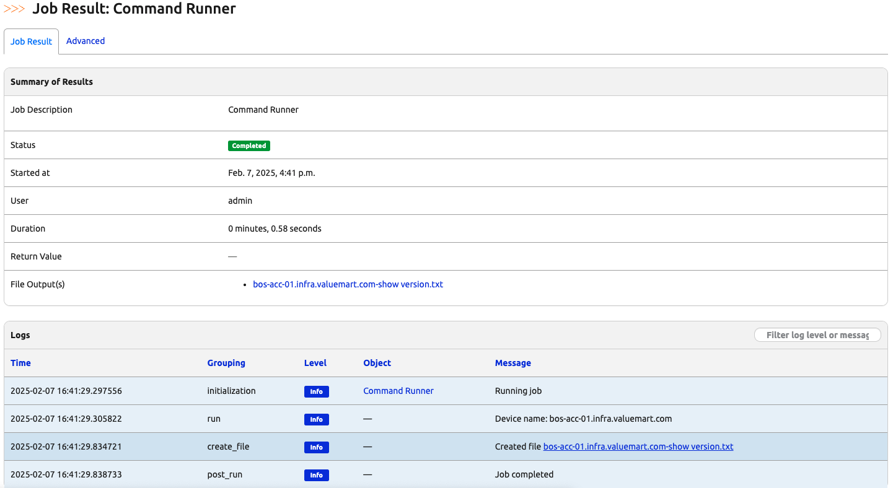
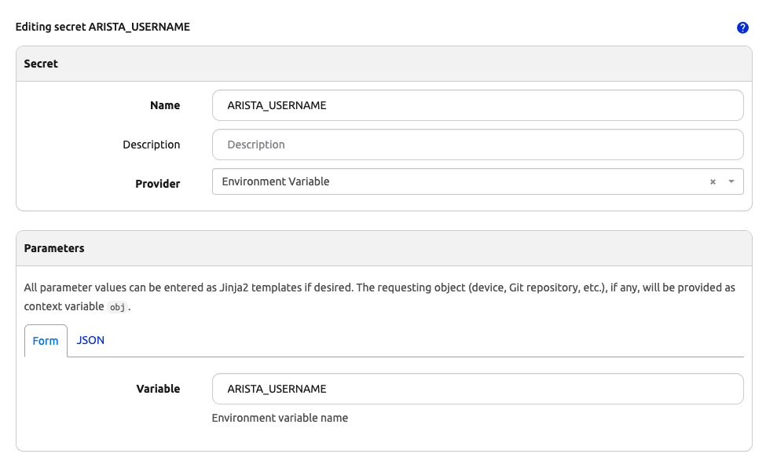
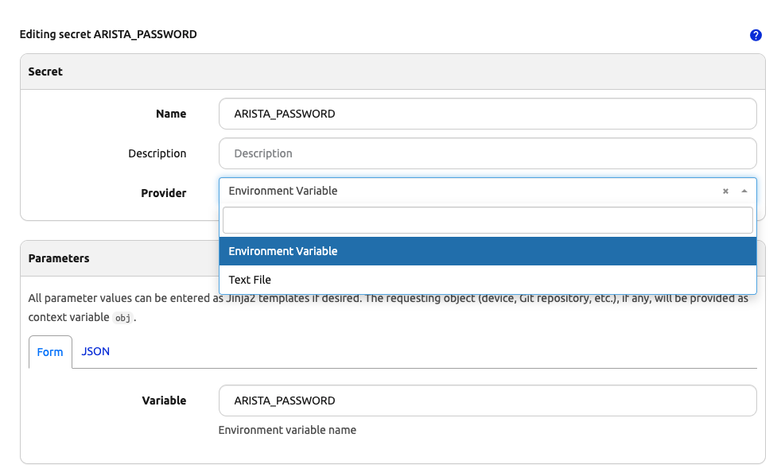
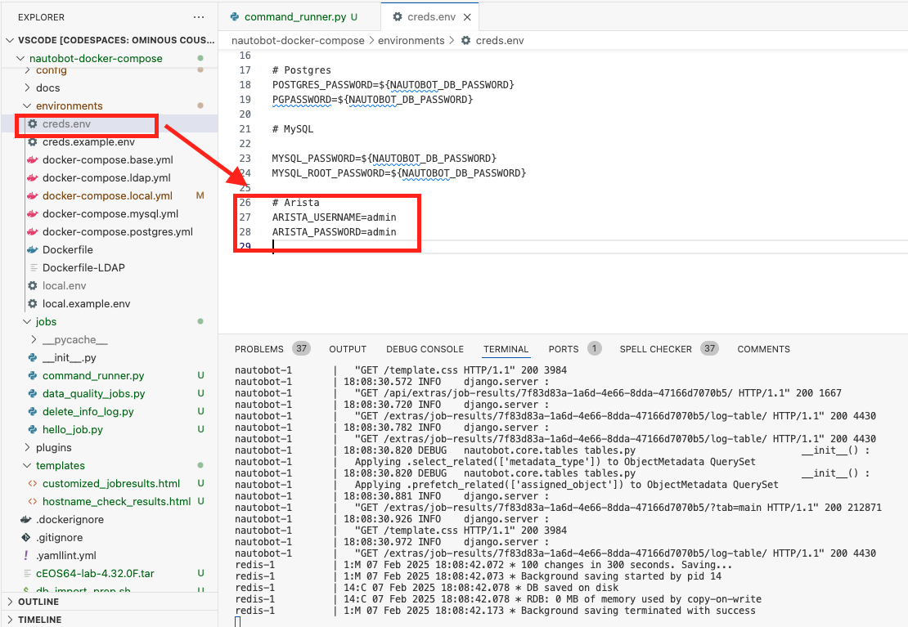
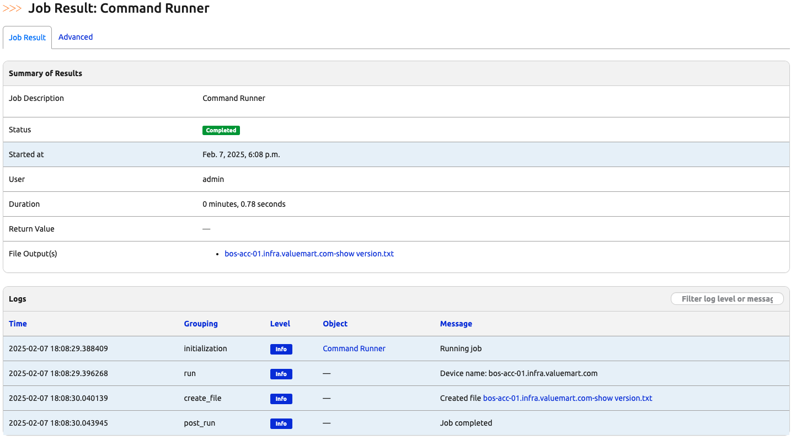

# Accessing Secrets in Jobs

For obvious reasons, we need to keep confidential information such as API tokens, device access username and passwords as secrets. In Nautobot, secrets management can be found in [Secrets and Security](https://docs.nautobot.com/projects/core/en/stable/user-guide/platform-functionality/secret/#secrets-and-security). 

There are a few concepts when it comes to secrets management within Nautobot: 

- Secrets: A secrete in Nautobot stores a *reference* on how to retrieve the secret; **not** the secretes themselves. 
- Secrets Group: Secrets group contains a collection of secrets, which can then be attached to objects such as devices or Git repositories. 
- Secrets providers: The [providers](https://github.com/nautobot/nautobot-app-secrets-providers) are where the secret values can be fetched, such as environmental variables as well as 3rd party providers such as `HashCorp Valut` and `AWS Secrets Manager`. 


>[!IMPORTANT]
> Be careful in making sure the secrets are not leaked in Jobs Logs. 

Let's go ahead and see an example of using secrets in Nautobot Jobs. 

## Environment Setup

The environment setup will be the same as [Lab Setup Scenario 1](../Lab_Setup/scenario_1_setup/README.md), below is a summary of the steps, please consult the guide for a detailed background if needed. 

We will follow the same steps to start Nautobot, you can skip `invoke build` and `invoke db-import` if you restarted an existing instance and `build` and `db-import` was already completed: 

```
$ cd nautobot-docker-compose/
$ poetry shell
$ invoke build
$ invoke db-import
$ invoke debug
```

Let's upload and prepare `cEOS` image and start Containerlab: 

```
$ docker import cEOS64-lab-4.32.0F.tar ceos:4.32.0F
```

For this lab we only needed the `bos-acc-01` devices: 

```
$ cd ~/100-days-of-nautobot/clab/
$ sudo containerlab deploy --topo ceos-lab.clab.yml --node-filter bos-acc-01
```

The environment is now setup for today's challenge.  

## Command Runner Job

We will use [Day009 Command Runner](https://github.com/nautobot/100-days-of-nautobot/blob/main/Day010_Python_Script_to_Jobs_Part_2/README.md) job as the base for today's challenge. 

For reference, this is the content of the Job: 

```python
import os

from django.conf import settings
from nautobot.apps.jobs import MultiChoiceVar, Job, ObjectVar, register_jobs, StringVar, IntegerVar
from nautobot.dcim.models.locations import Location
from nautobot.dcim.models.devices import Device
from nautobot.dcim.models.device_components import Interface
from netmiko import ConnectHandler
from nautobot.ipam.models import VLAN
from nautobot.apps.jobs import JobButtonReceiver


name = "Network Operations"


COMMAND_CHOICES = (
    ("show ip interface brief", "show ip int bri"),
    ("show ip route", "show ip route"),
    ("show version", "show version"),
    ("show log", "show log"),
    ("show ip ospf neighbor", "show ip ospf neighbor"),
)


class CommandRunner(Job):
    device_location = ObjectVar(model=Location, required=False)

    device = ObjectVar(
        model=Device,
        query_params={
            "location": "$device_location",
        },
    )

    commands = MultiChoiceVar(choices=COMMAND_CHOICES)

    class Meta:
        name = "Command Runner"
        has_sensitive_variables = False
        description = "Command Runner"

    def run(self, device_location, device, commands):
        self.logger.info("Device name: %s", device.name)
    
        # Verify that the device has a primary IP
        if device.primary_ip is None:
            self.logger.fatal("Device does not have a primary IP address set.")
            return

        # Verify that the device has a platform associated 
        if device.platform is None:
            self.logger.fatal("Device does not have a platform set.")
            return

        # check for device driver association
        if device.platform.network_driver_mappings.get("netmiko") is None:
            self.logger.fatal("Device mapping for Netmiko is not present, please set.")
            return

        # Connect to the device, get some output - comment this out if you are simulating
        net_connect = ConnectHandler(
            device_type=device.platform.network_driver_mappings["netmiko"],
            host=device.primary_ip.host,  # or device.
            username="admin",
            password="admin",
        )
        for command in commands:
            output = net_connect.send_command(
                command
            )  
            self.create_file(f"{device.name}-{command}.txt", output)


register_jobs(
    CommandRunner,
)
```

Please make sure the Job can be successfully executed before moving on to the next step, refer back to [Day009 Command Runner](https://github.com/nautobot/100-days-of-nautobot/blob/main/Day010_Python_Script_to_Jobs_Part_2/README.md) if needed: 




Notice the username and password were hard-coded in the job file: 

```python
        net_connect = ConnectHandler(
            device_type=device.platform.network_driver_mappings["netmiko"],
            host=device.primary_ip.host,  # or device.
            username="admin",
            password="admin",
        )
```

We will use `Nautobot secrets` instead of hard-coded values in the next step. 

## Nautobot Secrets 

We will start by creating `secrets`. Navigate to "Secrets -> '+'". We will name the secret 'ARISTA_USERNAME' and 'ARISTA_PASSWORD' from 'Environment variable' as the provider: 





Let's see how we can access the secrets. 

## Access Secret Values

We will attach to the nautobot container and set the two environment variables: 

```
$ docker exec -u root -it nautobot_docker_compose-nautobot-1 bash

root@ee2753f052ae:/opt/nautobot# export ARISTA_USERNAME="admin"
root@ee2753f052ae:/opt/nautobot# export ARISTA_PASSWORD="admin"
```

We can launch `nbshell` and see how to access the values of the secrets: 

```
root@ee2753f052ae:/opt/nautobot# nautobot-server nbshell
...
>>> from nautobot.extras.models.secrets import Secret
>>> username = Secret.objects.get(name="ARISTA_USERNAME").get_value()
>>> password = Secret.objects.get(name="ARISTA_PASSWORD").get_value()
>>> username
'admin'
>>> password
'admin'
```

Now, let's use the secret values in our `command_runner.py` job in the next step. 

## Using Secrets in the Job

Recall the jobs are executed in asynchronous via nautobot workers, the easiest way to implement new environment variable is to modify the `creds.env` file: 



We will need to stop and start the nautobot containers: 

```
Ctrl+C
(nautobot-docker-compose-py3.10) @ericchou1 ➜ ~/nautobot-docker-compose (main) $ invoke debug 
Starting Nautobot in debug mode...
Running docker compose command "up"
 Container nautobot_docker_compose-redis-1  Created
 Container nautobot_docker_compose-db-1  Created
 Container nautobot_docker_compose-nautobot-1  Created
 Container nautobot_docker_compose-celery_worker-1  Created
 Container nautobot_docker_compose-celery_beat-1  Created
Attaching to celery_beat-1, celery_worker-1, db-1, nautobot-1, redis-1
...
```

We can modify the `username` and `password` in the `command_runner.py` file to use secrets: 

```
from nautobot.extras.models.secrets import Secret

...
        # Connect to the device, get some output - comment this out if you are simulating
        net_connect = ConnectHandler(
            device_type=device.platform.network_driver_mappings["netmiko"],
            host=device.primary_ip.host,  # or device.name if your name is an FQDN
            username=Secret.objects.get(name="ARISTA_USERNAME").get_value(),  
            password=Secret.objects.get(name="ARISTA_PASSWORD").get_value(),
        )
        for command in commands:
            output = net_connect.send_command(
                command
            )  
            self.create_file(f"{device.name}-{command}.txt", output)
...
```

We will receive the same result as before, but the job runner uses the secret value instead of hard-coded value: 



## Final Job File

As a reference, here is the final `command_runner.py` file: 

```
import os

from django.conf import settings
from nautobot.apps.jobs import MultiChoiceVar, Job, ObjectVar, register_jobs, StringVar, IntegerVar
from nautobot.dcim.models.locations import Location
from nautobot.dcim.models.devices import Device
from nautobot.dcim.models.device_components import Interface
from netmiko import ConnectHandler
from nautobot.ipam.models import VLAN
from nautobot.apps.jobs import JobButtonReceiver
from nautobot.extras.models.secrets import Secret


name = "Network Operations"


COMMAND_CHOICES = (
    ("show ip interface brief", "show ip int bri"),
    ("show ip route", "show ip route"),
    ("show version", "show version"),
    ("show log", "show log"),
    ("show ip ospf neighbor", "show ip ospf neighbor"),
)


class CommandRunner(Job):
    device_location = ObjectVar(model=Location, required=False)

    device = ObjectVar(
        model=Device,
        query_params={
            "location": "$device_location",
        },
    )

    commands = MultiChoiceVar(choices=COMMAND_CHOICES)

    class Meta:
        name = "Command Runner"
        has_sensitive_variables = False
        description = "Command Runner"

    def run(self, device_location, device, commands):
        self.logger.info("Device name: %s", device.name)
    
        # Verify that the device has a primary IP
        if device.primary_ip is None:
            self.logger.fatal("Device does not have a primary IP address set.")
            return

        # Verify that the device has a platform associated 
        if device.platform is None:
            self.logger.fatal("Device does not have a platform set.")
            return

        # check for device driver association
        if device.platform.network_driver_mappings.get("netmiko") is None:
            self.logger.fatal("Device mapping for Netmiko is not present, please set.")
            return

        # Connect to the device, get some output - comment this out if you are simulating
        net_connect = ConnectHandler(
            device_type=device.platform.network_driver_mappings["netmiko"],
            host=device.primary_ip.host,  # or device.name if your name is an FQDN
            username=Secret.objects.get(name="ARISTA_USERNAME").get_value(),  
            password=Secret.objects.get(name="ARISTA_PASSWORD").get_value(),
        )
        for command in commands:
            output = net_connect.send_command(
                command
            )  
            self.create_file(f"{device.name}-{command}.txt", output)


register_jobs(
    CommandRunner,
)
```

Great job in completing Day 30! 

## Day 30 To Do

Remember to stop the codespace instance on [https://github.com/codespaces/](https://github.com/codespaces/). 

Go ahead and post a screenshot of the successful execution of the job with nautobot secret on a social media of your choice, make sure you use the tag `#100DaysOfNautobot` `#JobsToBeDone` and tag `@networktocode`, so we can share your progress! 

In tomorrow's challenge, we will see how we can validate routes via external API calls. See you tomorrow! 

[X/Twitter](<https://twitter.com/intent/tweet?url=https://github.com/nautobot/100-days-of-nautobot&text=I+jst+completed+Day+30+of+the+100+days+of+nautobot+!&hashtags=100DaysOfNautobot,JobsToBeDone>)

[LinkedIn](https://www.linkedin.com/) (Copy & Paste: I just completed Day 30 of 100 Days of Nautobot, https://github.com/nautobot/100-days-of-nautobot, challenge! @networktocode #JobsToBeDone #100DaysOfNautobot) 
