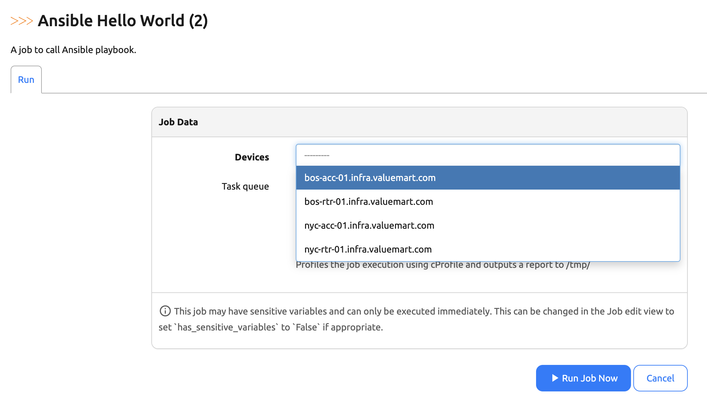
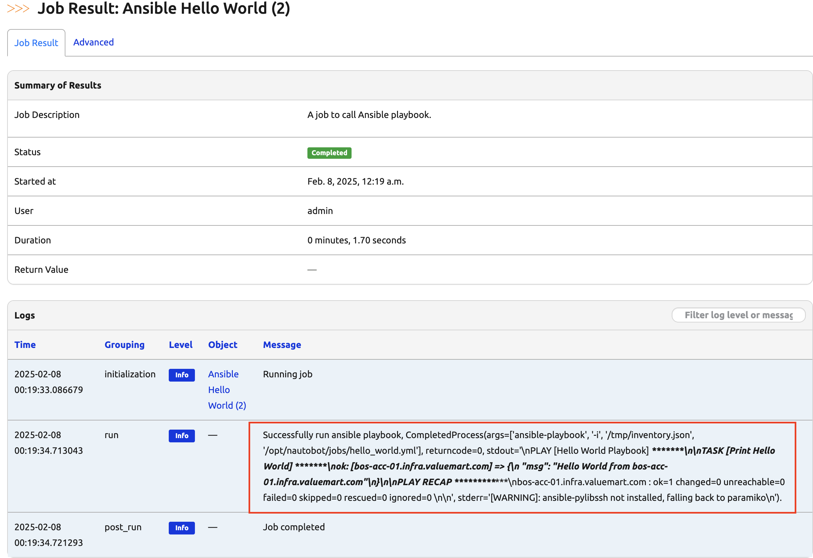

# Integrate Ansible with Jobs

In today's challenge, we will call a simple Ansible playbook within a Nautobot Job. This example is not for production use, it is meant to illustrate the interoperability between the two popular tools. 

As you can tell, we are progressively getting more complex in our Job configuration, this is exciting! 

## Environment Setup

The environment setup will be the same as [Lab Setup Scenario 1](../Lab_Setup/scenario_1_setup/README.md), below is a summary of the steps, please consult the guide for a detailed background if needed. 

We will follow the same steps to start Nautobot, you can skip `invoke build` and `invoke db-import` if you restarted an existing instance and `build` and `db-import` was already completed: 

```
$ cd nautobot-docker-compose/
$ poetry shell
$ invoke build
$ invoke db-import
$ invoke debug
```

Let's upload and prepare cEOS image and start Containerlab: 

```
$ docker import cEOS64-lab-4.32.0F.tar ceos:4.32.0F
```

For this lab we only needed the `bos-acc-01` devices: 

```
$ cd ~/100-days-of-nautobot/clab/
$ sudo containerlab deploy --topo ceos-lab.clab.yml --node-filter bos-acc-01
```

The environment is now setup for today's challenge.  

## Ansible Setup

By default, Ansible is not installed in our Docker containers. Let's install them on both the `nautobot-worker` and `nautobot`. 

Open up two terminal windows, one for `nautobot-worker` and one for `nautobot`: 

```
$ docker exec -u root -it nautobot_docker_compose-celery_worker-1 bash
$ docker exec -u root -it nautobot_docker_compose-nautobot-1 bash
```

Use the following steps on both to install Ansible: 

```shell
root@0936589bc72d:/opt/nautobot# apt update
root@0936589bc72d:/opt/nautobot# apt install -y software-properties-common
root@0936589bc72d:/opt/nautobot# apt-get install -y python3-software-properties
root@0936589bc72d:/opt/nautobot# echo "deb http://ppa.launchpad.net/ansible/ansible/ubuntu focal main" > /etc/apt/sources.list.d/ansible.list
apt-key adv --keyserver keyserver.ubuntu.com --recv-keys 93C4A3FD7BB9C367
apt-get update
root@0936589bc72d:/opt/nautobot# apt-get install -y ansible, vim, python3-paramiko
root@771b55abc34a:/opt/nautobot# export ANSIBLE_HOST_KEY_CHECKING=False

root@0936589bc72d:/opt/nautobot# ansible --version
ansible [core 2.14.18]
  config file = None
  configured module search path = ['/root/.ansible/plugins/modules', '/usr/share/ansible/plugins/modules']
  ansible python module location = /usr/lib/python3/dist-packages/ansible
  ansible collection location = /root/.ansible/collections:/usr/share/ansible/collections
  executable location = /usr/bin/ansible
  python version = 3.11.2 (main, Nov 30 2024, 21:22:50) [GCC 12.2.0] (/usr/bin/python3)
  jinja version = 3.1.2
  libyaml = True
```

Now we are ready to construct our Nautobot Job. 

## Nautobot Job with Ansible Playbook

We will put a `hello_world.yml` playbook in the `/opt/nautobot/jobs` directory: 

```
root@0936589bc72d:/opt/nautobot/jobs# cat hello_world.yml 
---
- name: Hello World Playbook
  hosts: all
  gather_facts: no
  tasks:
    - name: Print Hello World
      debug:
        msg: "Hello World from {{ inventory_hostname }}"
```

The playbook includes a printout for the `inventory_hostname` to make sure we are passing the selected device to the playbook. 

We can write a Nautobot Job, `hello_ansible_test.py`, by allowing the user to select the device from Nautobot and writing the information to a temporary file that would later to be used as a dynamic inventory file by Ansible. 

Ansible playbook is called with Python `subprocess`. 

The Nautobot Job content is as follows: 

```python 
from nautobot.apps.jobs import MultiChoiceVar, MultiObjectVar, Job, ObjectVar, register_jobs, StringVar, IntegerVar
from nautobot.dcim.models.devices import Device
from nautobot.dcim.models.locations import Location
import subprocess
import json 

name = "Operations with Ansible"

class HelloAnsible(Job):
    devices = MultiObjectVar(
        model=Device,
    )

    class Meta:
        name = "Ansible Hello World"
        description = "A job to call Ansible playbook."

    def run(self, devices):
        inventory = {"all": {"hosts": {}}}
        # Gather inventory information
        for device in devices:
            ip_address = str(device.primary_ip).split('/')[0] 
            inventory["all"]["hosts"][device.name] = {
                "ansible_host": ip_address,
                "ansible_user": "admin",  
                "ansible_password": "admin",
                "ansible_connection": "network_cli", 
                "ansible_network_os": "eos",
                "ansible_become": True,
                "ansible_become_method": "enable"
            }

        # Write the inventory to a temporary file
        inventory_file = "/tmp/inventory.json"
        with open(inventory_file, "w") as f:
            json.dump(inventory, f)

        # Run the Ansible playbook 
        device = str(device.primary_ip).split('/')[0]
        result = subprocess.run(
            ["ansible-playbook", "-i", inventory_file, "/opt/nautobot/jobs/hello_world.yml"],
            capture_output=True,
            text=True,
        )

        if result.returncode != 0:
            self.logger.fatal(f"Ansible playbook failed: {result.stderr}")
            return

        self.logger.info(f"Successfully run ansible playbook, {result}.")


register_jobs(
    HelloAnsible,
)
```

Once we enable the job, we can execute it and observe the result: 



In the "Job Result" page, we can see the output of the Ansible playbook, including the hostname of the device we selected: 



## Troubleshooting Ansible Playbook

Since most of the Nautobot Job configuration has been covered in previous days. If you run into problem with today's challenge, it is likely to be an Ansible issue. 

I find it helpful to test running Ansible directly on the Nautobot host first to make sure it executes. 

There are several things to check. 

1. Make sure the inventory file is written correctly: 

```
root@771b55abc34a:/opt/nautobot/jobs# cat /tmp/inventory.json 
{"all": {"hosts": {"bos-acc-01.infra.valuemart.com": {"ansible_host": "172.17.0.2", "ansible_user": "admin", "ansible_password": "admin", "ansible_connection": "network_cli", "ansible_network_os": "eos", "ansible_become": true, "ansible_become_method": "enable"}}}}
```

2. Check the content of the Ansible playbook: 

```
root@771b55abc34a:/opt/nautobot/jobs# cat hello_world.yml 
---
- name: Hello World Playbook
  hosts: all
  gather_facts: no
  tasks:
    - name: Print Hello World
      debug:
        msg: "Hello World from {{ inventory_hostname }}"
```

3. Execute Ansible playbook locally: 

```
root@771b55abc34a:/opt/nautobot/jobs# ansible-playbook -i /tmp/inventory.json hello_world.yml 

PLAY [Hello World Playbook] *************************************************************************************************************************

TASK [Print Hello World] ****************************************************************************************************************************
[WARNING]: ansible-pylibssh not installed, falling back to paramiko
ok: [bos-acc-01.infra.valuemart.com] => {
    "msg": "Hello World from bos-acc-01.infra.valuemart.com"
}

PLAY RECAP ******************************************************************************************************************************************
bos-acc-01.infra.valuemart.com : ok=1    changed=0    unreachable=0    failed=0    skipped=0    rescued=0    ignored=0  
```

Congratulations on completing Day 032, you are doing great! 

## Day 32 To Do

Remember to stop the codespace instance on [https://github.com/codespaces/](https://github.com/codespaces/). 

Go ahead and post a screenshot of the successful execution of the job calling the Ansible playbook on a social media of your choice, make sure you use the tag `#100DaysOfNautobot` `#JobsToBeDone` and tag `@networktocode`, so we can share your progress! 

See you tomorrow! 

[X/Twitter](<https://twitter.com/intent/tweet?url=https://github.com/nautobot/100-days-of-nautobot&text=I+jst+completed+Day+32+of+the+100+days+of+nautobot+!&hashtags=100DaysOfNautobot,JobsToBeDone>)

[LinkedIn](https://www.linkedin.com/) (Copy & Paste: I just completed Day 32 of 100 Days of Nautobot, https://github.com/nautobot/100-days-of-nautobot, challenge! @networktocode #JobsToBeDone #100DaysOfNautobot) 