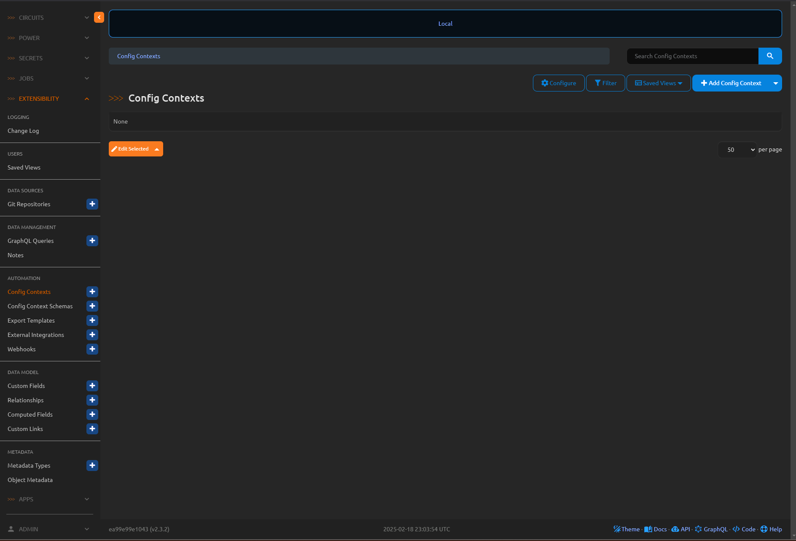
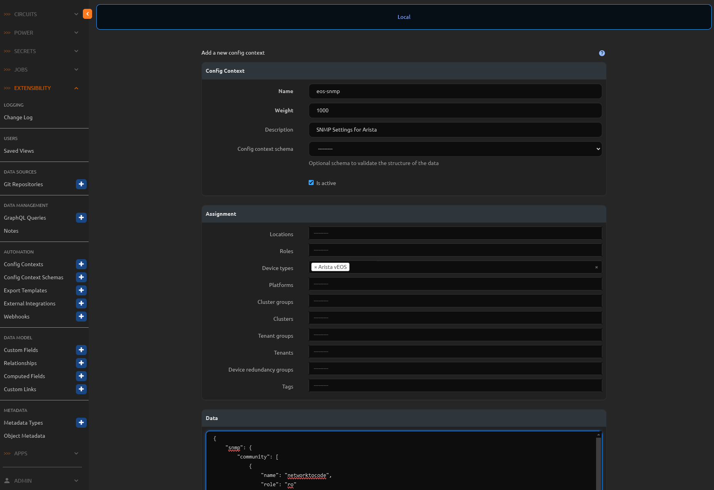

# Integrate Nautobot with Ansible Workflow

Over the last 32 days, we have delved into Nautobot Jobs, with a strong focus on Python (a valuable skill for Network Engineers). However, many organizations have standardized their automation on Ansible. Network to Code maintains an excellent [Ansible library](https://github.com/nautobot/nautobot-ansible) for Nautobot. This library includes modules to manage every model, including administrative functions like groups and permissions.

Today, we will set up Ansible playbooks to manage our container lab devices, using Nautobot as our source of truth. One of the most powerful features from an Ansible perspective is the ability to dynamically handle group and host variables using Nautobot. This allows us to maintain Nautobot as our source of truth without needing to manage a separate set of files for group and host variables on the Ansible server.

## Environment Setup

The environment setup follows [Lab Setup Scenario 1](../Lab_Setup/scenario_1_setup/README.md). Below is a summary of the steps; consult the guide for detailed background if needed.

We will follow the same steps to start Nautobot. You can skip `invoke build` and `invoke db-import` if you’re restarting an existing instance where `build` and `db-import` were already completed:

```
$ cd nautobot-docker-compose/
$ poetry shell
$ invoke build
$ invoke db-import
$ invoke debug
```

Let's upload and prepare cEOS image and start Containerlab: 

```
$ docker import cEOS64-lab-4.32.0F.tar ceos:4.32.0F
```

For this lab we only needed the `bos-acc-01` devices: 

```
$ cd ~/100-days-of-nautobot/clab/
$ sudo containerlab deploy --topo ceos-lab.clab.yml --node-filter bos-acc-01
```
## Nautobot as an Ansible Dynamic Inventory
The environment is now set up for today’s challenge.  
For today’s challenge, we will use Nautobot as a dynamic inventory and create a couple of playbooks to modify the configuration on `bos-acc-01`.

First, let’s set up the inventory file to use Nautobot’s inventory module. 
> [!TIP]
> To familiarize yourself with all the Ansible modules in the Nautobot collection, visit the Git repository and look under the `plugins` folder. In the `inventory` folder, you’ll find `gql_inventory.py`, which provides examples for setting up our inventory file.

This module uses a default GraphQL query that pulls both devices and virtual machines from Nautobot. We can filter the results and exclude virtual machines from the query, which is helpful if you’re managing a large number of devices and virtual machines in your Source of Truth (SoT).

Let’s use one of the provided examples to test this. We can include the API token in the query, but as a best practice, it should be omitted from playbooks or anything that could be exposed. We have two options:
1. Create an environment variable called `NAUTOBOT_TOKEN`.
2. Use Ansible Vault to store the token in an encrypted file.

We’ll use the environment variable approach. You can find the API token created with the containers in `nautobot-docker-compose/environments/creds.env` on line 11 (`NAUTOBOT_SUPERUSER_API_TOKEN`). Add this token to your environment variables by editing either your `.bashrc` or `.zshrc` file, located in your VS Code Explorer on the left side.

At the bottom of the file, add the following:
```
export NAUTOBOT_TOKEN="<YOUR TOKEN FROM THE CREDS.ENV FILE GOES HERE>"
```

### BASH Instructions
If you updated the ```.bashrc``` file do the following:
Open a new terminal and use the below command:
```bash
$ source ~/.bashrc
$ echo $NAUTOBOT_TOKEN
```
### ZSH Instructions
If you updated the ```.zshrc``` file do the following:
Open a new terminal and use the below command:
```bash
$ zsh ~/.bashrc
$ echo $NAUTOBOT_TOKEN
```

The echo command should display your Nautobot API token in the terminal. While we’re here, let’s set up the environment to run our Ansible playbooks. We’ll create a Python virtual environment to maintain separation from the Poetry environment used for ```nautobot-docker-compose```.

```bash
$ mkdir nautobot-ansible-example
$ cd nautobot-ansible-example
$ sudo apt update
$ sudo apt install python3-venv -y
$ python3 -m venv .ansbile
$ source .ansbile/bin/activate
$ pip3 install ansible pynautobot paramiko netutils
$ ansible-galaxy collection install networktocode.nautobot
$ ansible-galaxy collection install arista.eos --force
```

Create a new file called ```inventory.yml``` and add the following content:

```yaml
---
plugin: networktocode.nautobot.gql_inventory
api_endpoint: http://localhost:8080
query:
  devices:
    tags: name
    serial:
    tenant: name
    location:
      name:
      contact_name:
      description:
      parent: name
  virtual_machines:
    tags: name
    tenant: name
```

Also create a file called ```ansible.cfg```:
```ini
[defaults]
host_key_checking = False

COLLECTIONS_PATHS = ./ansible_collections
```

Let’s see what the inventory looks like for Ansible. Run: 
```bash
ansible-inventory -v --list -i inventory.yml --yaml
```

You should see output similar to this:

```yaml
all:
  children:
    ungrouped:
      hosts:
        bos-acc-01.infra.valuemart.com:
          ansible_host: 172.17.0.2
          ansible_network_os: arista.eos.eos
          location:
            contact_name: ''
            description: ''
            name: Boston
            parent:
              name: East Coast
          name: bos-acc-01.infra.valuemart.com
          platform:
            napalm_driver: eos
          primary_ip4:
            host: 172.17.0.2
        bos-rtr-01.infra.valuemart.com:
          ansible_host: 172.17.0.3
          ansible_network_os: arista.eos.eos
          location:
            contact_name: ''
            description: ''
            name: Boston
            parent:
              name: East Coast
          name: bos-rtr-01.infra.valuemart.com
          platform:
            napalm_driver: eos
          primary_ip4:
            host: 172.17.0.3
        nyc-acc-01.infra.valuemart.com:
          ansible_host: nyc-acc-01.infra.valuemart.com
          ansible_network_os: arista.eos.eos
          location:
            contact_name: ''
            description: ''
            name: New York City
            parent:
              name: East Coast
          name: nyc-acc-01.infra.valuemart.com
          platform:
            napalm_driver: eos
        nyc-rtr-01.infra.valuemart.com:
          ansible_host: nyc-rtr-01.infra.valuemart.com
          ansible_network_os: arista.eos.eos
          location:
            contact_name: ''
            description: ''
            name: New York City
            parent:
              name: East Coast
          name: nyc-rtr-01.infra.valuemart.com
          platform:
            napalm_driver: eos
```

If you, like me, manage your Ansible inventory in YAML format, you’ll notice the familiar structure of the output. The primary IP set in Nautobot is transformed into ```ansible_host```, and ```ansible_network_os``` uses the configured platform’s Network Driver Mappings. We don’t have any groups in this dynamic inventory because we didn’t specify any. Let’s update the ```inventory.yml``` file to add a ``group_by`` clause using ```location.name```:

```yaml
---
plugin: networktocode.nautobot.gql_inventory
api_endpoint: http://localhost:8080
query:
  devices:
    tags: name
    serial:
    tenant: name
    role: name
    location:
      name:
      contact_name:
      description:
      parent: name
  virtual_machines:
    tags: name
    tenant: name
group_by:
  - location.name
```

> [!TIP]
> To use ```group_by```, ensure the field is included in your query.

Now your output should look something like this, with devices grouped by their location:

```yaml
all:
  children:
    Boston:
      hosts:
        bos-acc-01.infra.valuemart.com:
          ansible_host: 172.17.0.2
          ansible_network_os: arista.eos.eos
          location:
            contact_name: ''
            description: ''
            name: Boston
            parent:
              name: East Coast
          name: bos-acc-01.infra.valuemart.com
          platform:
            napalm_driver: eos
          primary_ip4:
            host: 172.17.0.2
          role:
            name: Switch
        bos-rtr-01.infra.valuemart.com:
          ansible_host: 172.17.0.3
          ansible_network_os: arista.eos.eos
          location:
            contact_name: ''
            description: ''
            name: Boston
            parent:
              name: East Coast
          name: bos-rtr-01.infra.valuemart.com
          platform:
            napalm_driver: eos
          primary_ip4:
            host: 172.17.0.3
          role:
            name: Router
    New York City:
      hosts:
        nyc-acc-01.infra.valuemart.com:
          ansible_host: nyc-acc-01.infra.valuemart.com
          ansible_network_os: arista.eos.eos
          location:
            contact_name: ''
            description: ''
            name: New York City
            parent:
              name: East Coast
          name: nyc-acc-01.infra.valuemart.com
          platform:
            napalm_driver: eos
          role:
            name: Switch
        nyc-rtr-01.infra.valuemart.com:
          ansible_host: nyc-rtr-01.infra.valuemart.com
          ansible_network_os: arista.eos.eos
          location:
            contact_name: ''
            description: ''
            name: New York City
            parent:
              name: East Coast
          name: nyc-rtr-01.infra.valuemart.com
          platform:
            napalm_driver: eos
          role:
            name: Router
 ```

This dynamic inventory unlocks exciting possibilities with Nautobot. No more storing group or host variables in static files managed locally or in Git. Now we can use Nautobot to store this information and retrieve it dynamically!

You might be wondering, “What about variables that don’t correspond to an existing object in Nautobot?” Great question! Nautobot has a solution. In the Extensibility Menu, under “AUTOMATION,” there’s a “Config Context” section.


> [!TIP]
> You can also sync Config Contexts from a git repository.

Here, you can assign a JSON-formatted blob to a device based on location, roles, device types, cluster groups, etc. Create a new Config Context for Arista vEOS device types with the following JSON blob:

```json
{
    "snmp": {
        "community": [
            {
                "name": "networktocode",
                "role": "ro"
            },
            {
                "name": "secure",
                "role": "rw"
            }
        ]
    }
}
```



Now, update your ```inventory.yml``` once more to include the ```config_context``` in your query:

```yaml
---
plugin: networktocode.nautobot.gql_inventory
api_endpoint: http://localhost:8080
query:
  devices:
    tags: name
    serial:
    tenant: name
    role: name
    location:
      name:
      contact_name:
      description:
      parent: name
    config_context:
  virtual_machines:
    tags: name
    tenant: name
group_by:
  - location.name
```


Notice the new ```config_context``` fields in your inventory. Since this is part of the inventory file, you can access these variables in Ansible just like any other inventory item:

```yaml
all:
  children:
    Boston:
      hosts:
        bos-acc-01.infra.valuemart.com:
          ansible_host: 172.17.0.2
          ansible_network_os: arista.eos.eos
          config_context:
            snmp:
              community:
              - name: networktocode
                role: ro
              - name: secure
                role: rw
          location:
            contact_name: ''
            description: ''
            name: Boston
            parent:
              name: East Coast
          name: bos-acc-01.infra.valuemart.com
          platform:
            napalm_driver: eos
          primary_ip4:
            host: 172.17.0.2
          role:
            name: Switch
        bos-rtr-01.infra.valuemart.com:
          ansible_host: 172.17.0.3
          ansible_network_os: arista.eos.eos
          config_context:
            snmp:
              community:
              - name: networktocode
                role: ro
              - name: secure
                role: rw
          location:
            contact_name: ''
            description: ''
            name: Boston
            parent:
              name: East Coast
          name: bos-rtr-01.infra.valuemart.com
          platform:
            napalm_driver: eos
          primary_ip4:
            host: 172.17.0.3
          role:
            name: Router
    New York City:
      hosts:
        nyc-acc-01.infra.valuemart.com:
          ansible_host: nyc-acc-01.infra.valuemart.com
          ansible_network_os: arista.eos.eos
          config_context:
            snmp:
              community:
              - name: networktocode
                role: ro
              - name: secure
                role: rw
          location:
            contact_name: ''
            description: ''
            name: New York City
            parent:
              name: East Coast
          name: nyc-acc-01.infra.valuemart.com
          platform:
            napalm_driver: eos
          role:
            name: Switch
        nyc-rtr-01.infra.valuemart.com:
          ansible_host: nyc-rtr-01.infra.valuemart.com
          ansible_network_os: arista.eos.eos
          config_context:
            snmp:
              community:
              - name: networktocode
                role: ro
              - name: secure
                role: rw
          location:
            contact_name: ''
            description: ''
            name: New York City
            parent:
              name: East Coast
          name: nyc-rtr-01.infra.valuemart.com
          platform:
            napalm_driver: eos
          role:
            name: Router
```

Now that we better understand Nautobot’s dynamic inventory and how to use it with Ansible, let’s create an Ansible playbook to push the SNMP changes to our Arista devices in Boston.

Create a new file called ```pb.snmp_update.yml``` and add the following:
```yaml
---
- name: Configure SNMP settings on Arista vEOS
  hosts: Boston
  gather_facts: no
  connection: network_cli
  collections:
    - arista.eos

  tasks:
    - name: Configure SNMP Community strings
      become: true
      arista.eos.eos_snmp_server:
        config:
          communities:
            - name: "{{ item.name }}"
              ro: "TrueFalse"
              rw: "TrueFalse"
        state: merged
      loop: "{{ hostvars[inventory_hostname].config_context.snmp.community }}"
```

Let’s check one of the Boston devices to confirm it has no SNMP configurations yet:
```bash
$ ssh bos-acc-01
Warning: Permanently added 'bos-acc-01' (ED25519) to the list of known hosts.
(admin@bos-acc-01) Password: 
Last login: Tue Feb 18 23:16:28 2025 from 172.17.0.1
ceos-01>en
ceos-01#sh run | i snmp
ceos-01#
ceos-01#
```

This task uses the config_context for SNMP settings and the Arista EOS Ansible module to apply the configuration to the router and switch in Boston. To run the playbook, use: 
```bash
ansible-playbook pb.snmp_update.yml -u admin -k
``` 

You should see output in the terminal similar to this after running the playbook:
```bash
$ ansible-playbook pb.snmp_update.yml -u admin -k
[DEPRECATION WARNING]: [defaults]collections_paths option, does not fit var naming standard, use the singular form collections_path instead. This feature will be removed from 
ansible-core in version 2.19. Deprecation warnings can be disabled by setting deprecation_warnings=False in ansible.cfg.
SSH password: 
 [ERROR]: Mapping ansible_host requires primary_ip6.host or primary_ip4.host as part of the query.
[WARNING]: Invalid characters were found in group names but not replaced, use -vvvv to see details

PLAY [Configure SNMP settings on Arista vEOS] ***************************************************************************************************************************************

TASK [Configure SNMP Community strings] *********************************************************************************************************************************************
[WARNING]: ansible-pylibssh not installed, falling back to paramiko
changed: [bos-rtr-01.infra.valuemart.com] => (item={'name': 'networktocode', 'role': 'ro'})
changed: [bos-acc-01.infra.valuemart.com] => (item={'name': 'networktocode', 'role': 'ro'})
changed: [bos-rtr-01.infra.valuemart.com] => (item={'name': 'secure', 'role': 'rw'})
changed: [bos-acc-01.infra.valuemart.com] => (item={'name': 'secure', 'role': 'rw'})

PLAY RECAP **************************************************************************************************************************************************************************
bos-acc-01.infra.valuemart.com : ok=1    changed=1    unreachable=0    failed=0    skipped=0    rescued=0    ignored=0   
bos-rtr-01.infra.valuemart.com : ok=1    changed=1    unreachable=0    failed=0    skipped=0    rescued=0    ignored=0 
```

After the playbook completes, check the running config again to see the changes:
```bash
ceos-01#
ceos-01#sh run | i snmp
snmp-server community networktocode ro
snmp-server community secure rw
ceos-01#
```

## Wrap-Up
In this challenge, we successfully integrated Nautobot with Ansible to manage our container lab devices, using Nautobot as a dynamic inventory and source of truth. We set up the environment, configured a dynamic inventory with group and host variables, and leveraged Nautobot’s Config Context to store custom SNMP settings. Finally, we created and ran an Ansible playbook to apply those SNMP configurations to our Arista devices in Boston, verifying the changes in the running config. This workflow eliminates the need for static variable files, streamlining automation and keeping everything centralized in Nautobot. With these skills, you’re ready to explore even more powerful automation possibilities!

## Day 33 To Do

Remember to stop the codespace instance on [https://github.com/codespaces/](https://github.com/codespaces/). 

Go ahead and post a screenshot of the successful execution of the new job on a social media of your choice, make sure you use the tag `#100DaysOfNautobot` `#JobsToBeDone` and tag `@networktocode` so we can share your progress! 

In tomorrow's challenge, we will enhance our Nautobot job skills by building future sites. See you tomorrow! 

[X/Twitter](<https://twitter.com/intent/tweet?url=https://github.com/networktocode/100-days-of-nautobot-challenge&text=I+jst+completed+Day+33+of+the+100+days+of+nautobot+challenge+!&hashtags=100DaysOfNautobot,JobsToBeDone>)

[LinkedIn](https://www.linkedin.com/) (Copy & Paste: I just completed Day 33 of 100 Days of Nautobot, https://github.com/networktocode/100-days-of-nautobot-challenge, challenge! @networktocode #JobsToBeDone #100DaysOfNautobot)
