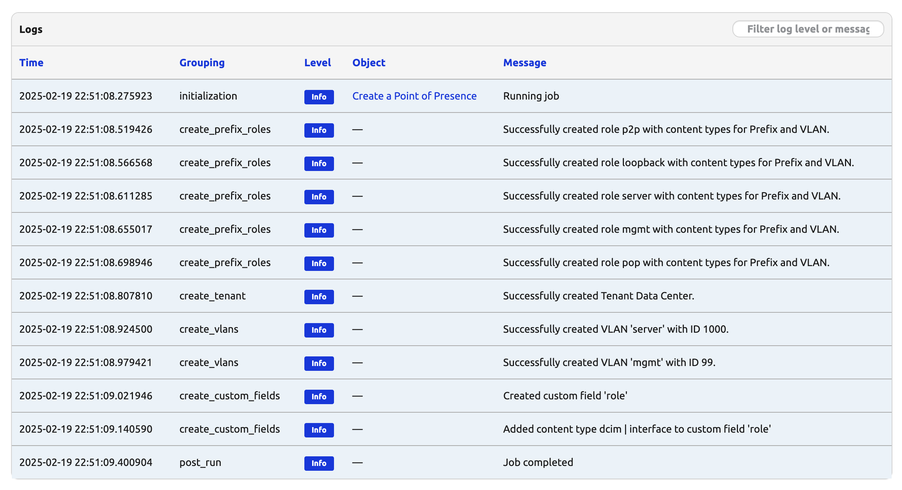

# Design Future Sites (Part 1)

Congratulations on completing 33 days of Nautobot Job! We now have all the tools we need to tackle bigger jobs. Today marks the first of a 6-day series for what would be an iterative process of putting together a job to design a future site. 

Are you ready to get started? Let's begin be setting up the environment. 

## Environment Setup

The environment setup will be the same as [Lab Setup Scenario 1](../Lab_Setup/scenario_1_setup/README.md), below is a summary of the steps, please consult the guide for a detailed background if needed.

> [!TIP]
> If you have stopped the Codespace environment and restart again but found the Docker daemon stopped working, please follow the steps in the setup guide to rebuild the environment.

We will follow the same steps to start Nautobot:

```
$ cd nautobot-docker-compose/
$ poetry shell
$ invoke build
$ invoke db-import
$ invoke debug
```
## Design Future Sites Part 1 Code

Let's create a file for today's challenge. We can either do this via the shared directory or directly in the Nautobot docker container:

```shell
$ docker exec -u root -it nautobot_docker_compose-nautobot-1 bash
root@c9e0fa2a45a0:/opt/nautobot# cd jobs
root@c9e0fa2a45a0:/opt/nautobot/jobs# pwd
/opt/nautobot/jobs
root@c9e0fa2a45a0:/opt/nautobot/jobs# touch create_site_job.py
root@c9e0fa2a45a0:/opt/nautobot/jobs# chown nautobot:nautobot create_site_job.py
```

The environment is now setup for today's challenge.

## Walkthrough

This challenge spans multiple exercises and covers Days 34 through 39. Each day, we’ll build upon the previous day's code, expanding our automation step by step.

Today, we will begin by creating the necessary prerequisites that will be required to create a new site with all of its racks and devices.

As we have seen in previous lessons, some objects in Nautobot have dependencies that must be created before you can create the object. For example, if you want to add a ROLE to a prefix when you create it, the ROLE must first exist in Nautobot.

To fully setup the environment for this project, we will be creating Roles for prefixes, a new Tenant, VLANs, and DeviceTypes. We'll save DeviceType for Day 35. For today, this is the data we will need to for our creation methods.

```python
PREFIX_ROLES = ["p2p", "loopback", "server", "mgmt", "pop"]
TENANT_NAME = "Data Center"
VLAN_INFO = {
    "server": 1000,
    "mgmt": 99,
}
CUSTOM_FIELDS = {
    "role": {"models": [Interface], "label": "Role"},
}
# Retrieve the content type for Prefix and VLAN models.
prefix_ct = ContentType.objects.get_for_model(Prefix)
vlan_ct = ContentType.objects.get_for_model(VLAN)

```

Lets break down each section of this data. The first constant is a list of ROLES that will be created in Nautobot. We will need the `p2p`, `loopback`, `server`, `mgmt`, and `pop` roles so they can be added to objects we create, like VLANS, PREFIXES, and IP ADDRESSES.

The next constant is TENANT_NAME which will be used to specify the name of the TENANT we will use to put objects of the POP site into.

VLAN_INFO is a key, value dictionary specifying the name and ID of the Vlans we will be creating for use in the Site.

Lastly, the content type for Prefix and VLAN will allow us to interact with the created objects later.

## Create Prefix Roles

The first method we will be working  is for creating the Roles based on the strings contained in PREFIX_ROLES. Take note of the ContentType import and the ContentType sections of code in the create_prefix_roles method. We are making sure that we can apply these roles to PREFIX and VLAN objects later when we are building the site.

```python
"""Job to create a new site of type POP with optional parent site support."""
from django.contrib.contenttypes.models import ContentType

from nautobot.apps.jobs import Job, register_jobs
from nautobot.extras.models.roles import Role
from nautobot.ipam.models import Prefix, VLAN

name = "Data Population Jobs Collection"

PREFIX_ROLES = ["p2p", "loopback", "server", "mgmt", "pop"]

def create_prefix_roles(logger):
    """Create all Prefix Roles defined in PREFIX_ROLES and add content types for IPAM Prefix and VLAN."""

    for role in PREFIX_ROLES:
        role_obj, created = Role.objects.get_or_create(name=role)
        # Add the Prefix and VLAN content types to the role.
        role_obj.content_types.add(prefix_ct, vlan_ct)
        role_obj.validated_save()
        logger.info(f"Successfully created role {role} with content types for Prefix and VLAN.")

class CreatePop(Job):
    """Job to create a new site of type POP."""

    class Meta:
        """Metadata for CreatePop."""

        name = "Create a Point of Presence"
        description = """
        Create a new Site of Type POP.
        A new /16 will automatically be allocated from the 'POP Global Pool' Prefix.
        """

    def run(self):
        """Main function to create a site."""
        # ----------------------------------------------------------------------------
        # Initialize the database with all required objects.
        # We will build on this in the coming days.
        # ----------------------------------------------------------------------------
        create_prefix_roles(self.logger)

register_jobs(CreatePop)

```

Feel free to run this code as we add to it or wait until the end. We are using `get_or_create` method throughout so we will not get any errors if the object has already been created.

Next, we will add in the add Tenant portion.

The create_tenant method is pretty simple and just takes the constant string of `Data Center` that is defined in TENANT_NAME. This creates a tenant object with that name that we can use later in the coming days of the exercise.


```python
"""Job to create a new site of type POP with optional parent site support."""
from django.contrib.contenttypes.models import ContentType

from nautobot.apps.jobs import Job, register_jobs
from nautobot.extras.models.roles import Role
from nautobot.ipam.models import Prefix, VLAN
from nautobot.tenancy.models import Tenant

name = "Data Population Jobs Collection"

PREFIX_ROLES = ["p2p", "loopback", "server", "mgmt", "pop"]
TENANT_NAME = "Data Center"

def create_prefix_roles(logger):
    """Create all Prefix Roles defined in PREFIX_ROLES and add content types for IPAM Prefix and VLAN."""

    # Retrieve the content type for Prefix and VLAN models.
    prefix_ct = ContentType.objects.get_for_model(Prefix)
    vlan_ct = ContentType.objects.get_for_model(VLAN)

    for role in PREFIX_ROLES:
        role_obj, created = Role.objects.get_or_create(name=role)
        # Add the Prefix and VLAN content types to the role.
        role_obj.content_types.add(prefix_ct, vlan_ct)
        role_obj.validated_save()
        logger.info(f"Successfully created role {role} with content types for Prefix and VLAN.")

def create_tenant(logger):
    """Create a tenant with the name defined in TENANT_NAME."""
    tenant_obj, _ = Tenant.objects.get_or_create(name=TENANT_NAME)
    tenant_obj.validated_save()
    logger.info(f"Successfully created Tenant {TENANT_NAME}.")

class CreatePop(Job):
    """Job to create a new site of type POP."""

    class Meta:
        """Metadata for CreatePop."""

        name = "Create a Point of Presence"
        description = """
        Create a new Site of Type POP.
        A new /16 will automatically be allocated from the 'POP Global Pool' Prefix.
        """

    def run(self):
        """Main function to create a site."""
        # ----------------------------------------------------------------------------
        # Initialize the database with all required objects.
        # We will build on this in the coming days.
        # ----------------------------------------------------------------------------
        create_prefix_roles(self.logger)
        create_tenant(self.logger)

register_jobs(CreatePop)
```

Next, we will create the VLANs and assign the appropriate roles to each VLAN.

We are also adding a new constant called ACTIVE_STATUS, which is just getting the Nautobot Extras Active Status that we can use to assign the status attribute as we build out the site. We will need this status for our vlans in the create_vlans method.

You will also notice that we are getting the appropriate role name for each of the VLANs in this section.

```python

ACTIVE_STATUS = Status.objects.get(name="Active")
...
role_obj = Role.objects.get(name=vlan_name)

```

If we find a role that matches the name of the VLAN, we assign that role to the VLAN. Otherwise, we create it without a role assignment.

This ensures that when we create the VLAN, we are able to add the role we created earlier.

```python

def create_vlans(logger):
    """Create predefined VLANs defined in VLAN_INFO, and assign the appropriate role."""

    for vlan_name, vlan_id in VLAN_INFO.items():
        # Retrieve the appropriate role based on the VLAN name.
        try:
            role_obj = Role.objects.get(name=vlan_name)
        except Role.DoesNotExist:
            logger.error(f"Role '{vlan_name}' not found. VLAN will be created without a role.")
            role_obj = None

        defaults = {"name": vlan_name, "status": ACTIVE_STATUS}
        if role_obj:
            defaults["role"] = role_obj

        vlan_obj, created = VLAN.objects.get_or_create(
            vid=vlan_id,
            defaults=defaults,
        )
        if created:
            vlan_obj.validated_save()
            logger.info(f"Successfully created VLAN '{vlan_name}' with ID {vlan_id}.")
        else:
            logger.info(f"VLAN '{vlan_name}' with ID {vlan_id} already exists.")
```

Finally, we will create the custom fields that will be used to assign the roles to the interfaces. This is an important step for the coming days as we create connections and cabling between interaces between interfaces. Notice that we have to add two more import statements to make custom field method work.

```python

from nautobot.dcim.models.device_components import Interface
from nautobot.extras.models.customfields import CustomField

...
def create_custom_fields(logger):
    """Create all relationships defined in CUSTOM_FIELDS."""
    for cf_name, field in CUSTOM_FIELDS.items():
        try:
            cf = CustomField.objects.get(key=cf_name)
        except CustomField.DoesNotExist:
            cf = CustomField.objects.create(key=cf_name)
            if "label" in field:
                cf.label = field.get("label")
            cf.validated_save()
            logger.info(f"Created custom field '{cf_name}'")
        for model in field["models"]:
            ct = ContentType.objects.get_for_model(model)
            cf.content_types.add(ct)
            cf.validated_save()
            logger.info(f"Added content type {ct} to custom field '{cf_name}'")

```

## Final Code

```python

"""Job to create a new site of type POP."""

from django.contrib.contenttypes.models import ContentType


from nautobot.apps.jobs import Job, register_jobs
from nautobot.extras.models.roles import Role
from nautobot.ipam.models import Prefix, VLAN
from nautobot.tenancy.models import Tenant
from nautobot.extras.models import Status
from nautobot.dcim.models.device_components import Interface
from nautobot.extras.models.customfields import CustomField

name = "Data Population Jobs Collection"


PREFIX_ROLES = ["p2p", "loopback", "server", "mgmt", "pop"]
POP_PREFIX_SIZE = 16
TENANT_NAME = "Data Center"
ACTIVE_STATUS = Status.objects.get(name="Active")
# VLAN definitions: key is also used to look up the role.
VLAN_INFO = {
    "server": 1000,
    "mgmt": 99,
}
CUSTOM_FIELDS = {
    "role": {"models": [Interface], "label": "Role"},
}
# Retrieve the content type for Prefix and VLAN models.
prefix_ct = ContentType.objects.get_for_model(Prefix)
vlan_ct = ContentType.objects.get_for_model(VLAN)

def create_prefix_roles(logger):
    """Create all Prefix Roles defined in PREFIX_ROLES and add content types for IPAM Prefix and VLAN."""    

    for role in PREFIX_ROLES:
        role_obj, created = Role.objects.get_or_create(name=role)
        # Add the Prefix and VLAN content types to the role.
        role_obj.content_types.add(prefix_ct, vlan_ct)
        role_obj.validated_save()
        logger.info(f"Successfully created role {role} with content types for Prefix and VLAN.")


def create_tenant(logger):
    """Create a tenant with the name defined in TENANT_NAME."""
    tenant_obj, _ = Tenant.objects.get_or_create(name=TENANT_NAME)
    tenant_obj.validated_save()
    logger.info(f"Successfully created Tenant {TENANT_NAME}.")


def create_vlans(logger):
    """Create predefined VLANs defined in VLAN_INFO, and assign the appropriate role."""
    # Get the active status from the database.

    for vlan_name, vlan_id in VLAN_INFO.items():
        # Retrieve the appropriate role based on the VLAN name.
        try:
            role_obj = Role.objects.get(name=vlan_name)
        except Role.DoesNotExist:
            logger.error(f"Role '{vlan_name}' not found. VLAN will be created without a role.")
            role_obj = None

        defaults = {"name": vlan_name, "status": ACTIVE_STATUS}
        if role_obj:
            defaults["role"] = role_obj

        vlan_obj, created = VLAN.objects.get_or_create(
            vid=vlan_id,
            defaults=defaults,
        )
        if created:
            vlan_obj.validated_save()
            logger.info(f"Successfully created VLAN '{vlan_name}' with ID {vlan_id}.")
        else:
            logger.info(f"VLAN '{vlan_name}' with ID {vlan_id} already exists.")

def create_custom_fields(logger):
    """Create all relationships defined in CUSTOM_FIELDS."""
    for cf_name, field in CUSTOM_FIELDS.items():
        try:
            cf = CustomField.objects.get(key=cf_name)
        except CustomField.DoesNotExist:
            cf = CustomField.objects.create(key=cf_name)
            if "label" in field:
                cf.label = field.get("label")
            cf.validated_save()
            logger.info(f"Created custom field '{cf_name}'")
        for model in field["models"]:
            ct = ContentType.objects.get_for_model(model)
            cf.content_types.add(ct)
            cf.validated_save()
            logger.info(f"Added content type {ct} to custom field '{cf_name}'")

class CreatePop(Job):
    """Job to create a new site of type POP."""

    class Meta:
        """Metadata for CreatePop."""

        name = "Create a Point of Presence"
        description = """
        Create a new Site of Type POP.
        A new /16 will automatically be allocated from the 'POP Global Pool' Prefix.
        """

    def run(self):
        """Main function to create a site."""
        # ----------------------------------------------------------------------------
        # Initialize the database with all required objects.
        # We will build on this in the coming days.
        # ----------------------------------------------------------------------------
        create_prefix_roles(self.logger)
        create_tenant(self.logger)
        create_vlans(self.logger)
        create_custom_fields(self.logger)


register_jobs(CreatePop)

```

> [!TIP]
> Don't forget to run `invoke post-upgrade` to register the job. 

Once the job is enabled, we can run the job to see the results: 



We will continue with the prerequisites tomorrow by adding DeviceType configuration to the job.

## Day 34 To Do

Remember to stop the codespace instance on [https://github.com/codespaces/](https://github.com/codespaces/).

Go ahead and post a screenshot of the successful execution of the newly created job on a social media of your choice, make sure you use the tag `#100DaysOfNautobot` `#JobsToBeDone` and tag `@networktocode`, so we can share your progress!

In tomorrow's challenge, we will enhance our Site creation Job by adding DeviceType creation. See you tomorrow!

[X/Twitter](<https://twitter.com/intent/tweet?url=https://github.com/networktocode/100-days-of-nautobot-challenge&text=I+jst+completed+Day+34+of+the+100+days+of+nautobot+challenge+!&hashtags=100DaysOfNautobot,JobsToBeDone>)

[LinkedIn](https://www.linkedin.com/) (Copy & Paste: I just completed Day 34 of 100 Days of Nautobot, https://github.com/networktocode/100-days-of-nautobot-challenge, challenge! @networktocode #JobsToBeDone #100DaysOfNautobot)
