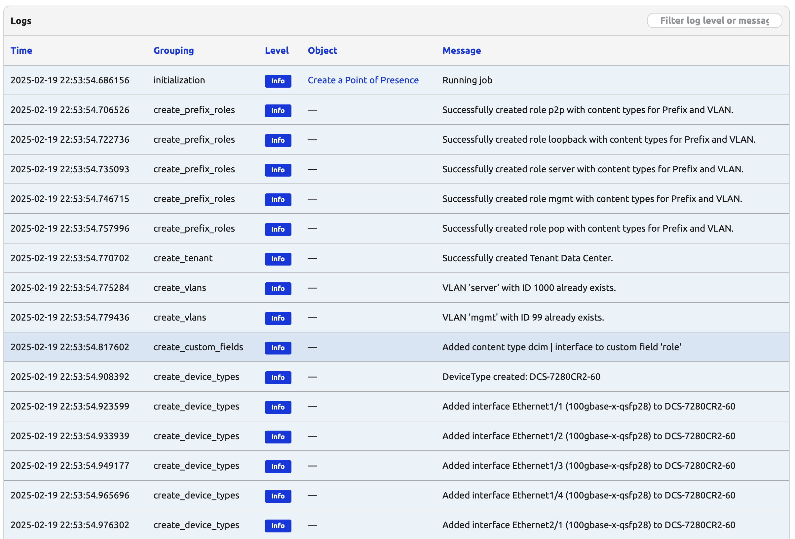

# Design Future Sites (Part 2)

Today marks the second day of the 6-day series of a job that will help us design a future site. 

## Design Future Sites Part 2 Code

If you had to create a new codespace instance make sure you recreate the file from the previous challenge.

```shell
$ docker exec -u root -it nautobot_docker_compose-nautobot-1 bash
root@c9e0fa2a45a0:/opt/nautobot# cd jobs
root@c9e0fa2a45a0:/opt/nautobot/jobs# pwd
/opt/nautobot/jobs
root@c9e0fa2a45a0:/opt/nautobot/jobs# touch create_site_job.py
root@c9e0fa2a45a0:/opt/nautobot/jobs# chown nautobot:nautobot create_site_job.py
```

Here is the Job code from where we left off yesterday.

```python
"""Job to create a new site of type POP."""

from django.contrib.contenttypes.models import ContentType


from nautobot.apps.jobs import Job, register_jobs
from nautobot.extras.models.roles import Role
from nautobot.ipam.models import Prefix, VLAN
from nautobot.tenancy.models import Tenant
from nautobot.extras.models import Status
from nautobot.dcim.models.device_components import Interface
from nautobot.extras.models.customfields import CustomField

name = "Data Population Jobs Collection"


PREFIX_ROLES = ["p2p", "loopback", "server", "mgmt", "pop"]
POP_PREFIX_SIZE = 16
TENANT_NAME = "Data Center"
ACTIVE_STATUS = Status.objects.get(name="Active")
# VLAN definitions: key is also used to look up the role.
VLAN_INFO = {
    "server": 1000,
    "mgmt": 99,
}
CUSTOM_FIELDS = {
    "role": {"models": [Interface], "label": "Role"},
}
# Retrieve the content type for Prefix and VLAN models.
prefix_ct = ContentType.objects.get_for_model(Prefix)
vlan_ct = ContentType.objects.get_for_model(VLAN)

def create_prefix_roles(logger):
    """Create all Prefix Roles defined in PREFIX_ROLES and add content types for IPAM Prefix and VLAN."""    

    for role in PREFIX_ROLES:
        role_obj, created = Role.objects.get_or_create(name=role)
        # Add the Prefix and VLAN content types to the role.
        role_obj.content_types.add(prefix_ct, vlan_ct)
        role_obj.validated_save()
        logger.info(f"Successfully created role {role} with content types for Prefix and VLAN.")


def create_tenant(logger):
    """Create a tenant with the name defined in TENANT_NAME."""
    tenant_obj, _ = Tenant.objects.get_or_create(name=TENANT_NAME)
    tenant_obj.validated_save()
    logger.info(f"Successfully created Tenant {TENANT_NAME}.")


def create_vlans(logger):
    """Create predefined VLANs defined in VLAN_INFO, and assign the appropriate role."""
    # Get the active status from the database.

    for vlan_name, vlan_id in VLAN_INFO.items():
        # Retrieve the appropriate role based on the VLAN name.
        try:
            role_obj = Role.objects.get(name=vlan_name)
        except Role.DoesNotExist:
            logger.error(f"Role '{vlan_name}' not found. VLAN will be created without a role.")
            role_obj = None

        defaults = {"name": vlan_name, "status": ACTIVE_STATUS}
        if role_obj:
            defaults["role"] = role_obj

        vlan_obj, created = VLAN.objects.get_or_create(
            vid=vlan_id,
            defaults=defaults,
        )
        if created:
            vlan_obj.validated_save()
            logger.info(f"Successfully created VLAN '{vlan_name}' with ID {vlan_id}.")
        else:
            logger.info(f"VLAN '{vlan_name}' with ID {vlan_id} already exists.")

def create_custom_fields(logger):
    """Create all relationships defined in CUSTOM_FIELDS."""
    for cf_name, field in CUSTOM_FIELDS.items():
        try:
            cf = CustomField.objects.get(key=cf_name)
        except CustomField.DoesNotExist:
            cf = CustomField.objects.create(key=cf_name)
            if "label" in field:
                cf.label = field.get("label")
            cf.validated_save()
            logger.info(f"Created custom field '{cf_name}'")
        for model in field["models"]:
            ct = ContentType.objects.get_for_model(model)
            cf.content_types.add(ct)
            cf.validated_save()
            logger.info(f"Added content type {ct} to custom field '{cf_name}'")

class CreatePop(Job):
    """Job to create a new site of type POP."""

    class Meta:
        """Metadata for CreatePop."""

        name = "Create a Point of Presence"
        description = """
        Create a new Site of Type POP.
        A new /16 will automatically be allocated from the 'POP Global Pool' Prefix.
        """

    def run(self):
        """Main function to create a site."""
        # ----------------------------------------------------------------------------
        # Initialize the database with all required objects.
        # We will build on this in the coming days.
        # ----------------------------------------------------------------------------
        create_prefix_roles(self.logger)
        create_tenant(self.logger)
        create_vlans(self.logger)
        create_custom_fields(self.logger)


register_jobs(CreatePop)

```

## Walkthrough

We will start our modification to the existing code by adding the necessary import statements.

```python

from itertools import product
import re
import yaml
from nautobot.dcim.models import DeviceType, Manufacturer
from nautobot.dcim.models.device_component_templates import InterfaceTemplate

```

As we stated yesterday, today will be all about DeviceTypes. Here is the data we will be using, which will be defined as the constant DEVICE_TYPES_YAML.

The YAML content for these device types was retrieved from the community [Nautobot Device Type library](https://github.com/nautobot/devicetype-library). There are many device types there and you should check it out to see all of the ones that are available.

```python

DEVICE_TYPES_YAML = [
    # First device type
    """
    manufacturer: Arista
    model: DCS-7280CR2-60
    part_number: DCS-7280CR2-60
    u_height: 1
    is_full_depth: false
    comments: '[Arista 7280R Data Sheet](https://www.arista.com/assets/data/pdf/Datasheets/7280R-DataSheet.pdf)'
    console-ports:
        - name: Console
        type: rj-45
    module-bays:
        - name: PSU 1
        position: '0'
        - name: PSU 2
        position: '1'
    interfaces:
        - name: Management1
        type: 1000base-t
        mgmt_only: true
        - name: Ethernet1/1
        type: 100gbase-x-qsfp28
        - name: Ethernet2/1
        type: 100gbase-x-qsfp28
        # QSFP28(100G) ports can be broken into 4x25 with a model of [1-60]/[1-4]
    """,
    # Second device type with corrected indentation.
    """
    manufacturer: Arista
    model: DCS-7150S-24-CL-F
    part_number: DCS-7150S-24-CL-F
    u_height: 1
    is_full_depth: false
    comments: '[Arista 7150 Data Sheet](https://www.arista.com/assets/data/pdf/Datasheets/7150S_Datasheet.pdf)'
    console-ports:
        - name: Console
        type: rj-45
    module-bays:
        - name: PS1
        position: '0'
        - name: PS2
        position: '1'
    interfaces:
        - name: Management1
        type: 1000base-t
        mgmt_only: true
        - name: Ethernet1
        type: 10gbase-x-sfpp
        # 10gbase-x-sfpp ports can be broken into [1-24]
    """,
]

```

> [!NOTE]
We are adding interfaces to the device types which uses the InterfaceTemplate model from device_component_templates and we needed a helper function called `expand_interface_pattern` to use the short interface naming convention of `- pattern: "Ethernet[1-60]/[1-4]"`

The method below shows how we are using regex here to match the interface patterns so we can match a pattern and generate a large number of interfaces without having to specify each one in the device type yaml.

```python

def expand_interface_pattern(pattern):
    """
    Expands an interface pattern like 'Ethernet[1-60]/[1-4]' into actual names.
    
    Supports:
      - Single range: Ethernet[1-24] -> Ethernet1, Ethernet2, ..., Ethernet24
      - Nested range: Ethernet[1-60]/[1-4] -> Ethernet1/1, Ethernet1/2, ..., Ethernet60/4
    """
    match = re.findall(r"\[([0-9]+)-([0-9]+)\]", pattern)
    if not match:
        return [pattern]  # No expansion needed, return as-is.

    # Convert to lists of numbers
    try:
        ranges = [list(range(int(start), int(end) + 1)) for start, end in match]
    except ValueError:
        raise ValueError(f"Invalid range in pattern: {pattern}")

    # Generate base name with placeholders
    base_name = re.sub(r"\[[0-9]+-[0-9]+\]", "{}", pattern, count=len(ranges))

    # Expand using cartesian product
    return [base_name.format(*nums) for nums in product(*ranges)]

```

The other new method we added is ```create_device_types```, which also calls on the ```expand_interface_pattern``` method.

```python

def create_device_types(logger):
    """
    Create DeviceType objects from YAML definitions and add interfaces using InterfaceTemplate.
    """

    for device_yaml in DEVICE_TYPES_YAML:
        data = yaml.safe_load(device_yaml)

        manufacturer_name = data.pop("manufacturer", None)
        if not manufacturer_name:
            logger.error("Manufacturer not provided in YAML definition.")
            continue
        manufacturer_obj, _ = Manufacturer.objects.get_or_create(name=manufacturer_name)

        model_name = data.pop("model", None)
        if not model_name:
            logger.error("Model not provided in YAML for manufacturer %s", manufacturer_name)
            continue

        # Create DeviceType
        device_type_defaults = {
            k: data[k] for k in ["part_number", "u_height", "is_full_depth", "comments"] if k in data
        }
        device_type_obj, created = DeviceType.objects.get_or_create(
            manufacturer=manufacturer_obj,
            model=model_name,
            defaults=device_type_defaults,
        )

        if created:
            device_type_obj.validated_save()
            logger.info(f"DeviceType created: {device_type_obj}")
        else:
            logger.info(f"DeviceType already exists: {device_type_obj}")

        # Add interfaces using InterfaceTemplate
        for iface in data.get("interfaces", []):
            pattern = iface.get("pattern")
            iface_type = iface.get("type")
            mgmt_only = iface.get("mgmt_only", False)

            if not pattern or not iface_type:
                logger.error(f"Invalid interface definition in {model_name}: {iface}")
                continue

            # Generate interfaces from range patterns
            interface_names = expand_interface_pattern(pattern)
            for iface_name in interface_names:
                interface_template, created = InterfaceTemplate.objects.get_or_create(
                    device_type=device_type_obj,
                    name=iface_name,
                    defaults={
                        "type": iface_type,
                        "mgmt_only": mgmt_only,
                    },
                )
                if created:
                    logger.info(f"Added interface {iface_name} ({iface_type}) to {model_name}")
```

This method is responsible for creating the device type and then adds interfaces using the Nautobot InterfaceTemplate class so that any device created from the device types will be created with the interfaces we specify for the device type.

The first part of the method reads the yaml data that we specified in DEVICE_TYPES_YAML. We then check to see if the Manufacturer is already present in Nautobot, and if not, we create it. Manufacturer is a required field for a Device Type and it must be present in the database before the Device Type can be created.

```python

    for device_yaml in DEVICE_TYPES_YAML:
        data = yaml.safe_load(device_yaml)

        manufacturer_name = data.pop("manufacturer", None)
        if not manufacturer_name:
            logger.error("Manufacturer not provided in YAML definition.")
            continue
        manufacturer_obj, _ = Manufacturer.objects.get_or_create(name=manufacturer_name)

```

Next, we store all of the data from the yaml file in either defaults except for the manufacturer and model before we try to create the new device type. If the device type already exists we skip in and move on.

```python

        model_name = data.pop("model", None)
        if not model_name:
            logger.error("Model not provided in YAML for manufacturer %s", manufacturer_name)
            continue

        # Create DeviceType
        device_type_defaults = {
            k: data[k] for k in ["part_number", "u_height", "is_full_depth", "comments"] if k in data
        }
        device_type_obj, created = DeviceType.objects.get_or_create(
            manufacturer=manufacturer_obj,
            model=model_name,
            defaults=device_type_defaults,
        )

        if created:
            device_type_obj.validated_save()
            logger.info(f"DeviceType created: {device_type_obj}")
        else:
            logger.info(f"DeviceType already exists: {device_type_obj}")
```

Finally, we create the interfaces either directly or if we are using a pattern as described above we use the `expand_interface_pattern` method.

```python
        for iface in data.get("interfaces", []):
            pattern = iface.get("pattern")
            iface_type = iface.get("type")
            mgmt_only = iface.get("mgmt_only", False)

            if not pattern or not iface_type:
                logger.error(f"Invalid interface definition in {model_name}: {iface}")
                continue

            # Generate interfaces from range patterns
            interface_names = expand_interface_pattern(pattern)
            for iface_name in interface_names:
                interface_template, created = InterfaceTemplate.objects.get_or_create(
                    device_type=device_type_obj,
                    name=iface_name,
                    defaults={
                        "type": iface_type,
                        "mgmt_only": mgmt_only,
                    },
                )
                if created:
                    logger.info(f"Added interface {iface_name} ({iface_type}) to {model_name}")
```

Below is the finished product for the first two days. We are not ready the Site portion of the exercise.

## Final Code

```python


"""Job to create a new site of type POP."""

from django.contrib.contenttypes.models import ContentType

from nautobot.apps.jobs import Job, register_jobs
from nautobot.dcim.models import DeviceType, Manufacturer
from nautobot.dcim.models.device_component_templates import InterfaceTemplate
from nautobot.extras.models import Status
from nautobot.extras.models.roles import Role
from nautobot.ipam.models import Prefix, VLAN
from nautobot.tenancy.models import Tenant
from nautobot.dcim.models.device_components import Interface
from nautobot.extras.models.customfields import CustomField

####DAY35####
from itertools import product
import re
import yaml
from nautobot.dcim.models import DeviceType, Manufacturer
from nautobot.dcim.models.device_component_templates import InterfaceTemplate

name = "Data Population Jobs Collection"


PREFIX_ROLES = ["p2p", "loopback", "server", "mgmt", "pop"]
POP_PREFIX_SIZE = 16
TENANT_NAME = "Data Center"
ACTIVE_STATUS = Status.objects.get(name="Active")
# VLAN definitions: key is also used to look up the role.
VLAN_INFO = {
    "server": 1000,
    "mgmt": 99,
}
CUSTOM_FIELDS = {
    "role": {"models": [Interface], "label": "Role"},
}
# Retrieve the content type for Prefix and VLAN models.
prefix_ct = ContentType.objects.get_for_model(Prefix)
vlan_ct = ContentType.objects.get_for_model(VLAN)

####DAY35####
DEVICE_TYPES_YAML = [
    """
    manufacturer: Arista
    model: DCS-7280CR2-60
    part_number: DCS-7280CR2-60
    u_height: 1
    is_full_depth: false
    comments: '[Arista 7280R Data Sheet](https://www.arista.com/assets/data/pdf/Datasheets/7280R-DataSheet.pdf)'
    interfaces:
        - pattern: "Ethernet[1-60]/[1-4]"
          type: 100gbase-x-qsfp28
        - pattern: "Management1"
          type: 1000base-t
          mgmt_only: true
    """,
    """
    manufacturer: Arista
    model: DCS-7150S-24
    part_number: DCS-7150S-24
    u_height: 1
    is_full_depth: false
    comments: '[Arista 7150 Data Sheet](https://www.arista.com/assets/data/pdf/Datasheets/7150S_Datasheet.pdf)'
    interfaces:
        - pattern: "Ethernet[1-24]"
          type: 10gbase-x-sfpp
        - pattern: "Management1"
          type: 1000base-t
          mgmt_only: true
    """,
]


def create_prefix_roles(logger):
    """Create all Prefix Roles defined in PREFIX_ROLES and add content types for IPAM Prefix and VLAN."""    

    for role in PREFIX_ROLES:
        role_obj, created = Role.objects.get_or_create(name=role)
        # Add the Prefix and VLAN content types to the role.
        role_obj.content_types.add(prefix_ct, vlan_ct)
        role_obj.validated_save()
        logger.info(f"Successfully created role {role} with content types for Prefix and VLAN.")


def create_tenant(logger):
    """Create a tenant with the name defined in TENANT_NAME."""
    tenant_obj, _ = Tenant.objects.get_or_create(name=TENANT_NAME)
    tenant_obj.validated_save()
    logger.info(f"Successfully created Tenant {TENANT_NAME}.")


def create_vlans(logger):
    """Create predefined VLANs defined in VLAN_INFO, and assign the appropriate role."""
    # Get the active status from the database.

    for vlan_name, vlan_id in VLAN_INFO.items():
        # Retrieve the appropriate role based on the VLAN name.
        try:
            role_obj = Role.objects.get(name=vlan_name)
        except Role.DoesNotExist:
            logger.error(f"Role '{vlan_name}' not found. VLAN will be created without a role.")
            role_obj = None

        defaults = {"name": vlan_name, "status": ACTIVE_STATUS}
        if role_obj:
            defaults["role"] = role_obj

        vlan_obj, created = VLAN.objects.get_or_create(
            vid=vlan_id,
            defaults=defaults,
        )
        if created:
            vlan_obj.validated_save()
            logger.info(f"Successfully created VLAN '{vlan_name}' with ID {vlan_id}.")
        else:
            logger.info(f"VLAN '{vlan_name}' with ID {vlan_id} already exists.")

def create_custom_fields(logger):
    """Create all relationships defined in CUSTOM_FIELDS."""
    for cf_name, field in CUSTOM_FIELDS.items():
        try:
            cf = CustomField.objects.get(key=cf_name)
        except CustomField.DoesNotExist:
            cf = CustomField.objects.create(key=cf_name)
            if "label" in field:
                cf.label = field.get("label")
            cf.validated_save()
            logger.info(f"Created custom field '{cf_name}'")
        for model in field["models"]:
            ct = ContentType.objects.get_for_model(model)
            cf.content_types.add(ct)
            cf.validated_save()
            logger.info(f"Added content type {ct} to custom field '{cf_name}'")

####DAY35####
def create_device_types(logger):
    """
    Create DeviceType objects from YAML definitions and add interfaces using InterfaceTemplate.
    """

    for device_yaml in DEVICE_TYPES_YAML:
        data = yaml.safe_load(device_yaml)

        manufacturer_name = data.pop("manufacturer", None)
        if not manufacturer_name:
            logger.error("Manufacturer not provided in YAML definition.")
            continue
        manufacturer_obj, _ = Manufacturer.objects.get_or_create(name=manufacturer_name)

        model_name = data.pop("model", None)
        if not model_name:
            logger.error("Model not provided in YAML for manufacturer %s", manufacturer_name)
            continue

        # Create DeviceType
        device_type_defaults = {
            k: data[k] for k in ["part_number", "u_height", "is_full_depth", "comments"] if k in data
        }
        device_type_obj, created = DeviceType.objects.get_or_create(
            manufacturer=manufacturer_obj,
            model=model_name,
            defaults=device_type_defaults,
        )

        if created:
            device_type_obj.validated_save()
            logger.info(f"DeviceType created: {device_type_obj}")
        else:
            logger.info(f"DeviceType already exists: {device_type_obj}")

        # Add interfaces using InterfaceTemplate
        for iface in data.get("interfaces", []):
            pattern = iface.get("pattern")
            iface_type = iface.get("type")
            mgmt_only = iface.get("mgmt_only", False)

            if not pattern or not iface_type:
                logger.error(f"Invalid interface definition in {model_name}: {iface}")
                continue

            # Generate interfaces from range patterns
            interface_names = expand_interface_pattern(pattern)
            for iface_name in interface_names:
                interface_template, created = InterfaceTemplate.objects.get_or_create(
                    device_type=device_type_obj,
                    name=iface_name,
                    defaults={
                        "type": iface_type,
                        "mgmt_only": mgmt_only,
                    },
                )
                if created:
                    logger.info(f"Added interface {iface_name} ({iface_type}) to {model_name}")

def expand_interface_pattern(pattern):
    """
    Expands an interface pattern like 'Ethernet[1-60]/[1-4]' into actual names.
    
    Supports:
      - Single range: Ethernet[1-24] -> Ethernet1, Ethernet2, ..., Ethernet24
      - Nested range: Ethernet[1-60]/[1-4] -> Ethernet1/1, Ethernet1/2, ..., Ethernet60/4
    """
    match = re.findall(r"\[([0-9]+)-([0-9]+)\]", pattern)
    if not match:
        return [pattern]  # No expansion needed, return as-is.

    # Convert to lists of numbers
    try:
        ranges = [list(range(int(start), int(end) + 1)) for start, end in match]
    except ValueError:
        raise ValueError(f"Invalid range in pattern: {pattern}")

    # Generate base name with placeholders
    base_name = re.sub(r"\[[0-9]+-[0-9]+\]", "{}", pattern, count=len(ranges))

    # Expand using cartesian product
    return [base_name.format(*nums) for nums in product(*ranges)]

class CreatePop(Job):
    """Job to create a new site of type POP."""

    class Meta:
        """Metadata for CreatePop."""

        name = "Create a Point of Presence"
        description = """
        Create a new Site of Type POP.
        A new /16 will automatically be allocated from the 'POP Global Pool' Prefix.
        """

    def run(self):
        """Main function to create a site."""
        # ----------------------------------------------------------------------------
        # Initialize the database with all required objects.
        # We will build on this in the coming days.
        # ----------------------------------------------------------------------------
        create_prefix_roles(self.logger)
        create_tenant(self.logger)
        create_vlans(self.logger)
        create_custom_fields(self.logger)
        ####DAY35####
        create_device_types(self.logger)


register_jobs(CreatePop)


```

Here is the Job output from the newly updated code: 




## Day 35 To Do

Remember to stop the codespace instance on [https://github.com/codespaces/](https://github.com/codespaces/).

Go ahead and post a screenshot of the successful execution of the job on a social media of your choice, make sure you use the tag `#100DaysOfNautobot` `#JobsToBeDone` and tag `@networktocode`, so we can share your progress!

In tomorrow's challenge, we will enhance our Site creation Job by adding Site and Prefix creation. See you tomorrow!

[X/Twitter](<https://twitter.com/intent/tweet?url=https://github.com/networktocode/100-days-of-nautobot-challenge&text=I+jst+completed+Day+35+of+the+100+days+of+nautobot+challenge+!&hashtags=100DaysOfNautobot,JobsToBeDone>)

[LinkedIn](https://www.linkedin.com/) (Copy & Paste: I just completed Day 35 of 100 Days of Nautobot, https://github.com/networktocode/100-days-of-nautobot-challenge, challenge! @networktocode #JobsToBeDone #100DaysOfNautobot)


