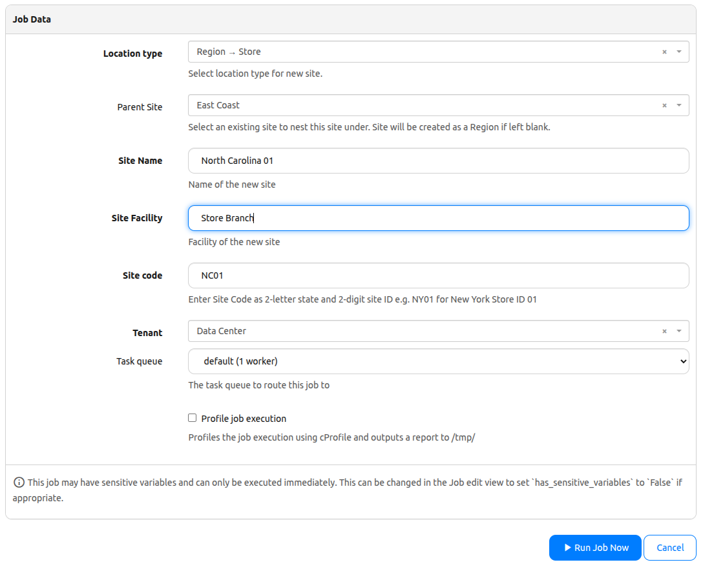
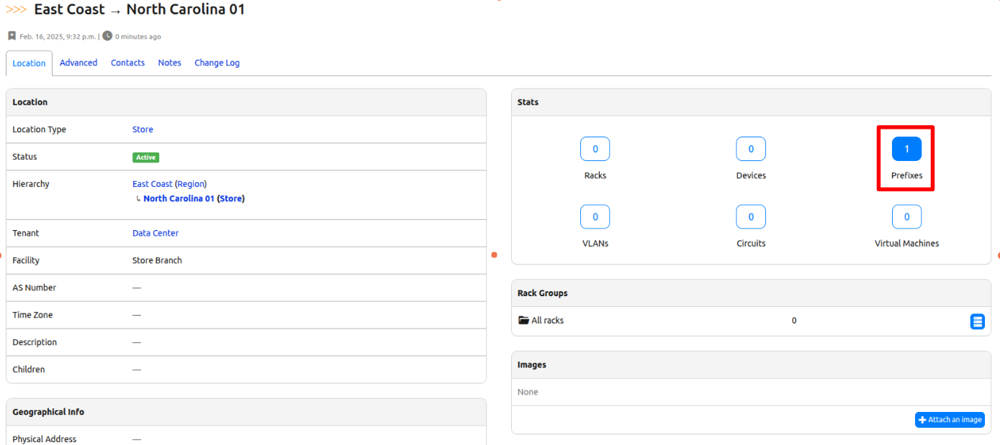
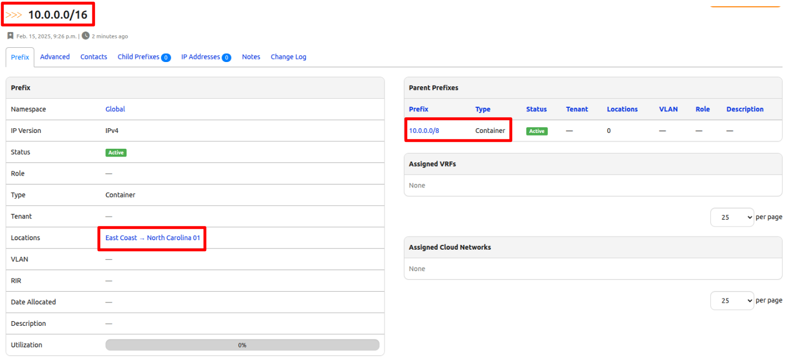

# Design Future Sites (Part 3) 

- Use Job to populate future site


## Environment Setup

The environment setup will be the same as [Lab Setup Scenario 1](../Lab_Setup/scenario_1_setup/README.md), below is a summary of the steps, please consult the guide for a detailed background if needed. 

> [!TIP]
> If you have stopped the Codespace environment and restart again but found the Docker daemon stopped working, please follow the steps in the setup guide to rebuild the environment. 

We will follow the same steps to start Nautobot: 

```
$ cd nautobot-docker-compose/
$ poetry shell
$ invoke build
$ invoke db-import
$ invoke debug
```# Design Future Sites (Part 3) 

- Use Job to populate future site


## Environment Setup

The environment setup will be the same as [Lab Setup Scenario 1](../Lab_Setup/scenario_1_setup/README.md), below is a summary of the steps, please consult the guide for a detailed background if needed. 

> [!TIP]
> If you have stopped the Codespace environment and restart again but found the Docker daemon stopped working, please follow the steps in the setup guide to rebuild the environment. 

We will follow the same steps to start Nautobot: 

```
$ cd nautobot-docker-compose/
$ poetry shell
$ invoke build
$ invoke db-import
$ invoke debug
```

> [!IMPORTANT]
> Creating mappings for Arista EOS and network drivers in our database is the final crucial step before we can get to creating a site. The past two days has been focused on setting up our environment with objects that would already exist in a production setting. Now, we have one more step to do to ensure everything is properly mapped before moving forward.

## Map Network Drivers

> [!NOTE]
> Once we get to Day 38 where we actually create devices, the ```"platform"``` variable points to this attribute.


Below is a quick reference in mapping network drivers. If you need more help, please refer back to [Day 10](../Day010_Python_Script_to_Jobs_Part_2) of this challenge.

Go to "DEVICES->Platforms" on the left, and edit the "Arista EOS" platform.


Select "arista_eos" for network driver.


## Let’s Build a Site in Nautobot!

Now for the exciting part!

We’ve laid the groundwork—now it’s time to create a site! Over the next few days, we’ll automate the process of building a site in Nautobot with all the essential components: roles, prefixes, subnets, VLANs, racks, devices, cabling, and more.

Sounds like a lot? Don’t worry! We’re breaking it down into small, manageable tasks so we can focus on learning and making steady progress.

Each day will build on the last, and by the end, we will have a fully configured site! Here’s the game plan:

✅ Day 36:
- [ ] Create relationships
- [ ] Create the site  
- [ ] Assign a /16 prefix  

✅ Day 37:
- [ ] Create roles and assign prefixes for each role  
- [ ] Create racks
- [ ] Establish rack and VLAN relationships 

✅ Day 38:
- [ ] Create devices  
- [ ] Assign VLANs and IPs to critical interfaces  
- [ ] Establish device and VLAN relationships  

✅ Day 39:
- [ ] Connect circuits to edge devices
- [ ] Cabling devices together 

🔥 Let’s Get Started!  

At the end of each day, we’ll revisit this checklist to see how far we’ve come. Progress feels good, right? Let’s dive in!  

## Design Future Sites Part 3 Code

If you had to create a new codespace instance make sure you recreate the file from the previous challenge.

```shell
$ docker exec -u root -it nautobot_docker_compose-nautobot-1 bash
root@c9e0fa2a45a0:/opt/nautobot# cd jobs
root@c9e0fa2a45a0:/opt/nautobot/jobs# pwd
/opt/nautobot/jobs
root@c9e0fa2a45a0:/opt/nautobot/jobs# touch create_site_job.py
root@c9e0fa2a45a0:/opt/nautobot/jobs# chown nautobot:nautobot create_site_job.py
```

## Walkthrough

Let's begin by adding the necessary import statements and declare additional variables. We'll continue to add to this as we work with additional Nautobot objects. 

```python

from nautobot.apps.jobs import Job, ObjectVar, StringVar, register_jobs
from nautobot.dcim.models.locations import Location, LocationType
from ipaddress import IPv4Network
from nautobot.extras.models.relationships import Relationship
from nautobot.extras.choices import RelationshipTypeChoices

...
POP_PREFIX_SIZE = 16

```

Sometimes, you need to define custom relationships between objects in your source of truth to reflect business logic or other connections that aren’t built-in. That’s where the Relationships feature comes in—it lets you create links between objects based on your specific network or data needs that we will use later on. If you want to better understand ```Relationships``` in Nautobot, check out the [documentation here](https://docs.nautobot.com/projects/core/en/stable/user-guide/feature-guides/relationships/?h=relationships).

We need to define a function at the top level of our code so we can call it later. In the coming days, we will establish relationship between racks, devices, and VLANs. Doing this now will make it easier to reference in our code later.

```python
...
def get_or_create_relationship(label, key, source_model, destination_model, rel_type):
    try:
        rel, created = Relationship.objects.get_or_create(
            key=key,
            defaults={
                "label": label,
                "source_type": ContentType.objects.get_for_model(source_model),
                "destination_type": ContentType.objects.get_for_model(destination_model),
                "type": rel_type,
            }
        )
        return rel
    except Exception as e:
        self.logger.error(f"Error creating relationship {label}: {e}")
        return Relationship.objects.get(key=key)  # Fallback to existing relationship

```

To call on this function, we look within the run() method and add the code below:


```python
    
        ...
        create_prefix_roles(self.logger)
        create_tenant(self.logger)
        create_vlans(self.logger)
        create_device_types(self.logger)

        # ----------------------------------------------------------------------------
        # Create Relationships
        # ----------------------------------------------------------------------------
        rel_device_vlan = get_or_create_relationship(
            "Device to VLAN", "device_to_vlan", Device, VLAN, RelationshipTypeChoices.TYPE_MANY_TO_MANY
        )
        rel_rack_vlan = get_or_create_relationship(
            "Rack to VLAN", "rack_to_vlan", Rack, VLAN, RelationshipTypeChoices.TYPE_MANY_TO_MANY
        )

```

This section now deals with the details of creating a site. We'll take user input to define the specifics of our new POP site like the Site Name, Site Code, etc. We’ll add this section under ```class CreatePop(Job)``` to allow us to customize details like the site name, region, and site code. Staying true to the spirit of automation, standardization helps keep everything structured and ensures consistency in our naming conventions!"

Additionally, we need to modify the parameters passed to the ```run()``` method by adding the received input data.

```python

class CreatePop(Job):
    """Job to create a new site of type POP."""

    # Receive input from user about site information
    location_type = ObjectVar(
    model=LocationType,
    description = "Select location type for new site."
    )
    parent_site = ObjectVar(
        model=Location,
        required=False,
        description="Select an existing site to nest this site under. Site will be created as a Region if left blank.",
        label="Parent Site"
    )
    site_name = StringVar(description="Name of the new site", label="Site Name")
    site_facility = StringVar(description="Facility of the new site", label="Site Facility")
    
    site_code = StringVar(description="Enter Site Code as 2-letter state and 2-digit site ID e.g. NY01 for New York Store ID 01")
    tenant = ObjectVar(model=Tenant)

    
    class Meta:
            """Metadata for CreatePop."""

            name = "Create a Point of Presence"
            description = """
            Create a new POP Site.
            A new /16 will automatically be allocated from the 'POP Global Pool' Prefix.
            """    
    # Pass received data as parameters to our run() method   
    def run(self, location_type, site_name, site_facility, tenant, site_code, parent_site=None):

```

> [!TIP]
> We want our code to be modular so every task from here on will be added below the last item under the ```run()``` method. Just be careful of the indentation!

This block of code is how we are actually using the input to create the specifics for the POP site. 

```python

        ...
        # ----------------------------------------------------------------------------
        # Create Site
        # ----------------------------------------------------------------------------
        location_type_site, _ = LocationType.objects.get_or_create(name=location_type)
        self.site_name = site_name
        self.site_facility = site_facility
        self.site, created = Location.objects.get_or_create(
            name=site_name,
            location_type=LocationType.objects.get(name=location_type),
            facility=site_facility,
            status=ACTIVE_STATUS,
            parent=parent_site,  # Will be None if not provided
            tenant=tenant
        )
        
        if created:
            message = f"Site '{site_name}' created as a top level Region."
            if parent_site:
                message = f"Site '{site_name}' successfully nested under '{parent_site.name}'."
            self.site.validated_save()
            self.logger.info(message)

            pop_role = Role.objects.get(name="pop")
            self.logger.info(f"Assigning '{site_name}' as '{pop_role}' role.")


```

Lastly, we'll assign the /16 prefix to the site once it is created. In this lab environment, we are using an existing /8 prefix assigned to the "East Coast" Region as the parent site. The idea is to first find an available /16 prefix. If none is available, we will further breakdown the parent prefix into smaller /16 that we can then assign to the new site.

Depending on the environment, we can modify the code but this approach ensures that we are implementing a nested hierarchy.

```python

            ...
            # ----------------------------------------------------------------------------
            # Allocate Prefix for this POP
            # ----------------------------------------------------------------------------
        
            # Find the first available /16 prefix that isn't assigned to a site yet
            pop_prefix = Prefix.objects.filter(
                type="container",
                prefix_length=POP_PREFIX_SIZE,
                status=ACTIVE_STATUS,
                location__isnull=True
            ).first()

            if pop_prefix:
                pop_prefix.location = self.site
                pop_prefix.validated_save()
                self.logger.info(f"Assigned {pop_prefix} to {site_name}.")
            else:
                self.logger.warning("No available /16 prefixes found. Creating a new /16.")
                top_level_prefix = Prefix.objects.filter(
                    type="container",
                    status=ACTIVE_STATUS,
                    prefix_length=8
                ).first()

                # Get the first available prefix within the /8
                first_avail = top_level_prefix.get_first_available_prefix()

                if not first_avail:
                    raise Exception("No available subnets found within the /8 prefix.")

                # Iterate over all possible /16 subnets within the /8 and find the first unassigned one
                for candidate_prefix in IPv4Network(str(first_avail)).subnets(new_prefix=POP_PREFIX_SIZE):
                    if not Prefix.objects.filter(prefix=str(candidate_prefix)).exists():
                        pop_prefix, created = Prefix.objects.get_or_create(
                            prefix=str(candidate_prefix),
                            type="container",
                            location=self.site,
                            status=ACTIVE_STATUS,
                            role=pop_role
                        )
                        pop_prefix.validated_save()
                        self.logger.info(f"Allocated new '{pop_prefix}' for site '{site_name}'.")
                        break
                else:
                    raise Exception("No available /16 prefixes found within the /8 range.")
        else:
            self.logger.warning(f"Site '{site_name}' already exists.") 

```

## Final Code for Day 36

```python


"""Job to create a new site of type POP."""

from itertools import product
import re

from django.contrib.contenttypes.models import ContentType
import yaml

from nautobot.dcim.models import DeviceType, Manufacturer
from nautobot.dcim.models.device_component_templates import InterfaceTemplate
from nautobot.extras.models import Status
from nautobot.extras.models.roles import Role
from nautobot.ipam.models import Prefix, VLAN
from nautobot.tenancy.models import Tenant
from nautobot.extras.models.customfields import CustomField
from nautobot.dcim.models.device_components import Interface

####DAY36####
from nautobot.apps.jobs import Job, ObjectVar, StringVar, register_jobs
from nautobot.dcim.models.locations import Location, LocationType
from nautobot.extras.models.relationships import Relationship
from nautobot.extras.choices import RelationshipTypeChoices
from ipaddress import IPv4Network


name = "Data Population Jobs Collection"


PREFIX_ROLES = ["p2p", "loopback", "server", "mgmt", "pop"]
TENANT_NAME = "Data Center"
ACTIVE_STATUS = Status.objects.get(name="Active")
# VLAN definitions: key is also used to look up the role.
VLAN_INFO = {
    "server": 1000,
    "mgmt": 99,
}
CUSTOM_FIELDS = {
    "role": {"models": [Interface], "label": "Role"},
}
# Retrieve the content type for Prefix and VLAN models.
prefix_ct = ContentType.objects.get_for_model(Prefix)
vlan_ct = ContentType.objects.get_for_model(VLAN)

####DAY35####
DEVICE_TYPES_YAML = [
    """
    manufacturer: Arista
    model: DCS-7280CR2-60
    part_number: DCS-7280CR2-60
    u_height: 1
    is_full_depth: false
    comments: '[Arista 7280R Data Sheet](https://www.arista.com/assets/data/pdf/Datasheets/7280R-DataSheet.pdf)'
    interfaces:
        - pattern: "Ethernet[1-60]/[1-4]"
          type: 100gbase-x-qsfp28
        - pattern: "Management1"
          type: 1000base-t
          mgmt_only: true
    """,
    """
    manufacturer: Arista
    model: DCS-7150S-24
    part_number: DCS-7150S-24
    u_height: 1
    is_full_depth: false
    comments: '[Arista 7150 Data Sheet](https://www.arista.com/assets/data/pdf/Datasheets/7150S_Datasheet.pdf)'
    interfaces:
        - pattern: "Ethernet[1-24]"
          type: 10gbase-x-sfpp
        - pattern: "Management1"
          type: 1000base-t
          mgmt_only: true
    """,
]

####DAY36####
POP_PREFIX_SIZE = 16

def create_prefix_roles(logger):
    """Create all Prefix Roles defined in PREFIX_ROLES and add content types for IPAM Prefix and VLAN."""

    # Retrieve the content type for Prefix and VLAN models.
    for role in PREFIX_ROLES:
        role_obj, created = Role.objects.get_or_create(name=role)
        # Add the Prefix and VLAN content types to the role.
        role_obj.content_types.add(prefix_ct, vlan_ct)
        role_obj.validated_save()
        logger.info(f"Successfully created role {role} with content types for Prefix and VLAN.")


def create_tenant(logger):
    """Create a tenant with the name defined in TENANT_NAME."""
    tenant_obj, _ = Tenant.objects.get_or_create(name=TENANT_NAME)
    tenant_obj.validated_save()
    logger.info(f"Successfully created Tenant {TENANT_NAME}.")


def create_vlans(logger):
    """Create predefined VLANs defined in VLAN_INFO, and assign the appropriate role."""
    # Get the active status from the database.

    for vlan_name, vlan_id in VLAN_INFO.items():
        # Retrieve the appropriate role based on the VLAN name.
        try:
            role_obj = Role.objects.get(name=vlan_name)
        except Role.DoesNotExist:
            logger.error(f"Role '{vlan_name}' not found. VLAN will be created without a role.")
            role_obj = None

        defaults = {"name": vlan_name, "status": ACTIVE_STATUS}
        if role_obj:
            defaults["role"] = role_obj

        vlan_obj, created = VLAN.objects.get_or_create(
            vid=vlan_id,
            defaults=defaults,
        )
        if created:
            vlan_obj.validated_save()
            logger.info(f"Successfully created VLAN '{vlan_name}' with ID {vlan_id}.")
        else:
            logger.info(f"VLAN '{vlan_name}' with ID {vlan_id} already exists.")

def create_custom_fields(logger):
    """Create all relationships defined in CUSTOM_FIELDS."""
    for cf_name, field in CUSTOM_FIELDS.items():
        try:
            cf = CustomField.objects.get(key=cf_name)
        except CustomField.DoesNotExist:
            cf = CustomField.objects.create(key=cf_name)
            if "label" in field:
                cf.label = field.get("label")
            cf.validated_save()
            logger.info(f"Created custom field '{cf_name}'")
        for model in field["models"]:
            ct = ContentType.objects.get_for_model(model)
            cf.content_types.add(ct)
            cf.validated_save()
            logger.info(f"Added content type {ct} to custom field '{cf_name}'")

####DAY35####
def create_device_types(logger):
    """
    Create DeviceType objects from YAML definitions and add interfaces using InterfaceTemplate.
    """

    for device_yaml in DEVICE_TYPES_YAML:
        data = yaml.safe_load(device_yaml)

        manufacturer_name = data.pop("manufacturer", None)
        if not manufacturer_name:
            logger.error("Manufacturer not provided in YAML definition.")
            continue
        manufacturer_obj, _ = Manufacturer.objects.get_or_create(name=manufacturer_name)

        model_name = data.pop("model", None)
        if not model_name:
            logger.error("Model not provided in YAML for manufacturer %s", manufacturer_name)
            continue

        # Create DeviceType
        device_type_defaults = {
            k: data[k] for k in ["part_number", "u_height", "is_full_depth", "comments"] if k in data
        }
        device_type_obj, created = DeviceType.objects.get_or_create(
            manufacturer=manufacturer_obj,
            model=model_name,
            defaults=device_type_defaults,
        )

        if created:
            device_type_obj.validated_save()
            logger.info(f"DeviceType created: {device_type_obj}")
        else:
            logger.info(f"DeviceType already exists: {device_type_obj}")

        # Add interfaces using InterfaceTemplate
        for iface in data.get("interfaces", []):
            pattern = iface.get("pattern")
            iface_type = iface.get("type")
            mgmt_only = iface.get("mgmt_only", False)

            if not pattern or not iface_type:
                logger.error(f"Invalid interface definition in {model_name}: {iface}")
                continue

            # Generate interfaces from range patterns
            interface_names = expand_interface_pattern(pattern)
            for iface_name in interface_names:
                interface_template, created = InterfaceTemplate.objects.get_or_create(
                    device_type=device_type_obj,
                    name=iface_name,
                    defaults={
                        "type": iface_type,
                        "mgmt_only": mgmt_only,
                    },
                )
                if created:
                    logger.info(f"Added interface {iface_name} ({iface_type}) to {model_name}")

def expand_interface_pattern(pattern):
    """
    Expands an interface pattern like 'Ethernet[1-60]/[1-4]' into actual names.
    
    Supports:
      - Single range: Ethernet[1-24] -> Ethernet1, Ethernet2, ..., Ethernet24
      - Nested range: Ethernet[1-60]/[1-4] -> Ethernet1/1, Ethernet1/2, ..., Ethernet60/4
    """
    match = re.findall(r"\[([0-9]+)-([0-9]+)\]", pattern)
    if not match:
        return [pattern]  # No expansion needed, return as-is.

    # Convert to lists of numbers
    try:
        ranges = [list(range(int(start), int(end) + 1)) for start, end in match]
    except ValueError:
        raise ValueError(f"Invalid range in pattern: {pattern}")

    # Generate base name with placeholders
    base_name = re.sub(r"\[[0-9]+-[0-9]+\]", "{}", pattern, count=len(ranges))

    # Expand using cartesian product
    return [base_name.format(*nums) for nums in product(*ranges)]

class CreatePop(Job):
    """Job to create a new site of type POP."""

    ####DAY36####
    # Receive input from user about site iformation
    location_type = ObjectVar(
    model=LocationType,
    description = "Select location type for new site."
    )
    parent_site = ObjectVar(
        model=Location,
        required=False,
        description="Select an existing site to nest this site under. Site will be created as a Region if left blank.",
        label="Parent Site"
    )
    site_name = StringVar(description="Name of the new site", label="Site Name")
    site_facility = StringVar(description="Facility of the new site", label="Site Facility") 
    site_code = StringVar(description="Enter Site Code as 2-letter state and 2-digit site ID e.g. NY01 for New York Store ID 01")   
    tenant = ObjectVar(model=Tenant)

    class Meta:
        """Metadata for CreatePop."""

        name = "Create a Point of Presence"
        description = """
        Create a new POP Site.
        A new /16 will automatically be allocated from the 'POP Global Pool' Prefix.
        """        
    ####DAY36####    
    def run(self, location_type, site_name, site_facility, tenant, site_code, parent_site=None):
        """Main function to create a site."""

        # ----------------------------------------------------------------------------
        # Initialize the database with all required objects
        # ----------------------------------------------------------------------------
        create_prefix_roles(self.logger)
        create_tenant(self.logger)
        create_vlans(self.logger)
        create_device_types(self.logger)

        ####DAY36####
        # ----------------------------------------------------------------------------
        # Create Site
        # ----------------------------------------------------------------------------
        location_type_site, _ = LocationType.objects.get_or_create(name=location_type)
        self.site_name = site_name
        self.site_facility = site_facility
        self.site, created = Location.objects.get_or_create(
            name = site_name,
            location_type = LocationType.objects.get(name=location_type),
            facility = site_facility,
            status = ACTIVE_STATUS,
            parent = parent_site,  # Will be None if not provided
            tenant = tenant
        )
        
        if created:
            message = f"Site '{site_name}' created as a top level Region."
            if parent_site:
                message = f"Site '{site_name}' successfully nested under '{parent_site.name}'."
            self.site.validated_save()
            self.logger.info(message)

            # ----------------------------------------------------------------------------
            # Allocate Prefix for this POP
            # ----------------------------------------------------------------------------
            pop_role = Role.objects.get(name="pop")
            self.logger.info(f"Assigning '{site_name}' as '{pop_role}' role.")

            # Find the first available /16 prefix that isn't assigned to a site yet
            pop_prefix = Prefix.objects.filter(
                type="container",  # Ensure it's a top-level subnet assigned as a container
                prefix_length = POP_PREFIX_SIZE,
                status = ACTIVE_STATUS,
                location__isnull = True  # Ensure it's not already assigned to another site
            ).first()

            if pop_prefix:
                # Assign the prefix to the new site 
                pop_prefix.location = self.site
                pop_prefix.validated_save()
                self.logger.info(f"Assigned {pop_prefix} to {site_name}.")
            else:                 
                self.logger.warning("No available /16 prefixes found. Creating a new /16.")
                
                # Search for top-level /8 prefixes
                top_level_prefix = Prefix.objects.filter(
                    type = "container",  
                    status = ACTIVE_STATUS,
                    prefix_length = 8
                ).first()

                # Get the first available prefix within the /8
                first_avail = top_level_prefix.get_first_available_prefix()

                if not first_avail:
                    raise Exception("No available subnets found within the /8 prefix.")

                # Iterate over all possible /16 subnets within the /8 and find the first unassigned one
                for candidate_prefix in IPv4Network(str(first_avail)).subnets(new_prefix=POP_PREFIX_SIZE):
                    if not Prefix.objects.filter(prefix=str(candidate_prefix)).exists():
                        pop_prefix, created = Prefix.objects.get_or_create(
                            prefix=str(candidate_prefix),
                            type="container",
                            location=self.site,
                            status=ACTIVE_STATUS,
                            role=pop_role
                        )
                        pop_prefix.validated_save()
                        self.logger.info(f"Allocated new'{pop_prefix}' for site '{site_name}'.")
                        break
                else:
                    raise Exception("No available /16 prefixes found within the /8 range.")        
        
        else:
            self.logger.warning(f"Site '{site_name}' already exists.") 
    
register_jobs(CreatePop)

```

🚀 We are now ready to run our job! 🚀 



> [!TIP]
> As we progress through the project, we will use site name as a combination of the US State where the store or office is located, and the two-digit store ID For example NY01 for New York Store ID #01. This is just for simplicity in learning, but for production environment, you will have to come up with a strategy to standardize names such as site codes, device names, and rack names, etc. 

And, here's the result! Navigate to "ORGANIZATION->LOCATIONS->Locations" to find your newly created site.



Notice the /16 prefix is assigned to your site and nested under the /8 prefix of the parent site.



> [!TIP]
> If you are getting errors or conflicts, clean up your database by removing objects created from previous jobs. As you go through the challenge, sometimes objects from previous jobs may cause errors in our code. We try to catch all errors with validators but depending on your environment, conflicts may still occur. 

## Recap

That was a lot! But as promised, let’s keep the motivation going—time to update our checklist with today’s accomplishments! 🎉

✅ Day 36:

    ✅ Create relationships

    ✅ Create the site  

    ✅ Assign a /16 prefix  


✅ Day 37:
- [ ] Create roles and assign prefixes for each role  
- [ ] Create racks
- [ ] Establish rack and VLAN relationships 

✅ Day 38:
- [ ] Create devices  
- [ ] Assign VLANs and IPs to critical interfaces  
- [ ] Establish device and VLAN relationships  

✅ Day 39:
- [ ] Connect circuits to edge devices
- [ ] Cabling devices together 

## Day 36 To Do

Remember to stop the codespace instance on [https://github.com/codespaces/](https://github.com/codespaces/). 

Go ahead and post a screenshot of the your newly created site on a social media of your choice, make sure you use the tags `#100DaysOfNautobot` `#JobsToBeDone` and tag @networktocode so we can share your progress! 

In tomorrow's challenge, we will work on Day 37 Tasks! See you tomorrow!

[LinkedIn](https://www.linkedin.com/) 

[X/Twitter](https://x.com/home) 


> [!IMPORTANT]
> Creating mappings for Arista EOS and network drivers in our database is the final crucial step before we can get to creating a site. The past two days has been focused on setting up our environment with objects that would already exist in a production setting. Now, we have one more step to do to ensure everything is properly mapped before moving forward.

## Map Network Drivers

> [!NOTE]
> Once we get to Day 38 where we actually create devices, the ```"platform"``` variable points to this attribute.


Below is a quick reference in mapping network drivers. If you need more help, please refer back to [Day 10](../Day010_Python_Script_to_Jobs_Part_2) of this challenge.

Go to "DEVICES->Platforms" on the left, and edit the "Arista EOS" platform.


Select "arista_eos" for network driver.


## Let’s Build a Site in Nautobot!

Now for the exciting part!

We’ve laid the groundwork—now it’s time to create a site! Over the next few days, we’ll automate the process of building a site in Nautobot with all the essential components: roles, prefixes, subnets, VLANs, racks, devices, cabling, and more.

Sounds like a lot? Don’t worry! We’re breaking it down into small, manageable tasks so we can focus on learning and making steady progress.

Each day will build on the last, and by the end, we will have a fully configured site! Here’s the game plan:

✅ Day 36:
- [ ] Create relationships
- [ ] Create the site  
- [ ] Assign a /16 prefix  

✅ Day 37:
- [ ] Create roles and assign prefixes for each role  
- [ ] Create racks
- [ ] Establish rack and VLAN relationships 

✅ Day 38:
- [ ] Create devices  
- [ ] Assign VLANs and IPs to critical interfaces  
- [ ] Establish device and VLAN relationships  

✅ Day 39:
- [ ] Connect circuits to edge devices
- [ ] Cabling devices together 

🔥 Let’s Get Started!  

At the end of each day, we’ll revisit this checklist to see how far we’ve come. Progress feels good, right? Let’s dive in!  

## Design Future Sites Part 3 Code

If you had to create a new codespace instance make sure you recreate the file from the previous challenge.

```shell
$ docker exec -u root -it nautobot_docker_compose-nautobot-1 bash
root@c9e0fa2a45a0:/opt/nautobot# cd jobs
root@c9e0fa2a45a0:/opt/nautobot/jobs# pwd
/opt/nautobot/jobs
root@c9e0fa2a45a0:/opt/nautobot/jobs# touch create_site_job.py
root@c9e0fa2a45a0:/opt/nautobot/jobs# chown nautobot:nautobot create_site_job.py
```

## Walkthrough

Let's begin by adding the necessary import statements and declare additional variables. We'll continue to add to this as we work with additional Nautobot objects. 

```python

from nautobot.apps.jobs import Job, ObjectVar, StringVar, register_jobs
from nautobot.dcim.models.locations import Location, LocationType
from ipaddress import IPv4Network
from nautobot.extras.models.relationships import Relationship
from nautobot.extras.choices import RelationshipTypeChoices

...
POP_PREFIX_SIZE = 16

```

Sometimes, you need to define custom relationships between objects in your source of truth to reflect business logic or other connections that aren’t built-in. That’s where the Relationships feature comes in—it lets you create links between objects based on your specific network or data needs that we will use later on. If you want to better understand ```Relationships``` in Nautobot, check out the [documentation here](https://docs.nautobot.com/projects/core/en/stable/user-guide/feature-guides/relationships/?h=relationships).

We need to define a function at the top level of our code so we can call it later. In the coming days, we will establish relationship between racks, devices, and VLANs. Doing this now will make it easier to reference in our code later.

```python
...
def get_or_create_relationship(label, key, source_model, destination_model, rel_type):
    try:
        rel, created = Relationship.objects.get_or_create(
            key=key,
            defaults={
                "label": label,
                "source_type": ContentType.objects.get_for_model(source_model),
                "destination_type": ContentType.objects.get_for_model(destination_model),
                "type": rel_type,
            }
        )
        return rel
    except Exception as e:
        self.logger.error(f"Error creating relationship {label}: {e}")
        return Relationship.objects.get(key=key)  # Fallback to existing relationship

```

To call on this function, we look within the run() method and add the code below:


```python
    
        ...
        create_prefix_roles(self.logger)
        create_tenant(self.logger)
        create_vlans(self.logger)
        create_device_types(self.logger)

        # ----------------------------------------------------------------------------
        # Create Relationships
        # ----------------------------------------------------------------------------
        rel_device_vlan = get_or_create_relationship(
            "Device to VLAN", "device_to_vlan", Device, VLAN, RelationshipTypeChoices.TYPE_MANY_TO_MANY
        )
        rel_rack_vlan = get_or_create_relationship(
            "Rack to VLAN", "rack_to_vlan", Rack, VLAN, RelationshipTypeChoices.TYPE_MANY_TO_MANY
        )

```

This section now deals with the details of creating a site. We'll take user input to define the specifics of our new POP site like the Site Name, Site Code, etc. We’ll add this section under ```class CreatePop(Job)``` to allow us to customize details like the site name, region, and site code. Staying true to the spirit of automation, standardization helps keep everything structured and ensures consistency in our naming conventions!"

Additionally, we need to modify the parameters passed to the ```run()``` method by adding the received input data.

```python

class CreatePop(Job):
    """Job to create a new site of type POP."""

    # Receive input from user about site information
    location_type = ObjectVar(
    model=LocationType,
    description = "Select location type for new site."
    )
    parent_site = ObjectVar(
        model=Location,
        required=False,
        description="Select an existing site to nest this site under. Site will be created as a Region if left blank.",
        label="Parent Site"
    )
    site_name = StringVar(description="Name of the new site", label="Site Name")
    site_facility = StringVar(description="Facility of the new site", label="Site Facility")
    
    site_code = StringVar(description="Enter Site Code as 2-letter state and 2-digit site ID e.g. NY01 for New York Store ID 01")
    tenant = ObjectVar(model=Tenant)

    
    class Meta:
            """Metadata for CreatePop."""

            name = "Create a Point of Presence"
            description = """
            Create a new POP Site.
            A new /16 will automatically be allocated from the 'POP Global Pool' Prefix.
            """    
    # Pass received data as parameters to our run() method   
    def run(self, location_type, site_name, site_facility, tenant, site_code, parent_site=None):

```

> [!TIP]
> We want our code to be modular so every task from here on will be added below the last item under the ```run()``` method. Just be careful of the indentation!

This block of code is how we are actually using the input to create the specifics for the POP site. 

```python

        ...
        # ----------------------------------------------------------------------------
        # Create Site
        # ----------------------------------------------------------------------------
        location_type_site, _ = LocationType.objects.get_or_create(name=location_type)
        self.site_name = site_name
        self.site_facility = site_facility
        self.site, created = Location.objects.get_or_create(
            name=site_name,
            location_type=LocationType.objects.get(name=location_type),
            facility=site_facility,
            status=ACTIVE_STATUS,
            parent=parent_site,  # Will be None if not provided
            tenant=tenant
        )
        
        if created:
            message = f"Site '{site_name}' created as a top level Region."
            if parent_site:
                message = f"Site '{site_name}' successfully nested under '{parent_site.name}'."
            self.site.validated_save()
            self.logger.info(message)

            pop_role = Role.objects.get(name="pop")
            self.logger.info(f"Assigning '{site_name}' as '{pop_role}' role.")


```

Lastly, we'll assign the /16 prefix to the site once it is created. In this lab environment, we are using an existing /8 prefix assigned to the "East Coast" Region as the parent site. The idea is to first find an available /16 prefix. If none is available, we will further breakdown the parent prefix into smaller /16 that we can then assign to the new site.

Depending on the environment, we can modify the code but this approach ensures that we are implementing a nested hierarchy.

```python

            ...
            # ----------------------------------------------------------------------------
            # Allocate Prefix for this POP
            # ----------------------------------------------------------------------------
        
            # Find the first available /16 prefix that isn't assigned to a site yet
            pop_prefix = Prefix.objects.filter(
                type="container",
                prefix_length=POP_PREFIX_SIZE,
                status=ACTIVE_STATUS,
                location__isnull=True
            ).first()

            if pop_prefix:
                pop_prefix.location = self.site
                pop_prefix.validated_save()
                self.logger.info(f"Assigned {pop_prefix} to {site_name}.")
            else:
                self.logger.warning("No available /16 prefixes found. Creating a new /16.")
                top_level_prefix = Prefix.objects.filter(
                    type="container",
                    status=ACTIVE_STATUS,
                    prefix_length=8
                ).first()

                # Get the first available prefix within the /8
                first_avail = top_level_prefix.get_first_available_prefix()

                if not first_avail:
                    raise Exception("No available subnets found within the /8 prefix.")

                # Iterate over all possible /16 subnets within the /8 and find the first unassigned one
                for candidate_prefix in IPv4Network(str(first_avail)).subnets(new_prefix=POP_PREFIX_SIZE):
                    if not Prefix.objects.filter(prefix=str(candidate_prefix)).exists():
                        pop_prefix, created = Prefix.objects.get_or_create(
                            prefix=str(candidate_prefix),
                            type="container",
                            location=self.site,
                            status=ACTIVE_STATUS,
                            role=pop_role
                        )
                        pop_prefix.validated_save()
                        self.logger.info(f"Allocated new '{pop_prefix}' for site '{site_name}'.")
                        break
                else:
                    raise Exception("No available /16 prefixes found within the /8 range.")
        else:
            self.logger.warning(f"Site '{site_name}' already exists.") 

```

## Final Code for Day 36

```python


"""Job to create a new site of type POP."""

from itertools import product
import re

from django.contrib.contenttypes.models import ContentType
import yaml

from nautobot.dcim.models import DeviceType, Manufacturer
from nautobot.dcim.models.device_component_templates import InterfaceTemplate
from nautobot.extras.models import Status
from nautobot.extras.models.roles import Role
from nautobot.ipam.models import Prefix, VLAN
from nautobot.tenancy.models import Tenant
from nautobot.extras.models.customfields import CustomField


from nautobot.apps.jobs import Job, ObjectVar, StringVar, register_jobs
from nautobot.dcim.models.locations import Location, LocationType

from nautobot.extras.models.relationships import Relationship
from nautobot.extras.choices import RelationshipTypeChoices

from ipaddress import IPv4Network


name = "Data Population Jobs Collection"


####DAY36####
POP_PREFIX_SIZE = 16

PREFIX_ROLES = ["p2p", "loopback", "server", "mgmt", "pop"]
TENANT_NAME = "Data Center"
ACTIVE_STATUS = Status.objects.get(name="Active")
# VLAN definitions: key is also used to look up the role.
VLAN_INFO = {
    "server": 1000,
    "mgmt": 99,
}
CUSTOM_FIELDS = {
    "role": {"models": [Interface], "label": "Role"},
}
DEVICE_TYPES_YAML = [
    """
    manufacturer: Arista
    model: DCS-7280CR2-60
    part_number: DCS-7280CR2-60
    u_height: 1
    is_full_depth: false
    comments: '[Arista 7280R Data Sheet](https://www.arista.com/assets/data/pdf/Datasheets/7280R-DataSheet.pdf)'
    interfaces:
        - pattern: "Ethernet[1-60]/[1-4]"
          type: 100gbase-x-qsfp28
        - pattern: "Management1"
          type: 1000base-t
          mgmt_only: true
    """,
    """
    manufacturer: Arista
    model: DCS-7150S-24
    part_number: DCS-7150S-24
    u_height: 1
    is_full_depth: false
    comments: '[Arista 7150 Data Sheet](https://www.arista.com/assets/data/pdf/Datasheets/7150S_Datasheet.pdf)'
    interfaces:
        - pattern: "Ethernet[1-24]"
          type: 10gbase-x-sfpp
        - pattern: "Management1"
          type: 1000base-t
          mgmt_only: true
    """,
]

prefix_ct = ContentType.objects.get_for_model(Prefix)
vlan_ct = ContentType.objects.get_for_model(VLAN)

def create_prefix_roles(logger):
    """Create all Prefix Roles defined in PREFIX_ROLES and add content types for IPAM Prefix and VLAN."""

    # Retrieve the content type for Prefix and VLAN models.
    

    for role in PREFIX_ROLES:
        role_obj, created = Role.objects.get_or_create(name=role)
        # Add the Prefix and VLAN content types to the role.
        role_obj.content_types.add(prefix_ct, vlan_ct)
        role_obj.validated_save()
        logger.info(f"Successfully created role {role} with content types for Prefix and VLAN.")


def create_tenant(logger):
    """Create a tenant with the name defined in TENANT_NAME."""
    tenant_obj, _ = Tenant.objects.get_or_create(name=TENANT_NAME)
    tenant_obj.validated_save()
    logger.info(f"Successfully created Tenant {TENANT_NAME}.")


def create_vlans(logger):
    """Create predefined VLANs defined in VLAN_INFO, and assign the appropriate role."""
    # Get the active status from the database.

    for vlan_name, vlan_id in VLAN_INFO.items():
        # Retrieve the appropriate role based on the VLAN name.
        try:
            role_obj = Role.objects.get(name=vlan_name)
        except Role.DoesNotExist:
            logger.error(f"Role '{vlan_name}' not found. VLAN will be created without a role.")
            role_obj = None

        defaults = {"name": vlan_name, "status": ACTIVE_STATUS}
        if role_obj:
            defaults["role"] = role_obj

        vlan_obj, created = VLAN.objects.get_or_create(
            vid=vlan_id,
            defaults=defaults,
        )
        if created:
            vlan_obj.validated_save()
            logger.info(f"Successfully created VLAN '{vlan_name}' with ID {vlan_id}.")
        else:
            logger.info(f"VLAN '{vlan_name}' with ID {vlan_id} already exists.")

def create_custom_fields(logger):
    """Create all relationships defined in CUSTOM_FIELDS."""
    for cf_name, field in CUSTOM_FIELDS.items():
        try:
            cf = CustomField.objects.get(key=cf_name)
        except CustomField.DoesNotExist:
            cf = CustomField.objects.create(key=cf_name)
            if "label" in field:
                cf.label = field.get("label")
            cf.validated_save()
            logger.info(f"Created custom field '{cf_name}'")
        for model in field["models"]:
            ct = ContentType.objects.get_for_model(model)
            cf.content_types.add(ct)
            cf.validated_save()
            logger.info(f"Added content type {ct} to custom field '{cf_name}'")

def create_device_types(logger):
    """
    Create DeviceType objects from YAML definitions and add interfaces using InterfaceTemplate.
    """

    for device_yaml in DEVICE_TYPES_YAML:
        data = yaml.safe_load(device_yaml)

        manufacturer_name = data.pop("manufacturer", None)
        if not manufacturer_name:
            logger.error("Manufacturer not provided in YAML definition.")
            continue
        manufacturer_obj, _ = Manufacturer.objects.get_or_create(name=manufacturer_name)

        model_name = data.pop("model", None)
        if not model_name:
            logger.error("Model not provided in YAML for manufacturer %s", manufacturer_name)
            continue

        # Create DeviceType
        device_type_defaults = {
            k: data[k] for k in ["part_number", "u_height", "is_full_depth", "comments"] if k in data
        }
        device_type_obj, created = DeviceType.objects.get_or_create(
            manufacturer=manufacturer_obj,
            model=model_name,
            defaults=device_type_defaults,
        )

        if created:
            device_type_obj.validated_save()
            logger.info(f"DeviceType created: {device_type_obj}")
        else:
            logger.info(f"DeviceType already exists: {device_type_obj}")

        # Add interfaces using InterfaceTemplate
        for iface in data.get("interfaces", []):
            pattern = iface.get("pattern")
            iface_type = iface.get("type")
            mgmt_only = iface.get("mgmt_only", False)

            if not pattern or not iface_type:
                logger.error(f"Invalid interface definition in {model_name}: {iface}")
                continue

            # Generate interfaces from range patterns
            interface_names = expand_interface_pattern(pattern)
            for iface_name in interface_names:
                interface_template, created = InterfaceTemplate.objects.get_or_create(
                    device_type=device_type_obj,
                    name=iface_name,
                    defaults={
                        "type": iface_type,
                        "mgmt_only": mgmt_only,
                    },
                )
                if created:
                    logger.info(f"Added interface {iface_name} ({iface_type}) to {model_name}")


def expand_interface_pattern(pattern):
    """
    Expands an interface pattern like 'Ethernet[1-60]/[1-4]' into actual names.
    Supports:
      - Single range: Ethernet[1-24] -> Ethernet1, Ethernet2, ..., Ethernet24
      - Nested range: Ethernet[1-60]/[1-4] -> Ethernet1/1, Ethernet1/2, ..., Ethernet60/4
    """
    match = re.findall(r"\[([0-9]+)-([0-9]+)\]", pattern)
    if not match:
        return [pattern]  # No expansion needed, return as-is.

    # Convert to lists of numbers
    ranges = [list(range(int(start), int(end) + 1)) for start, end in match]

    # Generate names using cartesian product
    expanded_names = []
    base_name = re.sub(r"\[[0-9]+-[0-9]+\]", "{}", pattern)

    for numbers in product(*ranges):
        expanded_names.append(base_name.format(*numbers))

    return expanded_names


class CreatePop(Job):
    """Job to create a new site of type POP."""

    ####DAY36####
    # Receive input from user about site iformation
    location_type = ObjectVar(
    model=LocationType,
    description = "Select location type for new site."
    )
    parent_site = ObjectVar(
        model=Location,
        required=False,
        description="Select an existing site to nest this site under. Site will be created as a Region if left blank.",
        label="Parent Site"
    )
    site_name = StringVar(description="Name of the new site", label="Site Name")
    site_facility = StringVar(description="Facility of the new site", label="Site Facility") 
    site_code = StringVar(description="Enter Site Code as 2-letter state and 2-digit site ID e.g. NY01 for New York Store ID 01")   
    tenant = ObjectVar(model=Tenant)

    class Meta:
        """Metadata for CreatePop."""

        name = "Create a Point of Presence"
        description = """
        Create a new POP Site.
        A new /16 will automatically be allocated from the 'POP Global Pool' Prefix.
        """        
    ####DAY36####    
    def run(self, location_type, site_name, site_facility, tenant, site_code, parent_site=None):
        """Main function to create a site."""

        # ----------------------------------------------------------------------------
        # Initialize the database with all required objects
        # ----------------------------------------------------------------------------
        create_prefix_roles(self.logger)
        create_tenant(self.logger)
        create_vlans(self.logger)
        create_device_types(self.logger)

        ####DAY36####
        # ----------------------------------------------------------------------------
        # Create Site
        # ----------------------------------------------------------------------------
        location_type_site, _ = LocationType.objects.get_or_create(name=location_type)
        self.site_name = site_name
        self.site_facility = site_facility
        self.site, created = Location.objects.get_or_create(
            name = site_name,
            location_type = LocationType.objects.get(name=location_type),
            facility = site_facility,
            status = ACTIVE_STATUS,
            parent = parent_site,  # Will be None if not provided
            tenant = tenant
        )
        
        if created:
            message = f"Site '{site_name}' created as a top level Region."
            if parent_site:
                message = f"Site '{site_name}' successfully nested under '{parent_site.name}'."
            self.site.validated_save()
            self.logger.info(message)

            # ----------------------------------------------------------------------------
            # Allocate Prefix for this POP
            # ----------------------------------------------------------------------------
            pop_role = Role.objects.get(name="pop")
            self.logger.info(f"Assigning '{site_name}' as '{pop_role}' role.")

            # Find the first available /16 prefix that isn't assigned to a site yet
            pop_prefix = Prefix.objects.filter(
                type="container",  # Ensure it's a top-level subnet assigned as a container
                prefix_length = POP_PREFIX_SIZE,
                status = ACTIVE_STATUS,
                location__isnull = True  # Ensure it's not already assigned to another site
            ).first()

            if pop_prefix:
                # Assign the prefix to the new site 
                pop_prefix.location = self.site
                pop_prefix.validated_save()
                self.logger.info(f"Assigned {pop_prefix} to {site_name}.")
            else:                 
                self.logger.warning("No available /16 prefixes found. Creating a new /16.")
                
                # Search for top-level /8 prefixes
                top_level_prefix = Prefix.objects.filter(
                    type = "container",  
                    status = ACTIVE_STATUS,
                    prefix_length = 8
                ).first()

                # Get the first available prefix within the /8
                first_avail = top_level_prefix.get_first_available_prefix()

                if not first_avail:
                    raise Exception("No available subnets found within the /8 prefix.")

                # Iterate over all possible /16 subnets within the /8 and find the first unassigned one
                for candidate_prefix in IPv4Network(str(first_avail)).subnets(new_prefix=POP_PREFIX_SIZE):
                    if not Prefix.objects.filter(prefix=str(candidate_prefix)).exists():
                        pop_prefix, created = Prefix.objects.get_or_create(
                            prefix=str(candidate_prefix),
                            type="container",
                            location=self.site,
                            status=ACTIVE_STATUS,
                            role=pop_role
                        )
                        pop_prefix.validated_save()
                        self.logger.info(f"Allocated new'{pop_prefix}' for site '{site_name}'.")
                        break
                else:
                    raise Exception("No available /16 prefixes found within the /8 range.")        
        
        else:
            self.logger.warning(f"Site '{site_name}' already exists.") 
    
register_jobs(CreatePop)

```

🚀 We are now ready to run our job! 🚀 


> [!TIP]
> As we progress through the project, we will use site name as a combination of the US State where the store or office is located, and the two-digit store ID For example NY01 for New York Store ID #01. This is just for simplicity in learning, but for production environment, you will have to come up with a strategy to standardize names such as site codes, device names, and rack names, etc. 

And, here's the result! Navigate to "ORGANIZATION->LOCATIONS->Locations" to find your newly created site.


Notice the /16 prefix is assigned to your site and nested under the /8 prefix of the parent site.


> [!TIP]
> If you are getting errors or conflicts, clean up your database by removing objects created from previous jobs. As you go through the challenge, sometimes objects from previous jobs may cause errors in our code. We try to catch all errors with validators but depending on your environment, conflicts may still occur. 

## Recap

That was a lot! But as promised, let’s keep the motivation going—time to update our checklist with today’s accomplishments! 🎉

✅ Day 36:

    ✅ Create relationships

    ✅ Create the site  

    ✅ Assign a /16 prefix  


✅ Day 37:
- [ ] Create roles and assign prefixes for each role  
- [ ] Create racks
- [ ] Establish rack and VLAN relationships 

✅ Day 38:
- [ ] Create devices  
- [ ] Assign VLANs and IPs to critical interfaces  
- [ ] Establish device and VLAN relationships  

✅ Day 39:
- [ ] Connect circuits to edge devices
- [ ] Cabling devices together 

## Day 36 To Do

Remember to stop the codespace instance on [https://github.com/codespaces/](https://github.com/codespaces/). 

Go ahead and post a screenshot of the your newly created site on a social media of your choice, make sure you use the tags `#100DaysOfNautobot` `#JobsToBeDone` and tag @networktocode so we can share your progress! 

In tomorrow's challenge, we will work on Day 37 Tasks! See you tomorrow!

[LinkedIn](https://www.linkedin.com/) 

[X/Twitter](https://x.com/home) 
