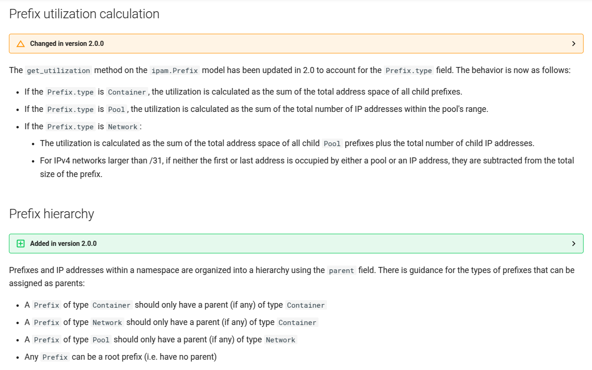
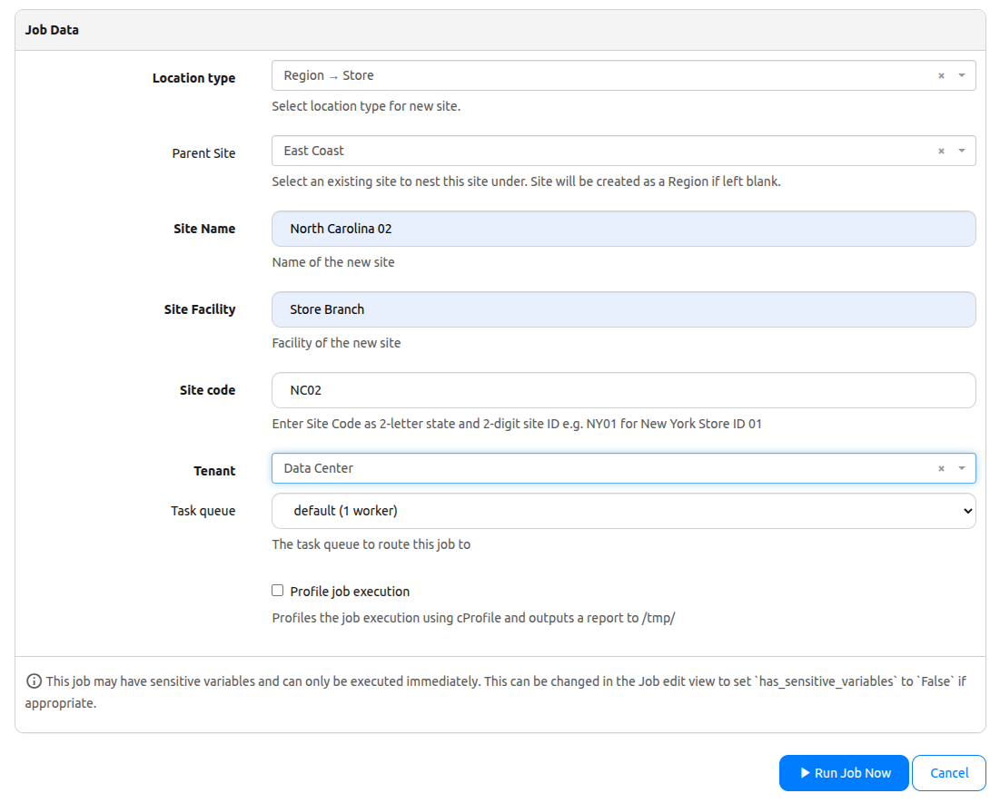
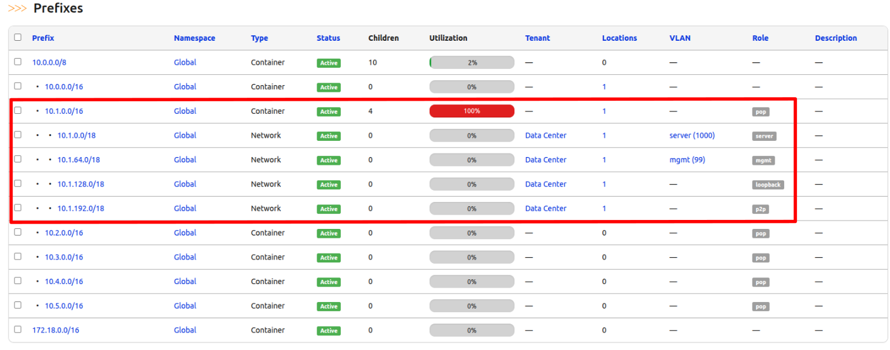
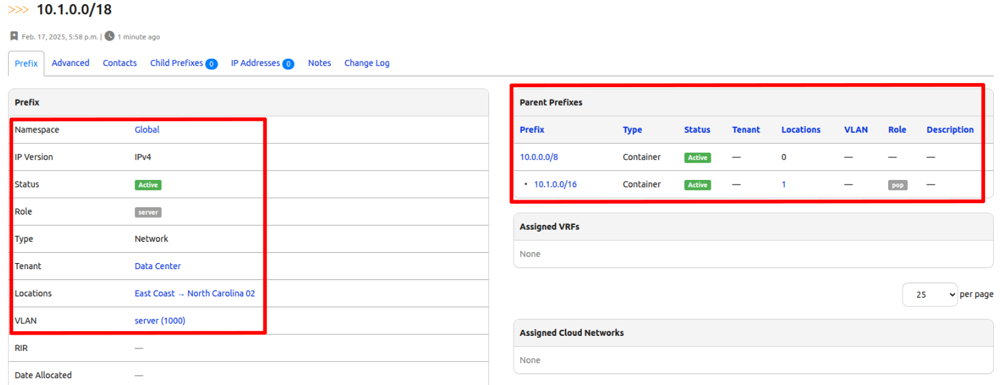
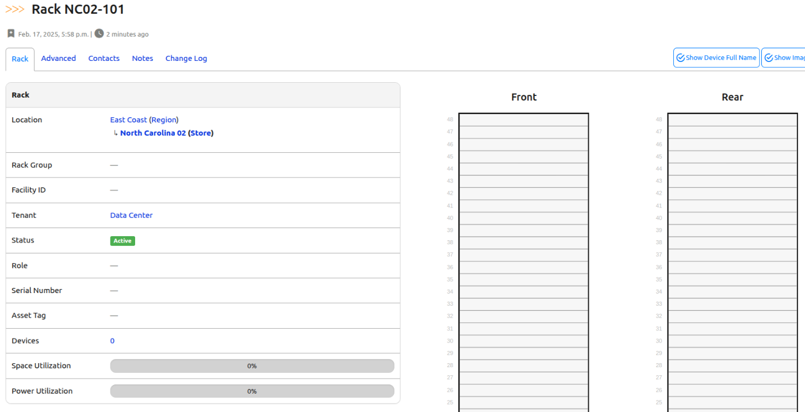
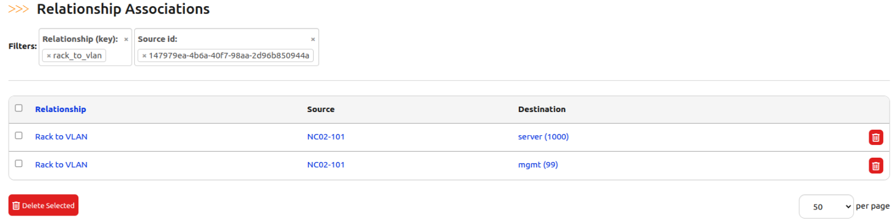

# Design Future Sites (Part 4) 

We are halfway through the 6-part series in creating a job to design future sites. 

## Let's continue from where we left off on Day 36

No long introductions here--let's just jump right in and tackle our tasks!

✅ Day 36:

    ✅ Create relationships

    ✅ Create the site  

    ✅ Assign a /16 prefix  


✅ Day 37:
- [ ] Create roles and assign prefixes for each role  
- [ ] Create racks
- [ ] Establish rack and VLAN relationships 

✅ Day 38:
- [ ] Create devices  
- [ ] Assign VLANs and IPs to critical interfaces  
- [ ] Establish device and VLAN relationships  

✅ Day 39:
- [ ] Connect circuits to edge devices
- [ ] Cabling devices together 

## Design Future Sites Part 4 Code

If you had to create a new codespace instance make sure you recreate the file from the previous challenge.

```shell
$ docker exec -u root -it nautobot_docker_compose-nautobot-1 bash
root@c9e0fa2a45a0:/opt/nautobot# cd jobs
root@c9e0fa2a45a0:/opt/nautobot/jobs# pwd
/opt/nautobot/jobs
root@c9e0fa2a45a0:/opt/nautobot/jobs# touch create_site_job.py
root@c9e0fa2a45a0:/opt/nautobot/jobs# chown nautobot:nautobot create_site_job.py
```

## Walkthrough

Today, we are adding Rack Creation to our Create Site Job so we'll need to import additional models. We also need to declare additional variables for our job to work.

```python

from nautobot.dcim.models import Device, DeviceType, Manufacturer
from nautobot.dcim.models.racks import Rack
from nautobot.dcim.choices import RackTypeChoices

...

ROLE_PREFIX_SIZE = 18

RACK_HEIGHT = 48
RACK_WIDTH = 19
RACK_TYPE = RackTypeChoices.TYPE_4POST

DEVICE_ROLES = {
    "edge": {
        "per_rack": 1,
        "device_type": "DCS-7280CR2-60",
        "platform": "arista_eos",
        "rack_elevation": 32,
        "color": "ff9800",
        "interfaces": [
            ("peer", 2),
            ("leaf", 12),
            ("external", 8),
        ],
    },
    "leaf": {
        "per_rack": 3,
        "device_type": "DCS-7150S-24",
        "platform": "arista_eos",
        "rack_elevation": 38,
        "color": "3f51b5",
        "interfaces": [
            ("edge", 4),
            ("access", 20),
        ],
    },
}


```

Before diving into the code, let's first talk about Prefixes in Nautobot, specifically, their hierarchical structure. If you want to learn more, check out the [Nautobot Documentation](https://docs.nautobot.com/projects/core/en/stable/user-guide/core-data-model/ipam/prefix/#prefix-utilization-calculation).

In yesterday's challenge, we assigned a /16 for our site. For our lab environment, we are treating the /8 and /16 as ```"Containers"```, which we'll use to create subnets with the type ```"Network"```. Later, we can use these subnets to create ```"Pools"```, allowing us to allocate individual IP Addresses for devices and interfaces.



# Code Structure

Let's break down our code to see how it applies:

1. Using the assigned /16 prefix ("pop_prefix"), we create smaller /18 subnets using Python’s built-in IPv4Network class.
2. We iterate through the generated subnets, assigning them to each predefined role.
3. We create the actual prefix objects, linking them to the roles we established back on Day 34.
4. Note that we are only creating two VLANs ("server" and "mgmt") in this project so only those two prefixes will be assigned a VLAN. 

> [!TIP]
> As with any Python code, indentation is important! Always check your indent based of the main ```run()``` method to prevent errors whenever we add new "modules".

```python

        # ----------------------------------------------------------------------------
        # Create and assign prefixes to roles in POP
        # ----------------------------------------------------------------------------
        
        site_subnets = IPv4Network(str(pop_prefix)).subnets(new_prefix=ROLE_PREFIX_SIZE)
        server_subnet = next(site_subnets)
        mgmt_subnet = next(site_subnets)
        loopback_subnet = next(site_subnets)
        p2p_subnet = next(site_subnets)

        # Assign new subnets to roles
        server_role = Role.objects.get(name="server")
        server_prefix, created = Prefix.objects.get_or_create(
            prefix=str(server_subnet),
            type="network",
            role=server_role,
            parent=pop_prefix,
            status=ACTIVE_STATUS,
            location=self.site,
            tenant=tenant,
            vlan=VLAN.objects.get(name=server_role)
        )
        self.logger.info(f"'{server_prefix}' assigned to '{server_role}'.")

        mgmt_role = Role.objects.get(name="mgmt")
        mgmt_prefix, created = Prefix.objects.get_or_create(
            prefix=str(mgmt_subnet),
            type="network",
            role=mgmt_role,
            parent=pop_prefix,
            status=ACTIVE_STATUS,
            location=self.site,
            tenant=tenant,
            vlan=VLAN.objects.get(name=mgmt_role)
        )
        self.logger.info(f"'{mgmt_prefix}' assigned to '{mgmt_role}'.")

        loopback_role = Role.objects.get(name="loopback")
        loopback_prefix, created = Prefix.objects.get_or_create(
            prefix=str(loopback_subnet),
            type="network",
            role=loopback_role,
            parent=pop_prefix,
            status=ACTIVE_STATUS,
            location=self.site,
            tenant=tenant
        )
        self.logger.info(f"'{loopback_prefix}' assigned to '{loopback_role}'.")

        p2p_role = Role.objects.get(name="p2p")
        p2p_prefix, created = Prefix.objects.get_or_create(
            prefix=str(p2p_subnet),
            type="network",
            role=p2p_role,
            parent=pop_prefix,
            status=ACTIVE_STATUS,
            location=self.site,
            tenant=tenant
        )
        self.logger.info(f"'{p2p_prefix}' assigned to '{p2p_role}'.") 

```

> [!TIP]
> We can run our job at this point to see the results. It is always good practice to test code as you add more components to see where it breaks. Just be careful on duplicative objects such as names, prefixes, etc.

Let's continue with creating racks and associate them with the VLANs we created. This part is pretty straight-forward based on the values we declared earlier in our global variables.

This step will house the devices we will create tomorrow for Day 38. 

> [!TIP]
> Remember the ```global_device_counter`` as this will help us tomorrow during device creation.

```python

        # ----------------------------------------------------------------------------
        # Create Racks
        # ----------------------------------------------------------------------------
        # Initialize global counters
        global_device_counter = {role: 1 for role in DEVICE_ROLES}  # Keeps track of numbering
        racks = []  # Store created racks so we can iterate later        

        # Create racks
        num_rack = 2 # We can modify this to be an input variable if a site needs more than 2
        for num in range(1, num_rack + 1):
            rack_name = f"{site_code.upper()}-{100 + num}"
            rack, created = Rack.objects.get_or_create(
                name=rack_name,
                location=self.site,
                u_height=RACK_HEIGHT,
                width=RACK_WIDTH,
                type=RACK_TYPE,
                status=ACTIVE_STATUS,
                tenant=tenant,
            )
            racks.append(rack)
            self.logger.info(f"Successfully created {rack_name}.")

        # ---------------------------------------------------------------------------
        # Associate the mgmt and server VLANs with each rack
        # ---------------------------------------------------------------------------
        mgmt_vlan = VLAN.objects.get(name="mgmt")
        server_vlan = VLAN.objects.get(name="server")
        for rack in racks:
            RelationshipAssociation.objects.get_or_create(
                relationship=rel_rack_vlan,
                source_type=ContentType.objects.get_for_model(Rack),
                source_id=rack.id,
                destination_type=ContentType.objects.get_for_model(VLAN),
                destination_id=mgmt_vlan.id
            )
            RelationshipAssociation.objects.get_or_create(
                relationship=rel_rack_vlan,
                source_type=ContentType.objects.get_for_model(Rack),
                source_id=rack.id,
                destination_type=ContentType.objects.get_for_model(VLAN),
                destination_id=server_vlan.id
            )
        
```

## Final Code for Day 37


```python


"""Job to create a new site of type POP."""

from itertools import product
import re

from django.contrib.contenttypes.models import ContentType
import yaml

from nautobot.dcim.models.device_component_templates import InterfaceTemplate
from nautobot.extras.models import Status
from nautobot.extras.models.roles import Role
from nautobot.ipam.models import Prefix, VLAN
from nautobot.tenancy.models import Tenant
from nautobot.extras.models.customfields import CustomField
from nautobot.dcim.models.device_components import Interface

####DAY36####
from nautobot.apps.jobs import Job, ObjectVar, StringVar, register_jobs
from nautobot.dcim.models.locations import Location, LocationType
from ipaddress import IPv4Network
from nautobot.extras.models.relationships import Relationship, RelationshipAssociation
from nautobot.extras.choices import RelationshipTypeChoices

####DAY37####
from nautobot.dcim.models.racks import Rack
from nautobot.dcim.choices import RackTypeChoices
from nautobot.dcim.models import Device, DeviceType, Manufacturer


name = "Data Population Jobs Collection"


PREFIX_ROLES = ["p2p", "loopback", "server", "mgmt", "pop"]
TENANT_NAME = "Data Center"
ACTIVE_STATUS = Status.objects.get(name="Active")
# VLAN definitions: key is also used to look up the role.
VLAN_INFO = {
    "server": 1000,
    "mgmt": 99,
}
CUSTOM_FIELDS = {
    "role": {"models": [Interface], "label": "Role"},
}

# Retrieve the content type for Prefix and VLAN models.
prefix_ct = ContentType.objects.get_for_model(Prefix)
vlan_ct = ContentType.objects.get_for_model(VLAN)

####DAY35####
DEVICE_TYPES_YAML = [
    """
    manufacturer: Arista
    model: DCS-7280CR2-60
    part_number: DCS-7280CR2-60
    u_height: 1
    is_full_depth: false
    comments: '[Arista 7280R Data Sheet](https://www.arista.com/assets/data/pdf/Datasheets/7280R-DataSheet.pdf)'
    interfaces:
        - pattern: "Ethernet[1-60]/[1-4]"
          type: 100gbase-x-qsfp28
        - pattern: "Management1"
          type: 1000base-t
          mgmt_only: true
    """,
    """
    manufacturer: Arista
    model: DCS-7150S-24
    part_number: DCS-7150S-24
    u_height: 1
    is_full_depth: false
    comments: '[Arista 7150 Data Sheet](https://www.arista.com/assets/data/pdf/Datasheets/7150S_Datasheet.pdf)'
    interfaces:
        - pattern: "Ethernet[1-24]"
          type: 10gbase-x-sfpp
        - pattern: "Management1"
          type: 1000base-t
          mgmt_only: true
    """,
]

####DAY36####
POP_PREFIX_SIZE = 16

####DAY37####
ROLE_PREFIX_SIZE = 18
RACK_HEIGHT = 48
RACK_WIDTH = 19
RACK_TYPE = RackTypeChoices.TYPE_4POST
DEVICE_ROLES = {
    "edge": {
        "per_rack": 1,
        "device_type": "DCS-7280CR2-60",
        "platform": "arista_eos",
        "rack_elevation": 32,
        "color": "ff9800",
        "interfaces": [
            ("peer", 2),
            ("leaf", 12),
            ("external", 8),
        ],
    },
    "leaf": {
        "per_rack": 3,
        "device_type": "DCS-7150S-24",
        "platform": "arista_eos",
        "rack_elevation": 38,
        "color": "3f51b5",
        "interfaces": [
            ("edge", 4),
            ("access", 20),
        ],
    },
}


def create_prefix_roles(logger):
    """Create all Prefix Roles defined in PREFIX_ROLES and add content types for IPAM Prefix and VLAN."""

    # Retrieve the content type for Prefix and VLAN models.
    for role in PREFIX_ROLES:
        role_obj, created = Role.objects.get_or_create(name=role)
        # Add the Prefix and VLAN content types to the role.
        role_obj.content_types.add(prefix_ct, vlan_ct)
        role_obj.validated_save()
        logger.info(f"Successfully created role {role} with content types for Prefix and VLAN.")


def create_tenant(logger):
    """Create a tenant with the name defined in TENANT_NAME."""
    tenant_obj, _ = Tenant.objects.get_or_create(name=TENANT_NAME)
    tenant_obj.validated_save()
    logger.info(f"Successfully created Tenant {TENANT_NAME}.")


def create_vlans(logger):
    """Create predefined VLANs defined in VLAN_INFO, and assign the appropriate role."""
    # Get the active status from the database.

    for vlan_name, vlan_id in VLAN_INFO.items():
        # Retrieve the appropriate role based on the VLAN name.
        try:
            role_obj = Role.objects.get(name=vlan_name)
        except Role.DoesNotExist:
            logger.error(f"Role '{vlan_name}' not found. VLAN will be created without a role.")
            role_obj = None

        defaults = {"name": vlan_name, "status": ACTIVE_STATUS}
        if role_obj:
            defaults["role"] = role_obj

        vlan_obj, created = VLAN.objects.get_or_create(
            vid=vlan_id,
            defaults=defaults,
        )
        if created:
            vlan_obj.validated_save()
            logger.info(f"Successfully created VLAN '{vlan_name}' with ID {vlan_id}.")
        else:
            logger.info(f"VLAN '{vlan_name}' with ID {vlan_id} already exists.")

def create_custom_fields(logger):
    """Create all relationships defined in CUSTOM_FIELDS."""
    for cf_name, field in CUSTOM_FIELDS.items():
        try:
            cf = CustomField.objects.get(key=cf_name)
        except CustomField.DoesNotExist:
            cf = CustomField.objects.create(key=cf_name)
            if "label" in field:
                cf.label = field.get("label")
            cf.validated_save()
            logger.info(f"Created custom field '{cf_name}'")
        for model in field["models"]:
            ct = ContentType.objects.get_for_model(model)
            cf.content_types.add(ct)
            cf.validated_save()
            logger.info(f"Added content type {ct} to custom field '{cf_name}'")

def create_device_types(logger):
    """
    Create DeviceType objects from YAML definitions and add interfaces using InterfaceTemplate.
    """

    for device_yaml in DEVICE_TYPES_YAML:
        data = yaml.safe_load(device_yaml)

        manufacturer_name = data.pop("manufacturer", None)
        if not manufacturer_name:
            logger.error("Manufacturer not provided in YAML definition.")
            continue
        manufacturer_obj, _ = Manufacturer.objects.get_or_create(name=manufacturer_name)

        model_name = data.pop("model", None)
        if not model_name:
            logger.error("Model not provided in YAML for manufacturer %s", manufacturer_name)
            continue

        # Create DeviceType
        device_type_defaults = {
            k: data[k] for k in ["part_number", "u_height", "is_full_depth", "comments"] if k in data
        }
        device_type_obj, created = DeviceType.objects.get_or_create(
            manufacturer=manufacturer_obj,
            model=model_name,
            defaults=device_type_defaults,
        )

        if created:
            device_type_obj.validated_save()
            logger.info(f"DeviceType created: {device_type_obj}")
        else:
            logger.info(f"DeviceType already exists: {device_type_obj}")

        # Add interfaces using InterfaceTemplate
        for iface in data.get("interfaces", []):
            pattern = iface.get("pattern")
            iface_type = iface.get("type")
            mgmt_only = iface.get("mgmt_only", False)

            if not pattern or not iface_type:
                logger.error(f"Invalid interface definition in {model_name}: {iface}")
                continue

            # Generate interfaces from range patterns
            interface_names = expand_interface_pattern(pattern)
            for iface_name in interface_names:
                interface_template, created = InterfaceTemplate.objects.get_or_create(
                    device_type=device_type_obj,
                    name=iface_name,
                    defaults={
                        "type": iface_type,
                        "mgmt_only": mgmt_only,
                    },
                )
                if created:
                    logger.info(f"Added interface {iface_name} ({iface_type}) to {model_name}")


def expand_interface_pattern(pattern):
    """
    Expands an interface pattern like 'Ethernet[1-60]/[1-4]' into actual names.
    Supports:
      - Single range: Ethernet[1-24] -> Ethernet1, Ethernet2, ..., Ethernet24
      - Nested range: Ethernet[1-60]/[1-4] -> Ethernet1/1, Ethernet1/2, ..., Ethernet60/4
    """
    match = re.findall(r"\[([0-9]+)-([0-9]+)\]", pattern)
    if not match:
        return [pattern]  # No expansion needed, return as-is.

    # Convert to lists of numbers
    ranges = [list(range(int(start), int(end) + 1)) for start, end in match]

    # Generate names using cartesian product
    expanded_names = []
    base_name = re.sub(r"\[[0-9]+-[0-9]+\]", "{}", pattern)

    for numbers in product(*ranges):
        expanded_names.append(base_name.format(*numbers))

    return expanded_names

####DAY37####
def get_or_create_relationship(label, key, source_model, destination_model, rel_type):
    try:
        rel, created = Relationship.objects.get_or_create(
            key=key,
            defaults={
                "label": label,
                "source_type": ContentType.objects.get_for_model(source_model),
                "destination_type": ContentType.objects.get_for_model(destination_model),
                "type": rel_type,
            }
        )
        return rel
    except Exception as e:
        self.logger.error(f"Error creating relationship {label}: {e}")
        return Relationship.objects.get(key=key)  # Fallback to existing relationship


class CreatePop(Job):
    """Job to create a new site of type POP."""
    
    ####DAY36####
    # Receive input from user about site iformation
    location_type = ObjectVar(
    model=LocationType,
    description = "Select location type for new site."
    )
    parent_site = ObjectVar(
        model=Location,
        required=False,
        description="Select an existing site to nest this site under. Site will be created as a Region if left blank.",
        label="Parent Site"
    )
    site_name = StringVar(description="Name of the new site", label="Site Name")
    site_facility = StringVar(description="Facility of the new site", label="Site Facility")
    
    site_code = StringVar(description="Enter Site Code as 2-letter state and 2-digit site ID e.g. NY01 for New York Store ID 01")
    tenant = ObjectVar(model=Tenant)


    class Meta:
        """Metadata for CreatePop."""

        name = "Create a Point of Presence"
        description = """
        Create a new POP Site.
        A new /16 will automatically be allocated from the 'POP Global Pool' Prefix.
        """    
    ####DAY36####    
    def run(self, location_type, site_name, site_facility, tenant, site_code, parent_site=None):
        """Main function to create a site."""
        # ----------------------------------------------------------------------------
        # Initialize the database with all required objects.
        # We will build on this in the coming days.
        # ----------------------------------------------------------------------------
        create_prefix_roles(self.logger)
        create_tenant(self.logger)
        create_vlans(self.logger)
        create_device_types(self.logger)

        ####DAY37####
        # ----------------------------------------------------------------------------
        # Create Relationships
        # ----------------------------------------------------------------------------
        rel_device_vlan = get_or_create_relationship(
            "Device to VLAN", "device_to_vlan", Device, VLAN, RelationshipTypeChoices.TYPE_MANY_TO_MANY
        )
        rel_rack_vlan = get_or_create_relationship(
            "Rack to VLAN", "rack_to_vlan", Rack, VLAN, RelationshipTypeChoices.TYPE_MANY_TO_MANY
        )

        ####DAY36####
        # ----------------------------------------------------------------------------
        # Create Site
        # ----------------------------------------------------------------------------
        location_type_site, _ = LocationType.objects.get_or_create(name=location_type)
        self.site_name = site_name
        self.site_facility = site_facility
        self.site, created = Location.objects.get_or_create(
            name=site_name,
            location_type=LocationType.objects.get(name=location_type),
            facility=site_facility,
            status=ACTIVE_STATUS,
            parent=parent_site,  # Will be None if not provided
            tenant=tenant
        )
        
        if created:
            message = f"Site '{site_name}' created as a top level Region."
            if parent_site:
                message = f"Site '{site_name}' successfully nested under '{parent_site.name}'."
            self.site.validated_save()
            self.logger.info(message)

            pop_role = Role.objects.get(name="pop")
            self.logger.info(f"Assigning '{site_name}' as '{pop_role}' role.")

            # ----------------------------------------------------------------------------
            # Allocate Prefix for this POP
            # ----------------------------------------------------------------------------
        
            # Find the first available /16 prefix that isn't assigned to a site yet
            pop_prefix = Prefix.objects.filter(
                type="container",
                prefix_length=POP_PREFIX_SIZE,
                status=ACTIVE_STATUS,
                location__isnull=True
            ).first()

            if pop_prefix:
                pop_prefix.location = self.site
                pop_prefix.validated_save()
                self.logger.info(f"Assigned {pop_prefix} to {site_name}.")
            else:
                self.logger.warning("No available /16 prefixes found. Creating a new /16.")
                top_level_prefix = Prefix.objects.filter(
                    type="container",
                    status=ACTIVE_STATUS,
                    prefix_length=8
                ).first()

                # Get the first available prefix within the /8
                first_avail = top_level_prefix.get_first_available_prefix()

                if not first_avail:
                    raise Exception("No available subnets found within the /8 prefix.")

                # Iterate over all possible /16 subnets within the /8 and find the first unassigned one
                for candidate_prefix in IPv4Network(str(first_avail)).subnets(new_prefix=POP_PREFIX_SIZE):
                    if not Prefix.objects.filter(prefix=str(candidate_prefix)).exists():
                        pop_prefix, created = Prefix.objects.get_or_create(
                            prefix=str(candidate_prefix),
                            type="container",
                            location=self.site,
                            status=ACTIVE_STATUS,
                            role=pop_role
                        )
                        pop_prefix.validated_save()
                        self.logger.info(f"Allocated new '{pop_prefix}' for site '{site_name}'.")
                        break
                else:
                    raise Exception("No available /16 prefixes found within the /8 range.")
        else:
            self.logger.warning(f"Site '{site_name}' already exists.") 

        ####DAY37####
        # ----------------------------------------------------------------------------
        # Create and assign prefixes to roles in POP
        # ----------------------------------------------------------------------------
        
        site_subnets = IPv4Network(str(pop_prefix)).subnets(new_prefix=ROLE_PREFIX_SIZE)
        server_subnet = next(site_subnets)
        mgmt_subnet = next(site_subnets)
        loopback_subnet = next(site_subnets)
        p2p_subnet = next(site_subnets)

        # Assign new subnets to roles
        server_role = Role.objects.get(name="server")
        server_prefix, created = Prefix.objects.get_or_create(
            prefix=str(server_subnet),
            type="network",
            role=server_role,
            parent=pop_prefix,
            status=ACTIVE_STATUS,
            location=self.site,
            tenant=tenant,
            vlan=VLAN.objects.get(name=server_role)
        )
        self.logger.info(f"'{server_prefix}' assigned to '{server_role}'.")

        mgmt_role = Role.objects.get(name="mgmt")
        mgmt_prefix, created = Prefix.objects.get_or_create(
            prefix=str(mgmt_subnet),
            type="network",
            role=mgmt_role,
            parent=pop_prefix,
            status=ACTIVE_STATUS,
            location=self.site,
            tenant=tenant,
            vlan=VLAN.objects.get(name=mgmt_role)
        )
        self.logger.info(f"'{mgmt_prefix}' assigned to '{mgmt_role}'.")

        loopback_role = Role.objects.get(name="loopback")
        loopback_prefix, created = Prefix.objects.get_or_create(
            prefix=str(loopback_subnet),
            type="network",
            role=loopback_role,
            parent=pop_prefix,
            status=ACTIVE_STATUS,
            location=self.site,
            tenant=tenant
        )
        self.logger.info(f"'{loopback_prefix}' assigned to '{loopback_role}'.")

        p2p_role = Role.objects.get(name="p2p")
        p2p_prefix, created = Prefix.objects.get_or_create(
            prefix=str(p2p_subnet),
            type="network",
            role=p2p_role,
            parent=pop_prefix,
            status=ACTIVE_STATUS,
            location=self.site,
            tenant=tenant
        )
        self.logger.info(f"'{p2p_prefix}' assigned to '{p2p_role}'.") 

        # ----------------------------------------------------------------------------
        # Create Racks
        # ----------------------------------------------------------------------------
        # Initialize global counters
        global_device_counter = {role: 1 for role in DEVICE_ROLES}  # Keeps track of numbering
        racks = []  # Store created racks so we can iterate later        

        # Create racks
        num_rack = 2 # We can modify this to be an input variable if a site needs more than 2
        for num in range(1, num_rack + 1):
            rack_name = f"{site_code.upper()}-{100 + num}"
            rack, created = Rack.objects.get_or_create(
                name=rack_name,
                location=self.site,
                u_height=RACK_HEIGHT,
                width=RACK_WIDTH,
                type=RACK_TYPE,
                status=ACTIVE_STATUS,
                tenant=tenant,
            )
            racks.append(rack)
            self.logger.info(f"Successfully created {rack_name}.")

        # ---------------------------------------------------------------------------
        # Associate the mgmt and server VLANs with each rack
        # ---------------------------------------------------------------------------
        mgmt_vlan = VLAN.objects.get(name="mgmt")
        server_vlan = VLAN.objects.get(name="server")
        for rack in racks:
            RelationshipAssociation.objects.get_or_create(
                relationship=rel_rack_vlan,
                source_type=ContentType.objects.get_for_model(Rack),
                source_id=rack.id,
                destination_type=ContentType.objects.get_for_model(VLAN),
                destination_id=mgmt_vlan.id
            )
            RelationshipAssociation.objects.get_or_create(
                relationship=rel_rack_vlan,
                source_type=ContentType.objects.get_for_model(Rack),
                source_id=rack.id,
                destination_type=ContentType.objects.get_for_model(VLAN),
                destination_id=server_vlan.id
            )
            
register_jobs(CreatePop)

```

Guess what's next?!?!

🚀 You guessed right--let's run our job! 🚀 

> [!NOTE]
> Remember to use a different site name to avoid conflicts.



Let's checkout the Prefix output by navigating to "IPAM->Prefixes" on the left side.

Compared to Day 36's job, we should have additional details on our prefixes. Notice the correct assignment of /18 subnets, roles, and VLANs. We should also see that the prefix is properly nested under the parent POP site's subnet in the Parent Prefix section.





Let's checkout out our newly created racks by navigating to "LOCATIONS->Racks". 

Check the rack name and how it matches your site code. This is one of the powers of standardization so we can apply automation!



Lastly, we'll verify our ```rack-to-vlan``` associations. On the rack details page, scroll down and click on "Relationship->VLANs". This shows us our racks are successfully associated with the VLANs we created.



## Recap

Cheers to another day of accomplishments! Let's celebrate and update our checklist! 🎉

✅ Day 36:

    ✅ Create relationships

    ✅ Create the site  

    ✅ Assign a /16 prefix  


✅ Day 37:

    ✅ Create roles and assign prefixes for each role  

    ✅ Create racks

    ✅ Establish rack and VLAN relationships 


✅ Day 38:
- [ ] Create devices  
- [ ] Assign VLANs and IPs to critical interfaces  
- [ ] Establish device and VLAN relationships  

✅ Day 39:
- [ ] Connect circuits to edge devices
- [ ] Cabling devices together 

## Day 37 To Do

Remember to stop the codespace instance on [https://github.com/codespaces/](https://github.com/codespaces/). 

Go ahead and post a screenshot of the successful creation of your prefixes and racks on a social media of your choice, make sure you use the tags `#100DaysOfNautobot` `#JobsToBeDone` and tag @networktocode so we can share your progress! 

For Day 38, we'll tackle creating devices and assigning VLANs.  See you tomorrow! 

[X/Twitter](<https://twitter.com/intent/tweet?url=https://github.com/networktocode/100-days-of-nautobot-challenge&text=I+jst+completed+Day+37+of+the+100+days+of+nautobot+challenge+!&hashtags=100DaysOfNautobot,JobsToBeDone>)

[LinkedIn](https://www.linkedin.com/) (Copy & Paste: I just completed Day 37 of 100 Days of Nautobot, https://github.com/networktocode/100-days-of-nautobot-challenge, challenge! @networktocode #JobsToBeDone #100DaysOfNautobot)
