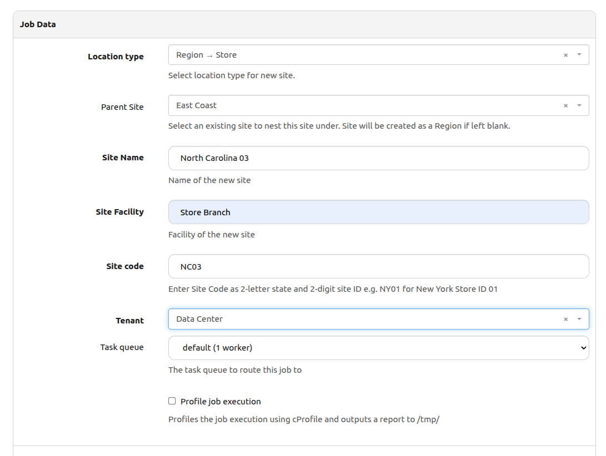
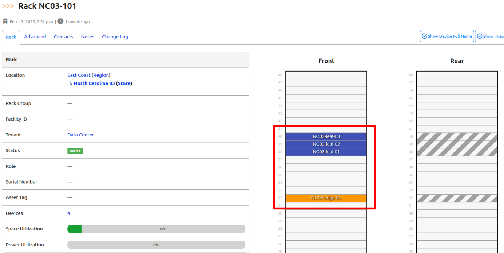
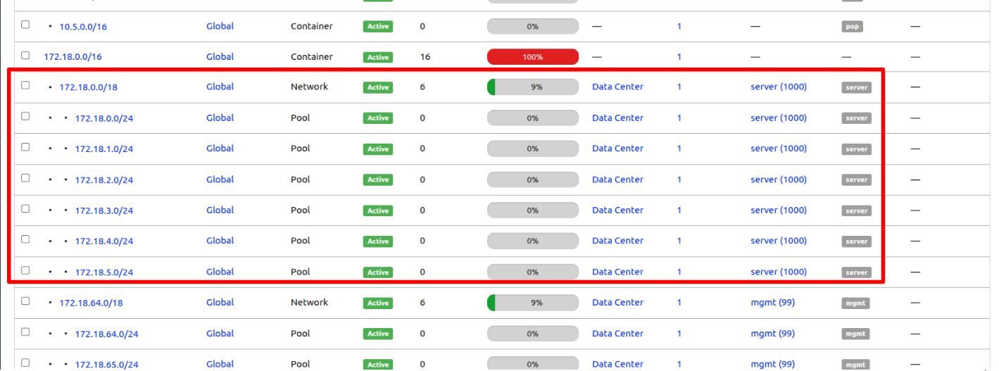
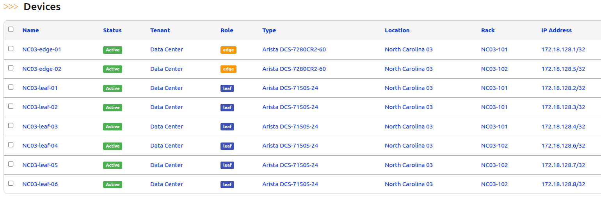
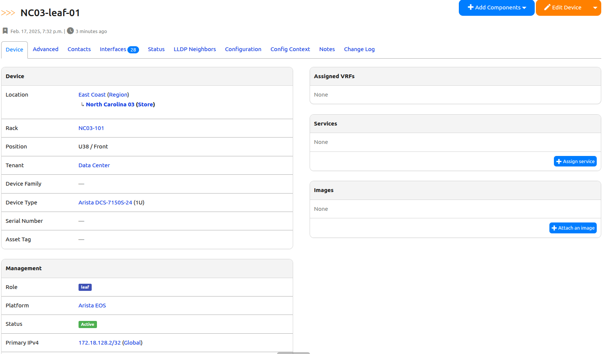
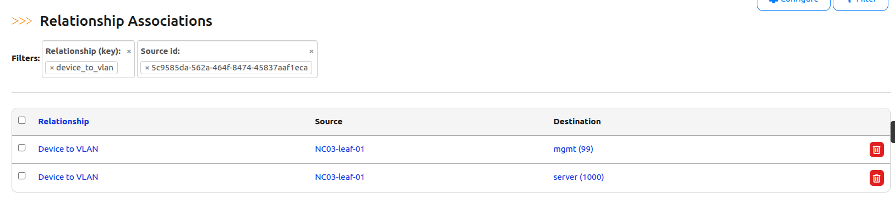

# Design Future Sites (Part 5)

Alright, Part 5 here we go! 

## Let's continue from where we left off on Day 37

✅ Day 36:

    ✅ Create relationships

    ✅ Create the site  

    ✅ Assign a /16 prefix  


✅ Day 37:

    ✅ Create roles and assign prefixes for each role  

    ✅ Create racks

    ✅ Establish rack and VLAN relationships 


✅ Day 38:
- [ ] Create devices  
- [ ] Assign VLANs and IPs to critical interfaces  
- [ ] Establish device and VLAN relationships  

✅ Day 39:
- [ ] Connect circuits to edge devices
- [ ] Cabling devices together 

🔥 We are almost there! Let's get after it!

## Design Future Sites Part 5 Code

If you had to create a new codespace instance make sure you recreate the file from the previous challenge.

```shell
$ docker exec -u root -it nautobot_docker_compose-nautobot-1 bash
root@c9e0fa2a45a0:/opt/nautobot# cd jobs
root@c9e0fa2a45a0:/opt/nautobot/jobs# pwd
/opt/nautobot/jobs
root@c9e0fa2a45a0:/opt/nautobot/jobs# touch create_site_job.py
root@c9e0fa2a45a0:/opt/nautobot/jobs# chown nautobot:nautobot create_site_job.py
```

## Walkthrough

Just like the previous days, we'll start by adding the necessary imports statements. There are no new variables to declare today, but we will be using the existing ```DEVICE_ROLES``` nested dictionary to determine the required attributes as we create devices. It's worth revisiting this for reference.

> [!TIP]
> Remember the network mapping step in Day 36? This is where the ```"platform"``` is critical. If the job fails, double check you have ```"arista_eos"``` in your mapping.

```python

from nautobot.dcim.models.device_components import Interface
from nautobot.dcim.choices import RackTypeChoices, InterfaceTypeChoices
from nautobot.ipam.models import Prefix, VLAN, IPAddress
...
DEVICE_ROLES = {
    "edge": {
        "per_rack": 1,
        "device_type": "DCS-7280CR2-60",
        "platform": "arista_eos",
        "rack_elevation": 32,
        "color": "ff9800",
        "interfaces": [
            ("peer", 2),
            ("leaf", 12),
            ("external", 8),
        ],
    },
    "leaf": {
        "per_rack": 3,
        "device_type": "DCS-7150S-24",
        "platform": "arista_eos",
        "rack_elevation": 38,
        "color": "3f51b5",
        "interfaces": [
            ("edge", 4),
            ("access", 20),
        ],
    },
}

```

For today's tasks, we will tie together elements from previous days and introduce new ones. Let's breakdown each section.

First, we'll loop through the racks we created, then iterate through the data defined in ```DEVICE_ROLES```. Our goal is to systematically create ```"edge"``` and ```"leaf"``` devices inside each rack in a sequential manner.

Remember the global counters from Rack Creation yesterday? This helps track our rack and device numbering. Additionally, we increment the ```"position"``` to ensure devices are installed in unique slots.

```python

        # ----------------------------------------------------------------------------
        # Create Devices
        # ----------------------------------------------------------------------------
        self.devices = {}
        for rack in racks:  
            for role, data in DEVICE_ROLES.items():
                device_role, _ = Role.objects.get_or_create(
                    name=role,
                    color=data.get("color")
                )
                device_role.content_types.add(prefix_ct, vlan_ct)
                device_role.validated_save()
                self.logger.info(f"Created '{device_role}'")

                # Start position for the first device in this rack
                position = data.get("rack_elevation", 1)
                num_devices = data.get("per_rack") 

                for _ in range(num_devices):                
                    device_type = DeviceType.objects.get(model=data.get("device_type"))
                    device_name = f"{site_code}-{role}-{global_device_counter[role]:02}"
                    platform_obj = Platform.objects.get(network_driver=data.get("platform"))

                    device_obj, _ = Device.objects.get_or_create(
                        device_type=device_type, 
                        name=device_name,
                        location=self.site,
                        status=ACTIVE_STATUS,
                        role=device_role,
                        rack=rack,
                        platform=platform_obj,
                        position=position,
                        face="front",
                        tenant=tenant,
                    )
                    device_obj.save()
                    self.logger.info(f"Device {device_name} successfully created in {rack.name}")

                    # Save the device in our inventory for later cabling
                    self.devices[device_obj.name] = device_obj

                    position += 1
                    global_device_counter[role] += 1

```

Next, we want to create the following items. Doing this within the ```for``` loop ensures that each device created are getting these attributes:

1. Find the first useable IP Address from the "loopback" prefix. 
2. Create an IP Address based on this IP Address.
3. Create a Loopback0 interface on the current device.
4. Assign the IP Address to the created Loopback .
5. Assign the Loopback0 IP as the Primary IPv4 address of the device for management purposes.

```python

                    # Assign Loopback IP
                    loopback_prefix = Prefix.objects.get(
                        location=self.site,
                        role=loopback_role,
                    )

                    loopback_available_ip = loopback_prefix.get_first_available_ip()
                    
                    if not loopback_available_ip:
                        self.logger.error(f"No available IPs in prefix {loopback_prefix}")
                        return

                    loopback_ip, _ = IPAddress.objects.get_or_create(
                        address=str(loopback_available_ip),
                        status=ACTIVE_STATUS,
                        tenant=tenant,
                        dns_name=f"{role}-{global_device_counter[role]:02}.{site_code}.{tenant.description}"
                    )

                    loopback_ip.mask_length = 32  # L0 subnets assigned as /32 instead of /18
                    loopback_ip.save()

                    loopback_intf, _ = Interface.objects.get_or_create(
                        name="Loopback0", 
                        type=InterfaceTypeChoices.TYPE_VIRTUAL, 
                        device=device_obj, 
                        status=ACTIVE_STATUS,
                    )

                    loopback_intf.ip_addresses.add(loopback_ip)
                    loopback_intf.save()
                    
                    # Assign L0 IP as primary IPv4 for device
                    device_obj.primary_ip4 = loopback_ip
                    device_obj.save()
                    self.logger.info(f"Created '{loopback_intf}' with '{loopback_ip}' and assigned to {device_name} as primary IP")

                    # Assign Role to Interfaces
                    intfs = iter(Interface.objects.filter(device=device_obj))
                    for int_role, cnt in data.get("interfaces", []):
                        for _ in range(cnt):
                            intf = next(intfs, None)
                            if intf:
                                intf._custom_field_data = {"role": int_role}
                                intf.save()
```

We typically find VLANs in switches (leaf) in production environments. This section ensures the following attributes are also created for the device if the assigned role is ```"leaf"```.

1. Query for prefix assigned to the VLAN role (should be a /18). 
2. Create smaller /24 subnets from the /18 role prefix and assign as "pool".
3. Find the first available IP Address from the role specified ("server" or "mgmt").
4. Create a VLAN interface on the switch and assign an IP Address. 

```python
                    # VLAN Assignment for leaf devices
                    if role == "leaf":
                        for vlan_name, vlan_id in VLAN_INFO.items():                            
                            vlan_role = Role.objects.get(name=vlan_name)

                            vlan_block = Prefix.objects.filter(
                                location=self.site, 
                                status=ACTIVE_STATUS, 
                                role=vlan_role,
                            ).first()
                        
                            # Find Next available Network for the current vlan role i.e. server or mgmt
                            first_avail = vlan_block.get_first_available_prefix()
                            subnet = list(first_avail.subnet(24))[0]
                            vlan_prefix, created = Prefix.objects.get_or_create(
                                prefix=str(subnet),
                                type="pool",
                                status=ACTIVE_STATUS,
                                role=vlan_role,
                                location=self.site,
                                tenant=tenant,
                                vlan=VLAN.objects.get(name=vlan_role)                                
                            )
                            
                            # Create IP Addresses on VLAN Interface
                            vlan_ip, created = IPAddress.objects.get_or_create(
                                address=str(subnet[0]),
                                status=ACTIVE_STATUS,
                                tenant=tenant,
                                dns_name=f"ip-{str(subnet[0]).replace('.', '-')}.{vlan_name}.{site_code}.{tenant.description}",
                            )

                            intf_name = f"vlan{vlan_id}"
                            intf, created = Interface.objects.get_or_create(
                                name=intf_name, 
                                type=InterfaceTypeChoices.TYPE_VIRTUAL, 
                                device=device_obj,                                
                                status=ACTIVE_STATUS
                            )
                            intf.ip_addresses.add(vlan_ip)
                            intf.save()

```

Lastly, we want to make sure that at the end of the ```for``` loop, each device is associated with the correct VLANs and rack assignment.

```python

                            # -----------------------------------------------------------------------
                            # Associate the mgmt and server VLANs with the device
                            # -----------------------------------------------------------------------
                            RelationshipAssociation.objects.get_or_create(
                                relationship=rel_device_vlan,
                                source_type=ContentType.objects.get_for_model(Device),
                                source_id=device_obj.id,
                                destination_type=ContentType.objects.get_for_model(VLAN),
                                destination_id=mgmt_vlan.id
                            )
                            RelationshipAssociation.objects.get_or_create(
                                relationship=rel_device_vlan,
                                source_type=ContentType.objects.get_for_model(Device),
                                source_id=device_obj.id,
                                destination_type=ContentType.objects.get_for_model(VLAN),
                                destination_id=server_vlan.id
                            )

```


## Final Day 38 Code

```python

"""Job to create a new site of type POP."""

from itertools import product
import re

from django.contrib.contenttypes.models import ContentType
import yaml

from nautobot.dcim.models.device_component_templates import InterfaceTemplate
from nautobot.extras.models import Status
from nautobot.extras.models.roles import Role
from nautobot.ipam.models import Prefix, VLAN
from nautobot.tenancy.models import Tenant
from nautobot.extras.models.customfields import CustomField
from nautobot.dcim.models.device_components import Interface

####DAY36####
from nautobot.apps.jobs import Job, ObjectVar, StringVar, register_jobs
from nautobot.dcim.models.locations import Location, LocationType
from ipaddress import IPv4Network
from nautobot.extras.models.relationships import Relationship, RelationshipAssociation
from nautobot.extras.choices import RelationshipTypeChoices

####DAY37####
from nautobot.dcim.models.racks import Rack
from nautobot.dcim.choices import RackTypeChoices

####DAY38####
from nautobot.dcim.models.device_components import Interface
from nautobot.dcim.choices import RackTypeChoices, InterfaceTypeChoices
from nautobot.ipam.models import Prefix, VLAN, IPAddress
from nautobot.dcim.models.devices import Device, DeviceType, Platform, Manufacturer


name = "Data Population Jobs Collection"


PREFIX_ROLES = ["p2p", "loopback", "server", "mgmt", "pop"]
TENANT_NAME = "Data Center"
ACTIVE_STATUS = Status.objects.get(name="Active")
# VLAN definitions: key is also used to look up the role.
VLAN_INFO = {
    "server": 1000,
    "mgmt": 99,
}
CUSTOM_FIELDS = {
    "role": {"models": [Interface], "label": "Role"},
}
# Retrieve the content type for Prefix and VLAN models.

prefix_ct = ContentType.objects.get_for_model(Prefix)
vlan_ct = ContentType.objects.get_for_model(VLAN)

####DAY35####
DEVICE_TYPES_YAML = [
    """
    manufacturer: Arista
    model: DCS-7280CR2-60
    part_number: DCS-7280CR2-60
    u_height: 1
    is_full_depth: false
    comments: '[Arista 7280R Data Sheet](https://www.arista.com/assets/data/pdf/Datasheets/7280R-DataSheet.pdf)'
    interfaces:
        - pattern: "Ethernet[1-60]/[1-4]"
          type: 100gbase-x-qsfp28
        - pattern: "Management1"
          type: 1000base-t
          mgmt_only: true
    """,
    """
    manufacturer: Arista
    model: DCS-7150S-24
    part_number: DCS-7150S-24
    u_height: 1
    is_full_depth: false
    comments: '[Arista 7150 Data Sheet](https://www.arista.com/assets/data/pdf/Datasheets/7150S_Datasheet.pdf)'
    interfaces:
        - pattern: "Ethernet[1-24]"
          type: 10gbase-x-sfpp
        - pattern: "Management1"
          type: 1000base-t
          mgmt_only: true
    """,
]

####DAY36####
POP_PREFIX_SIZE = 16

####DAY37####
ROLE_PREFIX_SIZE = 18
RACK_HEIGHT = 48
RACK_WIDTH = 19
RACK_TYPE = RackTypeChoices.TYPE_4POST
DEVICE_ROLES = {
    "edge": {
        "per_rack": 1,
        "device_type": "DCS-7280CR2-60",
        "platform": "arista_eos",
        "rack_elevation": 32,
        "color": "ff9800",
        "interfaces": [
            ("peer", 2),
            ("leaf", 12),
            ("external", 8),
        ],
    },
    "leaf": {
        "per_rack": 3,
        "device_type": "DCS-7150S-24",
        "platform": "arista_eos",
        "rack_elevation": 38,
        "color": "3f51b5",
        "interfaces": [
            ("edge", 4),
            ("access", 20),
        ],
    },
}


def create_prefix_roles(logger):
    """Create all Prefix Roles defined in PREFIX_ROLES and add content types for IPAM Prefix and VLAN."""

    # Retrieve the content type for Prefix and VLAN models.
    for role in PREFIX_ROLES:
        role_obj, created = Role.objects.get_or_create(name=role)
        # Add the Prefix and VLAN content types to the role.
        role_obj.content_types.add(prefix_ct, vlan_ct)
        role_obj.validated_save()
        logger.info(f"Successfully created role {role} with content types for Prefix and VLAN.")


def create_tenant(logger):
    """Create a tenant with the name defined in TENANT_NAME."""
    tenant_obj, _ = Tenant.objects.get_or_create(name=TENANT_NAME)
    tenant_obj.validated_save()
    logger.info(f"Successfully created Tenant {TENANT_NAME}.")


def create_vlans(logger):
    """Create predefined VLANs defined in VLAN_INFO, and assign the appropriate role."""
    # Get the active status from the database.

    for vlan_name, vlan_id in VLAN_INFO.items():
        # Retrieve the appropriate role based on the VLAN name.
        try:
            role_obj = Role.objects.get(name=vlan_name)
        except Role.DoesNotExist:
            logger.error(f"Role '{vlan_name}' not found. VLAN will be created without a role.")
            role_obj = None

        defaults = {"name": vlan_name, "status": ACTIVE_STATUS}
        if role_obj:
            defaults["role"] = role_obj

        vlan_obj, created = VLAN.objects.get_or_create(
            vid=vlan_id,
            defaults=defaults,
        )
        if created:
            vlan_obj.validated_save()
            logger.info(f"Successfully created VLAN '{vlan_name}' with ID {vlan_id}.")
        else:
            logger.info(f"VLAN '{vlan_name}' with ID {vlan_id} already exists.")

def create_custom_fields(logger):
    """Create all relationships defined in CUSTOM_FIELDS."""
    for cf_name, field in CUSTOM_FIELDS.items():
        try:
            cf = CustomField.objects.get(key=cf_name)
        except CustomField.DoesNotExist:
            cf = CustomField.objects.create(key=cf_name)
            if "label" in field:
                cf.label = field.get("label")
            cf.validated_save()
            logger.info(f"Created custom field '{cf_name}'")
        for model in field["models"]:
            ct = ContentType.objects.get_for_model(model)
            cf.content_types.add(ct)
            cf.validated_save()
            logger.info(f"Added content type {ct} to custom field '{cf_name}'")

def create_device_types(logger):
    """
    Create DeviceType objects from YAML definitions and add interfaces using InterfaceTemplate.
    """

    for device_yaml in DEVICE_TYPES_YAML:
        data = yaml.safe_load(device_yaml)

        manufacturer_name = data.pop("manufacturer", None)
        if not manufacturer_name:
            logger.error("Manufacturer not provided in YAML definition.")
            continue
        manufacturer_obj, _ = Manufacturer.objects.get_or_create(name=manufacturer_name)

        model_name = data.pop("model", None)
        if not model_name:
            logger.error("Model not provided in YAML for manufacturer %s", manufacturer_name)
            continue

        # Create DeviceType
        device_type_defaults = {
            k: data[k] for k in ["part_number", "u_height", "is_full_depth", "comments"] if k in data
        }
        device_type_obj, created = DeviceType.objects.get_or_create(
            manufacturer=manufacturer_obj,
            model=model_name,
            defaults=device_type_defaults,
        )

        if created:
            device_type_obj.validated_save()
            logger.info(f"DeviceType created: {device_type_obj}")
        else:
            logger.info(f"DeviceType already exists: {device_type_obj}")

        # Add interfaces using InterfaceTemplate
        for iface in data.get("interfaces", []):
            pattern = iface.get("pattern")
            iface_type = iface.get("type")
            mgmt_only = iface.get("mgmt_only", False)

            if not pattern or not iface_type:
                logger.error(f"Invalid interface definition in {model_name}: {iface}")
                continue

            # Generate interfaces from range patterns
            interface_names = expand_interface_pattern(pattern)
            for iface_name in interface_names:
                interface_template, created = InterfaceTemplate.objects.get_or_create(
                    device_type=device_type_obj,
                    name=iface_name,
                    defaults={
                        "type": iface_type,
                        "mgmt_only": mgmt_only,
                    },
                )
                if created:
                    logger.info(f"Added interface {iface_name} ({iface_type}) to {model_name}")


def expand_interface_pattern(pattern):
    """
    Expands an interface pattern like 'Ethernet[1-60]/[1-4]' into actual names.
    Supports:
      - Single range: Ethernet[1-24] -> Ethernet1, Ethernet2, ..., Ethernet24
      - Nested range: Ethernet[1-60]/[1-4] -> Ethernet1/1, Ethernet1/2, ..., Ethernet60/4
    """
    match = re.findall(r"\[([0-9]+)-([0-9]+)\]", pattern)
    if not match:
        return [pattern]  # No expansion needed, return as-is.

    # Convert to lists of numbers
    ranges = [list(range(int(start), int(end) + 1)) for start, end in match]

    # Generate names using cartesian product
    expanded_names = []
    base_name = re.sub(r"\[[0-9]+-[0-9]+\]", "{}", pattern)

    for numbers in product(*ranges):
        expanded_names.append(base_name.format(*numbers))

    return expanded_names

####DAY37####
def get_or_create_relationship(label, key, source_model, destination_model, rel_type):
    try:
        rel, created = Relationship.objects.get_or_create(
            key=key,
            defaults={
                "label": label,
                "source_type": ContentType.objects.get_for_model(source_model),
                "destination_type": ContentType.objects.get_for_model(destination_model),
                "type": rel_type,
            }
        )
        return rel
    except Exception as e:
        self.logger.error(f"Error creating relationship {label}: {e}")
        return Relationship.objects.get(key=key)  # Fallback to existing relationship


class CreatePop(Job):
    """Job to create a new site of type POP."""
    
    ####DAY36####
    # Receive input from user about site iformation
    location_type = ObjectVar(
    model=LocationType,
    description = "Select location type for new site."
    )
    parent_site = ObjectVar(
        model=Location,
        required=False,
        description="Select an existing site to nest this site under. Site will be created as a Region if left blank.",
        label="Parent Site"
    )
    site_name = StringVar(description="Name of the new site", label="Site Name")
    site_facility = StringVar(description="Facility of the new site", label="Site Facility")
    
    site_code = StringVar(description="Enter Site Code as 2-letter state and 2-digit site ID e.g. NY01 for New York Store ID 01")
    tenant = ObjectVar(model=Tenant)


    class Meta:
        """Metadata for CreatePop."""

        name = "Create a Point of Presence"
        description = """
        Create a new POP Site.
        A new /16 will automatically be allocated from the 'POP Global Pool' Prefix.
        """    
    ####DAY36####    
    def run(self, location_type, site_name, site_facility, tenant, site_code, parent_site=None):
        """Main function to create a site."""
        # ----------------------------------------------------------------------------
        # Initialize the database with all required objects.
        # We will build on this in the coming days.
        # ----------------------------------------------------------------------------
        create_prefix_roles(self.logger)
        create_tenant(self.logger)
        create_vlans(self.logger)
        create_device_types(self.logger)

        ####DAY37####
        # ----------------------------------------------------------------------------
        # Create Relationships
        # ----------------------------------------------------------------------------
        rel_device_vlan = get_or_create_relationship(
            "Device to VLAN", "device_to_vlan", Device, VLAN, RelationshipTypeChoices.TYPE_MANY_TO_MANY
        )
        rel_rack_vlan = get_or_create_relationship(
            "Rack to VLAN", "rack_to_vlan", Rack, VLAN, RelationshipTypeChoices.TYPE_MANY_TO_MANY
        )

        ####DAY36####
        # ----------------------------------------------------------------------------
        # Create Site
        # ----------------------------------------------------------------------------
        location_type_site, _ = LocationType.objects.get_or_create(name=location_type)
        self.site_name = site_name
        self.site_facility = site_facility
        self.site, created = Location.objects.get_or_create(
            name=site_name,
            location_type=LocationType.objects.get(name=location_type),
            facility=site_facility,
            status=ACTIVE_STATUS,
            parent=parent_site,  # Will be None if not provided
            tenant=tenant
        )
        
        if created:
            message = f"Site '{site_name}' created as a top level Region."
            if parent_site:
                message = f"Site '{site_name}' successfully nested under '{parent_site.name}'."
            self.site.validated_save()
            self.logger.info(message)

            pop_role = Role.objects.get(name="pop")
            self.logger.info(f"Assigning '{site_name}' as '{pop_role}' role.")

            # ----------------------------------------------------------------------------
            # Allocate Prefix for this POP
            # ----------------------------------------------------------------------------
        
            # Find the first available /16 prefix that isn't assigned to a site yet
            pop_prefix = Prefix.objects.filter(
                type="container",
                prefix_length=POP_PREFIX_SIZE,
                status=ACTIVE_STATUS,
                location__isnull=True
            ).first()

            if pop_prefix:
                pop_prefix.location = self.site
                pop_prefix.validated_save()
                self.logger.info(f"Assigned {pop_prefix} to {site_name}.")
            else:
                self.logger.warning("No available /16 prefixes found. Creating a new /16.")
                top_level_prefix = Prefix.objects.filter(
                    type="container",
                    status=ACTIVE_STATUS,
                    prefix_length=8
                ).first()

                # Get the first available prefix within the /8
                first_avail = top_level_prefix.get_first_available_prefix()

                if not first_avail:
                    raise Exception("No available subnets found within the /8 prefix.")

                # Iterate over all possible /16 subnets within the /8 and find the first unassigned one
                for candidate_prefix in IPv4Network(str(first_avail)).subnets(new_prefix=POP_PREFIX_SIZE):
                    if not Prefix.objects.filter(prefix=str(candidate_prefix)).exists():
                        pop_prefix, created = Prefix.objects.get_or_create(
                            prefix=str(candidate_prefix),
                            type="container",
                            location=self.site,
                            status=ACTIVE_STATUS,
                            role=pop_role
                        )
                        pop_prefix.validated_save()
                        self.logger.info(f"Allocated new '{pop_prefix}' for site '{site_name}'.")
                        break
                else:
                    raise Exception("No available /16 prefixes found within the /8 range.")
        else:
            self.logger.warning(f"Site '{site_name}' already exists.") 

        ####DAY37####
        # ----------------------------------------------------------------------------
        # Create and assign prefixes to roles in POP
        # ----------------------------------------------------------------------------
        
        site_subnets = IPv4Network(str(pop_prefix)).subnets(new_prefix=ROLE_PREFIX_SIZE)
        server_subnet = next(site_subnets)
        mgmt_subnet = next(site_subnets)
        loopback_subnet = next(site_subnets)
        p2p_subnet = next(site_subnets)

        # Assign new subnets to roles
        server_role = Role.objects.get(name="server")
        server_prefix, created = Prefix.objects.get_or_create(
            prefix=str(server_subnet),
            type="network",
            role=server_role,
            parent=pop_prefix,
            status=ACTIVE_STATUS,
            location=self.site,
            tenant=tenant,
            vlan=VLAN.objects.get(name=server_role)
        )
        self.logger.info(f"'{server_prefix}' assigned to '{server_role}'.")

        mgmt_role = Role.objects.get(name="mgmt")
        mgmt_prefix, created = Prefix.objects.get_or_create(
            prefix=str(mgmt_subnet),
            type="network",
            role=mgmt_role,
            parent=pop_prefix,
            status=ACTIVE_STATUS,
            location=self.site,
            tenant=tenant,
            vlan=VLAN.objects.get(name=mgmt_role)
        )
        self.logger.info(f"'{mgmt_prefix}' assigned to '{mgmt_role}'.")

        loopback_role = Role.objects.get(name="loopback")
        loopback_prefix, created = Prefix.objects.get_or_create(
            prefix=str(loopback_subnet),
            type="network",
            role=loopback_role,
            parent=pop_prefix,
            status=ACTIVE_STATUS,
            location=self.site,
            tenant=tenant
        )
        self.logger.info(f"'{loopback_prefix}' assigned to '{loopback_role}'.")

        p2p_role = Role.objects.get(name="p2p")
        p2p_prefix, created = Prefix.objects.get_or_create(
            prefix=str(p2p_subnet),
            type="network",
            role=p2p_role,
            parent=pop_prefix,
            status=ACTIVE_STATUS,
            location=self.site,
            tenant=tenant
        )
        self.logger.info(f"'{p2p_prefix}' assigned to '{p2p_role}'.") 

        # ----------------------------------------------------------------------------
        # Create Racks
        # ----------------------------------------------------------------------------
        # Initialize global counters
        global_device_counter = {role: 1 for role in DEVICE_ROLES}  # Keeps track of numbering
        racks = []  # Store created racks so we can iterate later        

        # Create racks
        num_rack = 2 # We can modify this to be an input variable if a site needs more than 2
        for num in range(1, num_rack + 1):
            rack_name = f"{site_code.upper()}-{100 + num}"
            rack, created = Rack.objects.get_or_create(
                name=rack_name,
                location=self.site,
                u_height=RACK_HEIGHT,
                width=RACK_WIDTH,
                type=RACK_TYPE,
                status=ACTIVE_STATUS,
                tenant=tenant,
            )
            racks.append(rack)
            self.logger.info(f"Successfully created {rack_name}.")

        # ---------------------------------------------------------------------------
        # Associate the mgmt and server VLANs with each rack
        # ---------------------------------------------------------------------------
        mgmt_vlan = VLAN.objects.get(name="mgmt")
        server_vlan = VLAN.objects.get(name="server")
        for rack in racks:
            RelationshipAssociation.objects.get_or_create(
                relationship=rel_rack_vlan,
                source_type=ContentType.objects.get_for_model(Rack),
                source_id=rack.id,
                destination_type=ContentType.objects.get_for_model(VLAN),
                destination_id=mgmt_vlan.id
            )
            RelationshipAssociation.objects.get_or_create(
                relationship=rel_rack_vlan,
                source_type=ContentType.objects.get_for_model(Rack),
                source_id=rack.id,
                destination_type=ContentType.objects.get_for_model(VLAN),
                destination_id=server_vlan.id
            )

        # ----------------------------------------------------------------------------
        # Create Devices
        # ----------------------------------------------------------------------------
        self.devices = {}
        for rack in racks:  
            for role, data in DEVICE_ROLES.items():
                device_role, _ = Role.objects.get_or_create(
                    name=role,
                    color=data.get("color")
                )
                device_role.content_types.add(prefix_ct, vlan_ct)
                device_role.validated_save()
                self.logger.info(f"Created '{device_role}'")

                # Start position for the first device in this rack
                position = data.get("rack_elevation", 1)
                num_devices = data.get("per_rack") 

                for _ in range(num_devices):                
                    device_type = DeviceType.objects.get(model=data.get("device_type"))
                    device_name = f"{site_code}-{role}-{global_device_counter[role]:02}"
                    platform_obj = Platform.objects.get(network_driver=data.get("platform"))

                    device_obj, _ = Device.objects.get_or_create(
                        device_type=device_type, 
                        name=device_name,
                        location=self.site,
                        status=ACTIVE_STATUS,
                        role=device_role,
                        rack=rack,
                        platform=platform_obj,
                        position=position,
                        face="front",
                        tenant=tenant,
                    )
                    device_obj.save()
                    self.logger.info(f"Device {device_name} successfully created in {rack.name}")

                    # Save the device in our inventory for later cabling
                    self.devices[device_obj.name] = device_obj

                    position += 1
                    global_device_counter[role] += 1
        
                    # Assign Loopback IP
                    loopback_prefix = Prefix.objects.get(
                        location=self.site,
                        role=loopback_role,
                    )

                    loopback_available_ip = loopback_prefix.get_first_available_ip()
                    
                    if not loopback_available_ip:
                        self.logger.error(f"No available IPs in prefix {loopback_prefix}")
                        return

                    loopback_ip, _ = IPAddress.objects.get_or_create(
                        address=str(loopback_available_ip),
                        status=ACTIVE_STATUS,
                        tenant=tenant,
                        dns_name=f"{role}-{global_device_counter[role]:02}.{site_code}.{tenant.description}"
                    )

                    loopback_ip.mask_length = 32  # L0 subnets assigned as /32 instead of /18
                    loopback_ip.save()

                    loopback_intf, _ = Interface.objects.get_or_create(
                        name="Loopback0", 
                        type=InterfaceTypeChoices.TYPE_VIRTUAL, 
                        device=device_obj, 
                        status=ACTIVE_STATUS,
                    )

                    loopback_intf.ip_addresses.add(loopback_ip)
                    loopback_intf.save()
                    
                    # Assign L0 IP as primary IPv4 for device
                    device_obj.primary_ip4 = loopback_ip
                    device_obj.save()
                    self.logger.info(f"Created '{loopback_intf}' with '{loopback_ip}' and assigned to {device_name} as primary IP")

                    # Assign Role to Interfaces
                    intfs = iter(Interface.objects.filter(device=device_obj))
                    for int_role, cnt in data.get("interfaces", []):
                        for _ in range(cnt):
                            intf = next(intfs, None)
                            if intf:
                                intf._custom_field_data = {"role": int_role}
                                intf.save()
                    
                    # VLAN Assignment for leaf devices
                    if role == "leaf":
                        for vlan_name, vlan_id in VLAN_INFO.items():                            
                            vlan_role = Role.objects.get(name=vlan_name)

                            vlan_block = Prefix.objects.filter(
                                location=self.site, 
                                status=ACTIVE_STATUS, 
                                role=vlan_role,
                            ).first()
                        
                            # Find Next available Network for the current vlan role i.e. server or mgmt
                            first_avail = vlan_block.get_first_available_prefix()
                            subnet = list(first_avail.subnet(24))[0]
                            vlan_prefix, created = Prefix.objects.get_or_create(
                                prefix=str(subnet),
                                type="pool",
                                status=ACTIVE_STATUS,
                                role=vlan_role,
                                location=self.site,
                                tenant=tenant,
                                vlan=VLAN.objects.get(name=vlan_role)                                
                            )
                            
                            # Create IP Addresses on VLAN Interface
                            vlan_ip, created = IPAddress.objects.get_or_create(
                                address=str(subnet[0]),
                                status=ACTIVE_STATUS,
                                tenant=tenant,
                                dns_name=f"ip-{str(subnet[0]).replace('.', '-')}.{vlan_name}.{site_code}.{tenant.description}",
                            )

                            intf_name = f"vlan{vlan_id}"
                            intf, created = Interface.objects.get_or_create(
                                name=intf_name, 
                                type=InterfaceTypeChoices.TYPE_VIRTUAL, 
                                device=device_obj,                                
                                status=ACTIVE_STATUS
                            )
                            intf.ip_addresses.add(vlan_ip)
                            intf.save()

                            # -----------------------------------------------------------------------
                            # Associate the mgmt and server VLANs with the device
                            # -----------------------------------------------------------------------
                            RelationshipAssociation.objects.get_or_create(
                                relationship=rel_device_vlan,
                                source_type=ContentType.objects.get_for_model(Device),
                                source_id=device_obj.id,
                                destination_type=ContentType.objects.get_for_model(VLAN),
                                destination_id=mgmt_vlan.id
                            )
                            RelationshipAssociation.objects.get_or_create(
                                relationship=rel_device_vlan,
                                source_type=ContentType.objects.get_for_model(Device),
                                source_id=device_obj.id,
                                destination_type=ContentType.objects.get_for_model(VLAN),
                                destination_id=server_vlan.id
                            )

register_jobs(CreatePop)


```

🚀 Now we are ready to create devices!🚀 



Once the Job completes, let's verify elements of our job to make sure that it executed properly!

Head over to "LOCATIONS->Racks" to verify if racks and devices are created how we want it. What we want to see is rack {site_code}-101 should house edge-01 and leaf-01 to 03 devices.



Subsequently, rack {site_code}102 should house edge-02 and leaf-04 to 06 devices.


What about our prefixes?

Here we can see that they are properly created as a /24 "pool" subnet with all the proper attributes.



Let's check our devices to make sure it has all the attributes we want.



Click on one of them to verify key information such as Loopback0 IP, Primary IPv4, role, platform, etc.



Lastly, we want to make sure all the VLAN association per device is correct. While on the device screen, scroll down to Relationships->VLANs and you should see both associations in there.



## Recap

Seeing all these green check marks gives us the awesome sense of accomplishment! That was a lot for today but it's definitely worth it!

✅ Day 36:

    ✅ Create relationships

    ✅ Create the site  

    ✅ Assign a /16 prefix  


✅ Day 37:

    ✅ Create roles and assign prefixes for each role  

    ✅ Create racks

    ✅ Establish rack and VLAN relationships 


✅ Day 38:

    ✅ Create devices  
    
    ✅ Assign VLANs and IPs to critical interfaces  
    
    ✅ Establish device and VLAN relationships 


✅ Day 39:
- [ ] Connect circuits to edge devices
- [ ] Cabling devices together 

## Day 38 To Do

Remember to stop the codespace instance on [https://github.com/codespaces/](https://github.com/codespaces/).

Go ahead and post a screenshot of the successful execution of the new job on a social media of your choice, make sure you use the tag `#100DaysOfNautobot` `#JobsToBeDone` and tag `@networktocode`, so we can share your progress!

Final day of building a site in Nautobot for Day 39! See you tomorrow!

[X/Twitter](<https://twitter.com/intent/tweet?url=https://github.com/nautobot/100-days-of-nautobot&text=I+jst+completed+Day+38+of+the+100+days+of+nautobot+!&hashtags=100DaysOfNautobot,JobsToBeDone>)

[LinkedIn](https://www.linkedin.com/) (Copy & Paste: I just completed Day 38 of 100 Days of Nautobot, https://github.com/nautobot/100-days-of-nautobot, challenge! @networktocode #JobsToBeDone #100DaysOfNautobot)
