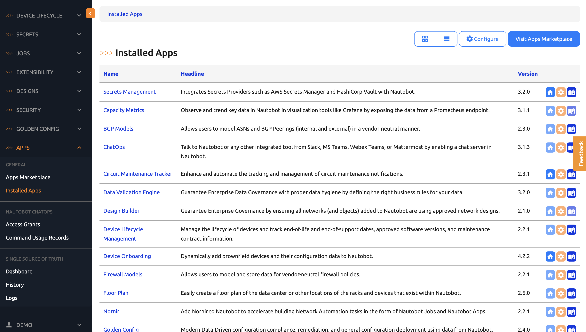
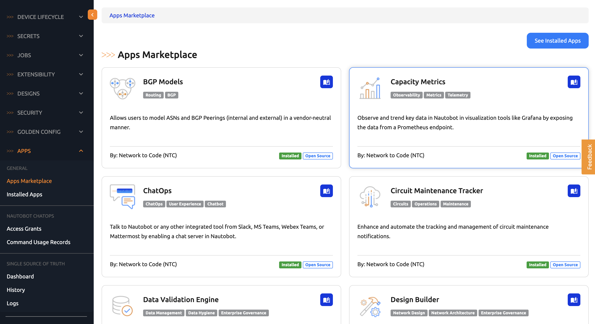
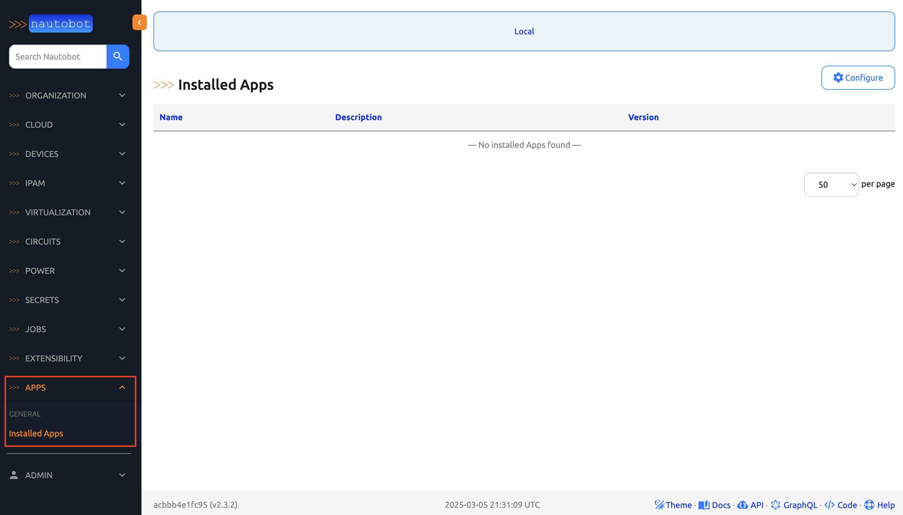
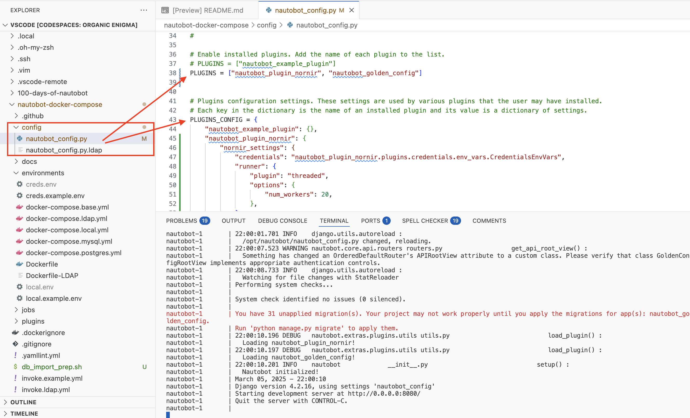
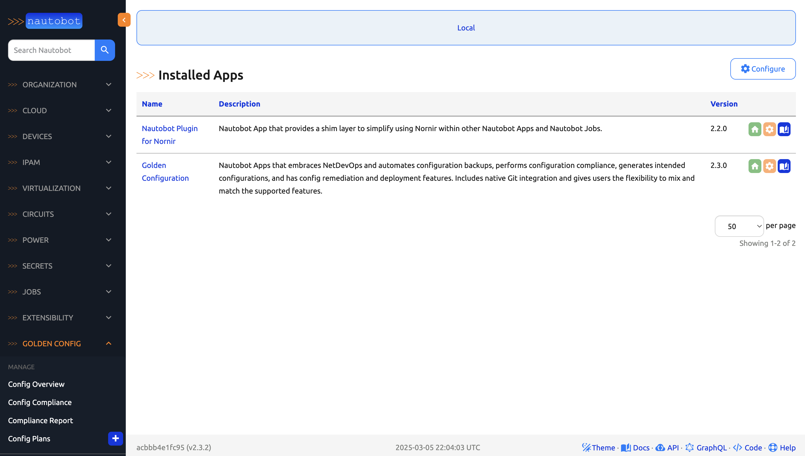
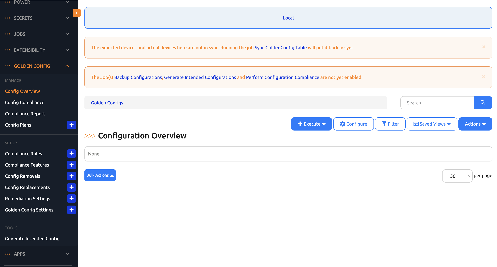
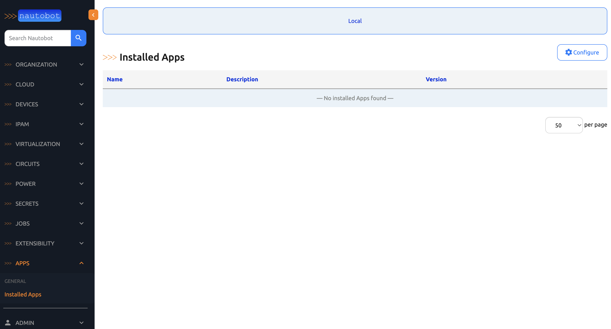

# Installing and Uninstalling Nautobot Apps

The [Nautobot Apps Overview](https://docs.nautobot.com/projects/core/en/stable/apps/) page is a great place to start with the documentation on some popular Nautobot apps. 

Another place to see the ever expanding list of applications can be viewed on the [Nautobot app ecosystem page](https://networktocode.com/nautobot/nautobot-apps/). 

In today's challenge, we will see how we can install and uninstall an existing Nautobot app from [PyPI](https://pypi.org/). 

## Explore Apps on demo.nautobot.com

One of the features offered on [https://demo.nautobot.com/](https://demo.nautobot.com/) is the ability to see some popular Nautobot apps pre-installed on Nautobot instance under `Apps -> Installed Apps`: 



This is a great to try out some apps in a low-risk way. Under `Apps -> Apps Marketplace` you can find the links to the documentation and brief description of the apps: 



But if you want to behind the scenes on the apps, we will need to install them on our own nautobot instance.

## Environment Setup

We will use `scenario 1` for the lab, please take a look at [scenario_1_setup](../Lab_Setup/scenario_1_setup/README.md) for the setup refresher. 

Below is a summary of the steps once you are in Codespace, please skip `invoke build` and `invoke db-import` if the environment was restarted from previous days and those steps were already taken: 

```
$ cd nautobot-docker-compose/
$ poetry shell
$ invoke build
$ invoke db-import
$ invoke debug
```

We do not need Containerlab for today's challenge. 

## Install Golden Config App

If we take a look at our instance, we do not see any installed apps: 



We can reference the [Nautobot Golden Config Install Guide](https://docs.nautobot.com/projects/golden-config/en/latest/admin/install/#install-guide) documentation for the user guide on installation. 

Attach to the nautobot container: 

```
$ docker exec -it nautobot_docker_compose-nautobot-1 bash
```

We can use `pip install` to install the package: 

```
nautobot@acbbb4e1fc95:~$ pip install nautobot-golden-config
Defaulting to user installation because normal site-packages is not writeable
Collecting nautobot-golden-config
  Downloading nautobot_golden_config-2.3.0-py3-none-any.whl.metadata (8.9 kB)
Collecting deepdiff!=6.0,!=6.1,<8,>=5.5.0 (from nautobot-golden-config)
  Downloading deepdiff-7.0.1-py3-none-any.whl.metadata (6.8 kB)
...
Successfully installed anyio-4.5.2 contourpy-1.1.1 cycler-0.12.1 deepdiff-7.0.1 django-pivot-1.9.0 fonttools-4.56.0 hier-config-2.3.1 httpcore-1.0.7 httpx-0.27.0 importlib-metadata-4.13.0 kiwisolver-1.4.7 matplotlib-3.7.5 mypy_extensions-1.0.0 nautobot-capacity-metrics-3.1.1 nautobot-golden-config-2.3.0 nautobot-plugin-nornir-2.2.0 nornir-3.4.1 nornir-jinja2-0.2.0 nornir-napalm-0.5.0 nornir-nautobot-3.2.0 nornir-netmiko-1.0.1 nornir-utils-0.2.0 numpy-1.24.4 ordered-set-4.1.0 packaging-23.2 pynautobot-2.4.2 ruamel.yaml-0.18.10 ruamel.yaml.clib-0.2.8 setuptools-75.3.0 types-pyyaml-6.0.12.20241230 urllib3-2.2.3 xmldiff-2.7.0
```

As explained in the guide, we will need to add the app to the `PLUGIN` list as well as the `PLUGIN_CONFIG` in `nautobot_config.py`. 

Find the `nautobot_config.py` under `nautobot-docker-compose`:



Then copy and paste the configuration: 

```
...
# Enable installed plugins. Add the name of each plugin to the list.
# PLUGINS = ["nautobot_example_plugin"]
PLUGINS = ["nautobot_plugin_nornir", "nautobot_golden_config"]


# Plugins configuration settings. These settings are used by various plugins that the user may have installed.
# Each key in the dictionary is the name of an installed plugin and its value is a dictionary of settings.
PLUGINS_CONFIG = {
    "nautobot_example_plugin": {},
    "nautobot_plugin_nornir": {
        "nornir_settings": {
            "credentials": "nautobot_plugin_nornir.plugins.credentials.env_vars.CredentialsEnvVars",
            "runner": {
                "plugin": "threaded",
                "options": {
                    "num_workers": 20,
                },
            },
        },
    },
    "nautobot_golden_config": {
        "per_feature_bar_width": 0.15,
        "per_feature_width": 13,
        "per_feature_height": 4,
        "enable_backup": True,
        "enable_compliance": True,
        "enable_intended": True,
        "enable_sotagg": True,
        "enable_plan": True,
        "enable_deploy": True,
        "enable_postprocessing": False,
        "sot_agg_transposer": None,
        "postprocessing_callables": [],
        "postprocessing_subscribed": [],
        "jinja_env": {
            "undefined": "jinja2.StrictUndefined",
            "trim_blocks": True,
            "lstrip_blocks": False,
        },
        # "default_deploy_status": "Not Approved",
        # "get_custom_compliance": "my.custom_compliance.func"
    },
}
...
```

The nautobot instance should automatically detect the change in configuration and restarted. 

The `Golden Config` should now appear on the navigation bar and under `Installed Apps`: 



We should perform a `invoke post-upgrade` to make sure the database table are created: 

```
(nautobot-docker-compose-py3.10) @ericchou1 ➜ ~/nautobot-docker-compose (main) $ invoke post-upgrade
```

Feel free to expand the navigation menu and click around: 



## Uninstall Golden Config App

Typically, we need to be careful about uninstall applications in production because it involves rolling back databases. But in our sandbox environment we are safe to perform the steps. 

We can follow the [uninstall instruction](https://docs.nautobot.com/projects/golden-config/en/latest/admin/uninstall/) to uninstall the application using `nautobot-server migrate nautobot_golden_config zero` and `pip3 uninstall nautobot-golden-config`. 

We should remove the previous configuration in `nautobot_config.py`. 

Let's roll back any database migration specific to the application: 

```
(nautobot-docker-compose-py3.10) @ericchou1 ➜ ~/nautobot-docker-compose (main) $ docker exec -it nautobot_docker_compose-nautobot-1 bash

nautobot@acbbb4e1fc95:~$ nautobot-server migrate nautobot_golden_config zero


22:12:32.910 WARNING nautobot.core.api.routers routers.py                   get_api_root_view() :
  Something has changed an OrderedDefaultRouter's APIRootView attribute to a custom class. Please verify that class GoldenConfigRootView implements appropriate authentication controls.
Operations to perform:
  Unapply all migrations: nautobot_golden_config
Running migrations:
  Rendering model states...
...
```

Then we can uninstall the app: 

```
nautobot@acbbb4e1fc95:~$ pip3 uninstall nautobot-golden-config
Found existing installation: nautobot-golden-config 2.3.0
Uninstalling nautobot-golden-config-2.3.0:
  Would remove:
    /opt/nautobot/.local/lib/python3.8/site-packages/nautobot_golden_config-2.3.0.dist-info/*
    /opt/nautobot/.local/lib/python3.8/site-packages/nautobot_golden_config/*
Proceed (Y/n)? y
  Successfully uninstalled nautobot-golden-config-2.3.0

```

Just like that, the Golden Config app is removed: 



Great job in completing today's challenge! 

## Day 41 To Do

Remember to stop the codespace instance on [https://github.com/codespaces/](https://github.com/codespaces/). 

Go ahead and share your thoughts on installing and uninstalling Nautobot app on a social media of your choice, make sure you use the tag `#100DaysOfNautobot` `#JobsToBeDone` and tag `@networktocode`, so we can share your progress! 

In tomorrow's challenge, we will be "baking a cookie." Done worry, no culinary skill is required. See you tomorrow! 

[X/Twitter](<https://twitter.com/intent/tweet?url=https://github.com/nautobot/100-days-of-nautobot&text=I+jst+completed+Day+41+of+the+100+days+of+nautobot+challenge+!&hashtags=100DaysOfNautobot,JobsToBeDone>)

[LinkedIn](https://www.linkedin.com/) (Copy & Paste: I just completed Day 41 of 100 Days of Nautobot, https://github.com/nautobot/100-days-of-nautobot-challenge, challenge! @networktocode #JobsToBeDone #100DaysOfNautobot) 