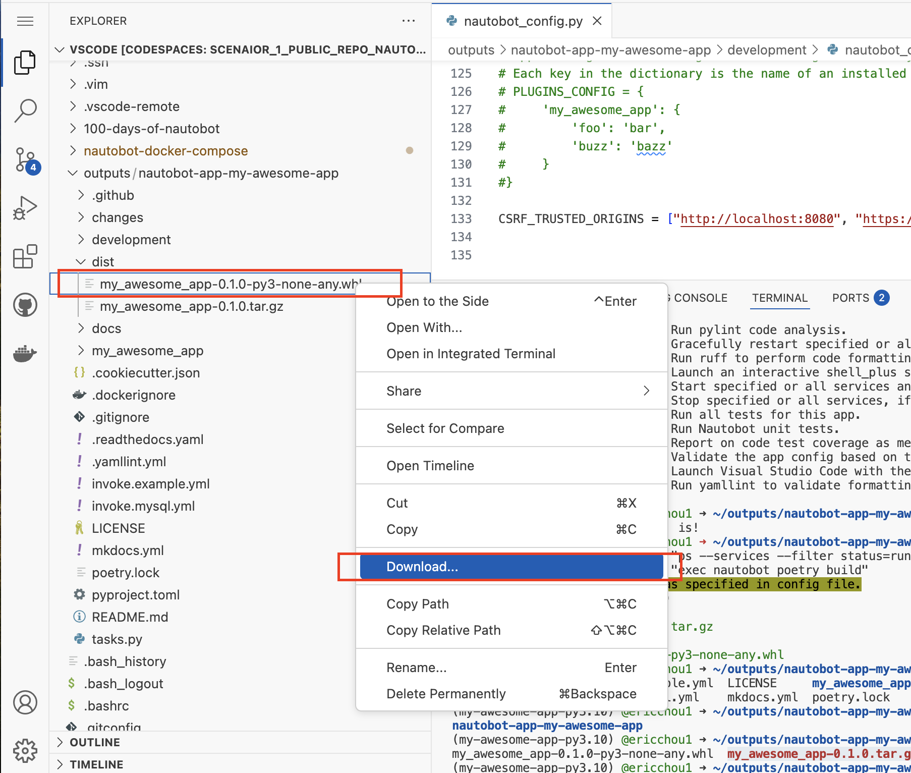

# App Bundled and Distribution (Part 1)

In a typical app development cycle, we will need a way to distribute the application once it is completed. We saw in [Day 41](../Day041_Installing_and_Uninstalling_Apps/README.md) how easy it was to install an application once it is on PyPI, but how do we package the application in a way to be able to upload to PyPI? The last part of distribution is the focus of Day 44 (today) and Day 45 (tomorrow).

In summary: 

- Day 42: Create a Nautobot App using Cookiecutter. 
- Day 43: Understand the App structure and start developing. 
- Day 44 (Today): Bundle the App into a wheel file that can be downloaded locally or upload to PyPI. 
- Day 45 (Tomorrow): Install this app on another Nautobot instance. 

Ready? Let's get started. 

## Environment Setup

Restart the Codespace instance from [Day 43](../Day042_Baking_an_App_Cookie/README.md) and start the app development environment: 

```
@ericchou1 ➜ ~ $ cd outputs/nautobot-app-my-awesome-app/
@ericchou1 ➜ ~/outputs/nautobot-app-my-awesome-app $ poetry shell
Spawning shell within /home/vscode/.cache/pypoetry/virtualenvs/my-awesome-app-TNUNvfeN-py3.10
@ericchou1 ➜ ~/outputs/nautobot-app-my-awesome-app $ . /home/vscode/.cache/pypoetry/virtualenvs/my-awesome-app-TNUNvfeN-py3.10/bin/activate
(my-awesome-app-py3.10) @ericchou1 ➜ ~/outputs/nautobot-app-my-awesome-app $

(my-awesome-app-py3.10) @ericchou1 ➜ ~/outputs/nautobot-app-my-awesome-app $ invoke debug
Starting  in debug mode...
Running docker compose command "up"
 Container my-awesome-app-redis-1  Created
 Container my-awesome-app-db-1  Created
 Container my-awesome-app-nautobot-1  Created
...
nautobot-1  | Django version 4.2.20, using settings 'nautobot_config'
nautobot-1  | Starting development server at http://0.0.0.0:8080/
nautobot-1  | Quit the server with CONTROL-C.
nautobot-1  | 
```

We are ready to package our application for distribution. 

## Example

The `pyproject.toml` contains the information we created during the initial setup, including version, description, author, etc.: 

```
@ericchou1 ➜ ~/outputs/nautobot-app-my-awesome-app $ cat pyproject.toml 
[tool.poetry]
name = "my-awesome-app"
version = "0.1.0"
description = "My Awesome Application"
authors = ["Eric Chou <email@domain.com>"]
license = "Apache-2.0"
readme = "README.md"
homepage = "https://github.com/nautobot/nautobot-app-my-awesome-app"
repository = "https://github.com/nautobot/nautobot-app-my-awesome-app"
documentation = "https://docs.nautobot.com/projects/my-awesome-app/en/latest/"
keywords = ["nautobot", "nautobot-app", "nautobot-plugin"]
classifiers = [
    "Intended Audience :: Developers",
    "Development Status :: 5 - Production/Stable",
    "Programming Language :: Python :: 3",
    "Programming Language :: Python :: 3.8",
    "Programming Language :: Python :: 3.9",
    "Programming Language :: Python :: 3.10",
    "Programming Language :: Python :: 3.11",
    "Programming Language :: Python :: 3.12",
]
packages = [
    { include = "my_awesome_app" },
]
include = [
    # Poetry by default will exclude files that are in .gitignore
    "my_awesome_app/static/my_awesome_app/docs/**/*",
]

[tool.poetry.dependencies]
python = ">=3.8,<3.13"
# Used for local development
nautobot = "^2.0.0"

[tool.poetry.group.dev.dependencies]
coverage = "*"
django-debug-toolbar = "*"
invoke = "*"
ipython = "*"
pylint = "*"
pylint-django = "*"
pylint-nautobot = "*"
ruff = "0.5.5"
yamllint = "*"
toml = "*"
Markdown = "*"
# Render custom markdown for version added/changed/remove notes
markdown-version-annotations = "1.0.1"
# Rendering docs to HTML
mkdocs = "1.6.0"
# Material for MkDocs theme
mkdocs-material = "9.5.32"
# Automatic documentation from sources, for MkDocs
mkdocstrings = "0.25.2"
mkdocstrings-python = "1.10.8"
mkdocs-autorefs = "1.2.0"
griffe = "1.1.1"
towncrier = "~23.6.0"
to-json-schema = "*"
jsonschema = "*"

[tool.poetry.extras]
all = [
]

[tool.pylint.master]
# Include the pylint_django plugin to avoid spurious warnings about Django patterns
load-plugins = "pylint_django, pylint_nautobot"
ignore = ".venv"

[tool.pylint.basic]
# No docstrings required for private methods (Pylint default), or for test_ functions, or for inner Meta classes.
no-docstring-rgx = "^(_|test_|Meta$)"

[tool.pylint.messages_control]
disable = """,
    line-too-long
"""

[tool.pylint.miscellaneous]
# Don't flag TODO as a failure, let us commit with things that still need to be done in the code
notes = """,
    FIXME,
    XXX,
    """

[tool.pylint-nautobot]
supported_nautobot_versions = [
    "2.0.0"
]

[tool.ruff]
line-length = 120
target-version = "py38"

[tool.ruff.lint]
select = [
    "D",  # pydocstyle
    "F", "E", "W",  # flake8
    "S",  # bandit
    "I",  # isort
]
ignore = [
    # warning: `one-blank-line-before-class` (D203) and `no-blank-line-before-class` (D211) are incompatible.
    "D203", # 1 blank line required before class docstring

    # D212 is enabled by default in google convention, and complains if we have a docstring like:
    # """
    # My docstring is on the line after the opening quotes instead of on the same line as them.
    # """
    # We've discussed and concluded that we consider this to be a valid style choice.
    "D212", # Multi-line docstring summary should start at the first line
    "D213", # Multi-line docstring summary should start at the second line

    # Produces a lot of issues in the current codebase.
    "D401", # First line of docstring should be in imperative mood
    "D407", # Missing dashed underline after section
    "D416", # Section name ends in colon
    "E501", # Line too long
]

[tool.ruff.lint.pydocstyle]
convention = "google"

[tool.ruff.lint.per-file-ignores]
"my_awesome_app/migrations/*" = [
    "D",
]
"my_awesome_app/tests/*" = [
    "D",
    "S"
]

[build-system]
requires = ["poetry_core>=1.0.0"]
build-backend = "poetry.core.masonry.api"

[tool.towncrier]
package = "my_awesome_app"
directory = "changes"
filename = "docs/admin/release_notes/version_X.Y.md"
template = "development/towncrier_template.j2"
start_string = "<!-- towncrier release notes start -->"
issue_format = "[#{issue}](https://github.com/nautobot/nautobot-app-my-awesome-app/issues/{issue})"

[[tool.towncrier.type]]
directory = "security"
name = "Security"
showcontent = true

[[tool.towncrier.type]]
directory = "added"
name = "Added"
showcontent = true

[[tool.towncrier.type]]
directory = "changed"
name = "Changed"
showcontent = true

[[tool.towncrier.type]]
directory = "deprecated"
name = "Deprecated"
showcontent = true

[[tool.towncrier.type]]
directory = "removed"
name = "Removed"
showcontent = true

[[tool.towncrier.type]]
directory = "fixed"
name = "Fixed"
showcontent = true

[[tool.towncrier.type]]
directory = "dependencies"
name = "Dependencies"
showcontent = true

[[tool.towncrier.type]]
directory = "documentation"
name = "Documentation"
showcontent = true

[[tool.towncrier.type]]
directory = "housekeeping"
name = "Housekeeping"
showcontent = true
```

We can use the `invoke generate-package` to generate wheel file that is standard across Python community as an all-in-one installation package: 

```
(my-awesome-app-py3.10) @ericchou1 ➜ ~/outputs/nautobot-app-my-awesome-app $ invoke generate-packages
Running docker compose command "ps --services --filter status=running"
Running docker compose command "exec nautobot poetry build"
Skipping virtualenv creation, as specified in config file.
Building my-awesome-app (0.1.0)
  - Building sdist
  - Built my_awesome_app-0.1.0.tar.gz
  - Building wheel
  - Built my_awesome_app-0.1.0-py3-none-any.whl
```

Under the `dist/` folder we have the `my_awesome_app-0.1.0-py3-none-any.whl` and `my_awesome_app-0.1.0.tar.gz` files: 

```
(my-awesome-app-py3.10) @ericchou1 ➜ ~/outputs/nautobot-app-my-awesome-app $ ls
changes  development  dist  docs  invoke.example.yml  invoke.mysql.yml  LICENSE  mkdocs.yml  my_awesome_app  poetry.lock  pyproject.toml  README.md  tasks.py
(my-awesome-app-py3.10) @ericchou1 ➜ ~/outputs/nautobot-app-my-awesome-app $ ls dist/
my_awesome_app-0.1.0-py3-none-any.whl  my_awesome_app-0.1.0.tar.gz
(my-awesome-app-py3.10) @ericchou1 ➜ ~/outputs/nautobot-app-my-awesome-app $
```

Let's right-click on the wheel file and download the file to a location on our computer. We will come back tomorrow and install the package on a separate Nautobot instance. 



## Day 44 To Do

Remember to stop the codespace instance on [https://github.com/codespaces/](https://github.com/codespaces/). 

Go ahead and post a screenshot of the new `dist/` folder you created from today's challenge on a social media of your choice, make sure you use the tag `#100DaysOfNautobot` `#JobsToBeDone` and tag `@networktocode`, so we can share your progress! 

In tomorrow's challenge, we will be installing this package. See you tomorrow! 

[X/Twitter](<https://twitter.com/intent/tweet?url=https://github.com/nautobot/100-days-of-nautobot&text=I+jst+completed+Day+44+of+the+100+days+of+nautobot+challenge+!&hashtags=100DaysOfNautobot,JobsToBeDone>)

[LinkedIn](https://www.linkedin.com/) (Copy & Paste: I just completed Day 44 of 100 Days of Nautobot, https://github.com/nautobot/100-days-of-nautobot-challenge, challenge! @networktocode #JobsToBeDone #100DaysOfNautobot) 