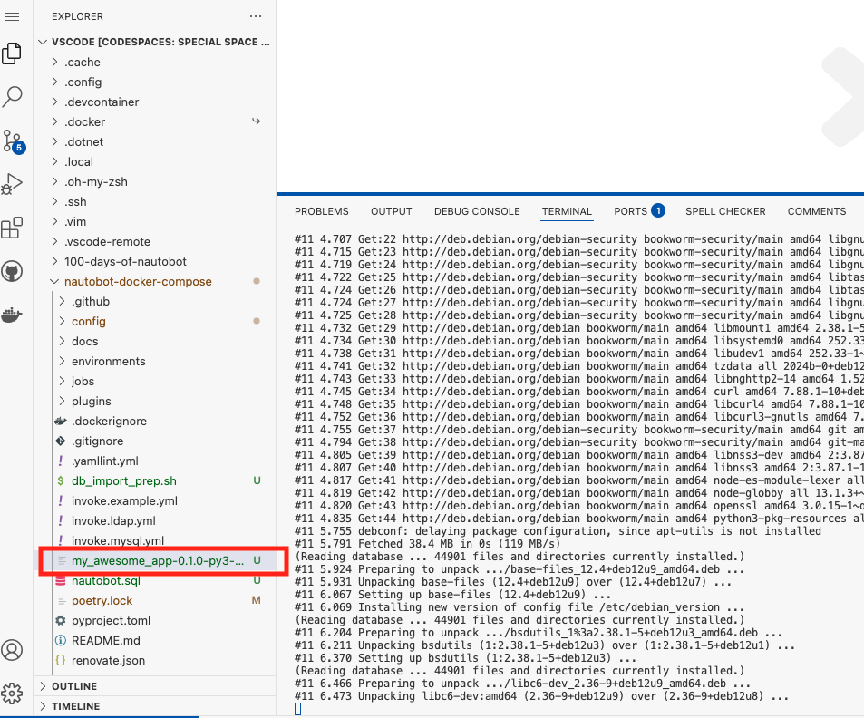
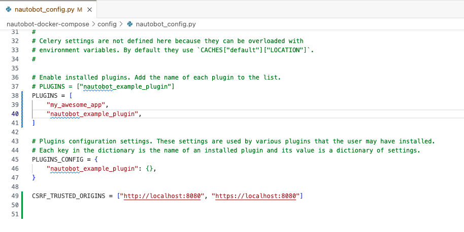
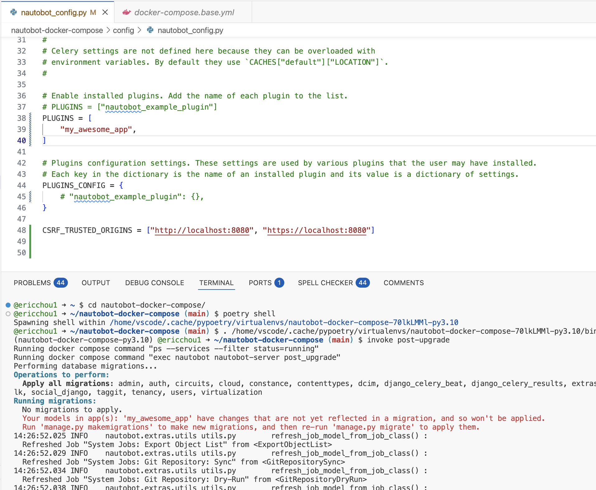
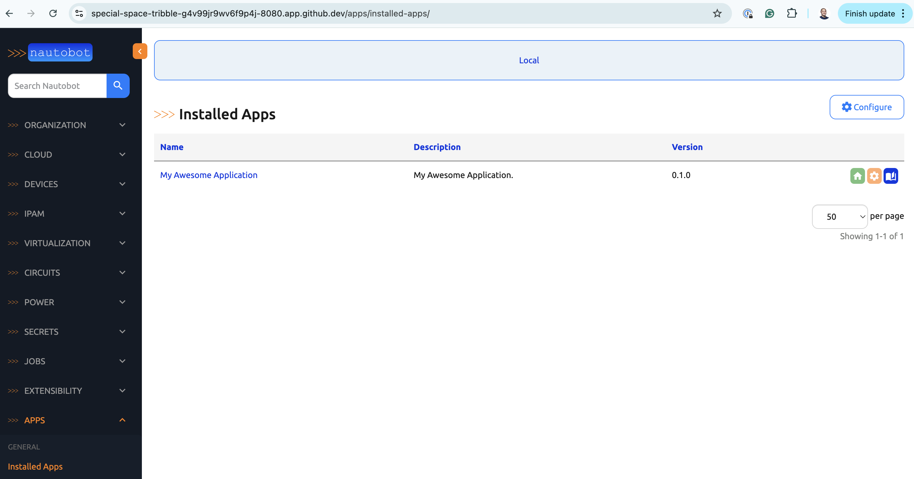

# App Bundled and Distribution (Part 2)

Welcome back to part 2 of the app distribution process. Let's get started.

## Environment Setup

We will use the `nautobot-docker-compose` instance to install the app we created from Day 42 and exported in Day 44. 

The full instruction to launch the containers is in `scenario 1`, please take a look at [scenario_1_setup](../Lab_Setup/scenario_1_setup/README.md) for the setup refresher. 

Below is a summary of the steps once you are in Codespace, please skip `invoke build` and `invoke db-import` if the environment was restarted from previous days and those steps were already taken: 

```
$ cd nautobot-docker-compose/
$ poetry shell
$ invoke build
$ invoke db-import
$ invoke debug
```

We do not need Containerlab for today's challenge. 


## Installation Example

We will upload the file to the `nautobod-docker-compose` directory: 



Then we can use `docker cp` to copy and paste the package to the Nautobot container `/tmp/` directory: 

```
(nautobot-docker-compose-py3.10) @ericchou1 ➜ ~/nautobot-docker-compose (main) $ docker cp my_awesome_app-0.1.0-py3-none-any.whl nautobot_docker_compose-nautobot-1:/tmp/
Successfully copied 17.4kB to nautobot_docker_compose-nautobot-1:/tmp/
```

Let's attach to the Nautobot instance and install the package using `pip install`: 

```
(nautobot-docker-compose-py3.10) @ericchou1 ➜ ~/nautobot-docker-compose (main) $ docker exec -it -u root nautobot_docker_compose-nautobot-1 bash
root@48e06f355729:/opt/nautobot# cd /tmp
root@48e06f355729:/tmp# ls
dist  my_awesome_app-0.1.0-py3-none-any.whl

root@48e06f355729:/tmp# pip install my_awesome_app-0.1.0-py3-none-any.whl 
Processing ./my_awesome_app-0.1.0-py3-none-any.whl
Requirement already satisfied: nautobot<3.0.0,>=2.0.0 in /usr/local/lib/python3.8/site-packages (from my-awesome-app==0.1.0) (2.3.2)
Requirement already satisfied: Django<4.3.0,>=4.2.15 in /usr/local/lib/python3.8/site-packages (from nautobot<3.0.0,>=2.0.0->my-awesome-app==0.1.0) (4.2.15)
...
Installing collected packages: my-awesome-app
Successfully installed my-awesome-app-0.1.0

root@48e06f355729:/tmp# pip list | grep my-awesome
my-awesome-app                 0.1.0

```

Let's add the app to `config -> nautobot_config.py` configuration under `PLUGIN`: 



We will see this error of `unapplied migration` for the new app: 



Without stopping the original instances, perform `invoke post-upgrade` on a separate terminal: 

> [!INFORMATION]
> If we stop the instance, we will see an error of app not found because each docker instance is started from a clean state. 

```
(nautobot-docker-compose-py3.10) @ericchou1 ➜ ~/nautobot-docker-compose (main) $ invoke post-upgrade
Running docker compose command "ps --services --filter status=running"
Running docker compose command "exec nautobot nautobot-server post_upgrade"
Performing database migrations...
Operations to perform:
  Apply all migrations: admin, auth, circuits, cloud, constance, contenttypes, dcim, django_celery_beat, django_celery_results, extras, ipam, sessions, silk, social_django, taggit, tenancy, users, virtualization
Running migrations:
  No migrations to apply.
  Your models in app(s): 'my_awesome_app' have changes that are not yet reflected in a migration, and so won't be applied.
  Run 'manage.py makemigrations' to make new migrations, and then re-run 'manage.py migrate' to apply them.
```

Alternatively we can also execute `makemigration` and `migrate` in the nautobot instance using `nautobot-server` commands:  

```
root@543d3084cedf:/opt/nautobot# nautobot-server makemigrations
Migrations for 'my_awesome_app':
  /usr/local/lib/python3.8/site-packages/my_awesome_app/migrations/0001_initial.py
    - Create model MyAwesomeAppExampleModel
root@543d3084cedf:/opt/nautobot# nautobot-server migrate
Operations to perform:
  Apply all migrations: admin, auth, circuits, cloud, constance, contenttypes, dcim, django_celery_beat, django_celery_results, extras, ipam, my_awesome_app, sessions, silk, social_django, taggit, tenancy, users, virtualization
Running migrations:
  No migrations to apply.
14:46:21.723 INFO    nautobot.extras.utils utils.py        refresh_job_model_from_job_class() :
  Refreshed Job "System Jobs: Export Object List" from <ExportObjectList>
14:46:21.732 INFO    nautobot.extras.utils utils.py        refresh_job_model_from_job_class() :
  Refreshed Job "System Jobs: Git Repository: Sync" from <GitRepositorySync>
14:46:21.738 INFO    nautobot.extras.utils utils.py        refresh_job_model_from_job_class() :
  Refreshed Job "System Jobs: Git Repository: Dry-Run" from <GitRepositoryDryRun>
14:46:21.750 INFO    nautobot.extras.utils utils.py        refresh_job_model_from_job_class() :
  Refreshed Job "System Jobs: Import Objects" from <ImportObjects>
14:46:21.756 INFO    nautobot.extras.utils utils.py        refresh_job_model_from_job_class() :
  Refreshed Job "System Jobs: Logs Cleanup" from <LogsCleanup>
14:46:21.763 INFO    nautobot.extras.utils utils.py        refresh_job_model_from_job_class() :
  Refreshed Job "System Jobs: Refresh Dynamic Group Caches" from <RefreshDynamicGroupCaches>
```

Under `Installed Apps` we can see our new awecome app installed: 



Great job in completing today's challenge!  

## Day 45 To Do

Remember to stop the codespace instance on [https://github.com/codespaces/](https://github.com/codespaces/). 

Go ahead and post a screenshot of a new app installed on the nautobot instance on a social media of your choice, make sure you use the tag `#100DaysOfNautobot` `#JobsToBeDone` and tag `@networktocode`, so we can share your progress! 

For tomorrow's challenge, we will play with some Django code. See you tomorrow! 

[X/Twitter](<https://twitter.com/intent/tweet?url=https://github.com/nautobot/100-days-of-nautobot&text=I+jst+completed+Day+45+of+the+100+days+of+nautobot+challenge+!&hashtags=100DaysOfNautobot,JobsToBeDone>)

[LinkedIn](https://www.linkedin.com/) (Copy & Paste: I just completed Day 45 of 100 Days of Nautobot, https://github.com/nautobot/100-days-of-nautobot-challenge, challenge! @networktocode #JobsToBeDone #100DaysOfNautobot) 