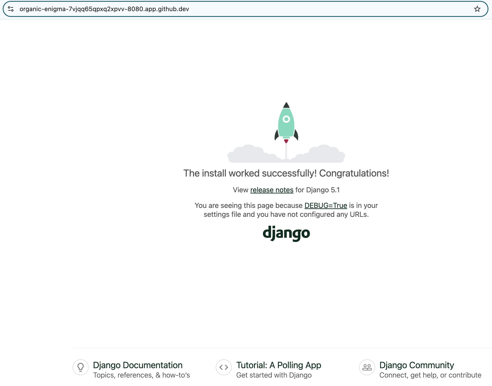
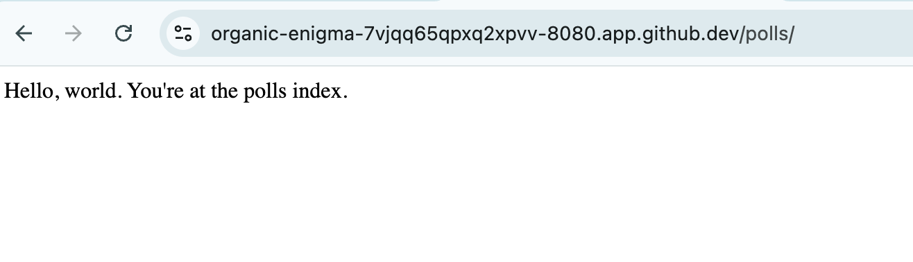

# Django Example - Part 1. Setting Up Project and Create App

In our challenge so far, we have mentioned a number of times Nautobot is based on the Python Django framework. As we have seen, one does not need to know Django to take advantage of Nautobot. But as we progress further into our journey of Nautobot app development, it is beneficial to have some basic understanding of Django to make the necessary connection between Django and Nautobot. 
 
Django is known since the beginning for its detailed and extensive documentation. I mean, what else would you expect from a web framework coming out of an award-winning newspaper organization? :)

We took the detailed 7-part [Django Tutorial](https://docs.djangoproject.com/en/5.1/intro/tutorial01/) and condensed them into a 4-part series for Day 46 - 49 just to give us some basic understanding of the major components of Django and help us further our understanding of Nautobot. 

> [!IMPORTANT]
> We will move fast in this condensed version of the tutorial. The emphasis will be on moving quickly to have a working app to see the main moving parts of Django. The [Django Tutorial](https://docs.djangoproject.com/en/5.1/intro/tutorial01/) does a fantastic job in explaining the details as well as providing additional resources, please refer to the tutorial for more details.

In today's challenge, we will be setting up a Django project and creating an app in the project. 

Here are the steps: 

- Create virtual environment 
- Create Django project 
- Create App and add it the project
- Create the initial view and route the user to that view

Let's get started. 

## Environment Setup

We will be using the usual Codespace that we have been using. But we do not need to launch `nautobot-docker-compose` containers, all the necessary steps will be covered in the days. 

## Code Example

From the default home directory `/home/vscode`, we can create a directory that will contain our new project. We will also use `poetry` with `poetry init` to create a virtual environment: 

```
@ericchou1 ➜ ~ $ mkdir djangoproject
@ericchou1 ➜ ~ $ cd djangoproject/
@ericchou1 ➜ ~/djangoproject $ poetry init

This command will guide you through creating your pyproject.toml config.

Package name [djangoproject]:  
Version [0.1.0]:  
Description []:  
Author [Name <email>, n to skip]:  
License []:  
Compatible Python versions [^3.10]:  

Would you like to define your main dependencies interactively? (yes/no) [yes] 
You can specify a package in the following forms:
  - A single name (requests): this will search for matches on PyPI
  - A name and a constraint (requests@^2.23.0)
  - A git url (git+https://github.com/python-poetry/poetry.git)
  - A git url with a revision (git+https://github.com/python-poetry/poetry.git#develop)
  - A file path (../my-package/my-package.whl)
  - A directory (../my-package/)
  - A url (https://example.com/packages/my-package-0.1.0.tar.gz)

Package to add or search for (leave blank to skip): 

Would you like to define your development dependencies interactively? (yes/no) [yes] 
Package to add or search for (leave blank to skip): 

Generated file

[tool.poetry]
name = "djangoproject"
version = "0.1.0"
description = ""
authors = ["Name <email>"]
readme = "README.md"

[tool.poetry.dependencies]
python = "^3.10"


[build-system]
requires = ["poetry-core"]
build-backend = "poetry.core.masonry.api"


Do you confirm generation? (yes/no) [yes] 
```

Once it is created, we will use `poetry shell` to activate the environment: 

```
@ericchou1 ➜ ~/djangoproject $ poetry shell
Creating virtualenv djangoproject-jP4IF3vC-py3.10 in /home/vscode/.cache/pypoetry/virtualenvs
Spawning shell within /home/vscode/.cache/pypoetry/virtualenvs/djangoproject-jP4IF3vC-py3.10
```

We will install Django with `pip` and use `django-admin` command to initialize a new Django project and `cd` to the new directory: 

```
(djangoproject-py3.10) @ericchou1 ➜ ~/djangoproject $ pip install django
(djangoproject-py3.10) @ericchou1 ➜ ~/djangoproject $ django-admin --version
5.1.7

(djangoproject-py3.10) @ericchou1 ➜ ~/djangoproject $ django-admin startproject mysite

(djangoproject-py3.10) @ericchou1 ➜ ~/djangoproject $ cd mysite/
```

At this point we can use the development server to see a basic home page: 


```
(djangoproject-py3.10) @ericchou1 ➜ ~/djangoproject/mysite $ python manage.py runserver 0.0.0.0:8080
Watching for file changes with StatReloader
Performing system checks...

System check identified no issues (0 silenced).

You have 18 unapplied migration(s). Your project may not work properly until you apply the migrations for app(s): admin, auth, contenttypes, sessions.
Run 'python manage.py migrate' to apply them.
March 07, 2025 - 14:54:44
Django version 5.1.7, using settings 'mysite.settings'
Starting development server at http://0.0.0.0:8080/
Quit the server with CONTROL-C.
```



We can stop the server with `CONTROL-C`. 

The project directory, in our case `mysite` contains project-level tools, including the `manage.py` that we can use to perform project level tasks, such as launching the development server, create admin user, etc. 

If you take a closer look, there is a subdirectory with the same name as the project called `mysite` that contains files that controls the settings as well as the top-level URL routing: 

```
(djangoproject-py3.10) @ericchou1 ➜ ~/djangoproject/mysite $ pwd
/home/vscode/djangoproject/mysite
(djangoproject-py3.10) @ericchou1 ➜ ~/djangoproject/mysite $ tree mysite/
mysite/
├── asgi.py
├── __init__.py
├── __pycache__
│   ├── __init__.cpython-310.pyc
│   ├── settings.cpython-310.pyc
│   ├── urls.cpython-310.pyc
│   └── wsgi.cpython-310.pyc
├── settings.py
├── urls.py
└── wsgi.py

1 directory, 9 files
```

The way Django organize the structure, is to break down each of the application into its own folder. This might seem like a lot of work for a simple app, but in the long run, this opinionated approach works great for separate of concerns. 

We will use `manage.py` to create a new app named `polls`: 

```
(djangoproject-py3.10) @ericchou1 ➜ ~/djangoproject/mysite $ python manage.py startapp polls
```

At this point, we have a folder named `djangoproject` with our virtual environment files, a subfolder `djangoproject/mysite` for project level settings, another subfolder `djangoproject/mysite/mysite` for the entry point for the entry point to the site, and another folder `djangoproject/mysite/polls` containing files for our `polls` app: 

```
(djangoproject-py3.10) @ericchou1 ➜ ~/djangoproject/mysite $ tree .
.
├── db.sqlite3
├── manage.py
├── mysite
│   ├── asgi.py
│   ├── __init__.py
│   ├── __pycache__
│   │   ├── __init__.cpython-310.pyc
│   │   ├── settings.cpython-310.pyc
│   │   ├── urls.cpython-310.pyc
│   │   └── wsgi.cpython-310.pyc
│   ├── settings.py
│   ├── urls.py
│   └── wsgi.py
└── polls
    ├── admin.py
    ├── apps.py
    ├── __init__.py
    ├── migrations
    │   └── __init__.py
    ├── models.py
    ├── tests.py
    └── views.py

4 directories, 18 files
```

We will need to add the new app to the installed apps list in the project level settings under `djangoproject/mysite/mysite/settings.py`: 

```
(djangoproject-py3.10) @ericchou1 ➜ ~/djangoproject/mysite $ vim mysite/settings.py

# Application definition

INSTALLED_APPS = [
    'django.contrib.admin',
    ...
    'polls',
]
```

We will tell the main project `urls.py` file to route anything with the `polls/` path to the `urls.py` file within our project. We can do this with the following code:  

```
(djangoproject-py3.10) @ericchou1 ➜ ~/djangoproject/mysite $ cat mysite/urls.py 

from django.contrib import admin
from django.urls import include, path

urlpatterns = [
    path('polls/', include('polls.urls')),
    path('admin/', admin.site.urls),
]
```

We will need to create a new `urls.py` under polls project: 

```
(djangoproject-py3.10) @ericchou1 ➜ ~/djangoproject/mysite $ touch polls/urls.py
```

In the file, we will state at the root level, specified with an empty `''` we will show the user with a view called index that is from the `views` file (that we will create shortly): 

```
(djangoproject-py3.10) @ericchou1 ➜ ~/djangoproject/mysite $ cat polls/urls.py 
from django.urls import path
from . import views

urlpatterns = [
    path('', views.index, name='index'),
]
```

In the `polls/views.py` we will now create that view using simple `HttpResponse`: 

```
(djangoproject-py3.10) @ericchou1 ➜ ~/djangoproject/mysite $ cat polls/views.py 
from django.http import HttpResponse

def index(request):
    return HttpResponse("Hello, world. You're at the polls index.")
```

To see the newly created view, we will start the development server again: 

```
(djangoproject-py3.10) @ericchou1 ➜ ~/djangoproject/mysite $ python manage.py runserver 0.0.0.0:8080
```

And there you go, the fancy new view is shown under `polls/`:



It might not seem much, but it is a small victory worth celebrating as we just created our first Django project with a new application and allow it to be seen by the user. 

Please stop the codespace but do not delete it as we will continue to work on the same project for the next few days. 

## Day 46 To Do

Remember to stop the codespace instance on [https://github.com/codespaces/](https://github.com/codespaces/). 

Go ahead and post a screenshot of a new app that you have create from today's challenge on a social media of your choice, make sure you use the tag `#100DaysOfNautobot` `#JobsToBeDone` and tag `@networktocode`, so we can share your progress! 

In tomorrow's challenge, we will create new database models. See you tomorrow! 

[X/Twitter](<https://twitter.com/intent/tweet?url=https://github.com/nautobot/100-days-of-nautobot&text=I+jst+completed+Day+46+of+the+100+days+of+nautobot+challenge+!&hashtags=100DaysOfNautobot,JobsToBeDone>)

[LinkedIn](https://www.linkedin.com/) (Copy & Paste: I just completed Day 46 of 100 Days of Nautobot, https://github.com/nautobot/100-days-of-nautobot-challenge, challenge! @networktocode #JobsToBeDone #100DaysOfNautobot) 