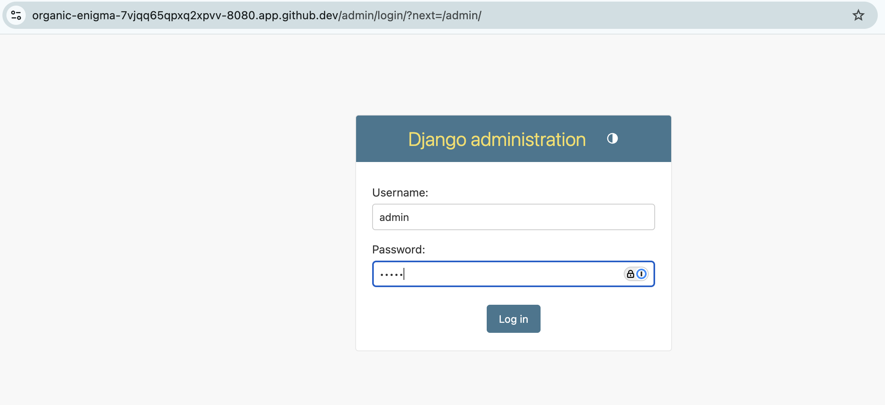
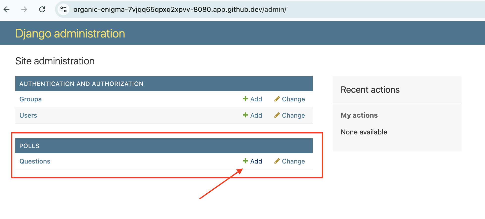
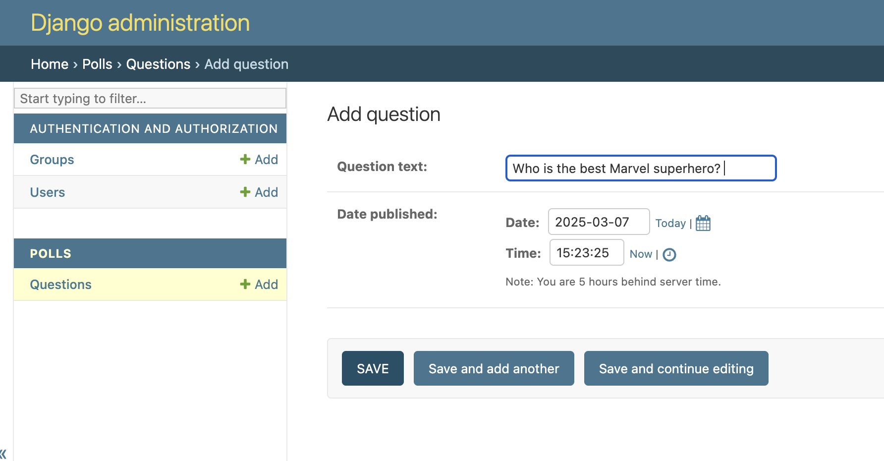

# Django Example - Part 2. Creating New Data Models

Building from yesterday's challenge, in today's challenge, we will create two new database models for our new `polls` app. 

## Code Example

We will create two models, Question and Choice. The [Django Tutorial Part 2](https://docs.djangoproject.com/en/5.1/intro/tutorial02/) does a good job explaining the meaning of the fields as well as relationships. Please refer to the tutorial for more information as even just copy/paste that here would be pretty extensive. 

Here is the content of the `polls/models.py` file: 


```python polls/models.py
from django.db import models

class Question(models.Model):
    question_text = models.CharField(max_length=200)
    pub_date = models.DateTimeField('date published')

    def __str__(self):
        return self.question_text

class Choice(models.Model):
    question = models.ForeignKey(Question, on_delete=models.CASCADE)
    choice_text = models.CharField(max_length=200)
    votes = models.IntegerField(default=0)

    def __str__(self):
        return self.choice_text
```

Django provides tools of `makemigrations` and `migrate` to allow database changes to take effect. Again, refer to the [Django Tutorial 2](https://docs.djangoproject.com/en/5.1/intro/tutorial02/) for more information on their purpose. 

We will simply perform the migration for the changes to take effect: 

```
(djangoproject-py3.10) @ericchou1 ➜ ~/djangoproject/mysite $ python manage.py makemigrations polls
Migrations for 'polls':
  polls/migrations/0001_initial.py
    + Create model Question
    + Create model Choice
(djangoproject-py3.10) @ericchou1 ➜ ~/djangoproject/mysite $ python manage.py migrate
Operations to perform:
  Apply all migrations: admin, auth, contenttypes, polls, sessions
Running migrations:
  Applying contenttypes.0001_initial... OK
  Applying auth.0001_initial... OK
  Applying admin.0001_initial... OK
  Applying admin.0002_logentry_remove_auto_add... OK
  Applying admin.0003_logentry_add_action_flag_choices... OK
  Applying contenttypes.0002_remove_content_type_name... OK
  Applying auth.0002_alter_permission_name_max_length... OK
  Applying auth.0003_alter_user_email_max_length... OK
  Applying auth.0004_alter_user_username_opts... OK
  Applying auth.0005_alter_user_last_login_null... OK
  Applying auth.0006_require_contenttypes_0002... OK
  Applying auth.0007_alter_validators_add_error_messages... OK
  Applying auth.0008_alter_user_username_max_length... OK
  Applying auth.0009_alter_user_last_name_max_length... OK
  Applying auth.0010_alter_group_name_max_length... OK
  Applying auth.0011_update_proxy_permissions... OK
  Applying auth.0012_alter_user_first_name_max_length... OK
  Applying polls.0001_initial... OK
  Applying sessions.0001_initial... OK
```

Django provides an admin interface out of the box to manage the database entries, but we will need to register the database models in the `polls/admin.py` file: 

```python 
(djangoproject-py3.10) @ericchou1 ➜ ~/djangoproject/mysite $ cat polls/admin.py 
from django.contrib import admin
from .models import Question

admin.site.register(Question)
```

Let's create superuser for our project: 

```
(djangoproject-py3.10) @ericchou1 ➜ ~/djangoproject/mysite $ python manage.py createsuperuser
Username (leave blank to use 'vscode'): admin
Email address: admin@admin.com
Password: 
Password (again): 
The password is too similar to the username.
This password is too short. It must contain at least 8 characters.
This password is too common.
Bypass password validation and create user anyway? [y/N]: y
Superuser created successfully.
```

Start the development server again: 

```
(djangoproject-py3.10) @ericchou1 ➜ ~/djangoproject/mysite $ python manage.py runserver 0.0.0.0:8080
```

We can access the admin interface by appending the `/admin` at the end of the URL: 



We can create new questions by clicking on the `+ Add` button: 



Notice the text, date, and time field on the page, we can use teh `Today` and `Now` button to quickly add date and time: 



Great job in completing today's challenge, tomorrow we will create new views and templates. 

## Day 47 To Do

Remember to stop the codespace instance on [https://github.com/codespaces/](https://github.com/codespaces/). 

Go ahead and post a screenshot of the new admin interface modifying the polls database entries on a social media of your choice, make sure you use the tag `#100DaysOfNautobot` `#JobsToBeDone` and tag `@networktocode`, so we can share your progress! 

In tomorrow's challenge, we will be creating new views and HTML templates. See you tomorrow! 

[X/Twitter](<https://twitter.com/intent/tweet?url=https://github.com/nautobot/100-days-of-nautobot&text=I+jst+completed+Day+47+of+the+100+days+of+nautobot+challenge+!&hashtags=100DaysOfNautobot,JobsToBeDone>)

[LinkedIn](https://www.linkedin.com/) (Copy & Paste: I just completed Day 47 of 100 Days of Nautobot, https://github.com/nautobot/100-days-of-nautobot-challenge, challenge! @networktocode #JobsToBeDone #100DaysOfNautobot) 