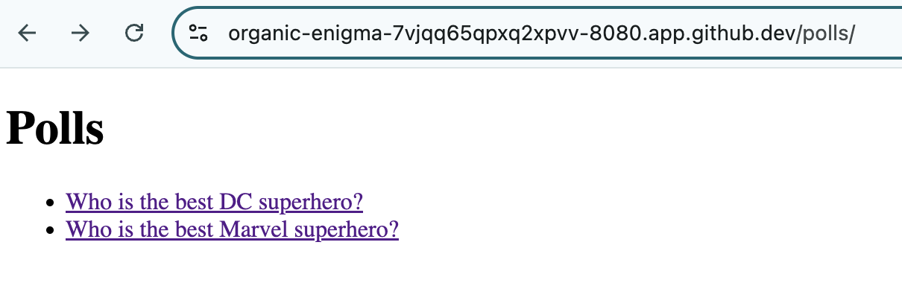
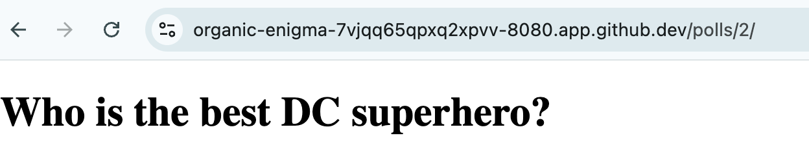

# Django Example - Part 3. Create New Views and Templates

We will create new views and templates for the `polls` app we created in the last two days. 

Today's challenge roughly follows the [Django Tutorial Part 3](https://docs.djangoproject.com/en/5.1/intro/tutorial03/) from the official Django documentation. They do a great job explaining in more detail about views, url pattern, querysets, and other related code. Please take a look at the page for detailed explanation. 

> [!IMPORTANT]
> We will move fast in this condensed version of the tutorial. The emphasis will be on moving quickly to have a working app to see the main moving parts of Django. The [Django Tutorial](https://docs.djangoproject.com/en/5.1/intro/tutorial01/) does a fantastic job in explaining the details as well as providing additional resources, please refer to the tutorial for more details.

## Code Example

We will modify our `polls/views.py` as follows, consult the [Django Tutorial Part 3](https://docs.djangoproject.com/en/5.1/intro/tutorial03/) page for more detail on Django queryset and context: 

```
(djangoproject-py3.10) @ericchou1 ➜ ~/djangoproject/mysite $ cat polls/views.py 
from django.shortcuts import render
from .models import Question

def index(request):
    latest_question_list = Question.objects.order_by('-pub_date')[:5]
    context = {'latest_question_list': latest_question_list}
    return render(request, 'polls/index.html', context)

def detail(request, question_id):
    question = Question.objects.get(pk=question_id)
    return render(request, 'polls/detail.html', {'question': question})
```

We will update the `polls/urls.py` to wire it up to the detail view: 

```
(djangoproject-py3.10) @ericchou1 ➜ ~/djangoproject/mysite $ cat polls/urls.py 
from django.urls import path
from . import views

urlpatterns = [
    path('', views.index, name='index'),
    path('<int:question_id>/', views.detail, name='detail'),
]
```

If we take a look at the views, we know the views uses HTML templates under `polls/index.html` and `polls/detail.html`. 

The default template location is usually a point of confusion. By default, Django expects a `templates` directory under the app folder, then the name we specified. Since we specify `polls/<file>` as the path, we will create `polls/templates/polls` directory with `index.html` and `detail.html` inside: 

```
(djangoproject-py3.10) @ericchou1 ➜ ~/djangoproject/mysite $ mkdir -p polls/templates/polls
```

Just to be extra clear, here is the file directory and files under `polls/`:  

```shell
(djangoproject-py3.10) @ericchou1 ➜ ~/djangoproject/mysite $ tree polls/
polls/
├── admin.py
├── apps.py
├── __init__.py
├── migrations
│   ├── 0001_initial.py
│   ├── __init__.py
│   └── __pycache__
│       ├── 0001_initial.cpython-310.pyc
│       └── __init__.cpython-310.pyc
├── models.py
├── __pycache__
│   ├── admin.cpython-310.pyc
│   ├── apps.cpython-310.pyc
│   ├── __init__.cpython-310.pyc
│   ├── models.cpython-310.pyc
│   ├── urls.cpython-310.pyc
│   └── views.cpython-310.pyc
├── templates
│   └── polls
│       ├── detail.html
│       └── index.html
├── tests.py
├── urls.py
└── views.py

5 directories, 19 files
```

Here is the code for `index.html`: 

```html index.html 
(djangoproject-py3.10) @ericchou1 ➜ ~/djangoproject/mysite $ cat polls/templates/polls/index.html  
<!DOCTYPE html>
<html>
<head>
    <title>Polls Index</title>
</head>
<body>
    <h1>Polls</h1>
    <ul>
        
            <li><a href="">{{ question.question_text }}</a></li>
        
    </ul>
</body>
</html>
```

Here is the code for `polls.html`: 

```html
(djangoproject-py3.10) @ericchou1 ➜ ~/djangoproject/mysite $ cat polls/templates/polls/detail.html 
<!DOCTYPE html>
<html>
<head>
    <title>{{ question.question_text }}</title>
</head>
<body>
    <h1>{{ question.question_text }}</h1>
    <ul>
        
            <li>{{ choice.choice_text }}</li>
        
    </ul>
</body>
</html>
```

Now launch the development server again: 

```
(djangoproject-py3.10) @ericchou1 ➜ ~/djangoproject/mysite $ python manage.py runserver 0.0.0.0:8080
```

This is the index page for the `polls` app: 



Click on the question we can see the detail of the question: 



We are still missing the actual poll counts, we will add that in tomorrow's challenge. 

## Day 48 To Do

Remember to stop the codespace instance on [https://github.com/codespaces/](https://github.com/codespaces/). 

Go ahead and post a screenshot of new pages we created in today's challenge on a social media of your choice, make sure you use the tag `#100DaysOfNautobot` `#JobsToBeDone` and tag `@networktocode`, so we can share your progress! 

In tomorrow's challenge, we will finish this Django example app. See you tomorrow! 

[X/Twitter](<https://twitter.com/intent/tweet?url=https://github.com/nautobot/100-days-of-nautobot&text=I+jst+completed+Day+48+of+the+100+days+of+nautobot+challenge+!&hashtags=100DaysOfNautobot,JobsToBeDone>)

[LinkedIn](https://www.linkedin.com/) (Copy & Paste: I just completed Day 48 of 100 Days of Nautobot, https://github.com/nautobot/100-days-of-nautobot-challenge, challenge! @networktocode #JobsToBeDone #100DaysOfNautobot) 