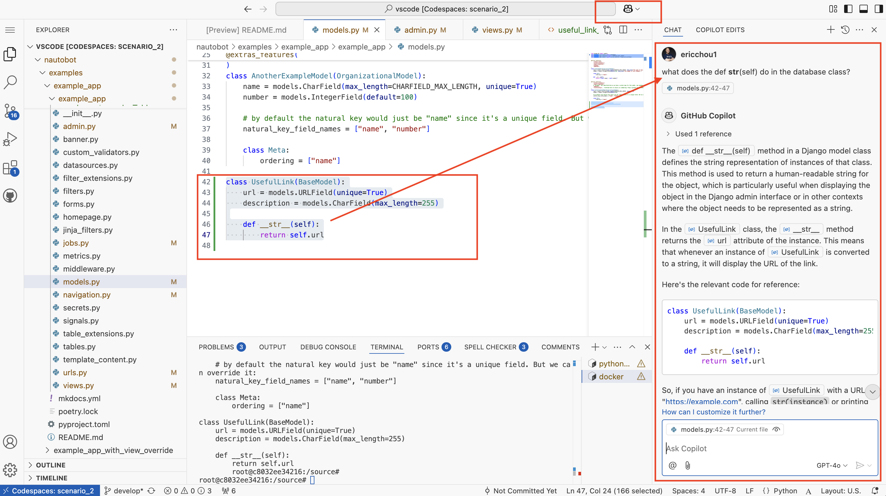
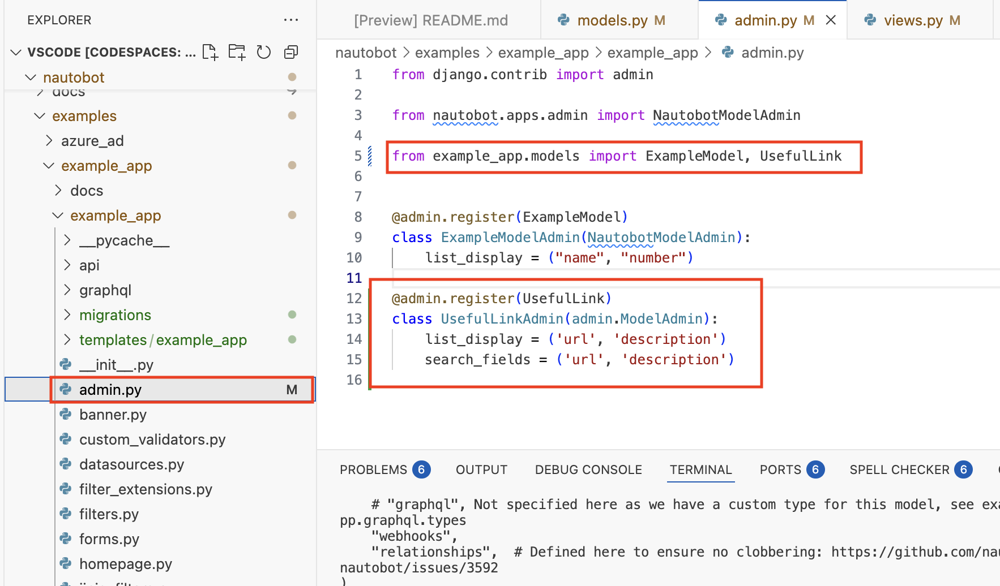
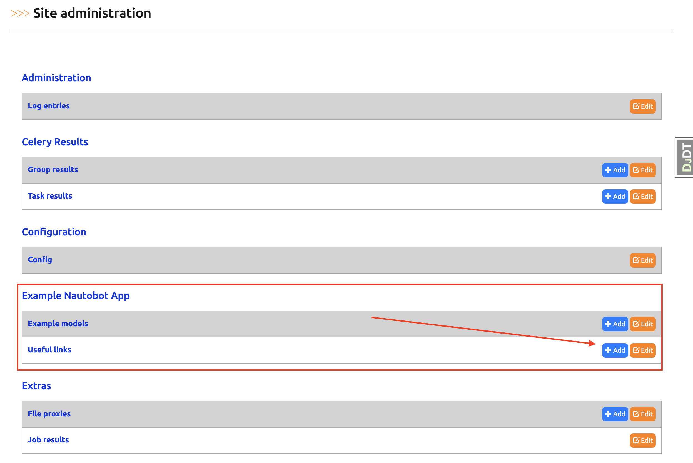
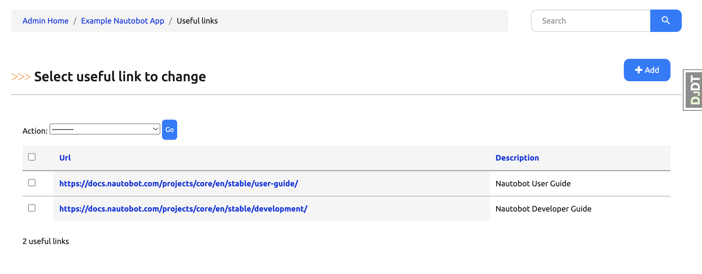

# Example App Creating Data Models - Part 2

Today's challenge is a continuation from yesterday's work. 

We will create our own simple data models with a field for description and a field for the URL. 

## Code Example

If we take a look at the `ExampleModel` object, it has a `@extra_features` decorator, a `meta` class, and restrains from the database fields themselves, such as `max_length` for `CharField`: 

```python 
@extras_features(
    "custom_links",
    "custom_validators",
    "export_templates",
    "graphql",
    "webhooks",
)
class ExampleModel(OrganizationalModel):
    name = models.CharField(max_length=CHARFIELD_MAX_LENGTH, help_text="The name of this Example.", unique=True)
    number = models.IntegerField(default=100, help_text="The number of this Example.")

    class Meta:
        ordering = ["name"]

    def __str__(self):
        return f"{self.name} - {self.number}"
```

We will go over some of them in future days. For our database model, we will simply use the Nautobot `BaseModel` with two fields: 

```python models.py
from django.db import models
from nautobot.core.models import BaseModel

class UsefulLink(BaseModel):
    url = models.URLField(unique=True)
    description = models.CharField(max_length=255)

    def __str__(self):
        return self.url
```

Do you wonder what does `def __str__(self)` do in that database class? If you have GitHub Copilot, you can actually ask questions in natural language (I just thought it is really cool): 



Here is the full content of the updated `models.py`: 

```python models.py
from django.db import models
from nautobot.core.models import BaseModel 
from nautobot.apps.constants import CHARFIELD_MAX_LENGTH
from nautobot.apps.models import extras_features, OrganizationalModel


@extras_features(
    "custom_links",
    "custom_validators",
    "export_templates",
    "graphql",
    "webhooks",
)
class ExampleModel(OrganizationalModel):
    name = models.CharField(max_length=CHARFIELD_MAX_LENGTH, help_text="The name of this Example.", unique=True)
    number = models.IntegerField(default=100, help_text="The number of this Example.")

    class Meta:
        ordering = ["name"]

    def __str__(self):
        return f"{self.name} - {self.number}"


@extras_features(
    "custom_validators",
    "export_templates",
    # "graphql", Not specified here as we have a custom type for this model, see example_app.graphql.types
    "webhooks",
    "relationships",  # Defined here to ensure no clobbering: https://github.com/nautobot/nautobot/issues/3592
)
class AnotherExampleModel(OrganizationalModel):
    name = models.CharField(max_length=CHARFIELD_MAX_LENGTH, unique=True)
    number = models.IntegerField(default=100)

    # by default the natural key would just be "name" since it's a unique field. But we can override it:
    natural_key_field_names = ["name", "number"]

    class Meta:
        ordering = ["name"]

class UsefulLink(BaseModel):
    url = models.URLField(unique=True)
    description = models.CharField(max_length=255)

    def __str__(self):
        return self.url
```

Of course, the database changes needs to be updated with `makemigrations` and `migrate`. We will do that within the nautobot container itself: 

```shell 
root@c8032ee34216:/opt/nautobot# nautobot-server makemigrations
Migrations for 'example_app':
  /source/examples/example_app/example_app/migrations/0008_usefullink.py
    - Create model UsefulLink
root@c8032ee34216:/opt/nautobot# nautobot-server migrate
Operations to perform:
  Apply all migrations: admin, auth, circuits, cloud, constance, contenttypes, dcim, django_celery_beat, django_celery_results, example_app, extras, ipam, sessions, silk, social_django, taggit, tenancy, users, virtualization, wireless
Running migrations:
  Applying example_app.0008_usefullink... OK
22:19:13.100 INFO    nautobot.extras.utils utils.py        refresh_job_model_from_job_class() :
  Refreshed Job "System Jobs: Bulk Delete Objects" from <BulkDeleteObjects>
```

Great, no error is a good sign. But how do we add entries to the new database table? We can use the admin interface. 

## Register with admin

Just like Python, Django is 'batteries-includes' with an admin interface out of the box. In order for the database to show up in the admin interface, we will need to register with the `admin.py` file in the `example_app` directory: 



Here is the content of the `admin.py` file, notice we import the new `UsefulLink` data model and include them in the `list_display`: 

```python admin.py 
from django.contrib import admin

from nautobot.apps.admin import NautobotModelAdmin

from example_app.models import ExampleModel, UsefulLink


@admin.register(ExampleModel)
class ExampleModelAdmin(NautobotModelAdmin):
    list_display = ("name", "number")

@admin.register(UsefulLink)
class UsefulLinkAdmin(admin.ModelAdmin):
    list_display = ('url', 'description')
    search_fields = ('url', 'description')
```

Log on to admins site via `https://<url>/admin/`: 



We can then add some useful links: 




For me, I thought the links for [Nautobot User Guide](https://docs.nautobot.com/projects/core/en/stable/user-guide/) and [Nautobot Developer Guide](https://docs.nautobot.com/projects/core/en/stable/development/). 

Pretty cool that we can create a new data model and start adding data to it with just a few lines of code! 

## Day 52 To Do

Remember to stop the codespace instance on [https://github.com/codespaces/](https://github.com/codespaces/). 

Go ahead and post a screenshot of the new entries on a social media of your choice, make sure you use the tag `#100DaysOfNautobot` `#JobsToBeDone` and tag `@networktocode`, so we can share your progress! 

In tomorrow's challenge, we tie this database model with a view. See you tomorrow! 

[X/Twitter](<https://twitter.com/intent/tweet?url=https://github.com/nautobot/100-days-of-nautobot&text=I+jst+completed+Day+52+of+the+100+days+of+nautobot+challenge+!&hashtags=100DaysOfNautobot,JobsToBeDone>)

[LinkedIn](https://www.linkedin.com/) (Copy & Paste: I just completed Day 52 of 100 Days of Nautobot, https://github.com/nautobot/100-days-of-nautobot-challenge, challenge! @networktocode #JobsToBeDone #100DaysOfNautobot) 