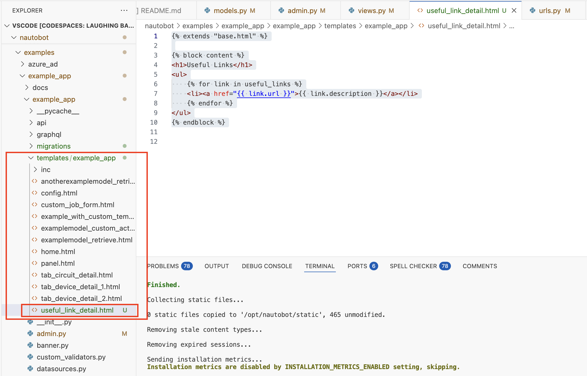

# Example App Create New Template

As we have done before, in today's challenge, we will create a simple HTML template for our response to the user. 

## HTML Template 

Recall where we left off from Day 54 is we used the following view code to wire up the `UsefulLink` model and specify the `example_app/useful_link_detail.html` as the template we will use to render the result: 

```python views.py
from example_app.models import AnotherExampleModel, ExampleModel, UsefulLink

from django.views.generic import ListView


class UsefulLinkListView(ListView): 
    model = UsefulLink
    template_name = "example_app/useful_link_detail.html"
    context_object_name = "useful_links"

    def get_queryset(self):
        return UsefulLink.objects.all()
```

While the template specified in the code is straight forward, the directory structure is often a source of confusion. The template file `useful_link_detail.html` top level structure from `example_app` is as follows: 

```
example_app
  example_app
    templates
      example_app
        useful_link_detail.html
```



This is a common Django project pattern to organize templates in a way that avoids name collision and make it clear which app the template belongs to. 

In short, Django expects all the templates in the `template/` folder within the app code. Since we specified `example_app/useful_link_detail.html` as the destination, there is an additional `example_app` folder. 

"Why the redundant name?" 

That is a good question. While the name `useful_link_detail.html` is pretty expressive, think of some generic names such as `index.html` or `item_list.html` that might be clear which app it belongs to. This is not a hard-written rule, but we are just introducing this common pattern here. 

Ok, enough explaining, here is the code for the template: 

```html template.html



<h1>Useful Links</h1>
<ul>
    
    <li><a href="{{ link.url }}">{{ link.description }}</a></li>
    
</ul>

```

If you have worked with Jinja or other template languages before, you will recognize the pattern. This line `` inherits the `base.html` template while `` start a block named `content`. 

The following code iterates over the objects in the variable `useful_links`: 

```html
<ul>
    
    <li><a href="{{ link.url }}">{{ link.description }}</a></li>
    
</ul>
```

How do we know the variable passed over to the template is named `useful_links`? This was specified in the `context_object_name` in `views.py`: 

```python 
class UsefulLinkListView(ListView):
    model = UsefulLink
    template_name = "example_app/useful_link_detail.html"
    context_object_name = "useful_links"

    def get_queryset(self):
        return UsefulLink.objects.all()
```

Ok, we are almost there, tomorrow we will add the URL routing for this template. 

## Day 49 To Do

Remember to stop the codespace instance on [https://github.com/codespaces/](https://github.com/codespaces/). 

Go ahead and post a screenshot of the template code from today's challenge on a social media platform of your choice, make sure you use the tag `#100DaysOfNautobot` `#JobsToBeDone` and tag `@networktocode`, so we can share your progress! 

In tomorrow's challenge, we will be adding URL routing for our app. See you tomorrow! 

[X/Twitter](<https://twitter.com/intent/tweet?url=https://github.com/nautobot/100-days-of-nautobot&text=I+jst+completed+Day+55+of+the+100+days+of+nautobot+challenge+!&hashtags=100DaysOfNautobot,JobsToBeDone>)

[LinkedIn](https://www.linkedin.com/) (Copy & Paste: I just completed Day 55 of 100 Days of Nautobot, https://github.com/nautobot/100-days-of-nautobot-challenge, challenge! @networktocode #JobsToBeDone #100DaysOfNautobot) 