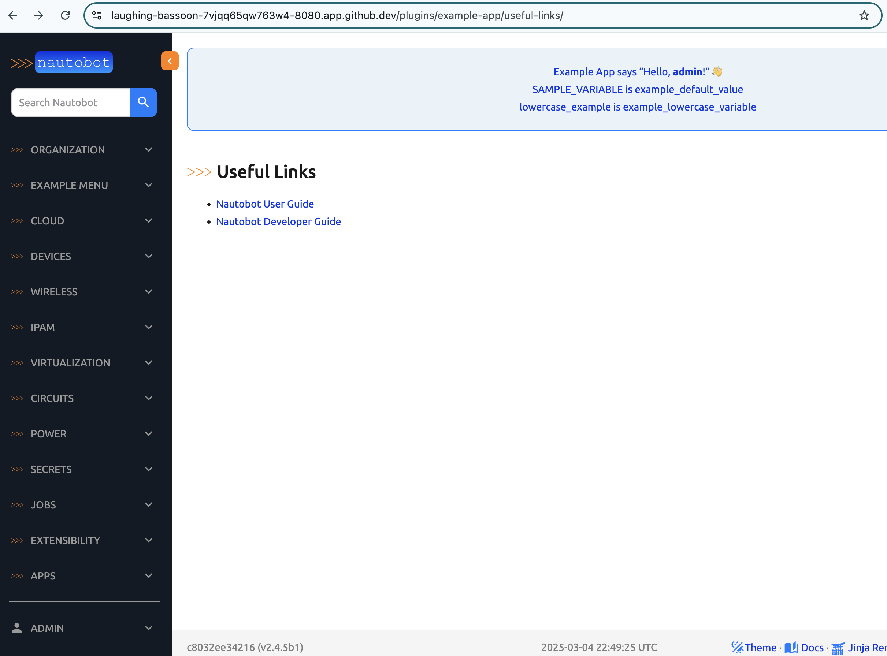

# Example App Create New URL Routing

Let's add a URL pattern to match the view to let the user can see the page. 

## urls.py

The URL file is at the same level as `views.py` named `ursl.py`: 

```
@ericchou1 ➜ ~/nautobot/examples (develop) $ tree example_app/example_app/
example_app/example_app/
├── admin.py
...
├── models.py
├── navigation.py
├── templates
│   └── example_app
│       ├── anotherexamplemodel_retrieve.html
│       ├── config.html
│       ├── custom_job_form.html
│       ├── examplemodel_custom_action_get_all_example_model_names.html
│       ├── examplemodel_retrieve.html
│       ├── example_with_custom_template.html
│       ├── home.html
│       ├── inc
│       │   ├── item_example.html
│       │   └── panel_example.html
│       ├── panel.html
│       ├── tab_circuit_detail.html
│       ├── tab_device_detail_1.html
│       ├── tab_device_detail_2.html
│       └── useful_link_detail.html
├── urls.py
└── views.py

10 directories, 88 files
```

Let's add a `useful-links/` pattern 

```python url.py
from django.urls import path
...
urlpatterns = [
    ...
    path("useful-links/", views.UsefulLinkListView.as_view(), name="usefullinks_list"),
    ...
]
```

The `name="usefullinks_list"` assigns a name to this URL pattern for other parts of the code, so we do not need to type in the whole path. 

For good measure, here is the full content of the `urls.py`: 

```python urls.py
from django.templatetags.static import static
from django.urls import path
from django.views.generic import RedirectView

from nautobot.apps.urls import NautobotUIViewSetRouter

from example_app import views

app_name = "example_app"
router = NautobotUIViewSetRouter()
# ExampleModel is registered using the ViewSet
router.register("models", views.ExampleModelUIViewSet)
router.register("other-models", views.AnotherExampleModelUIViewSet)

urlpatterns = [
    path("", views.ExampleAppHomeView.as_view(), name="home"),
    path("useful-links/", views.UsefulLinkListView.as_view(), name="usefullinks_list"),
    path("config/", views.ExampleAppConfigView.as_view(), name="config"),
    path(
        "docs/",
        RedirectView.as_view(url=static("example_app/docs/index.html")),
        name="docs",
    ),
    # Still have the ability to add routes to a model that is using the NautobotUIViewSet.
    path("circuits/<uuid:pk>/example-app-tab/", views.CircuitDetailAppTabView.as_view(), name="circuit_detail_tab"),
    path(
        "devices/<uuid:pk>/example-app-tab-1/",
        views.DeviceDetailAppTabOneView.as_view(),
        name="device_detail_tab_1",
    ),
    path(
        "devices/<uuid:pk>/example-app-tab-2/",
        views.DeviceDetailAppTabTwoView.as_view(),
        name="device_detail_tab_2",
    ),
    # This URL definition is here in order to test the override_views functionality which is defined
    # in examples.example_app_with_view_override.example_app_with_view_override.views
    path("override-target/", views.ViewToBeOverridden.as_view(), name="view_to_be_overridden"),
    # This URL definition is here in order to test the permission_classes functionality which is defined
    # in NautobotUIViewSetMixin
    path(
        "view-with-custom-permissions/",
        views.ViewWithCustomPermissions.as_view({"get": "list"}),
        name="view_with_custom_permissions",
    ),
]
urlpatterns += router.urls
```

We can now see the page: 



The coding portion of today's challenge is simple. Please take the extra time to look up the Django documentation on [URL Dispatcher](https://docs.djangoproject.com/en/5.1/topics/http/urls/). 

Then come back and see what the `<uuid:pk>` portion would change the call to the `views.DeviceDetailAppTabTwoView()` function: 

```python
    papth(
        "devices/<uuid:pk>/example-app-tab-2/",
        views.DeviceDetailAppTabTwoView.as_view(),
        name="device_detail_tab_2",
    )
```

Congratulations on completing Day 56!  

## Day 56 To Do

Remember to stop the codespace instance on [https://github.com/codespaces/](https://github.com/codespaces/). 

Go ahead and post something you learned from URL dispatching in Django from today's challenge on a social media of your choice, make sure you use the tag `#100DaysOfNautobot` `#JobsToBeDone` and tag `@networktocode`, so we can share your progress! 

In tomorrow's challenge, we will add this URL pattern to the navigation menu. See you tomorrow! 

[X/Twitter](<https://twitter.com/intent/tweet?url=https://github.com/nautobot/100-days-of-nautobot&text=I+jst+completed+Day+56+of+the+100+days+of+nautobot+challenge+!&hashtags=100DaysOfNautobot,JobsToBeDone>)

[LinkedIn](https://www.linkedin.com/) (Copy & Paste: I just completed Day 56 of 100 Days of Nautobot, https://github.com/nautobot/100-days-of-nautobot-challenge, challenge! @networktocode #JobsToBeDone #100DaysOfNautobot) 