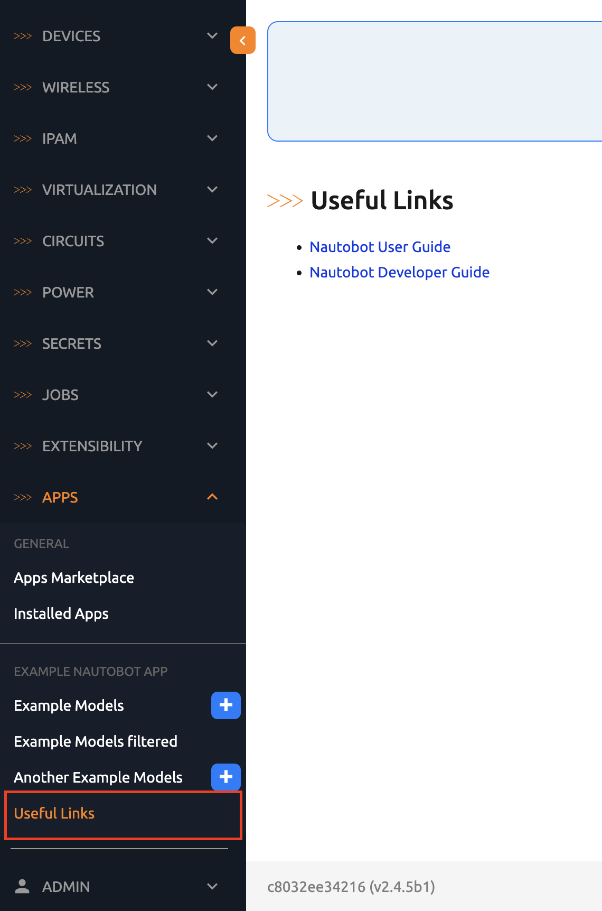
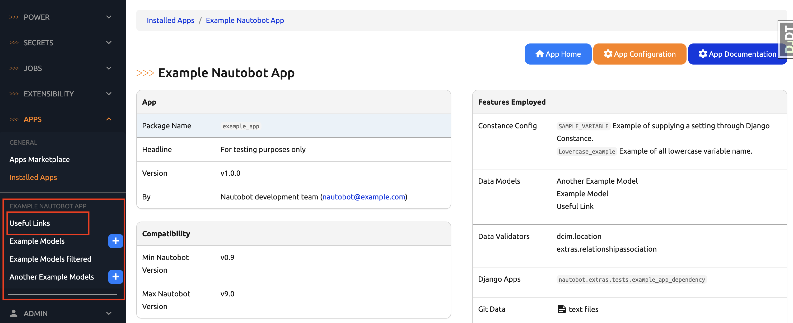

# Example App Creating Navigation

We are almost done with our `Useful Links` addition to the Nautobot `example_app`. The last step is to add the URL link to the navigation menu. 

## Nautobot Navigation Menu

In Nautobot, both core applications and Apps can be on the navigation menu by adding code to the `menu_items` inside of the app's `navigation.py` file. 

> [!TIP]
> The Nautobot documentation [Populating the Navigation Menu](https://docs.nautobot.com/projects/core/en/stable/development/core/navigation-menu/) is a great resource for this topic. 

Remember we use a `name` for the url, we can use that here in the `NavMenuItem`: 

```python navigation.py
menu_items = (
    NavMenuTab(
        ...
                    NavMenuItem(
                        link="plugins:example_app:usefullinks_list",
                        name="Useful Links",
                        permissions=["example_app.view_examplemodel"],
                    ),  
        ...
    )
)
```

Here is the content of the `navigation.py` file:

```python navigation.py
from nautobot.apps.ui import (
    NavMenuAddButton,
    NavMenuGroup,
    NavMenuItem,
    NavMenuTab,
)

menu_items = (
    NavMenuTab(
        name="Apps",
        groups=(
            NavMenuGroup(
                name="Example Nautobot App",
                weight=100,
                items=(
                    NavMenuItem(
                        link="plugins:example_app:examplemodel_list",
                        name="Example Models",
                        permissions=["example_app.view_examplemodel"],
                        buttons=(
                            NavMenuAddButton(
                                link="plugins:example_app:examplemodel_add",
                                permissions=[
                                    "example_app.add_examplemodel",
                                ],
                            ),
                        ),
                    ),
                    NavMenuItem(
                        link="plugins:example_app:examplemodel_list",
                        name="Example Models filtered",
                        permissions=["example_app.view_examplemodel"],
                        query_params={"number": "100"},
                    ),
                    NavMenuItem(
                        link="plugins:example_app:anotherexamplemodel_list",
                        name="Another Example Models",
                        permissions=["example_app.view_anotherexamplemodel"],
                        buttons=(
                            NavMenuAddButton(
                                link="plugins:example_app:anotherexamplemodel_add",
                                permissions=[
                                    "example_app.add_anotherexamplemodel",
                                ],
                            ),
                        ),
                    ),
                    NavMenuItem(
                        link="plugins:example_app:usefullinks_list",
                        name="Useful Links",
                        permissions=["example_app.view_examplemodel"],
                    ),
                ),
            ),
        ),
    ),
    NavMenuTab(
        name="Example Menu",
        weight=150,
        groups=(
            NavMenuGroup(
                name="Example Group 1",
                weight=100,
                items=(
                    NavMenuItem(
                        link="plugins:example_app:examplemodel_list",
                        name="Example Models",
                        permissions=["example_app.view_examplemodel"],
                        buttons=(
                            NavMenuAddButton(
                                link="plugins:example_app:examplemodel_add",
                                permissions=[
                                    "example_app.add_examplemodel",
                                ],
                            ),
                        ),
                    ),
                ),
            ),
        ),
    ),
    NavMenuTab(
        name="Circuits",
        groups=(
            NavMenuGroup(
                name="Example Circuit Group",
                weight=150,
                items=(
                    NavMenuItem(
                        link="plugins:example_app:examplemodel_list",
                        name="Example Models",
                        permissions=["example_app.view_examplemodel"],
                        buttons=(
                            NavMenuAddButton(
                                link="plugins:example_app:examplemodel_add",
                                permissions=[
                                    "example_app.add_examplemodel",
                                ],
                            ),
                        ),
                    ),
                ),
            ),
        ),
    ),
)
```

Our link now appears on the navigation menu as a first class citizen: 



Play around with the different options specified in the documentation. For example, if we change the weight of our link to be 100: 

```
                    NavMenuItem(
                        link="plugins:example_app:usefullinks_list",
                        name="Useful Links",
                        weight=100,
                        permissions=["example_app.view_examplemodel"],
                    ),
```

The new link now appears *before* other links in the `Example Nautobot App` group. 



Try changing other options for navigation menu, it will be fun! 

## Day 57 To Do

Remember to stop the codespace instance on [https://github.com/codespaces/](https://github.com/codespaces/). 

Go ahead and post a screenshot of a new navigation menu on a social media of your choice, make sure you use the tag `#100DaysOfNautobot` `#JobsToBeDone` and tag `@networktocode`, so we can share your progress! 

In tomorrow's challenge, we will add a job to our app. See you tomorrow! 

[X/Twitter](<https://twitter.com/intent/tweet?url=https://github.com/nautobot/100-days-of-nautobot&text=I+jst+completed+Day+57+of+the+100+days+of+nautobot+challenge+!&hashtags=100DaysOfNautobot,JobsToBeDone>)

[LinkedIn](https://www.linkedin.com/) (Copy & Paste: I just completed Day 57 of 100 Days of Nautobot, https://github.com/nautobot/100-days-of-nautobot-challenge, challenge! @networktocode #JobsToBeDone #100DaysOfNautobot) 