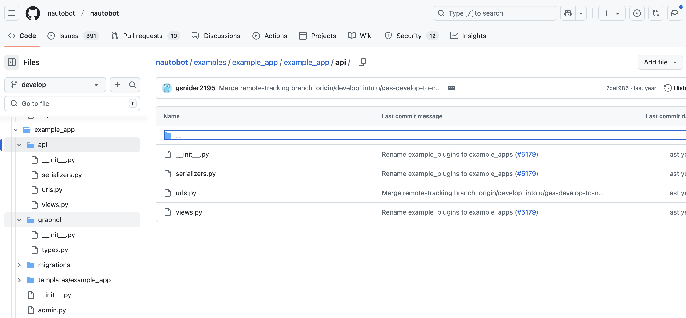

# Example App Other Considerations

Thanks to the existing environment, we were able to put together a functional Nautobot app relatively fast. It might not seem fast, but think about the amount of time we need to build an admin interface, navigation bar, or database interaction from scratch. We have not even considered the Redis database, Celery worker, and other components involved in the Nautobot system. 

Yet, there are still many features we can add and topics we have not had a chance to cover. 

Today's challenge is about finding a topic that is interesting to you and spend an hour reading up on the documentation and play around with it in the sandbox. 

I will provide a few ideas below that is worth the time exploring, but don't let the list stop you from exploring in another topic interesting to you. 

## Django Debug Toolbar

[Django Debug Toolbar](https://django-debug-toolbar.readthedocs.io/en/latest/) is one of *the best* tool one can use to investigate the inner working of Django. Even if you are not "debugging", it is a great way to just "see" how Django works. 

## Django Rest Framework 

[Django Rest Framework](https://www.django-rest-framework.org/) is a powerful and flexible toolkit for building Web APIs. [Nautobot API](https://docs.nautobot.com/projects/core/en/stable/user-guide/platform-functionality/rest-api/overview/) is built from it. 

Take a look at the `example_app` API folder and see if 

## Adding HTML CSS 

The look and feel of the page in our app can be modified via [CSS](https://www.w3schools.com/css/). Changing one small thing in the HTML page, like the background color, can be one step toward understanding the template inheritance in Nautobot. 

## Adding JavaScript Functionality

Similar to HTML CSS, once we can change the static style of the page, why not go a step further and add some interactivity? \[Hint:\] It will take some [JavaScript](https://www.javascript.com/) to do so. 

## Day 59 To Do

Remember to stop (and delete) the codespace instance on [https://github.com/codespaces/](https://github.com/codespaces/).  

Go ahead and post which topic you decide to study a bit more on a social media of your choice, make sure you use the tag `#100DaysOfNautobot` `#JobsToBeDone` and tag `@networktocode`, so we can share your progress! 

In tomorrow's challenge, we will do a quick review of "Segment 3' and look forward to what is ahead in "Segment 4". See you tomorrow! 

[X/Twitter](<https://twitter.com/intent/tweet?url=https://github.com/nautobot/100-days-of-nautobot&text=I+jst+completed+Day+59+of+the+100+days+of+nautobot+challenge+!&hashtags=100DaysOfNautobot,JobsToBeDone>)

[LinkedIn](https://www.linkedin.com/) (Copy & Paste: I just completed Day 59 of 100 Days of Nautobot, https://github.com/nautobot/100-days-of-nautobot-challenge, challenge! @networktocode #JobsToBeDone #100DaysOfNautobot) 