# Lab Related Notes

This document captures various notes related to the lab setup. 

## Launch Bigger Instance

It is easy to run out of CPU resources when we have both Nautobot containers and Containerlab running at the same time, even with just a few lab nodes. In most cases, you can simply choose a bigger instance to have a better experience: 

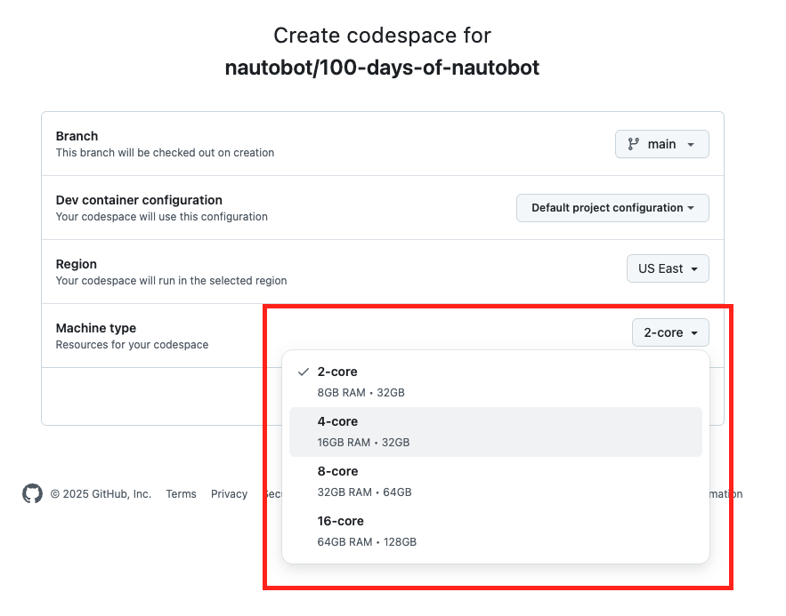

## Filter Containerlab Nodes

To save resources, sometimes we might want to launch fewer Containerlab nodes than described in the topology graph. We can either comment out the nodes or use the command line option of `--node-filter`:  

```
$ sudo containerlab deploy --topo ceos-lab.clab.yml --node-filter bos-acc-01,bos-rtr-01
```

## Containerlab Launch, Destroy, and Reconfigure

It is a good idea to destroy the Containerlab topology once you are done with it. 

```
(deploy) # containerlab deploy --topo ceos-lab.clab.yml
(destroy) # containerlab destroy --topo ceos-lab.clab.yml
```

But if you forget to destroy the lab, the next time you try to launch the lab you will encounter error similar to below: 

```
Error: containers ["bos-acc-01" "bos-rtr-01"] already exist. Add '--reconfigure' flag to the deploy command to first remove the containers and then deploy the lab
```

As stated, the command to fix the error is to use the `reconfigure` flag: 

```
# sudo containerlab deploy --reconfigure --topo ceos-lab.clab.yml
```

## Rebuild Codespace

We have discovered sometimes after the codespace instance was stopped either manually or due to the preset timeout period, the Docker daemon would stop working. 

For example, this instance was stopped 3 days ago, and I restarted via "open in browser": 

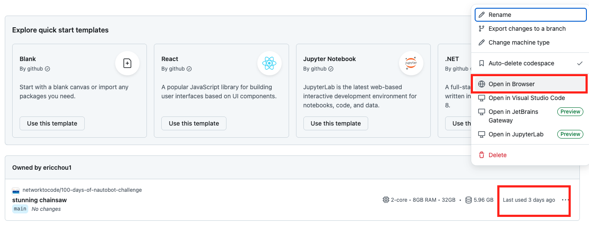

In the terminal, docker daemon would appear to have stopped: 

```
@ericchou1 ➜ ~ $ docker ps
Cannot connect to the Docker daemon at unix:///var/run/docker.sock. Is the docker daemon running?
```

If this happens, we can rebuild the codespace by going to "Settings -> Command Pallette": 

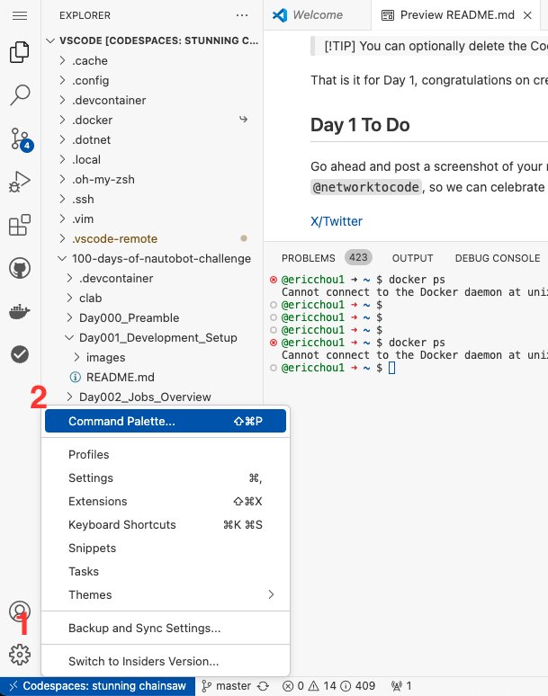

Then type in "rebuild" to choose "Codesapces: Rebuild Containers": 

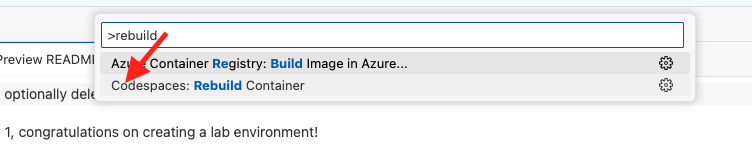

Pick "Rebuild" and proceed: 

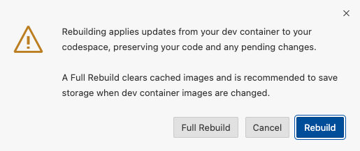

After reloading the window, Docker daemon would be back running: 

```
@ericchou1 ➜ ~ $ docker ps
CONTAINER ID   IMAGE     COMMAND   CREATED   STATUS    PORTS     NAMES

@ericchou1 ➜ ~ $ docker run hello-world
Unable to find image 'hello-world:latest' locally
latest: Pulling from library/hello-world
c1ec31eb5944: Pull complete 
Digest: sha256:5b3cc85e16e3058003c13b7821318369dad01dac3dbb877aac3c28182255c724
Status: Downloaded newer image for hello-world:latest

Hello from Docker!
This message shows that your installation appears to be working correctly.

To generate this message, Docker took the following steps:
 1. The Docker client contacted the Docker daemon.
 2. The Docker daemon pulled the "hello-world" image from the Docker Hub.
    (amd64)
 3. The Docker daemon created a new container from that image which runs the
    executable that produces the output you are currently reading.
 4. The Docker daemon streamed that output to the Docker client, which sent it
    to your terminal.

To try something more ambitious, you can run an Ubuntu container with:
 $ docker run -it ubuntu bash

Share images, automate workflows, and more with a free Docker ID:
 https://hub.docker.com/

For more examples and ideas, visit:
 https://docs.docker.com/get-started/

```

## Job File Creation and Permission

Nautobot Jobs needs to be installed under `JOBS_ROOT` path as specified in [Job Developer Guide](https://docs.nautobot.com/projects/core/en/stable/development/jobs/#installing-jobs). 

In our labs using `nautobot-docker-compose`, we were able to create the job file under the `/jobs` folder because we map the directory to the `JOBS_ROOT` in the docker container. This is illustrated in [Day 3](https://github.com/nautobot/100-days-of-nautobot/tree/main/Day003_Hello_Jobs_Part_1) `option 1` of `Creating the Job File` section. 

However, it is worth noting that `option 2` in the same section reflects more of the production `nautobot` environment where we create the jobs files under `JOBS_ROOT` in the `nautobot` environment, in this case, nautobot docker container. After the job file is created and permission changed, as stated in the example, you will need to open the file under the dock container file directory as illustrated in this [illustration](https://github.com/nautobot/100-days-of-nautobot/blob/main/Day003_Hello_Jobs_Part_1/images/docker_access_1.png).  


## Rename Codespace Instances

By default, the codespace name are randomly assigned. They can be renamed after they are launched by click on the ```...``` option and choose "Rename": 

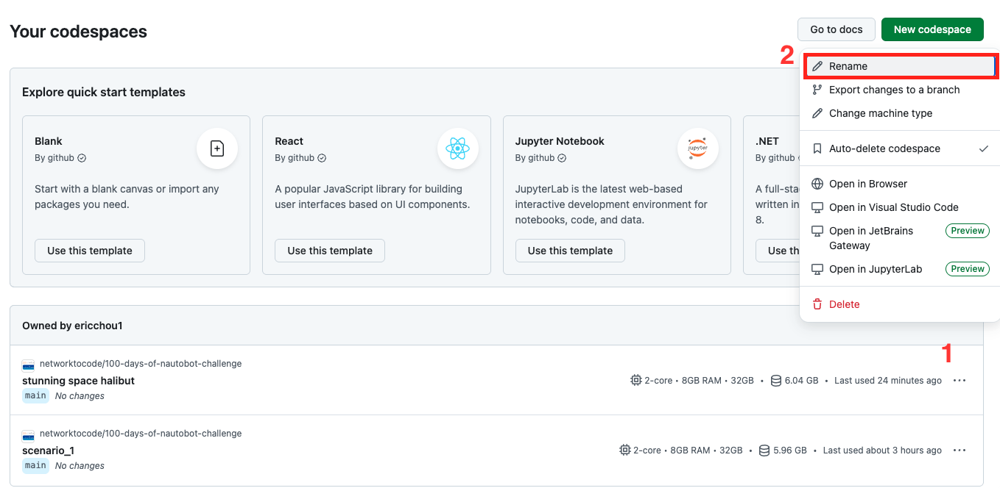

I find it beneficial to rename them according to the scenarios, such as "scenario_1" and "scenario_2". 

## Database Import

In order to minimize the setup steps, the dev container took a few extra steps than the steps listed in [nautobot-docker-compose](https://github.com/nautobot/nautobot-docker-compose). 

- Proactively copied the environment files: 

```
cp environments/local.example.env environments/local.env
cp environments/creds.example.env environments/creds.env
```

- Preloaded the `nautobot.sql` file in the directory. The `invoke db-import` commands looks for the `nautobot.sql` file as the database file to be loaded: 

```
# invoke --list
Available tasks:

  ...
  db-export              Export the database from the dev environment to nautobot.sql.
  db-import              Install the backup of Nautobot db into development environment.
  ...
```

Under "Lab_Setup -> database_files" there are other database files we can use for labs. 

## PostCreate.sh File

In the `devcontainer.json` file we use the `postCreateCommand` to specify the commands to run after codespace is launched, in this case a shell script `postCreate.sh`: 

```
{
    "name": "Lab Scenario 1",
    ...
    "postCreateCommand": "bash /workspaces/100-days-of-nautobot/postCreate.sh",
    ...
}
```

Currently, the script clones the repository and copy the README.md file from the repository to the root level: 

```
#!/bin/bash
git clone https://github.com/nautobot/100-days-of-nautobot.git
cp 100-days-of-nautobot/README.md .
```

## Connecting to Devices

In [Day 9](../../Day009_Python_Script_to_Jobs_Part_1/README.md) and [Day 10](../../Day010_Python_Script_to_Jobs_Part_2/README.md) we allow the Job worker connect to the `Arista EOS` devices in Containerlab. There are a few moving parts behind the scenes to make the initial experience smooth. If you have problem connect to the devices, check the following: 

- The IP Prefix for the network devices exist, add the prefix if needed. 

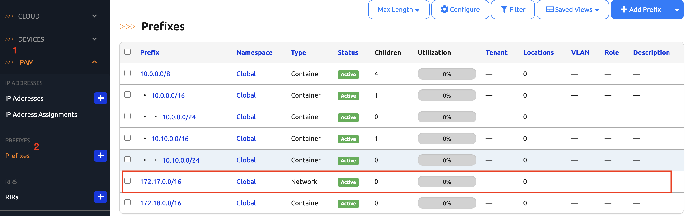

- The IP addresses used for the devices exist within the prefix, add them if needed. 

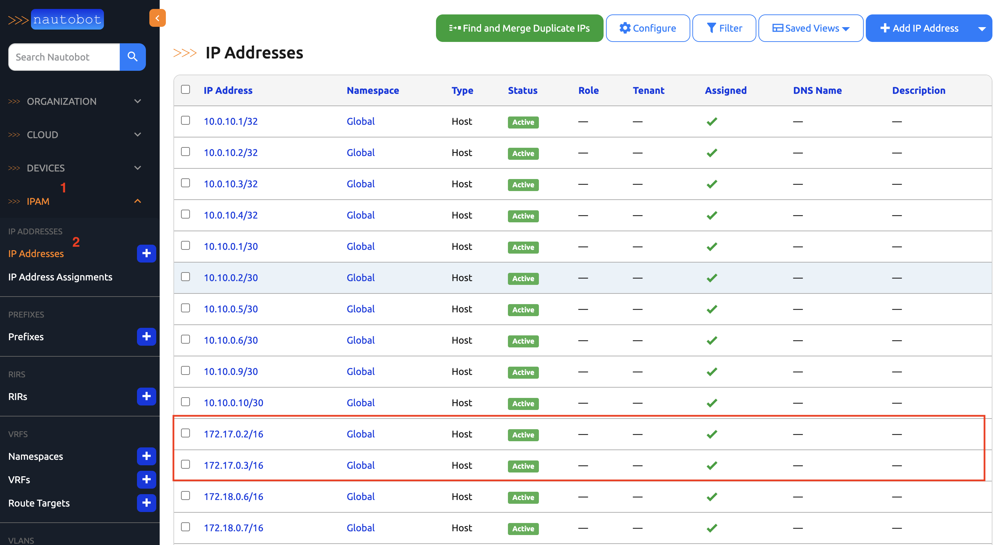

- The device interface has the correct IP address assigned to it, for example, `bos-acc-01`'s `Management1` interface should have `172.16.0.2/16` assign to it in my lab: 

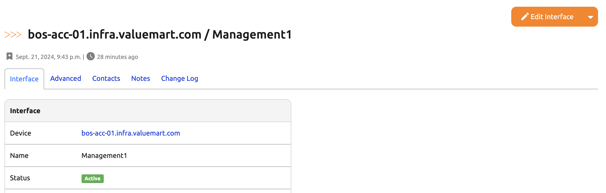
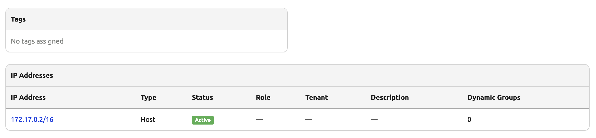

- Last but not least, check to see if the network driver is specified for the platform. For example, Arista EOS driver should be specified as `arista_eos`: 

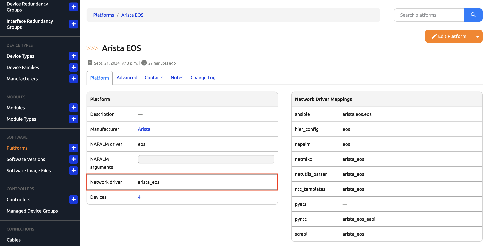


