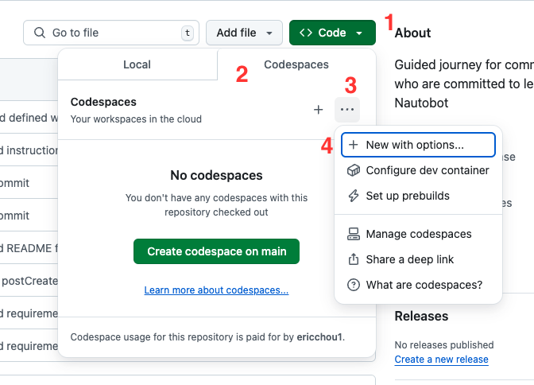
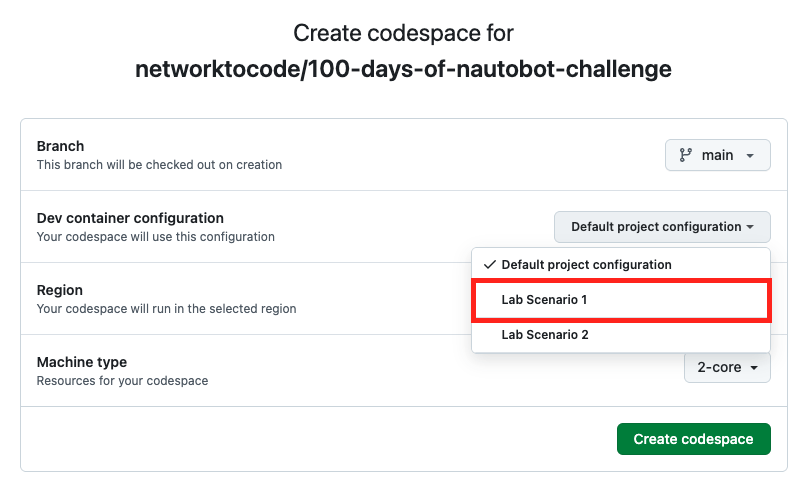
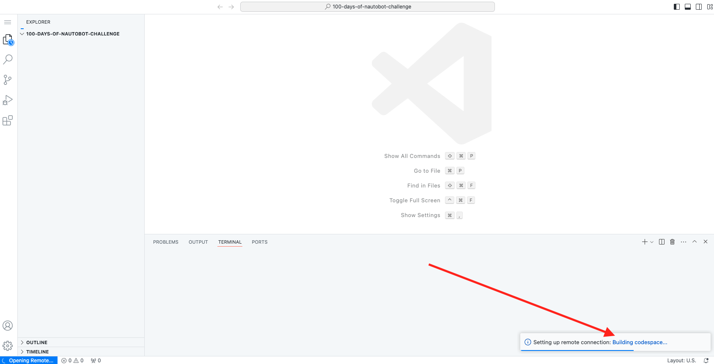
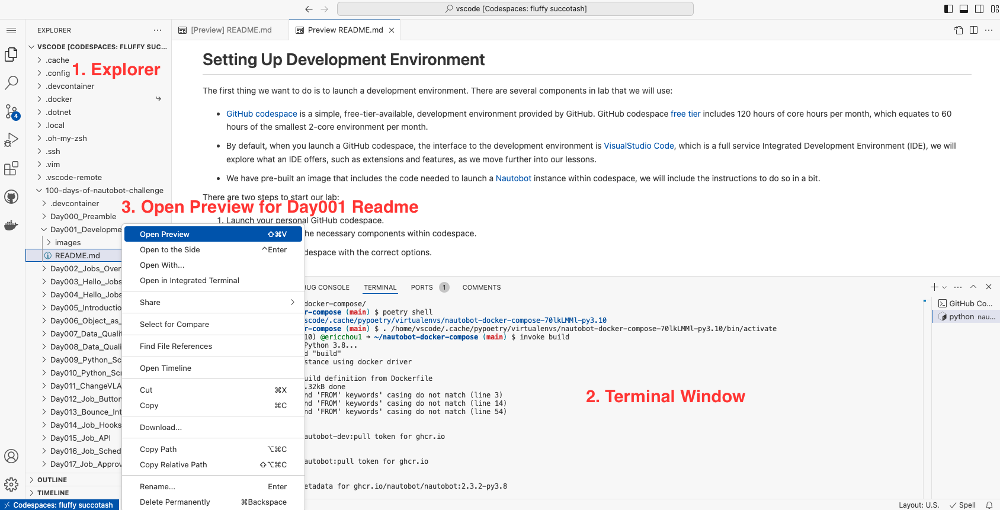
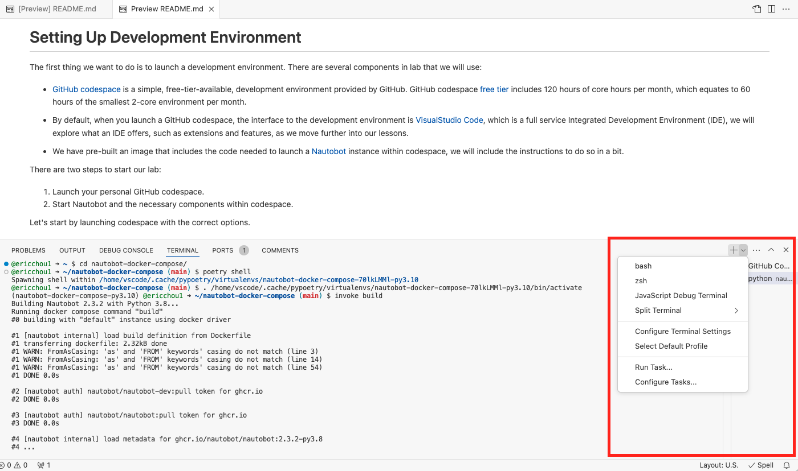
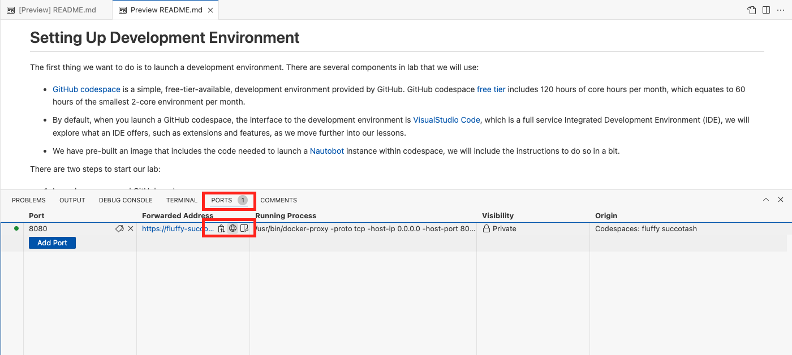
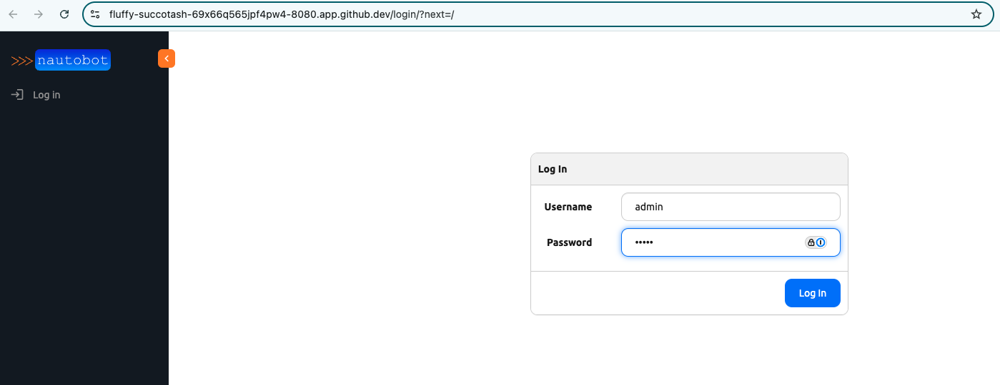
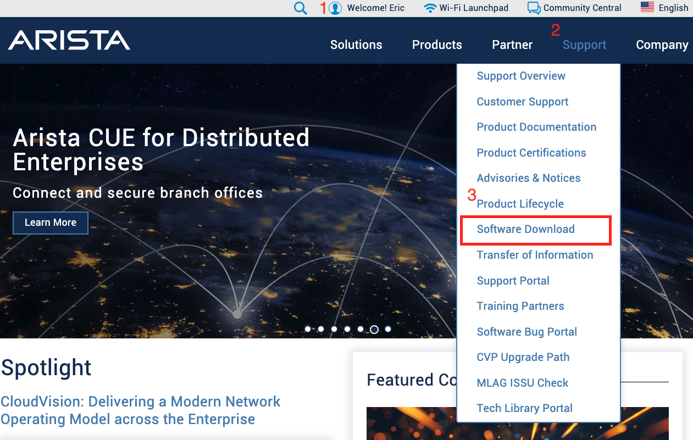
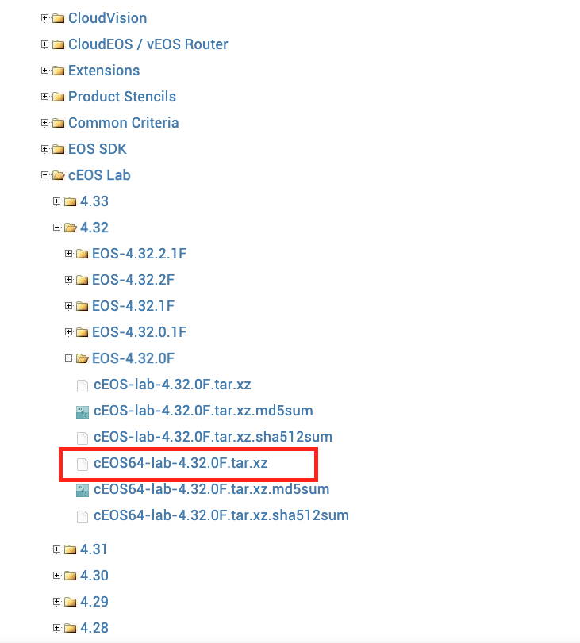
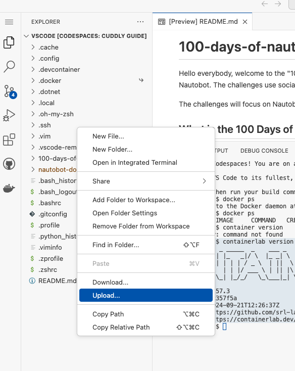

# Lab Scenario 1

Lab Scenario 1 is our base scenario presented in the [Preamble](../../Day000_Preamble/README.md) and the set up is illustrated in the [Day 1 Instruction](../../Day001_Development_Setup/README.md). 

For better illustration, we will summarize the development environment setup below. For more detailed illustration, please refer back to [Day 1 Instruction](../../Day001_Development_Setup/README.md). 

## Launch Codespace

If you are brand new to GitHub Codespace, you can watch the setup video below: 

[Video: Setting Up Your 100 Days of Nautobot Development Environment](https://www.youtube.com/watch?v=gW3Qq0yssLE)

Launch Codespace with the following steps: 

1. Click on the green Code button 
2. Choose Codespaces. 
3. Click on the "..." option 
4. Pick 'New with Options'



On the next screen, click on the dropdown menu for 'Dev container configuration' and pick 'Lab Scenario 1', then click on 'Create Codespace': 

> [!TIP] 
> When you launch Codespace for the very first time, it might prompt you to choose between browser-based Visual Studio Code or launch a desktop version, choose browser-based version to be consistent with the screenshots, but please feel free to pick the desktop version if you want. 



Codespac will begin to launch, feel free to click on 'Building Codespace' to view the creation log and monitor the progress: 



After Codespace finished setting up, you will have a browser-based development environment with the following sections: 

1. Explorer Window: This is there you can choose the different files, namely Day001, Day002, etc. folders.  
2. Terminal Window: There will also be a terminal window we can interact with the Codespace code. 
3. In the explorer window, expand the "100-Days-of-nautobot-challenge" folder and "Day001_Development_Setup" subfolder, right-click on the ```README.md``` file and choose "Open Preview": 



4. We will work with the terminal window a lot, sometimes opening many terminal windows at once. The ```+``` is where we can add more terminal windows. 



Go ahead and launch the Codespace, once it is launched, this repository will be cloned into the environment. 

## Start Nautobot and the necessary components

Included in the Codespace is the code from [nautobot-docker-compose](https://github.com/nautobot/nautobot-docker-compose/) repository. Our Codespace is launched with the docker-in-docker feature to allow us run Nautobot as well as the necessary components in containers. 

The following instructions will be typed in at the terminal window. 

- Change directory to where the nautobot docker-compose code is: 
```
@ericchou1 ➜ ~ $ cd nautobot-docker-compose/
```
- We have already installed [poetry](https://python-poetry.org/) virtual environment, so we just need to enable the environment: 

```
@ericchou1 ➜ ~/nautobot-docker-compose (main) $ poetry shell
Spawning shell within /home/vscode/.cache/pypoetry/virtualenvs/nautobot-docker-compose-70lkLMMl-py3.10
@ericchou1 ➜ ~/nautobot-docker-compose (main) $ . /home/vscode/.cache/pypoetry/virtualenvs/nautobot-docker-compose-70lkLMMl-py3.10/bin/activate
(nautobot-docker-compose-py3.10) @ericchou1 ➜ ~/nautobot-docker-compose (main) $
```

- We will use [Invoke](https://www.pyinvoke.org/) for shell-oriented subprocess for CLI-invokable tasks. 

> [!IMPORTANT]
> The steps below shows how to build the environment from scratch; if you are restarting from a previously built docker-compose environment already have the database imported, you can simply use `invoke debug` to launch the nautobot containers. 

- The first step is to build the docker images, if you are building it for the first time, it will take a bit of time, make sure you wait until you see the "DONE" message at the end with the terminal prompt given back to the user. 

```
(nautobot-docker-compose-py3.10) @ericchou1 ➜ ~/nautobot-docker-compose (main) $ invoke build
Building Nautobot 2.3.2 with Python 3.8...
Running docker compose command "build"
#0 building with "default" instance using docker driver

#1 [nautobot internal] load build definition from Dockerfile
#1 transferring dockerfile: 2.32kB done
#1 WARN: FromAsCasing: 'as' and 'FROM' keywords' casing do not match (line 3)
#1 WARN: FromAsCasing: 'as' and 'FROM' keywords' casing do not match (line 14)
#1 WARN: FromAsCasing: 'as' and 'FROM' keywords' casing do not match (line 54)
#1 DONE 0.0s
... 
<skip> 
...
#2 [nautobot auth] nautobot/nautobot-dev:pull token for ghcr.io
#2 DONE 0.0s
#24 [nautobot] resolving provenance for metadata file
#24 DONE 0.0s
```

- We are now ready to import the initial datasets: 

```
$ source db_import_prep.sh
$ invoke db-import
(nautobot-docker-compose-py3.10) @ericchou1 ➜ ~/nautobot-docker-compose (main) $ invoke db-import
Importing Database into Development...

Starting Postgres for DB import...

Running docker compose command "up -d db"
 db Pulling 
 43c4264eed91 Pulling fs layer 
...
<skip>
...
 55d20525b40e Waiting 
 82052d0672a9 Downloading [====================================>              ]     720B/984B
 82052d0672a9 Downloading [==================================================>]     984B/984B
 82052d0672a9 Download complete 
 ...
 <skip>
 ...
 Network nautobot_docker_compose_default  Creating
 Network nautobot_docker_compose_default  Created
...
<skip>
...
ALTER TABLE
ALTER TABLE
ALTER TABLE
ALTER TABLE
```

- Now we can start the nautobot containers with ```invoke debug```. This will start Nautobot in debug mode and display all message on the screen: 

> [!TIP] 
> Wait until you see the message of ```Starting development server at http://0.0.0.0:8080/``` before moving on to the next step: 

```
(nautobot-docker-compose-py3.10) @ericchou1 ➜ ~/nautobot-docker-compose (main) $ invoke debug
Starting Nautobot in debug mode...
Running docker compose command "up"
 redis Pulling 
 43c4264eed91 Already exists 
 54346cffc29b Pulling fs layer 
 2866ca214a5e Pulling fs layer 
 ee16541feddb Pulling fs layer 
 d14ed515876d Pulling fs layer 
 cf7b98d3ba3c Pulling fs layer 
 4f4fb700ef54 Pulling fs layer 
 c4e0a3f69d20 Pulling fs layer 
 ...
 <skip>
 ...
nautobot-1       | October 16, 2024 - 20:18:55
nautobot-1       | Django version 4.2.16, using settings 'nautobot_config'
nautobot-1       | Starting development server at http://0.0.0.0:8080/
nautobot-1       | Quit the server with CONTROL-C.
nautobot-1       | 
```

Once Nautobot is started, we can go to the forwarded ports, hoover over 'Forwarded Address' and click on the globe icon to open a separate browser window: 



The new window should direct you to the forwarded port where Nautobot UI can be accessed. The default login credentials are username ```admin``` and password ```admin```, this was the admin user we included in the initial dataset: 



We now have a working Nautobot instance in Codepsace. Let's go back to the terminal window and use ```Ctl+C``` to terminate the Nautobot instance: 

```
...
...
nautobot-1       | 20:25:48.342 INFO    django.server :
nautobot-1       |   "GET /static/img/favicon.ico?version=2.3.2 HTTP/1.1" 200 15086
redis-1          | 1:M 16 Oct 2024 20:33:15.250 * 100 changes in 300 seconds. Saving...
redis-1          | 1:M 16 Oct 2024 20:33:15.251 * Background saving started by pid 14
redis-1          | 14:C 16 Oct 2024 20:33:15.253 * DB saved on disk
redis-1          | 14:C 16 Oct 2024 20:33:15.254 * RDB: 0 MB of memory used by copy-on-write
redis-1          | 1:M 16 Oct 2024 20:33:15.351 * Background saving terminated with success
Gracefully stopping... (press Ctrl+C again to force)
 Container nautobot_docker_compose-celery_worker-1  Stopping
 Container nautobot_docker_compose-celery_beat-1  Stopping
 Container nautobot_docker_compose-celery_beat-1  Stopped
 Container nautobot_docker_compose-celery_worker-1  Stopped
 Container nautobot_docker_compose-nautobot-1  Stopping
 Container nautobot_docker_compose-nautobot-1  Stopped
 Container nautobot_docker_compose-db-1  Stopping
 Container nautobot_docker_compose-redis-1  Stopping
 Container nautobot_docker_compose-redis-1  Stopped
 Container nautobot_docker_compose-db-1  Stopped
canceled
```

## Start Containerlab (Optional)

[Containerlab](https://containerlab.dev/) is a docker-based network lab environment we will use for testing against network devices. 

Network lab is not required for all challenges, but included here to provide the necessary information if needed. For more detailed instruction, please reference [Lab 9 README](../../Day009_Python_Script_to_Jobs_Part_1/README.md). 

Containerlab is already installed in our environment, we can check the version installed: 

```
@ericchou1 ➜ ~ $ containerlab version
  ____ ___  _   _ _____  _    ___ _   _ _____ ____  _       _     
 / ___/ _ \| \ | |_   _|/ \  |_ _| \ | | ____|  _ \| | __ _| |__  
| |  | | | |  \| | | | / _ \  | ||  \| |  _| | |_) | |/ _` | '_ \ 
| |__| |_| | |\  | | |/ ___ \ | || |\  | |___|  _ <| | (_| | |_) |
 \____\___/|_| \_| |_/_/   \_\___|_| \_|_____|_| \_\_|\__,_|_.__/ 

    version: 0.57.3
     commit: 8c357f5a
       date: 2024-09-21T12:26:37Z
     source: https://github.com/srl-labs/containerlab
 rel. notes: https://containerlab.dev/rn/0.57/#0573
```

We provided a lab topology under ```100-days-of-nautobot-challenge/clab``` which we can take a look: 

```
$ cd 100-days-of-nautobot-challenge/
$ cd clab/
$ cat ceos-lab.clab.yml 
---
name: "ceos-lab"
prefix: ""

mgmt:
  # network: "network-lab"
  # ipv4-subnet: "172.24.78.0/24"
  network: "bridge"

topology:
  kinds:
    ceos:
      image: "ceos:4.32.0F"

  nodes:
    bos-acc-01:
      kind: "ceos"
      startup-config: "startup-configs/bos-acc-01.conf"

    bos-rtr-01:
      kind: "ceos"
      startup-config: "startup-configs/bos-rtr-01.conf"

    nyc-acc-01:
      kind: "ceos"
      startup-config: "startup-configs/nyc-acc-01.conf"

    nyc-rtr-01:
      kind: "ceos"
      startup-config: "startup-configs/nyc-rtr-01.conf"

  links:
    - endpoints: ["bos-acc-01:eth1", "bos-rtr-01:eth1"]
    - endpoints: ["bos-acc-01:eth2", "nyc-rtr-01:eth2"]
    - endpoints: ["bos-rtr-01:eth2", "nyc-acc-01:eth2"]
    - endpoints: ["nyc-acc-01:eth1", "nyc-rtr-01:eth1"]
```

We will need to upload the cEOS image as indicated in the topology file. 

## Download and Upload cEOS image

[Arista Networks](https://www.arista.com/en/) provides a free download of their containerized EOS system that can be used with Containerlab. The registration is free, but we will need to use a business email address. 

Once registered, we can download the image via "Support -> Software Download": 



We should pick one of the "cEOS Lab" software image, in the screenshot, we show ```cEOS64-lab-4-32.0F.tar.xz```: 



Once that is downloaded, we can right-click on the Explorer area and choose to upload the image: 



Depending on the Internet speed, the upload time might take a minute or two. Once the image is uploaded, we can use the following command to import the image to docker: 

> [!IMPORTANT]
> Remember to substitute the version and location matches the version downloaded and the location of the file. 

```
$ docker import ../Lab_Setup/cEOS64-lab-4.32.0F.tar ceos:4.32.0F

sha256:ff28abebb338b16656c0c86e01940e97a3b26de4b6c66873daebdb941cd4f4e2
```

We are ready to launch our lab in the next step. 

## Launch Containerlab

We can launch the lab with limited amount of devices, for example, just the Boston devices via the `` --node-filter option```: 

```
$ sudo containerlab deploy --topo ceos-lab.clab.yml --node-filter bos-acc-01,bos-rtr-01
INFO[0000] Containerlab v0.57.3 started                 
INFO[0000] Applying node filter: ["bos-acc-01" "bos-rtr-01"] 
INFO[0000] Parsing & checking topology file: ceos-lab.clab.yml 
WARN[0000] Unable to init module loader: stat /lib/modules/6.5.0-1025-azure/modules.dep: no such file or directory. Skipping... 
INFO[0000] Creating lab directory: /home/vscode/100-days-of-nautobot-challenge/clab/clab-ceos-lab 
INFO[0000] Creating container: "bos-acc-01"             
INFO[0000] Creating container: "bos-rtr-01"             
INFO[0001] Running postdeploy actions for Arista cEOS 'bos-rtr-01' node 
INFO[0001] Created link: bos-acc-01:eth1 <--> bos-rtr-01:eth1 
INFO[0001] Running postdeploy actions for Arista cEOS 'bos-acc-01' node 
...
INFO[0093] 🎉 New containerlab version 0.60.1 is available! Release notes: https://containerlab.dev/rn/0.60/#0601
Run 'containerlab version upgrade' to upgrade or go check other installation options at https://containerlab.dev/install/ 
+---+------------+--------------+--------------+------+---------+---------------+--------------+
| # |    Name    | Container ID |    Image     | Kind |  State  | IPv4 Address  | IPv6 Address |
+---+------------+--------------+--------------+------+---------+---------------+--------------+
| 1 | bos-acc-01 | 575cba7b555b | ceos:4.32.0F | ceos | running | 172.17.0.3/16 | N/A          |
| 2 | bos-rtr-01 | 940e991b876a | ceos:4.32.0F | ceos | running | 172.17.0.2/16 | N/A          |
+---+------------+--------------+--------------+------+---------+---------------+--------------+
```

The default username and password are both ```admin``` for the network devices: 

```
$ ssh admin@172.17.0.3
The authenticity of host '172.17.0.3 (172.17.0.3)' can't be established.
ED25519 key fingerprint is SHA256:aXFI/vMIdoc3mdWegaZATVj6uUmjUYtJHRnB1PiSSCs.
This key is not known by any other names
Are you sure you want to continue connecting (yes/no/[fingerprint])? yes
Warning: Permanently added '172.17.0.3' (ED25519) to the list of known hosts.
(admin@172.17.0.3) Password: 
ceos-01>sh ver
Arista cEOSLab
Hardware version: 
Serial number: CECCE43E5AAA6355D646272A9F91AE27
Hardware MAC address: 001c.73a0.2d78
System MAC address: 001c.73a0.2d78

Software image version: 4.32.0F-36401836.4320F (engineering build)
Architecture: x86_64
Internal build version: 4.32.0F-36401836.4320F
Internal build ID: e97bbe15-478c-45d1-84fa-332db23aef84
Image format version: 1.0
Image optimization: None

cEOS tools version: (unknown)
Kernel version: 6.5.0-1025-azure

Uptime: 4 minutes
Total memory: 8119864 kB
Free memory: 2728160 kB

ceos-01>exit
Connection to 172.17.0.3 closed.
```

We can proceed with the challenges that require network devices to test.

When required, we can shutdown the lab with the ```destroy``` command: 

```
$ sudo containerlab destroy --topo ceos-lab.clab.yml --node-filter bos-acc-01,bos-rtr-01
INFO[0000] Applying node filter: ["bos-acc-01" "bos-rtr-01"] 
INFO[0000] Parsing & checking topology file: ceos-lab.clab.yml 
INFO[0000] Destroying lab: ceos-lab                     
INFO[0002] Removed container: bos-rtr-01                
INFO[0002] Removed container: bos-acc-01                
INFO[0002] Removing containerlab host entries from /etc/hosts file 
INFO[0002] Removing ssh config for containerlab nodes   
``` 

Once we are done with the challenge at hand, we can either stop or delete the Codespace instance. 

## Stop or Delete Codespace 

Let's go ahead and stop Codespace as we do not want to incur unnecessary charges when we are not using it. We will navigate to your [Codespace](https://github.com/codespaces) settings and stop the Codespace: 

![Codespace_Screenshot_8.png]../../Day001_Development_Setup/(images/Codespace_Screenshot_8.png)

> [!TIP] 
> You can optionally delete the Codespace, however, you will need to repeat the steps in this lesson if you do. 

Congratulations, we are now ready to proceed with the lessons based on lab scenario 1! 
