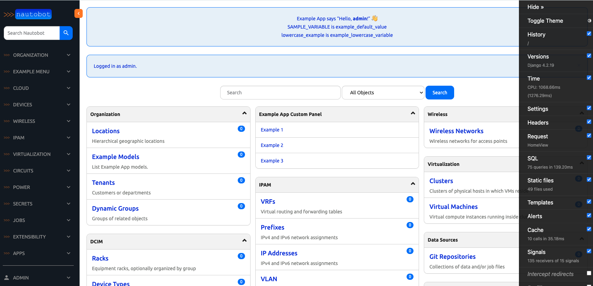

# Lab Scenario 2


Lab Scenario 2 is similar to scenario 1 with the following differences: 

- A new `nautobot` repository has been pre-cloned for the environment, it is cloned from [Nautobot v2.5.4b1](https://github.com/nautobot/nautobot/). 
- The steps to launch `nautobot` is similar, but the build time takes longer: 

```
$ cd nautobot
$ poetry shell
$ poetry install
$ invoke build
(be patient with this step)
$ invoke debug
(be patient with this step as well)
```

- For Codespace to work, the following was modified in `development/dev.env`: 

```
NAUTOBOT_ALLOWED_HOSTS=".localhost 127.0.0.1 [::1] *"
```

- Simliarly, the following was modified in `development/nautobot_config.py`: 

```
CORS_ALLOWED_ORIGINS = ["http://localhost:3000", "http://localhost:8080"]
CSRF_TRUSTED_ORIGINS = ["http://localhost:8080", "https://localhost:8080"] 
```

- Multiple ports are opened, `nautobot` is still on port 8080: 


- [Django debug toolbar](https://django-debug-toolbar.readthedocs.io/en/latest/) is active: 

