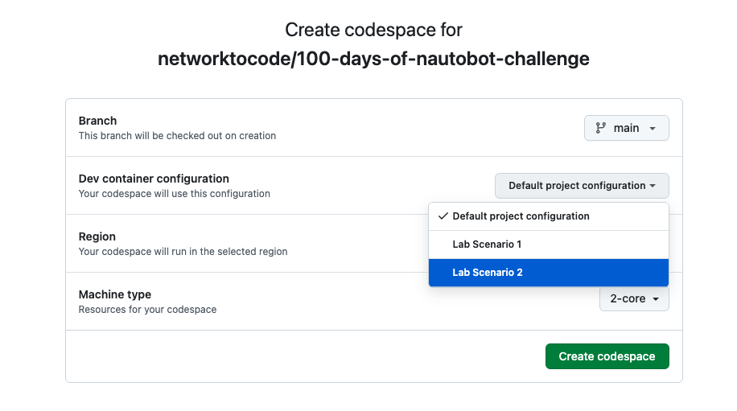
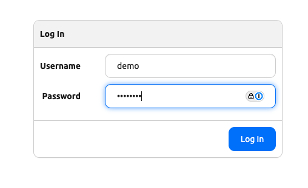
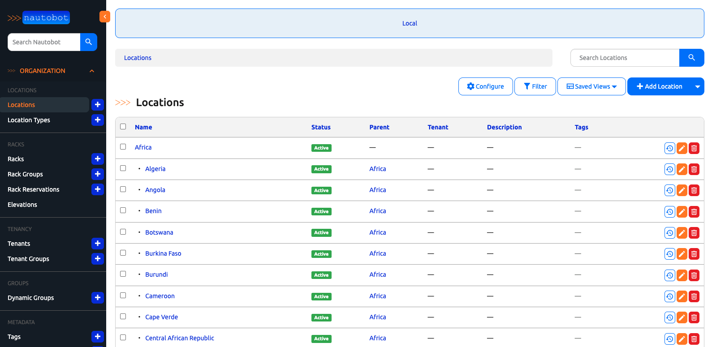

# Lab Scenario 2

Lab scenario 2 is very similar to [Lab Scenario 1](../scenario_1_setup/README.md) but with dataset similar to [Nautobot Demo](https://demo.nautobot.com/login/?next=/). 

We will condense the steps for lab scenario 2 since many of us are already familiar with Codespace, poetry, and invoke. 

## Steps

Here are the steps for launching lab scenario 2: 

1. Start codespace with scenario 2. 



2. Start poetry shell and build the containers. 

```
$ cd nautobot-docker-compose/
$ poetry shell
$ invoke build
```

3. Copy ```nautobot-demo.sql``` file to current directory and import the file with invoke: 

```
$ cp ../100-days-of-nautobot-challenge/Lab_Setup/database_files/nautobot-demo.sql nautobot.sql
$ invoke db-import
```

4. Launch Nautobot: 

```
$ invoke debug
```

5. Verification: 

You will notice the default user is the same as the Nautobot demo site with username ```demo``` and password ```nautobot```: 



If we click on locations, we will see a lot more locations than lab scenario 1: 



Congratulations, we are ready to perform the challenges based on Lab Scenario 2! 


